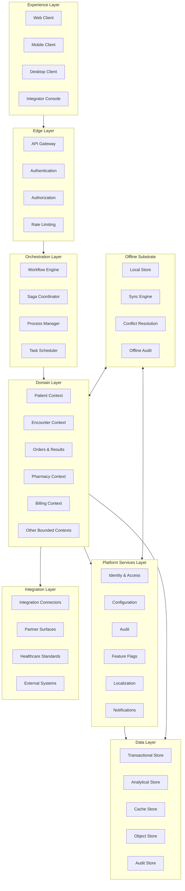

# Ibn Hayan Healthcare Operating System — System Architecture

| Field | Value |
|---|---|
| Document Title | System Architecture |
| Project | Ibn Hayan Healthcare Operating System |
| Document Type | Canonical Architectural Reference |
| Authority Level | Authoritative — Source of Truth |
| Version | 2.0.0 |
| Status | Ratified |
| Owner | Office of the Chief Software Architect |
| Custodian | Architecture Council |
| Review Cadence | Quarterly, with off-cycle revision when an Architecture Decision Record is ratified |
| Audience | Senior software architects, engineering leadership, module owners, integration architects, security architects, SRE leadership |
| Scope | System-level architecture: principles, layers, contexts, configuration, modules, multi-tenancy, integration, security, scalability, extensibility, deployment, offline, localization, audit, reporting, AI readiness, evolution |
| Out of Scope | Implementation details, source code, database schemas, API contracts, UI specifications, deployment runbooks, vendor selection, technology commits |
| Conflict Resolution | This document prevails over every other architectural or module document. Any conflict between this document and a downstream document is resolved in favor of this document until this document is amended. |
| Amendment Mechanism | Architecture Council ratification through an Architecture Decision Record (ADR); recorded in CHANGELOG with explicit version increment |
| Predecessor | v1.0.0 (initial) |
| Supersedes | All prior architectural drafts and internal memos |

---

## Table of Contents

1. Architecture Overview
2. Architectural Vision
3. System Philosophy
4. Architectural Principles
5. High-Level Architecture
6. Platform Layers
7. Domain-Driven Architecture
8. Configuration-Driven Architecture
9. Modular Architecture
10. Multi-Tenant Architecture
11. Organization Hierarchy
12. Clinic Hierarchy
13. Module Architecture
14. Feature Flag Strategy
15. Configuration Strategy
16. Workflow Engine Philosophy
17. State Management Philosophy
18. Event-Driven Concepts
19. Integration Architecture
20. Security Architecture
21. Scalability Strategy
22. Extensibility Strategy
23. Deployment Models
24. Offline-First Architecture
25. Synchronization Strategy
26. Localization Architecture
27. Audit Architecture
28. Reporting Architecture
29. AI Readiness
30. Future Evolution Strategy

---

## 1. Architecture Overview

### 1.1 Purpose of This Document

This document is the canonical architectural reference for the Ibn Hayan Healthcare Operating System. It defines what the platform is as an architectural artefact — its layers, its contexts, its contracts, its primitives, its commitments. Every downstream architectural document, every module specification, every Architecture Decision Record, every operational runbook, and every integration contract must align with this document. Where alignment is not possible, either the downstream artefact is incorrect or this document must be amended through the Architecture Council.

This document is not an implementation guide. It contains no source code, no database schemas, no API endpoint specifications, no UI component catalogues, and no technology commitments. It describes the architectural decisions and commitments that implementations are expected to honour. Implementation choices are governed by `SOFTWARE_ARCHITECTURE.md` and `CODING_STANDARDS.md`; this document governs what those choices must produce.

The document is written for senior software architects who already understand distributed systems, domain-driven design, multi-tenant SaaS delivery, healthcare-grade operational rigour, and decade-horizon architectural thinking. It does not explain what a bounded context is, what eventual consistency is, or why audit is a primitive. It assumes that literacy and focuses on the architectural decisions that distinguish Ibn Hayan from every other healthcare platform.

### 1.2 Scope and Authority

The scope of this document is the entire Ibn Hayan platform as an architectural artefact. The document holds authority over the following classes of downstream artefacts:

- `SOFTWARE_ARCHITECTURE.md`, `MODULE_ARCHITECTURE.md`, `CONFIGURATION_ARCHITECTURE.md`, `CODING_STANDARDS.md`, `FOLDER_STRUCTURE.md` — these elaborate the system architecture into implementation-grade specifications.
- All Architecture Decision Records under `docs/12_ADR/` — these ratify specific architectural decisions and must be consistent with the principles in Section 4.
- All module specifications under `docs/07_MODULES/` — these define module internals and must align with the module architecture in Section 13.
- All security documents under `docs/09_SECURITY/` — these define security controls and must align with the security architecture in Section 20.
- All integration documents under `docs/08_INTEGRATIONS/` — these define integration contracts and must align with the integration architecture in Section 19.
- All database documents under `docs/04_DATABASE/` — these define data architecture and must align with the bounded contexts in Section 7.
- All deployment documents under `docs/13_DEPLOYMENT/` — these define deployment models and must align with the deployment models in Section 23.

A downstream artefact that contradicts this document is, by definition, defective. The remedy is to either correct the downstream artefact or amend this document through an ADR. Silent contradiction is not permitted.

### 1.3 Architectural Posture

The Ibn Hayan platform is architected on the following non-negotiable posture:

- **Healthcare-native, not healthcare-adapted.** The architecture begins from healthcare semantics. Generic enterprise patterns are borrowed only where they do not compromise healthcare fidelity.
- **Configuration-driven, not customization-dependent.** The platform adapts to customer needs through declarative configuration. Source-level customization is excluded as a delivery mechanism.
- **Multi-tenant SaaS as default.** The platform serves every customer from a single shared runtime. Customer-specific deployments are deployment choices, not code branches.
- **Offline-first as primitive.** The platform operates locally by default, with synchronization to the central platform. Offline is not a fallback mode; it is the primary mode for client surfaces.
- **Audit as primitive.** Every consequential action is recorded in an immutable audit trail. Audit is built into every module's contract, not added as a feature.
- **Decade-horizon thinking.** Architectural decisions are made on a ten-year horizon, not on a quarter-by-quarter horizon. Decisions that optimize for the short term at the cost of the decade are rejected.

These six posture commitments are not negotiable. They are the architectural expression of the product principles defined in `PRODUCT_BIBLE.md`, and they govern every architectural decision in this document.

### 1.4 Technology-Agnostic Posture

This document is deliberately technology-agnostic. It does not name specific programming languages, frameworks, databases, message brokers, or cloud vendors. Technology selection is an implementation choice governed by the criteria in `SOFTWARE_ARCHITECTURE.md`, not an architectural commitment.

The technology-agnostic posture is a direct consequence of the decade-horizon thinking (Section 2.2). Technologies change on shorter cycles than the platform's viability horizon. An architecture that commits to a specific technology commits to that technology's lifecycle, which is typically shorter than the platform's required lifecycle. The architecture therefore commits to patterns, principles, and contracts — not to technologies.

Where this document references a technology category (e.g., "transactional data store", "message broker", "object storage"), the reference is to the category, not to a specific product. The choice of product within a category is an implementation decision governed by selection criteria, not by architectural commitment.

### 1.5 Relationship to Product Bible

This document is the architectural expression of the product commitments defined in `PRODUCT_BIBLE.md`. The product principles (P-1 through P-9) and design principles (D-1 through D-10) defined in `PRODUCT_BIBLE.md` are the basis for the architectural principles (Section 4) defined here. The architectural principles translate product commitments into architectural decisions.

Where this document and `PRODUCT_BIBLE.md` appear to conflict, the Product Bible prevails. The product is the source of truth; the architecture serves the product, not the reverse. A conflict between product and architecture is resolved by amending the architecture to serve the product, not by amending the product to fit the architecture.

### 1.6 Document Structure

The document is organized in six movements:

1. **Architecture identity** (Sections 2 through 4) — establishes the architectural vision, philosophy, and principles that govern every decision.
2. **Structural architecture** (Sections 5 through 13) — defines the platform's layers, bounded contexts, modules, and the hierarchies they serve.
3. **Behavioural architecture** (Sections 14 through 18) — defines the configuration, feature flag, workflow, state, and event-driven behaviour of the platform.
4. **Cross-cutting architecture** (Sections 19 through 22) — defines integration, security, scalability, and extensibility as cross-cutting concerns.
5. **Operational architecture** (Sections 23 through 28) — defines deployment, offline, synchronization, localization, audit, and reporting as operational concerns.
6. **Forward architecture** (Sections 29 and 30) — defines AI readiness and future evolution as forward-looking concerns.

Each section is self-contained but cross-references other sections rather than restating their content. The architectural principles in Section 4 are referenced throughout the document as the basis for specific architectural decisions.

### 1.7 How to Read This Document

A first-time reader should read Sections 1 through 5 in order to internalize the architectural posture and principles, then jump to Section 7 (Domain-Driven Architecture) and Section 13 (Module Architecture) to understand the platform's structural decomposition. Sections 14 through 22 may be consulted as reference for specific behavioural and cross-cutting concerns. Sections 23 through 30 are essential for anyone responsible for deployment, operations, or long-term platform evolution.

A reader looking for a specific architectural decision rule should consult Section 4 (Architectural Principles) first; this section is the decision framework that governs every architectural choice. A reader looking for structural decomposition should consult Section 5 (High-Level Architecture) and Section 7 (Domain-Driven Architecture). A reader looking for a specific module's architecture should consult `MODULE_ARCHITECTURE.md`. A reader looking for a specific architectural decision's rationale should consult the relevant ADR under `docs/12_ADR/`.

---

## 2. Architectural Vision

### 2.1 Vision Statement

The architectural vision of Ibn Hayan is to provide a durable, healthcare-native, configuration-driven, multi-tenant platform that serves every healthcare organization from a solo practitioner to a multinational hospital network, that remains viable across a ten-year horizon, and that absorbs unanticipated capability without architectural rework.

The vision is not stated in terms of features or capabilities. It is stated in terms of architectural properties — durability, healthcare nativeness, configuration-driven behaviour, multi-tenancy, scale range, and future-proofness. These properties are the architectural expression of the product vision defined in `PRODUCT_BIBLE.md`.

### 2.2 The Decade Horizon

The architectural vision is stated on a ten-year horizon. This is not a marketing flourish; it is an architectural commitment that shapes every decision in this document. The decade horizon has the following architectural consequences:

- **Stable bounded contexts.** The bounded contexts defined in Section 7 are designed to outlast any specific implementation. Contexts are not reorganized to accommodate features; features are accommodated within the existing context structure.
- **Explicit contracts.** Every module boundary is governed by explicit contracts — commands, queries, events, configuration schemas. Contracts are versioned and evolve through documented deprecation, not through silent breaking change.
- **First-class extension points.** The platform's extensibility surface (Section 22) is first-class. Extensions are not bolt-ons; they are governed by the same architectural rigour as core platform capabilities.
- **Technology-agnostic posture.** The architecture does not commit to specific technologies. Technology selection is an implementation choice governed by architectural criteria, not by architectural identity.
- **Conservative evolution.** The platform evolves deliberately, with each change justified against the architectural principles. Change that is fast but wrong on the decade horizon is rejected as debt.

The decade horizon does not mean the architecture is static. It means the architecture evolves through amendable principles and explicit decisions, not through ad hoc adaptation. The architecture is the durable artefact; implementations are its stewards.

### 2.3 The Three Architectural Vectors

The architectural vision unfolds along three vectors that are pursued simultaneously and in tension with each other:

- **Structural coherence.** The platform's structural decomposition — layers, contexts, modules — must be coherent enough that a new architect can understand the platform in a defined period. Coherence is measured by the clarity of boundaries, the explicitness of contracts, and the absence of circular dependencies.
- **Behavioural richness.** The platform's behavioural surface — configuration, workflow, events, state — must be rich enough to express the operational reality of every supported clinic type without source-level modification. Richness is measured by configuration coverage of clinic types, workflow expressiveness, and event-driven completeness.
- **Operational durability.** The platform's operational posture — deployment, offline, synchronization, audit, security, scalability — must be durable enough to meet healthcare-grade operational rigour across the decade horizon. Durability is measured by availability, recoverability, audit completeness, security posture, and scalability under load.

Tension among the three vectors is intentional. Structural coherence without behavioural richness produces a clean architecture that cannot serve healthcare. Behavioural richness without structural coherence produces a feature pile that cannot be maintained. Operational durability without structural coherence or behavioural richness produces a stable platform that cannot evolve. Ibn Hayan pursues all three vectors simultaneously.

### 2.4 What the Vision Excludes

The architectural vision explicitly excludes the following ambitions, which are common in healthcare software architecture but incompatible with Ibn Hayan's posture:

- **Technology lock-in.** The architecture does not commit to a specific technology as architectural identity. Technology choices are implementation decisions.
- **Customization as adaptation.** The architecture does not support source-level customization as an adaptation mechanism. Configuration is the only adaptation mechanism.
- **Single-tenant default.** The architecture does not default to single-tenant deployment. Multi-tenancy is the default; single-tenancy is a deployment choice.
- **Online-only operation.** The architecture does not assume continuous network connectivity. Offline-first is the default for client surfaces.
- **Feature-driven architecture.** The architecture is not organized around features. It is organized around bounded contexts and module boundaries that outlast features.
- **Monolithic deployment.** The architecture does not require monolithic deployment. Deployment is decoupled from architecture; the same architecture supports multiple deployment models.

### 2.5 Vision Alignment Test

Every architectural decision is tested against the vision by asking four questions in sequence:

1. Does this decision preserve the structural coherence of the platform?
2. Does this decision extend the behavioural richness of the platform within the configuration surface?
3. Does this decision maintain or improve the operational durability of the platform?
4. Does this decision remain viable on the decade horizon?

A decision that answers yes to all four questions is consistent with the vision. A decision that answers no to any question is rejected or escalated to the Architecture Council for adjudication, with the tension made explicit rather than hidden. This test is the operational expression of the architectural vision; it is not a checklist but a discipline.

---

## 3. System Philosophy

### 3.1 Philosophy Overview

The system philosophy is the set of architectural beliefs that shape every decision in this document. The philosophy is not derived from technology trends; it is the lens through which technology trends are evaluated. Where a trend contradicts the philosophy, the trend is regarded as wrong for Ibn Hayan until the philosophy is amended.

The philosophy is stated as six beliefs, each with direct architectural consequences.

### 3.2 Belief One — Architecture Serves the Product

The architecture exists to serve the product, not the reverse. Architectural decisions are made in service of product commitments, not in service of architectural elegance. Where architectural elegance and product value conflict, product value prevails, and the architectural decision is recorded with the trade-off explicit.

The consequence is that this document defers to `PRODUCT_BIBLE.md` on all product-level matters. The architecture does not define what the product should be; it defines how the product's commitments are honoured architecturally.

### 3.3 Belief Two — Healthcare Semantics Are Primary

Healthcare semantics — patients, encounters, orders, results, medications, observations — are the primary organizing principle of the architecture. Generic enterprise patterns are borrowed only where they do not compromise healthcare fidelity. The architecture does not adapt healthcare to enterprise patterns; it adapts enterprise patterns to healthcare.

The consequence is that the bounded contexts (Section 7) are organized around healthcare work. The clinical encounter is the central organizing entity of the data model. The role and permission model reflects healthcare operational reality. The configuration surface is expressed in healthcare terms.

### 3.4 Belief Three — Configuration Is the Adaptation Surface

Configuration is the primary adaptation mechanism. The architecture is designed to express customer-specific behaviour through declarative, version-controlled, tenant-scoped configuration, not through source-level modification. The configuration surface is a first-class architectural concern with its own layer, its own validation framework, and its own audit trail.

The consequence is that the configuration architecture (Section 8) is treated with the same rigour as the module architecture (Section 13). Configuration is not a settings file; it is a discipline that governs how the platform adapts without forking.

### 3.5 Belief Four — The Platform Outlasts Every Implementation

The platform's architecture outlasts every specific implementation, every specific technology choice, and every specific team. This requires that the architecture be larger than any implementation's preferences, that decisions be recorded rather than carried in heads, and that the architecture's evolution be governed by amendable principles rather than by personal authority.

The consequence is that every architectural decision of consequence is recorded in an ADR. The ADR is the durable artefact; the implementation is its steward. An implementation that contradicts a ratified ADR is defective.

### 3.6 Belief Five — Audit Is a Primitive, Not a Feature

Audit is not a feature added to the platform; it is a primitive that the platform is built upon. Every consequential action — clinical, financial, operational, configurational — is recorded in an immutable audit trail. Audit is built into every module's contract, enforced at the platform layer, and protected against tampering.

The consequence is that audit is non-negotiable. A module that does not audit its consequential actions is defective and is not shipped. An implementation that compromises audit completeness for performance or convenience is defective.

### 3.7 Belief Six — Open Contracts Beat Closed Implementations

The platform's contracts — module contracts, integration contracts, configuration schemas, event schemas — are open and documented. Closed implementations that hide behaviour behind undocumented interfaces are rejected. The platform's behaviour is visible to its users, its integrators, and its future maintainers.

The consequence is that every module's contract is documented as part of the definition of done. Every integration surface is documented as a contract. Every configuration schema is documented. Undocumented behaviour is defective behaviour.

### 3.8 Philosophy in Practice

The six beliefs are applied as decision tests. When an architectural decision is unclear, the architect asks which belief governs and what that belief requires. When two beliefs appear to conflict, the conflict is named explicitly and resolved through the architectural principles (Section 4), which provide precedence. When a belief is shown to be wrong, the belief is amended through the Architecture Council, and the amendment is recorded in this document with explicit reasoning.

---

## 4. Architectural Principles

### 4.1 Purpose of Architectural Principles

Architectural Principles are the decision rules that govern architectural choices. They are not aspirations; they are operating constraints. Every architectural decision of consequence is justifiable by reference to one or more Architectural Principles. A decision that cannot be justified by reference to a principle is, by definition, out of scope for the architecture.

Architectural Principles are distinguished from the Product Principles in `PRODUCT_BIBLE.md` as follows: Product Principles state *what* the product commits to; Architectural Principles state *how* the architecture honours those commitments. Architectural Principles are derived from Product Principles and from the system philosophy (Section 3).

### 4.2 Principle P1 — Healthcare Safety Overrides All Others

Healthcare safety — patient safety, clinical safety, medication safety, data safety — is the highest architectural principle. When a decision pits healthcare safety against any other principle — performance, convenience, simplicity, cost — healthcare safety prevails.

**Applies to:** every architectural decision with potential patient-safety implications, including data integrity, audit completeness, offline operation, synchronization conflict resolution, and access control.

**Precedence:** absolute. No other principle overrides P1.

### 4.3 Principle P2 — Configuration Before Customization

The platform adapts to customer needs through configuration, not through source-level customization. Customization is rejected as an architectural mechanism. Configuration is the primary adaptation surface and is treated as a first-class architectural concern.

**Applies to:** every customer-specific adaptation request, every module extension decision, every integration scope decision.

**Precedence:** P2 is co-equal with P3 and P4. Conflicts among them are resolved by the Architecture Council.

### 4.4 Principle P3 — One Platform, Many Organizations

The platform is a single code base, a single configuration model, and a single operational runtime serving every customer. Variations between customers are expressed as configuration, not as forks. The platform does not maintain customer-specific branches.

**Applies to:** release management, tenant isolation strategy, configuration inheritance, module packaging.

**Precedence:** P3 is co-equal with P2 and P4.

### 4.5 Principle P4 — Loose Coupling, High Cohesion

Modules are loosely coupled and highly cohesive. Coupling is through explicit contracts — commands, queries, events, configuration schemas — never through direct data access. Cohesion is achieved by organizing modules around bounded contexts. Circular dependencies are forbidden.

**Applies to:** module boundary design, dependency management, communication patterns.

**Precedence:** P4 is co-equal with P2 and P3. P4 prevails over P9 when loose coupling conflicts with reversibility, because coupling debt is harder to repay than reversibility debt.

### 4.6 Principle P5 — Consistency Over Availability for Clinical Data

For clinical data — patient records, encounters, orders, results, medications — consistency prevails over availability in the event of a partition. The platform prefers to be unavailable for a write than to accept a write that may conflict with patient safety. For non-clinical data — operational telemetry, analytics, notifications — availability may prevail over consistency.

**Applies to:** data store selection, synchronization strategy, conflict resolution, partition tolerance.

**Precedence:** P5 prevails over P9 (reversibility) when clinical correctness is at stake.

### 4.7 Principle P6 — Reversibility Over Permanence

Architectural decisions should be reversible where reversibility does not compromise healthcare safety, consistency, or audit completeness. Reversibility is achieved through explicit contracts, versioned evolution, and conservative commitment. Decisions that are difficult to reverse are made deliberately, with the irreversibility acknowledged.

**Applies to:** technology selection, contract design, data model evolution, deployment topology.

**Precedence:** P6 is subordinate to P1, P5, and P13. Reversibility is valuable but not at the cost of safety, consistency, or audit.

### 4.7.1 Principle P7 — Documented Before Implemented

No architectural decision is implemented until it is documented. Documentation includes the decision, the alternatives considered, the rationale, the consequences, and the amendment mechanism. Documentation is the durable artefact; the implementation is its expression.

**Applies to:** every architectural decision of consequence, recorded as an ADR.

**Precedence:** P7 is subordinate to P1 but prevails over schedule pressure.

### 4.8 Principle P8 — Bounded Contexts Are Stable

Bounded contexts (Section 7) are stable. Contexts are not reorganized to accommodate features. Features are accommodated within the existing context structure, or new contexts are added through deliberate architectural decision. Context boundaries are designed to outlast any specific implementation.

**Applies to:** domain decomposition, module boundary design, data model evolution.

**Precedence:** P8 is subordinate to P1 but prevails over feature-driven reorganization.

### 4.9 Principle P9 — Extensibility Through Defined Points

Extension is through defined extension points, not through ad hoc modification. Extension points are first-class architectural concerns with their own contracts, their own validation, and their own lifecycle. Extensions that bypass defined points are defective.

**Applies to:** plugin architecture, integration architecture, customization requests that exceed configuration surface.

**Precedence:** P9 is subordinate to P1, P4, and P13.

### 4.10 Principle P10 — Multi-Tenancy as Default

Multi-tenancy is the default delivery and isolation model. Single-tenancy is a deployment choice, not an architectural choice. Every module's contract is multi-tenant by default. Single-tenant deployment runs the same code paths as multi-tenant deployment.

**Applies to:** module design, data partitioning, query scoping, audit scoping.

**Precedence:** P10 is co-equal with P2 and P3.

### 4.11 Principle P11 — Offline-First as Default

Offline-first is the default operational mode for client surfaces. The platform operates locally by default, with synchronization to the central platform. Online-only operation is a special case, not the general case.

**Applies to:** client architecture, synchronization strategy, conflict resolution, audit recording.

**Precedence:** P11 is subordinate to P1 and P5 but prevails over P14 (simplicity) when offline operation adds complexity.

### 4.12 Principle P12 — Open Standards Over Proprietary

The platform prefers open standards over proprietary ones for integration, data formats, and protocols. Proprietary approaches are used only where open standards are not yet viable, and the use is documented with a transition path to open standards when they mature.

**Applies to:** integration architecture, data exchange, protocol selection, format selection.

**Precedence:** P12 is subordinate to P1, P5, and P13.

### 4.13 Principle P13 — Auditability as Primitive

Audit is a primitive, not a feature. Every consequential action is recorded in an immutable audit trail. Audit is built into every module's contract, enforced at the platform layer, and protected against tampering. Audit completeness is non-negotiable.

**Applies to:** every module, every integration, every configuration change, every security-relevant action.

**Precedence:** P13 is co-equal with P1 and P5 for consequential actions. Audit completeness prevails over performance, convenience, and cost.

### 4.14 Principle P14 — Simplicity Over Complexity

Architectural choices should be as simple as the requirements allow, and no simpler. Complexity is added only when justified by a documented requirement. Unjustified complexity is debt and is rejected.

**Applies to:** pattern selection, technology selection, module boundary design, dependency management.

**Precedence:** P14 is subordinate to P1, P5, P11, and P13. Simplicity is valuable but not at the cost of safety, consistency, offline operation, or audit.

### 4.15 Principle P15 — Observability as Primitive

Observability is a primitive, not a feature. Every operational component is observable through telemetry. Every consequential action is auditable. Every architectural decision is documented. The platform is observable, auditable, and accountable by design.

**Applies to:** every operational component, every module, every integration.

**Precedence:** P15 is co-equal with P13.

### 4.16 Principle P16 — Composable, Not Monolithic

The platform is composed of modules with explicit boundaries, explicit contracts, and explicit dependencies. Composition is governed by bounded contexts, not by feature catalogues. The platform is not a monolith in which everything is always present, and it is not a marketplace in which anything goes.

**Applies to:** module architecture, dependency management, deployment topology.

**Precedence:** P16 is co-equal with P4.

### 4.17 Principle P17 — Regional Adaptation Without Forking

The platform is built for global use, with regional adaptation as a configuration surface. Regional adaptation does not require code branching. Multiple regulatory regimes, clinical coding systems, and payment models coexist within a single tenant.

**Applies to:** localization architecture, regulatory compliance, data residency, multi-region operation.

**Precedence:** P17 is co-equal with P3.

### 4.18 Principle P18 — Decade-Horizon Viability

Architectural decisions are made on a ten-year horizon. Decisions that optimize for the short term at the cost of decade-horizon viability are rejected. The architecture favours choices that remain viable across technology shifts, market cycles, and leadership transitions.

**Applies to:** every architectural decision of consequence.

**Precedence:** P18 is the temporal expression of P1. Decade-horizon viability prevails over short-term optimization when the two conflict.

### 4.19 Precedence Hierarchy

The architectural principles have the following precedence hierarchy, in descending order:

1. **P1 (Healthcare Safety)** — absolute; overrides all others.
2. **P5 (Consistency for Clinical Data)** and **P13 (Auditability)** — co-equal; override P6, P9, P11, P14, P18 when clinical correctness or audit completeness is at stake.
3. **P18 (Decade-Horizon Viability)** — overrides short-term optimization principles.
4. **P2 (Configuration Before Customization)**, **P3 (One Platform)**, **P4 (Loose Coupling)**, **P10 (Multi-Tenancy)**, **P16 (Composability)**, **P17 (Regional Adaptation)** — co-equal structural principles; conflicts among them are resolved by the Architecture Council.
5. **P7 (Documented)**, **P8 (Bounded Contexts Stable)**, **P11 (Offline-First)**, **P12 (Open Standards)**, **P14 (Simplicity)**, **P15 (Observability)** — operating principles; subordinate to the structural principles but prev over schedule pressure and ad hoc preferences.
6. **P6 (Reversibility)** and **P9 (Extensibility)** — valuable but subordinate; do not override safety, consistency, audit, or structural principles.

Conflicts are not hidden. When a decision requires precedence, the precedence applied is recorded in the ADR's rationale.

### 4.20 Principles Are Not a Checklist

Architectural principles are not invoked mechanically. They are the lens through which decisions are made. A decision that requires no principle to justify it is usually a decision that is out of scope or insufficiently considered. A decision that requires three principles to justify is usually a decision that is tension-laden and requires explicit Architecture Council attention. The principles exist to make tensions visible, not to resolve them by rote.

---

## 5. High-Level Architecture

### 5.1 Purpose of This Section

This section presents the high-level architecture of the Ibn Hayan platform. It identifies the major layers that compose the platform, the responsibilities of each layer, and the dependency direction among layers. The detailed treatment of each layer is in Section 6.

The high-level architecture is the single load-bearing structural diagram of the platform. Every downstream architectural decision must be consistent with this structure. A decision that does not fit the layered structure is either out of scope or requires an architectural amendment.

### 5.2 Architectural Layers Diagram

The platform is composed of eight layers, organized from the user-facing edge to the durable data and offline substrates. The layers and their dependency direction are shown in the following diagram.

The dependency direction is downward for synchronous request flow (Experience → Edge → Orchestration → Domain → Platform Services → Data) and bidirectional for offline synchronization (Offline Substrate ↔ Domain and Platform Services). The Integration Layer is consumed by the Domain Layer through defined contracts, not directly by the Experience Layer.

### 5.3 Layer Responsibilities

Each layer has a defined responsibility. Layers do not cross responsibilities; a layer that takes on another layer's responsibility is architecturally defective.

| Layer | Responsibility |
|---|---|
| Experience | User-interface surfaces for practitioners, administrators, integrators |
| Edge | Request ingress, authentication, authorization, rate limiting, request routing |
| Orchestration | Workflow coordination, saga management, process management, task scheduling |
| Domain | Bounded contexts implementing clinical, operational, financial, administrative logic |
| Platform Services | Cross-cutting services: identity, configuration, audit, feature flags, localization, notifications |
| Integration | Connectors to external systems, partner-facing surfaces, healthcare standard support |
| Data | Transactional, analytical, cache, object, and audit stores |
| Offline Substrate | Local stores, synchronization engine, conflict resolution, offline audit |

### 5.4 Layer Communication Rules

Layers communicate according to the following rules:

| Rule | Description |
|---|---|
| Downward only for synchronous flow | Synchronous request flow proceeds downward through layers; upward flow is forbidden for synchronous requests |
| Bidirectional for events | Events flow bidirectionally through the Event-Driven Concepts (Section 18) |
| No layer skipping | A layer may not bypass an intermediate layer to access a lower layer directly |
| Contract-based | Cross-layer communication is through explicit contracts, not through shared state |
| Tenant-scoped | Every cross-layer communication carries tenant context; tenant-agnostic communication is forbidden |

### 5.5 Cross-Cutting Concerns

Certain concerns cross all layers and are not the responsibility of any single layer:

| Concern | Cross-Cutting Implementation |
|---|---|
| Security | Authentication, authorization, encryption enforced at every layer |
| Audit | Audit recording at every layer where consequential actions occur |
| Observability | Telemetry emission at every layer |
| Tenant Context | Tenant context propagation through every layer |
| Localization | Localization applied at the Experience Layer and respected by all layers |
| Configuration | Configuration consumed at every layer that has configurable behaviour |

Cross-cutting concerns are implemented as platform-level primitives (Section 6, Platform Services Layer) and consumed by all layers through defined contracts.

### 5.6 Architecture and Deployment

The layered architecture is independent of deployment topology. The same architecture supports multi-tenant SaaS deployment, single-tenant dedicated deployment, hybrid deployment, air-gapped deployment, and region-specific deployment. The deployment model (Section 23) determines how layers are distributed across infrastructure, not how layers are organized.

This independence is a direct consequence of Principle P3 (One Platform, Many Organizations) and Principle P18 (Decade-Horizon Viability). An architecture that is tied to a specific deployment model is an architecture that cannot adapt to deployment evolution across the decade horizon.

---

## 6. Platform Layers

### 6.1 Purpose of This Section

This section defines each of the eight platform layers in detail. For each layer, the section identifies the layer's responsibilities, its internal components, its contracts with other layers, and the architectural principles that govern it. The treatment is structural; behavioural aspects of specific components are treated in later sections.

### 6.2 Experience Layer

The Experience Layer is the user-facing surface of the platform. It comprises the clients that practitioners, administrators, and integrators use to interact with the platform. The Experience Layer is thin; it contains no business logic and holds no durable state beyond what is required for offline operation (Section 24).

**Components:**
- Web client — browser-based client for practitioners and administrators
- Mobile client — native mobile client for practitioners
- Desktop client — desktop client for facilities requiring richer client capability
- Integrator console — browser-based console for integrators and system administrators

**Contracts:**
- Consumes: Edge Layer contracts (request-response, events, file transfer)
- Produces: user actions translated into Edge Layer requests
- Does not: access Domain Layer directly, access Data Layer directly, hold business state

**Governing principles:** P5 (Practitioner Experience, from Product Bible), P11 (Offline-First), P14 (Simplicity)

### 6.3 Edge Layer

The Edge Layer is the platform's request ingress and policy enforcement point. It terminates external connections, authenticates requests, authorizes requests against the tenant and user context, applies rate limiting, and routes requests to the appropriate Orchestration or Domain component.

**Components:**
- API gateway — request ingress, routing, protocol termination
- Authentication service — identity verification, session management
- Authorization service — permission checks against tenant, user, and resource context
- Rate limiting service — tenant-scoped rate limiting to preserve tenant operational isolation

**Contracts:**
- Consumes: Experience Layer requests; Platform Services (IAM) for authentication and authorization
- Produces: authenticated, authorized, rate-limited requests to Orchestration and Domain
- Does not: contain business logic, hold business state, access Data Layer directly

**Governing principles:** P1 (Healthcare Safety, through access control), P10 (Multi-Tenancy), P13 (Auditability), P15 (Observability)

### 6.4 Orchestration Layer

The Orchestration Layer coordinates multi-step workflows that span multiple bounded contexts. It is responsible for saga management (long-running transactions across contexts), process management (stateful workflow coordination), and task scheduling (deferred and recurring tasks).

**Components:**
- Workflow engine — executes configured workflows across bounded contexts
- Saga coordinator — manages long-running transactions with compensation
- Process manager — coordinates stateful processes that span multiple contexts
- Task scheduler — schedules deferred and recurring tasks

**Contracts:**
- Consumes: Edge Layer requests; Domain Layer commands; Platform Services (Configuration, Audit)
- Produces: coordinated commands to Domain Layer; events to Event-Driven Concepts
- Does not: hold business state beyond workflow state; access Data Layer directly except for workflow state

**Governing principles:** P4 (Loose Coupling), P5 (Consistency for Clinical Data), P13 (Auditability), P16 (Composability)

### 6.5 Domain Layer

The Domain Layer contains the bounded contexts that implement clinical, operational, financial, and administrative logic. This is the core of the platform — where healthcare semantics live. The Domain Layer is organized around bounded contexts (Section 7), each of which is a cohesive area of domain responsibility.

**Components:**
- Bounded contexts — 19 contexts covering clinical, operational, financial, administrative, and platform domains (detailed in Section 7)
- Each context exposes commands, queries, events, and configuration schemas as contracts
- Contexts communicate through contracts, not through direct data access

**Contracts:**
- Consumes: Orchestration Layer commands; Platform Services; Integration Layer adapters
- Produces: domain events; query results; audit records
- Does not: access other contexts' data directly; bypass Platform Services for cross-cutting concerns

**Governing principles:** P1 (Healthcare Safety), P2 (Configuration Before Customization), P4 (Loose Coupling), P8 (Bounded Contexts Stable), P16 (Composability)

### 6.6 Platform Services Layer

The Platform Services Layer contains cross-cutting services consumed by all other layers. These services are primitives, not features — they are the foundation on which the rest of the platform is built. Platform Services are multi-tenant by default and are governed by the same architectural rigour as the Domain Layer.

**Components:**
- Identity & Access (IAM) — authentication, authorization, identity, session management
- Configuration — configuration management, validation, versioning, audit
- Audit — audit trail, audit query, audit reporting
- Feature Flags — flag management, evaluation, lifecycle
- Localization — language, calendar, regulatory framework adaptation
- Notifications — notification dispatch across channels

**Contracts:**
- Consumes: Data Layer for state; Configuration for service configuration
- Produces: cross-cutting services consumed by all other layers
- Does not: contain domain logic; access Domain Layer directly

**Governing principles:** P1 (Healthcare Safety), P10 (Multi-Tenancy), P13 (Auditability), P15 (Observability)

### 6.7 Integration Layer

The Integration Layer connects the platform to external systems — laboratory systems, imaging systems, pharmacy systems, insurance systems, government systems, medical devices, and other healthcare software. The Integration Layer is consumed by the Domain Layer through defined contracts; it does not expose external systems directly to the Experience Layer.

**Components:**
- Integration connectors — adapters to specific external systems
- Partner surfaces — surfaces exposed by the platform for partner consumption
- Healthcare standards support — support for recognized healthcare integration standards
- External system registry — registry of integrated external systems per tenant

**Contracts:**
- Consumes: Domain Layer requests for external system interaction; Platform Services (Audit, Configuration)
- Produces: external system responses to Domain Layer; events from external systems
- Does not: contain business logic; bypass Platform Services for audit and configuration

**Governing principles:** P4 (Loose Coupling), P9 (Extensibility), P12 (Open Standards), P13 (Auditability)

### 6.8 Data Layer

The Data Layer contains the durable state of the platform. It is segmented by data class — transactional, analytical, cache, object, and audit — with each class served by an appropriate store type. The segmentation is a direct consequence of Principle P5 (Consistency Over Availability for Clinical Data) and Principle P13 (Auditability), which require different store characteristics for different data classes.

**Components:**
- Transactional store — clinical, operational, financial data with strong consistency
- Analytical store — aggregated, historical data for reporting and analytics
- Cache store — ephemeral data for performance
- Object store — documents, images, exports
- Audit store — immutable audit trail

**Contracts:**
- Consumes: queries and commands from Domain Layer and Platform Services
- Produces: query results; persistence confirmations; audit records
- Does not: contain business logic; expose data outside its tenant scope

**Governing principles:** P1 (Healthcare Safety), P5 (Consistency for Clinical Data), P13 (Auditability), P10 (Multi-Tenancy)

### 6.9 Offline Substrate

The Offline Substrate is the platform's local-first foundation. It enables client surfaces to operate offline, with synchronization to the central platform when connectivity is available. The Offline Substrate is a first-class architectural concern, not a fallback mode.

**Components:**
- Local store — durable local state on client devices
- Sync engine — bidirectional synchronization with the central platform
- Conflict resolution — resolution of conflicts between local and central state
- Offline audit — local audit trail that synchronizes with the central audit trail

**Contracts:**
- Consumes: client actions; central platform state when available
- Produces: local query results; synchronization events to central platform
- Does not: bypass conflict resolution; compromise audit completeness

**Governing principles:** P1 (Healthcare Safety), P5 (Consistency for Clinical Data), P11 (Offline-First), P13 (Auditability)

### 6.10 Layer Independence

The eight layers are independent in responsibility but coupled in execution. The independence is what allows each layer to evolve without forcing evolution of the others — the Edge Layer can adopt new authentication mechanisms without changing the Domain Layer; the Data Layer can adopt new store technologies without changing the Domain Layer; the Offline Substrate can adopt new sync strategies without changing the Experience Layer.

The coupling is through contracts. Each layer's contracts are versioned and evolve through documented deprecation. Breaking contract changes are architectural decisions ratified through ADRs, not casual implementation choices.

### 6.11 Layer Evolution

Layers evolve at different rates. The Experience Layer evolves quickly, as user-experience expectations shift. The Domain Layer evolves slowly, as healthcare semantics are stable. The Data Layer evolves at the pace of data infrastructure, which is faster than domain semantics but slower than user-experience fashion. The Offline Substrate evolves at the pace of connectivity infrastructure.

The varying evolution rates are why the layered architecture exists. A monolithic architecture forces uniform evolution; a layered architecture allows each layer to evolve at its natural rate. This is a direct consequence of Principle P18 (Decade-Horizon Viability) — the architecture must absorb evolution without rework.

---

## 7. Domain-Driven Architecture

### 7.1 Purpose of This Section

This section defines the platform's domain-driven architecture. It identifies the bounded contexts that organize the platform's domain logic, the responsibilities of each context, and the relationships among contexts. Bounded contexts are the primary structural organizing principle of the Domain Layer (Section 6.5) and are governed by Principle P8 (Bounded Contexts Are Stable).

### 7.2 Bounded Context Catalogue

The platform is organized into 19 bounded contexts. The contexts are stable; they are not reorganized to accommodate features. New contexts are added only through deliberate architectural decision ratified by an ADR.

| Code | Bounded Context | Category | Responsibility |
|---|---|---|---|
| BC01 | Patient | Clinical | Patient identity, demographics, consent, medical record lifecycle |
| BC02 | Encounter | Clinical | Encounter management across outpatient, inpatient, emergency, telehealth |
| BC03 | Clinical Documentation | Clinical | Clinical notes, structured documentation, templates, assessments |
| BC04 | Orders & Results | Clinical | Order entry, result management, decision support, result reporting |
| BC05 | Pharmacy | Clinical | Medication management, dispensing, clinical pharmacy |
| BC06 | Scheduling | Operational | Appointment scheduling, resource scheduling, queue management |
| BC07 | Billing | Financial | Billing, claims, payments, insurance submission, subscription billing (per ADR-009) |
| BC08 | Accounting | Financial | General ledger, accounts payable, accounts receivable, financial reporting |
| BC09 | Inventory | Operational | Inventory management, supply chain, stock movement |
| BC10 | Workforce | Administrative | Workforce scheduling, time and attendance, credentials |
| BC11 | CRM | Administrative | Patient relationships, outreach, communications |
| BC12 | HR | Administrative | Human resources, payroll, employee records |
| BC13 | Documents | Operational | Document management, document templates, document workflow |
| BC14 | Notifications | Operational | Notifications, reminders, alerts across channels |
| BC15 | Identity & Access | Platform | Authentication, authorization, identity, session management |
| BC16 | Configuration | Platform | Configuration management, validation, versioning, audit |
| BC17 | Audit | Platform | Audit trail, audit query, audit reporting |
| BC18 | Feature Flags | Platform | Flag management, evaluation, lifecycle |
| BC19 | Localization | Platform | Language, calendar, regulatory framework adaptation |

### 7.3 Context Relationships

Contexts relate to each other through defined relationships. The relationships are governed by the dependency rules in Section 13.4 and by the following principles:

- **Customer-Supplier.** Where one context consumes another context's data or capability, the consuming context is the customer and the providing context is the supplier. The supplier defines the contract; the customer consumes it.
- **Conformist.** Where one context must conform to another context's model (e.g., a context that consumes a standard healthcare coding system conforms to the coding system's model).
- **Anticorruption Layer.** Where one context consumes an external system's data, an anticorruption layer translates the external model to the platform's model, preventing external model leakage.
- **Shared Kernel.** Where multiple contexts share a small, explicit, versioned kernel of common concepts (e.g., patient identity), the kernel is governed by joint ownership and explicit change control.

### 7.4 Context Contracts

Each context exposes four contract types:

| Contract Type | Description |
|---|---|
| Commands | Requests to perform an action that changes state |
| Queries | Requests to retrieve state without changing it |
| Events | Notifications that something has happened in the context |
| Configuration Schemas | Declarative definitions of the context's configurable behaviour |

Contracts are versioned. Breaking changes follow the platform's deprecation policy, with old versions supported through a defined transition window. Contracts are documented as part of the definition of done for a context; undocumented contracts are defective.

### 7.5 Context Internals

Within a context, the internal structure follows domain-driven design patterns. The internals are not constrained by this document; they are constrained by `MODULE_ARCHITECTURE.md` and `SOFTWARE_ARCHITECTURE.md`. The constraint at this level is that the internals must honour the context's contracts and must not bypass the platform's cross-cutting concerns (security, audit, observability, configuration).

Contexts own their data. A context's data is not accessed directly by other contexts; it is accessed through the context's query contracts. Direct data access across context boundaries is a defect and is rejected at code review.

### 7.6 Context Stability

Contexts are stable (Principle P8). Stability is achieved by organizing contexts around enduring domain responsibilities rather than around features. A feature is accommodated within the existing context structure; a context is not created or reorganized to accommodate a feature.

New contexts are added only when an enduring domain responsibility is identified that does not fit any existing context. The addition is ratified by an ADR, with the rationale explicit and the alternatives considered recorded. Context removal is rare and is undertaken only with multi-year transition support for affected modules.

### 7.7 Context and Module Alignment

Bounded contexts and modules (Section 13) are related but distinct. A bounded context is a domain responsibility area; a module is a deployable unit that implements one or more bounded contexts. In Ibn Hayan, the typical mapping is one-to-one — one module implements one bounded context — but the architecture allows for one-to-many and many-to-one mappings where justified by deployment or evolution requirements.

The current module catalogue (Section 19 of `PRODUCT_BIBLE.md`) is aligned one-to-one with the bounded context catalogue in the typical case. Documented deviations are ratified by ADR. The Inventory bounded context (BC09) remains its own context (ADR-010); medication inventory integrates tightly with the Pharmacy module (M05) for pharmacy-specific inventory flows, while non-pharmacy inventory module packaging is deferred and no Inventory M-code is assigned. The Feature Flags bounded context (BC18) remains conceptually separate from Configuration (ADR-007); for v1 its management surface is packaged inside the Configuration/Settings module (M15) as an implementation decision, not a domain ownership transfer, preserving BC18's independent contracts, audit semantics, and future extractability. The Notifications bounded context (BC14) maps normally to the Notifications module (M08) and is consumed broadly by other modules through its published contract — this broad consumption is the standard integration pattern for a cross-cutting operational capability, not a mapping exception. The Integration module (M17) and the Reporting module (M18) do not correspond to dedicated bounded contexts; they are the deployable expressions of the Integration Layer (Section 19) and the Reporting Layer (Section 28) respectively.

### 7.8 Context Evolution

Contexts evolve through contract versioning, not through reorganization. A context's contracts evolve to accommodate new capability; the context's boundaries remain stable. Contract evolution is governed by the platform's deprecation policy, with old contracts supported through a defined transition window.

Where a context's responsibility has materially changed — for example, through the emergence of a new sub-domain that warrants its own context — the change is ratified by an ADR, with the new context's boundaries explicitly defined and the transition plan documented.

---

## 8. Configuration-Driven Architecture

### 8.1 Purpose of This Section

This section defines the platform's configuration-driven architecture. Configuration is the platform's primary adaptation mechanism (Principle P2) and is a first-class architectural concern with its own layer, its own validation framework, and its own audit trail. The detailed treatment of configuration internals is in `CONFIGURATION_ARCHITECTURE.md`; this section defines the architectural commitments that govern configuration.

### 8.2 Configuration as Architectural Concern

Configuration is not a settings file; it is an architectural concern. The platform's behaviour is, in principle, configurable — every behavioural decision of consequence can be expressed through declarative configuration without source-level modification. The configuration surface is large, versioned, validated, and audited.

The configuration-driven architecture has the following consequences:

- The platform has a layered configuration model with explicit precedence (Section 15).
- Every module exposes its configuration surface as a documented contract.
- Configuration changes are validated before application, with five validation rule categories (Section 15.6).
- Configuration changes are versioned and audited, with rollback supported.
- Configuration governance is a customer-scoped practice supported by platform tooling.

### 8.3 Configuration Surface

The configuration surface is the complete set of configurable behaviours exposed by the platform. The surface is organized by module, by capability, and by scope. Each module's configuration surface is documented as part of the module's contract (Section 13).

The configuration surface is bounded by what can be expressed without source-level modification. Behaviours that would require source modification are either out of scope or candidates for platform evolution through the extension surface (Section 22). The boundary between configuration and source is explicit and is governed by the platform's extensibility strategy.

### 8.4 Configuration and Bounded Contexts

Each bounded context exposes its own configuration schema as part of its contract. The configuration schema defines what aspects of the context's behaviour are configurable, what the configuration keys are, what the valid values are, and what the precedence rules are.

Configuration schemas are versioned alongside the context's other contracts. Breaking changes to configuration schemas follow the platform's deprecation policy, with old schemas supported through a defined transition window.

### 8.5 Configuration and Multi-Tenancy

Configuration is tenant-scoped. Each tenant has its own configuration, layered on top of the platform default and the edition configuration. The layered model (Section 15) ensures that tenant configuration inherits from higher-scope layers, with tenant-specific overrides applied at the tenant layer.

Multi-tenancy and configuration together produce the platform's adaptation model: one code base, one configuration framework, many tenants, each with their own configuration that adapts the platform to their operational reality without forking the code.

### 8.6 Configuration and Audit

Every configuration change is audited. The audit record includes the configurator, the time, the scope, the previous value, the new value, and the validation result. Configuration audit records are immutable and are the basis for compliance reporting and incident investigation.

Configuration audit is distinct from operational audit (Section 27). Operational audit records what users did; configuration audit records how the platform was configured to behave. Both are required for accountability, and both are governed by Principle P13 (Auditability as Primitive).

### 8.7 Configuration Governance

Configuration governance is the practice of managing configuration change over time. Governance includes change approval workflows, compliance review for regulatory-impacting changes, sandbox testing before production application, and change communication to affected users.

Governance is customer-scoped. The platform provides the tooling and the audit trail; the customer defines the governance workflow within the platform's framework. The platform does not impose a specific governance workflow; it imposes the framework within which governance is exercised.

---

## 9. Modular Architecture

### 9.1 Purpose of This Section

This section defines the platform's modular architecture at the system level. Modules are the unit of composition, the unit of enablement, and the unit of dependency management. The detailed treatment of module internals is in `MODULE_ARCHITECTURE.md`; this section defines the architectural commitments that govern modules.

### 9.2 Module Definition

A module is a deployable unit that implements one or more bounded contexts. A module has:

- Explicit boundaries that align with bounded contexts
- Explicit contracts (commands, queries, events, configuration schemas)
- Explicit dependencies on other modules
- Independent enablement per tenant, subject to dependency constraints
- Versioned evolution with documented deprecation

Modules are not microservices by default. The platform's default deployment is a modular monolith — modules are deployed together, communicating through in-process contracts. Modules may be extracted to separate services when justified by operational requirements, but extraction is a deployment choice, not an architectural commitment.

### 9.3 Module Catalogue

The module catalogue is defined in Section 19 of `PRODUCT_BIBLE.md`. The catalogue comprises 19 modules aligned with the 19 bounded contexts defined in Section 7 of this document. The alignment is one-to-one in most cases, with documented exceptions for contexts that span multiple modules or modules that span multiple contexts.

### 9.4 Module Dependency Rules

Module dependencies follow the bounded context dependencies and are governed by the following rules:

| Rule | Description |
|---|---|
| Acyclic | Module dependencies are acyclic; circular dependencies are forbidden |
| Explicit | Dependencies are explicit, documented, and validated at build time |
| Contract-based | Modules communicate through contracts, not through direct data access |
| Hierarchical | Platform modules may be depended upon by all other modules; category-specific modules depend on Platform modules and on Patient (M01) where appropriate |
| Versioned | Dependencies are versioned; breaking changes follow the deprecation policy |

The dependency graph is documented in `MODULE_ARCHITECTURE.md`. The graph is validated continuously; violations are treated as build failures.

### 9.5 Module Communication

Modules communicate through four mechanisms:

| Mechanism | Description | When Used |
|---|---|---|
| In-process commands | Synchronous command invocation within the same deployment | Default for modular monolith deployment |
| Events | Asynchronous event publication and subscription | When the consuming module does not need synchronous response |
| Queries | Synchronous query invocation | When the consuming module needs to read another module's state |
| Integration contracts | Communication through the Integration Layer | When the consuming module is an external system |

Direct data access across module boundaries is forbidden. A module that accesses another module's data store directly is defective and is rejected at code review.

### 9.6 Module Lifecycle

Modules have a lifecycle that governs their evolution:

| Stage | Code | Description |
|---|---|---|
| Candidate | LC1 | Module under design; not available to customers |
| Pilot | LC2 | Module deployed to pilot customers for validation |
| General Availability | LC3 | Module available to all customers per edition packaging |
| Mature | LC4 | Module in steady-state; long-term support commitment |
| Deprecation Candidate | LC5 | Module considered for deprecation; transition planning underway |
| Deprecated | LC6 | Module deprecated; new customers cannot enable; existing customers supported through transition window |
| Retired | LC7 | Module removed from the platform; transition window closed |

Lifecycle transitions are ratified by the Architecture Council. Transitions are recorded in the module's documentation and in the platform's CHANGELOG.

### 9.7 Module and Edition Packaging

Modules are packaged into editions per Section 16 of `PRODUCT_BIBLE.md`. Edition packaging determines which modules are enabled by default for a customer; it does not modify module internals. All editions run the same code; editions differ only in configuration.

A module that is not in a customer's edition is not enabled for that customer, but it is still present in the code base. Edition packaging is a configuration concern, not a code branching concern. This is a direct consequence of Principle P3 (One Platform, Many Organizations).

### 9.8 Module Extension

Modules are extended through the platform's extension surface (Section 22), not through source-level modification. Extension points are first-class architectural concerns with their own contracts, their own validation, and their own lifecycle.

An extension that requires modifying a module's source is, by definition, customization, and is rejected by Principle P2. Extensions that cannot be expressed through the extension surface are candidates for platform evolution, not for customer-specific customization.

---

## 10. Multi-Tenant Architecture

### 10.1 Purpose of This Section

This section defines the platform's multi-tenant architecture. Multi-tenancy is the default delivery model (Principle P10) and is the architectural expression of Principle P3 (One Platform, Many Organizations). The detailed treatment of multi-tenant operations is in the operational documentation; this section defines the architectural commitments that govern multi-tenancy.

### 10.2 Tenant Isolation Levels

The platform supports three isolation levels, available as deployment choices but never as code branches:

| Isolation Level | Code | Description | Typical Use |
|---|---|---|---|
| Logical | IL1 | Shared compute, shared storage, logical tenant separation | Default; serves the majority of customers |
| Logical with Dedicated Compute | IL2 | Shared storage, dedicated compute per tenant | Customers with specific performance or compliance needs |
| Physical | IL3 | Dedicated infrastructure, single-tenant deployment | Customers with regulatory or contractual physical-separation requirements |

All three isolation levels run the same code, the same configuration model, and the same operational runtime. The choice of isolation level is a deployment decision (Section 23), not a product or architectural decision.

### 10.3 Tenant Isolation Enforcement

Tenant isolation is enforced at every layer of the platform:

| Layer | Isolation Enforcement |
|---|---|
| Experience | User sessions are scoped to a single tenant; cross-tenant access is forbidden |
| Edge | Every request is tenant-scoped; requests without tenant context are rejected |
| Orchestration | Workflows are tenant-scoped; cross-tenant workflow steps are forbidden |
| Domain | Every command, query, and event carries tenant context; cross-tenant data access is forbidden |
| Platform Services | Tenant context is propagated through all service calls |
| Integration | Integration credentials are tenant-scoped; cross-tenant integration is forbidden |
| Data | Data is partitioned by tenant; queries are scoped to a single tenant |
| Offline Substrate | Local stores are tenant-scoped; cross-tenant offline operation is forbidden |

A module or component that does not enforce tenant isolation is defective and is not shipped. Tenant isolation is not a feature; it is a primitive (Principle P10).

### 10.4 Tenant Lifecycle

Tenants have a lifecycle that governs their creation, operation, and decommissioning:

| Stage | Code | Description |
|---|---|---|
| Provisioned | TL1 | Tenant created; default configuration applied |
| Onboarding | TL2 | Customer-specific configuration applied; first encounter targeted |
| Active | TL3 | Tenant in steady-state operation |
| Expansion | TL4 | Tenant expanding scope — additional facilities, modules, specialties |
| Suspension | TL5 | Tenant suspended; data preserved |
| Offboarding | TL6 | Tenant being decommissioned; data export executed |
| Decommissioned | TL7 | Tenant removed; data retention period observed |

Tenant lifecycle transitions are governed by documented processes. Transitions are auditable, with the audit trail showing who initiated the transition, when, and with what authorization.

### 10.5 Tenant Configuration Inheritance

Tenant configuration inherits from the platform default and from the edition, with tenant-level configuration overriding as defined in Section 15. Tenants within a customer may inherit from a customer-level baseline, enabling a customer to define common configuration once and apply it across multiple tenants.

Inheritance is explicit and documented. A customer's multi-tenant configuration is auditable end-to-end; the audit trail shows which configuration was applied at which layer for any given tenant at any given time.

### 10.6 Tenant Data Residency

Tenant data residency is governed by the customer's contract and by the regulatory framework in force for the tenant's region. The platform supports regional data residency — a tenant's data is stored in the region specified by the customer's contract, and is not moved across regions without explicit authorization.

Data residency is enforced at the storage layer. A tenant's data is partitioned by region, and access to data is governed by the tenant's region. Cross-region data access is permitted only for documented operational reasons (e.g., disaster recovery) and is auditable.

### 10.7 Tenant Operational Isolation

Tenant operational isolation ensures that one tenant's operational behaviour does not affect another tenant. A tenant that generates high load does not degrade service for other tenants; a tenant that experiences an operational incident does not cause incidents for other tenants. Operational isolation is achieved through resource partitioning, rate limiting, and graceful degradation under load.

Operational isolation is not absolute. The platform shares infrastructure across tenants, and shared infrastructure has finite capacity. The platform's scalability strategy (Section 21) is designed to maintain operational isolation under normal and peak load, with documented degradation behaviour under extreme load.

---

## 11. Organization Hierarchy

### 11.1 Purpose of This Section

This section defines the organizational hierarchy that the platform supports. The hierarchy governs how a customer's organizational structure is represented in the platform, how configuration inherits through the hierarchy, and how permissions are scoped through the hierarchy. The hierarchy is the structural backbone for multi-facility and multi-region operation.

### 11.2 Hierarchy Levels

The platform supports a five-level organizational hierarchy:

| Level | Code | Description |
|---|---|---|
| Customer | H1 | The organizational entity that holds the commercial relationship with Ibn Hayan |
| Organization Unit | H2 | A major division within the customer (e.g., a regional health authority, a hospital network) |
| Facility | H3 | A physical or logical facility where healthcare is delivered (e.g., a clinic, a hospital) |
| Department | H4 | A department within a facility (e.g., cardiology department, emergency department) |
| Care Team | H5 | A care team within a department (e.g., a primary care team, an intensive care team) |

The hierarchy is not mandatory in full. A solo practitioner operates with only the Customer and Facility levels. A small practice operates with Customer, Facility, and Department levels. A hospital network operates with all five levels. The platform's configuration surface accommodates partial hierarchy use.

### 11.3 Hierarchy and Configuration Inheritance

Configuration inherits through the organizational hierarchy, with higher levels providing defaults and lower levels overriding as needed. The inheritance is governed by the configuration layer model (Section 15) and is documented in `CONFIGURATION_ARCHITECTURE.md`.

The hierarchy provides natural configuration layers:

- Customer-level configuration applies to all organization units, facilities, departments, and care teams within the customer.
- Organization-unit-level configuration applies to all facilities, departments, and care teams within the organization unit.
- Facility-level configuration applies to all departments and care teams within the facility.
- Department-level configuration applies to all care teams within the department.
- Care-team-level configuration applies to the care team.

Inheritance is explicit. A configuration applied at a higher level propagates to lower levels unless overridden. Overrides are validated, versioned, and auditable.

### 11.4 Hierarchy and Permission Scoping

Permissions are scoped through the organizational hierarchy. A role assigned at a higher level applies to lower levels unless restricted; a role assigned at a lower level does not propagate upward. Scoping is governed by the permission philosophy (Section 21 of `PRODUCT_BIBLE.md`) and is implemented by the Identity & Access module (M14).

Permission scoping is critical for healthcare operations. A clinician seeing patients in clinic A does not automatically have access to patients in clinic B, even within the same organization. The permission framework enforces scoping at the action level, not at the page level; a clinician without read permission on a patient cannot access that patient's record through any surface.

### 11.5 Hierarchy and Data Residency

The organizational hierarchy interacts with data residency for multi-region customers. A facility in one region operates under that region's regulatory framework, with data residency enforced at the storage layer. A facility in another region operates under its own regulatory framework.

The hierarchy allows a customer to operate across regions within a single tenant, with regional variation expressed through facility-level configuration and facility-level data residency. This is a direct consequence of Principle P17 (Regional Adaptation Without Forking).

### 11.6 Hierarchy Evolution

Organizational hierarchies evolve as customers grow, merge, reorganize, or divest. The platform's hierarchy supports evolution through:

- **Addition** of new organization units, facilities, departments, or care teams
- **Reorganization** of the hierarchy (e.g., moving a facility from one organization unit to another)
- **Merge** of hierarchies (e.g., when two customers merge)
- **Divestiture** of hierarchy portions (e.g., when a customer divests a facility)

Hierarchy evolution is a configuration operation, not a code change. Evolution is auditable, with the audit trail showing who initiated the change, when, and with what authorization. Evolution may trigger data migration (e.g., when a facility moves to a different region), with migration governed by documented processes.

### 11.7 Hierarchy and Reporting

Reporting respects the organizational hierarchy. Reports can be generated at any hierarchy level, with roll-up to higher levels and drill-down to lower levels. Reporting at the customer level includes all organization units, facilities, departments, and care teams within the customer. Reporting at the facility level includes all departments and care teams within the facility.

Hierarchy-respecting reporting is critical for healthcare operations. A clinical leader needs to see reporting across their scope of authority; a facility administrator needs to see reporting for their facility; a care-team lead needs to see reporting for their care team. The platform's reporting architecture (Section 28) supports hierarchy-respecting reporting as a first-class capability.

---

## 12. Clinic Hierarchy

### 12.1 Purpose of This Section

This section defines the clinic hierarchy that the platform supports. The clinic hierarchy governs how clinical work is organized within a facility, distinct from the organizational hierarchy (Section 11) which governs administrative structure. The clinic hierarchy is the operational expression of healthcare delivery within the platform.

### 12.2 Clinic Hierarchy Levels

The clinic hierarchy operates within the facility level of the organizational hierarchy and comprises three levels:

| Level | Code | Description |
|---|---|---|
| Clinic Type | CH1 | The type of clinical service delivered (e.g., general practice, cardiology, emergency) |
| Service Line | CH2 | A grouping of related clinic types (e.g., primary care service line, specialty care service line) |
| Care Episode | CH3 | A discrete clinical episode for a patient within a clinic type (e.g., a cardiology consultation, an emergency visit) |

The clinic hierarchy is orthogonal to the organizational hierarchy. A single facility may operate multiple clinic types, organized into service lines, with care episodes occurring within each clinic type. The clinic hierarchy is governed by the clinic type catalogue (Section 18 of `PRODUCT_BIBLE.md`).

### 12.3 Clinic Type Configuration Overlays

Each clinic type has a configuration overlay that adjusts the platform's default configuration to match the clinic type's operational reality. Overlays cover encounter templates, documentation structure, order sets, role definitions, permission defaults, and reporting views.

Overlays are layered on top of the organizational hierarchy configuration. The precedence is:

1. Platform default (lowest)
2. Edition
3. Customer
4. Organization unit
5. Facility
6. Department
7. Care team
8. Clinic type overlay
9. User
10. Session (highest)

The clinic type overlay is applied between the care-team level and the user level, ensuring that clinic-type-specific configuration applies regardless of the organizational position, but can be overridden at the user and session levels for individual practitioner preferences.

### 12.4 Service Lines

Service lines group related clinic types for operational and reporting purposes. A primary care service line may include general practice, family medicine, and internal medicine clinic types. A specialty care service line may include cardiology, dermatology, and endocrinology clinic types. An emergency service line may include emergency department and urgent care clinic types.

Service lines are not a structural level of the organizational hierarchy; they are a clinical grouping within a facility. Service lines are used for reporting, for resource allocation, and for clinical governance. Service lines do not affect permission scoping, which is governed by the organizational hierarchy.

### 12.5 Care Episodes

Care episodes are discrete clinical events within a clinic type. A care episode may be a routine consultation, an emergency visit, an inpatient admission, a surgical procedure, or a telehealth encounter. Care episodes are the primary unit of clinical work and are governed by the Encounter bounded context (BC02).

Care episodes are linked to patients through the Patient bounded context (BC01), to orders and results through the Orders & Results bounded context (BC04), and to documentation through the Clinical Documentation bounded context (BC03). The relationships among these contexts are governed by the bounded context relationships defined in Section 7.3.

### 12.6 Clinic Hierarchy and the Encounter

The encounter is the central organizing entity of the platform's clinical data model. Every clinical action — assessment, order, result, medication, observation — is associated with an encounter, which is associated with a patient, which is associated with a facility, which is associated with a customer. The encounter-centred data model is a direct consequence of Design Principle D-1 (Healthcare First, Architecture Second) and is the architectural expression of healthcare-native design.

The encounter's position in the clinic hierarchy determines the configuration overlay applied, the encounter template used, the order sets available, and the documentation structure required. The encounter's position in the organizational hierarchy determines the permission scope applied and the reporting roll-up applied.

---

## 13. Module Architecture

### 13.1 Purpose of This Section

This section defines the platform's module architecture at the system level. The detailed treatment of module internals — contracts, dependencies, communication patterns, versioning, extension points — is in `MODULE_ARCHITECTURE.md`. This section defines the architectural commitments that govern module architecture and the relationships among modules.

### 13.2 Module Boundary Principles

Module boundaries are governed by the following principles:

| Principle | Description |
|---|---|
| Bounded context alignment | Module boundaries align with bounded context boundaries |
| Single responsibility | Each module has a single, cohesive responsibility |
| Explicit contracts | Module boundaries are defined by explicit contracts, not by implementation |
| Independent evolution | Modules evolve independently, subject to contract compatibility |
| Acyclic dependencies | Module dependencies are acyclic; circular dependencies are forbidden |

Module boundaries are not determined by feature catalogues, by team organization, or by deployment convenience. They are determined by domain decomposition, which is the basis of the bounded context catalogue (Section 7).

### 13.3 Module Contract Surface

Each module exposes a contract surface that defines how other modules interact with it. The contract surface comprises:

| Contract Type | Description |
|---|---|
| Commands | Requests to perform an action that changes state |
| Queries | Requests to retrieve state without changing it |
| Events | Notifications that something has happened in the module |
| Configuration Schemas | Declarative definitions of the module's configurable behaviour |

Contracts are versioned. Breaking changes follow the platform's deprecation policy, with old contracts supported through a defined transition window. Contracts are documented as part of the definition of done for a module; undocumented contracts are defective.

### 13.4 Module Dependency Graph

Module dependencies follow the bounded context dependencies and are governed by the rules in Section 9.4. The high-level dependency direction is:

- Platform modules (M14–M19) depend on each other in defined ways but not on category-specific modules.
- Administrative modules (M11–M13) depend on Platform modules and on Patient (M01).
- Financial modules (M09–M10) depend on Platform modules and on Patient (M01) and Encounter (M02).
- Operational modules (M06–M08) depend on Platform modules and on Patient (M01) and Encounter (M02).
- Clinical modules (M01–M05) depend on Platform modules; Clinical modules may depend on each other in defined ways.

The full dependency graph is documented in `MODULE_ARCHITECTURE.md` and is validated continuously. Dependency violations are treated as build failures.

### 13.5 Module Communication Patterns

Modules communicate through four patterns, each appropriate to different use cases:

| Pattern | Description | When Used |
|---|---|---|
| Synchronous command | The consuming module invokes a command on the providing module and waits for response | When the consuming module needs immediate confirmation |
| Synchronous query | The consuming module queries the providing module for state | When the consuming module needs to read state |
| Asynchronous event | The providing module publishes an event that the consuming module subscribes to | When the consuming module does not need immediate response |
| Outbox pattern | The providing module writes events to an outbox that is reliably delivered to consumers | When event delivery must be reliable, even across failures |

The choice of pattern is governed by the use case's latency requirements, reliability requirements, and coupling tolerance. The platform's module architecture supports all four patterns, with the pattern selected per interaction through architectural decision.

### 13.6 Module Versioning

Modules are versioned independently. Versioning follows semantic versioning principles, with major versions indicating breaking changes, minor versions indicating backward-compatible additions, and patch versions indicating backward-compatible fixes.

Module versioning interacts with contract versioning. A module's contracts may evolve independently of the module's version, with contract versions tracked separately. A module that has multiple contract versions in production must support all of them through their deprecation windows.

### 13.7 Module Extension Points

Modules expose extension points that allow capability to be added without modifying the module's source. Extension points are first-class architectural concerns with their own contracts, their own validation, and their own lifecycle. Extension points are governed by the platform's extensibility strategy (Section 22).

An extension point that requires source modification of the extended module is, by definition, customization, and is rejected by Principle P2. Extensions that cannot be expressed through extension points are candidates for platform evolution, not for customer-specific customization.

### 13.8 Module Isolation Strategy

Modules are isolated from each other through three isolation dimensions:

| Dimension | Description |
|---|---|
| Contract isolation | Modules interact only through documented contracts; internal implementation is private |
| State isolation | Modules own their state; direct data access across module boundaries is forbidden |
| Failure isolation | A module's failure does not cascade to other modules, except where dependency requires |

Failure isolation is achieved through bulkheading, circuit breaking, and graceful degradation. A module that fails should degrade its own capability without bringing down dependent modules. Dependent modules should handle the failure through fallback behaviour, retry, or user-visible notification.

### 13.9 Module Testing Strategy

Modules are tested at multiple levels:

| Test Level | Description |
|---|---|
| Unit tests | Tests of individual module components in isolation |
| Contract tests | Tests that verify the module's contracts behave as documented |
| Integration tests | Tests that verify the module's interaction with other modules |
| End-to-end tests | Tests that verify complete workflows spanning multiple modules |
| Operational tests | Tests that verify the module's behaviour under operational stress |

Testing strategy is detailed in the testing documentation. The architectural commitment is that modules are testable at all five levels, with contract tests being mandatory for contract evolution.

---

## 14. Feature Flag Strategy

### 14.1 Purpose of This Section

This section defines the platform's feature flag strategy. Feature flags are a first-class architectural concern that enables controlled capability exposure, controlled rollout, and controlled experimentation. The strategy is governed by the configuration-driven architecture (Section 8) and is implemented by the Feature Flags bounded context (BC18).

### 14.2 Feature Flag Types

The platform supports five feature flag types, each with its own use case and lifecycle:

| Flag Type | Code | Description | When Used |
|---|---|---|---|
| Release Flag | FF1 | Controls visibility of new capability during rollout | Gradual rollout of new features |
| Experiment Flag | FF2 | Controls variant assignment for experimentation | A/B testing, multivariate testing |
| Operational Flag | FF3 | Controls operational behaviour (e.g., enabling a circuit breaker) | Operational response to incidents, degradation control |
| Permission Flag | FF4 | Controls access to capability for specific tenants or users | Beta access, early access, restricted features |
| Migration Flag | FF5 | Controls behaviour during data or contract migration | Phased migration between contract versions |

Feature flags are not a substitute for configuration. Flags control binary or near-binary capability exposure; configuration controls continuous behavioural parameters. The distinction is important: a behaviour that should be a configuration key is defective as a feature flag, and vice versa.

### 14.3 Feature Flag Lifecycle

Feature flags have a lifecycle that prevents flag accumulation:

| Stage | Code | Description |
|---|---|---|
| Defined | FFL1 | Flag defined; not yet evaluated |
| Active | FFL2 | Flag in use; evaluation produces a result |
| Static-True | FFL3 | Flag permanently true; scheduled for removal |
| Static-False | FFL4 | Flag permanently false; scheduled for removal |
| Removed | FFL5 | Flag removed from the platform |

The transition from Active to Static-True or Static-False is critical for preventing flag accumulation. A flag that has been at the same value for a defined period is transitioned to static status and scheduled for removal. A flag that has been at Static status for a defined period is removed.

### 14.4 Feature Flag Evaluation

Feature flag evaluation is governed by the following rules:

| Rule | Description |
|---|---|
| Tenant-scoped | Flag evaluation produces a result per tenant, not globally |
| User-scoped | Some flags (FF4) evaluate per user within a tenant |
| Session-scoped | Some flags (FF2) evaluate per session for experimentation consistency |
| Deterministic | Flag evaluation is deterministic for a given tenant, user, and session |
| Auditable | Flag evaluation is auditable, with the result recorded for consequential actions |

Flag evaluation is fast. The evaluation path is optimized to minimize latency impact, as flags may be evaluated on every request. Flags that cannot be evaluated quickly are re-architected or moved to configuration.

### 14.5 Feature Flag Governance

Feature flags are governed by the platform's configuration governance framework (Section 22.7 of `PRODUCT_BIBLE.md`). Flag changes are auditable, with the audit trail showing who changed the flag, when, and with what authorization.

Flag governance distinguishes between flag definition (a platform-level decision) and flag evaluation (a tenant-scoped decision). Flag definition is owned by the platform team; flag evaluation is owned by the customer's system administrator, within the constraints defined by the flag type.

### 14.6 Feature Flag and Configuration Distinction

Feature flags and configuration are distinct architectural concerns:

| Dimension | Feature Flag | Configuration |
|---|---|---|
| Cardinality | Binary or near-binary | Continuous |
| Lifetime | Temporary (until removal) | Permanent |
| Change frequency | High (per rollout, per experiment) | Low (per operational change) |
| Use case | Capability exposure | Behavioural parameter |
| Governance | Platform team primarily | Customer primarily |

A capability that requires continuous parameterization is a configuration key, not a feature flag. A capability that requires binary exposure is a feature flag, not a configuration key. The distinction is enforced at architectural review.

### 14.7 v1 Implementation Packaging (ADR-007)

BC18 Feature Flags remains conceptually separate from the Configuration bounded context (BC16). For v1 of the platform, feature-flag management may be packaged inside the Configuration/Settings module (M15) surface as an implementation decision ratified by ADR-007. This packaging does not transfer Feature Flags domain ownership to Configuration. BC18 retains its own bounded context, its own contracts, its own audit semantics, and its own lifecycle (Section 14.3); the v1 management-surface packaging inside M15 preserves BC18's future extractability as a separate deployable unit. The distinction enforced at architectural review (Section 14.6) is unchanged by the v1 packaging decision.

---

## 15. Configuration Strategy

### 15.1 Purpose of This Section

This section defines the platform's configuration strategy. Configuration is the platform's primary adaptation mechanism (Principle P2) and is treated as a first-class architectural concern. The detailed treatment of configuration internals is in `CONFIGURATION_ARCHITECTURE.md`; this section defines the architectural commitments that govern configuration.

### 15.2 Configuration Layer Model

The platform's configuration layer model defines eight layers with explicit precedence:

| Layer | Code | Scope | Typical Owner |
|---|---|---|---|
| Platform default | L1 | All customers, all tenants | Ibn Hayan product team |
| Edition | L2 | All customers on an edition | Ibn Hayan product team |
| Tenant | L3 | A single customer's tenant | Customer system administrator |
| Facility | L4 | A facility within a customer | Customer facility administrator |
| Department | L5 | A department within a facility | Customer department administrator |
| Care team | L6 | A care team within a department | Customer care team lead |
| User | L7 | A single user | The user or their delegate |
| Session | L8 | A single session | The user, transient |

Precedence is from L1 (lowest) to L8 (highest). A configuration at a higher layer overrides a configuration at a lower layer. Overrides are validated, versioned, and auditable. Not all configuration keys are overridable at all layers; some keys are fixed at lower layers for safety or regulatory reasons.

### 15.3 Configuration Key Catalogue

The platform maintains a configuration key catalogue that lists every configuration key exposed by the platform. The catalogue is the canonical reference for what is configurable, what the valid values are, and what the precedence rules are. The catalogue is documented as part of the platform's contract surface.

Configuration keys are namespaced by module and by capability. A key's namespace reflects its owning module and its semantic grouping. The namespace is stable; keys are not renamed casually, and renaming follows the platform's deprecation policy.

### 15.4 Configuration Validation

Every configuration change is validated before it is applied. Validation covers five rule categories:

| Rule Category | Code | Description |
|---|---|---|
| Structural | V1 | Configuration conforms to the schema (types, required fields, formats) |
| Referential | V2 | Configuration references resolve (e.g., a referenced module exists, a referenced role is defined) |
| Semantic | V3 | Configuration is internally consistent (e.g., a workflow's steps form a valid graph) |
| Contextual | V4 | Configuration is consistent with its scope (e.g., a facility-level configuration does not contradict a tenant-level invariant) |
| Regulatory | V5 | Configuration is consistent with the regulatory framework in force for the tenant's region |

A configuration that fails validation is not applied. The validation failure is reported to the configurator with diagnostic information. Validation failures are auditable.

### 15.5 Configuration Versioning

Every configuration change is versioned. The version history is immutable and is the basis for configuration audit, rollback, and change review. Configuration changes can be rolled back to any prior version, with the rollback itself versioned and auditable.

Configuration versioning is the configuration-surface equivalent of source-code versioning. It enables controlled evolution, controlled experimentation, and controlled recovery. A customer that applies a configuration change that produces undesired behaviour can roll back without engineering intervention.

### 15.6 Configuration Audit

Every configuration change is recorded in the audit trail, including the configurator, the time, the scope, the previous value, the new value, and the validation result. Configuration audit records are immutable and are the basis for compliance reporting and for incident investigation.

Configuration audit is distinct from operational audit (Section 27). Operational audit records what users did; configuration audit records how the platform was configured to behave. Both are required for accountability, and both are governed by Principle P13 (Auditability as Primitive).

### 15.7 Configuration Sandbox

The platform supports configuration sandboxes — non-production tenants where configuration changes can be tested before application to production tenants. Sandbox tenants inherit from production tenants, ensuring that sandbox testing reflects production reality.

Configuration sandbox is a critical governance tool. A configuration change that has not been tested in a sandbox is not applied to production, except for emergency changes that follow a documented expedited pathway. The sandbox requirement is a direct consequence of Principle P1 (Healthcare Safety) — untested configuration changes can compromise clinical safety.

### 15.8 Configuration Hot-Reload

The platform supports configuration hot-reload for configuration keys that do not require module restart. Hot-reload enables configuration changes to take effect without service interruption, supporting operational agility.

Hot-reload is not universal. Some configuration keys require module restart, either because the key affects module initialization or because hot-reload would compromise consistency. Keys that require restart are documented as such, and changes to those keys follow a documented deployment pathway.

---

## 16. Workflow Engine Philosophy

### 16.1 Purpose of This Section

This section defines the platform's workflow engine philosophy. The workflow engine is the platform's mechanism for coordinating multi-step processes that span bounded contexts. The philosophy governs how workflows are defined, how they execute, and how they evolve.

### 16.2 Workflow Definition

Workflows are defined declaratively through configuration. A workflow definition specifies the steps, the conditions, the actors, the inputs, the outputs, and the exception handling. Workflow definitions are versioned, validated, and auditable, in keeping with the configuration-driven architecture (Section 8).

Workflow definitions are not code. A workflow that requires source-level implementation is not a workflow; it is a feature. The workflow engine is designed to execute configured workflows, not to host custom code.

### 16.3 Workflow Execution

Workflow execution is governed by the Orchestration Layer (Section 6.4). The workflow engine coordinates the execution of steps across bounded contexts, handling state management, error handling, compensation, and audit.

Workflow execution is:

| Property | Description |
|---|---|
| Stateful | Workflow state is durable across execution steps |
| Auditable | Every workflow step is recorded in the audit trail |
| Recoverable | Workflows recover from failures, with compensation or retry as configured |
| Observable | Workflow execution is observable through telemetry |
| Tenant-scoped | Workflows execute within a single tenant |

### 16.4 Workflow Patterns

The workflow engine supports the following patterns:

| Pattern | Description | When Used |
|---|---|---|
| Sequential | Steps execute in sequence | Linear processes (e.g., patient registration) |
| Parallel | Steps execute in parallel | Concurrent processes (e.g., order placement and insurance verification) |
| Conditional | Steps execute based on conditions | Decision-driven processes (e.g., triage-driven care pathway) |
| Looping | Steps repeat based on conditions | Iterative processes (e.g., treatment cycle) |
| Saga | Long-running transactions with compensation | Multi-step transactions with rollback (e.g., billing workflow) |

The choice of pattern is governed by the workflow's requirements. The workflow engine supports all five patterns, with the pattern selected per workflow through configuration.

### 16.5 Workflow and Bounded Contexts

Workflows coordinate activity across bounded contexts. A workflow step typically invokes a command on a bounded context, waits for the result, and proceeds based on the result. Workflows do not bypass bounded context contracts; they orchestrate contract invocation.

The relationship between workflows and bounded contexts is governed by Principle P4 (Loose Coupling, High Cohesion). Workflows depend on bounded context contracts, not on bounded context internals. A bounded context's contract evolution may affect workflows that depend on it, with the effect managed through the platform's deprecation policy.

### 16.6 Workflow and State Management

Workflow state is managed by the workflow engine, not by the bounded contexts that the workflow coordinates. This separation is critical: bounded contexts do not hold workflow state, and workflows do not hold domain state. The separation preserves bounded context cohesion and workflow engine focus.

Workflow state is durable. A workflow that is interrupted (e.g., by a system failure) can resume from its last durable state. The durability is governed by Principle P5 (Consistency Over Availability for Clinical Data) — workflow state is treated as clinical data when the workflow affects clinical outcomes.

### 16.7 Workflow Evolution

Workflows evolve through configuration versioning. A workflow definition can be revised, with the revision versioned and auditable. Revisions can be rolled back, with rollback itself versioned and auditable.

Workflow evolution interacts with bounded context contract evolution. A bounded context contract change may require workflow definition changes, with the dependency managed through the platform's deprecation policy. The workflow engine supports multiple contract versions, allowing workflows to migrate to new contract versions at their own pace.

---

## 17. State Management Philosophy

### 17.1 Purpose of This Section

This section defines the platform's state management philosophy. State management governs how the platform stores, accesses, and evolves the state that represents its operation. The philosophy is the basis for the data architecture defined in the database documentation.

### 17.2 State Categories

The platform's state is categorized by its characteristics and is stored in different stores accordingly:

| State Category | Characteristics | Store Type |
|---|---|---|
| Transactional | Strong consistency, low latency, high write rate | Transactional store |
| Analytical | Eventual consistency, query-optimized, low write rate | Analytical store |
| Cache | Ephemeral, low latency, replaceable | Cache store |
| Object | Large binary, immutable or append-only | Object store |
| Audit | Immutable, append-only, query-optimized for investigation | Audit store |

The categorization is a direct consequence of Principle P5 (Consistency Over Availability for Clinical Data) and Principle P13 (Auditability). Different state categories have different requirements, and treating them uniformly produces either over-engineered infrastructure or under-rigorous controls.

### 17.3 State and Bounded Contexts

State is owned by bounded contexts. Each bounded context owns its state, and other contexts access that state only through the context's query contracts. Direct data access across context boundaries is a defect.

State ownership is the basis for the platform's modular architecture (Section 9). A bounded context that owns its state can evolve independently of other contexts, subject to contract compatibility. A bounded context that does not own its state is coupled to other contexts' implementations and cannot evolve independently.

### 17.4 State Consistency

State consistency is governed by the state category:

| State Category | Consistency Model |
|---|---|
| Transactional | Strong consistency within a bounded context; eventual consistency across contexts |
| Analytical | Eventual consistency (typically delayed by ETL pipeline) |
| Cache | Eventual consistency (cache invalidation is best-effort) |
| Object | Strong consistency for immutable objects; append-only for mutable objects |
| Audit | Strong consistency (audit records are immutable once written) |

Strong consistency across bounded contexts is achieved through saga coordination (Section 16.4), not through distributed transactions. Distributed transactions are avoided because they introduce coupling and availability constraints that are incompatible with the platform's bounded context model.

### 17.5 State and Multi-Tenancy

State is tenant-scoped. Every state record belongs to a tenant, and access to state is governed by tenant context. State stores enforce tenant scoping at the storage layer; queries that attempt to access state across tenants are rejected.

Tenant scoping is critical for tenant isolation (Section 10.3). A state store that does not enforce tenant scoping is defective and is not shipped.

### 17.6 State and Audit

State changes are auditable. Every consequential state change — a clinical record update, a financial transaction, a configuration change — is recorded in the audit trail, with the audit record capturing the previous state, the new state, the actor, and the time.

The relationship between state and audit is governed by Principle P13 (Auditability as Primitive). Audit is not optional; it is enforced at the platform layer. A state change that is not audited is defective, regardless of the operational convenience of skipping audit.

### 17.7 State Evolution

State evolves through schema migration. Schema migrations are versioned, tested, and applied through documented processes. Migrations that affect production state are exercised in sandbox environments before production application.

State evolution interacts with bounded context contract evolution. A contract change may require a state schema migration, with the migration planned and executed alongside the contract change. The platform's deprecation policy governs the transition window during which both old and new schemas are supported.

---

## 18. Event-Driven Concepts

### 18.1 Purpose of This Section

This section defines the platform's event-driven concepts. Events are a first-class communication mechanism that enables loose coupling, asynchronous processing, and eventual consistency across bounded contexts. The detailed treatment of event internals is in `MODULE_ARCHITECTURE.md`; this section defines the architectural commitments that govern events.

### 18.2 Event Types

The platform supports three event types:

| Event Type | Description | When Used |
|---|---|---|
| Domain Event | Notification that something has happened in a bounded context | Default event type for cross-context communication |
| Integration Event | Notification intended for external system consumption | When external systems need to react to platform events |
| Audit Event | Notification of an auditable action | When audit recording is event-driven |

Events are categorized by their purpose, not by their content. A domain event and an integration event may carry the same payload but have different consumers and different lifecycle governance.

### 18.3 Event Lifecycle

Events have a lifecycle that governs their production, distribution, and consumption:

| Stage | Code | Description |
|---|---|---|
| Produced | EL1 | Event produced by a bounded context |
| Persisted | EL2 | Event persisted to the event log (outbox pattern) |
| Distributed | EL3 | Event distributed to subscribers |
| Consumed | EL4 | Event consumed by a subscriber |
| Archived | EL5 | Event archived for long-term retention |

The lifecycle is governed by the platform's reliability commitments. An event that is produced must be persisted before the producing transaction is considered complete. An event that is persisted must be distributed to all subscribers. An event that is distributed must be consumed by all subscribers, with consumption failures retried.

### 18.4 Event Reliability

Event reliability is governed by the outbox pattern. A bounded context that produces an event writes the event to an outbox as part of the producing transaction. The outbox is then reliably delivered to subscribers, with delivery guaranteed by the platform's event distribution infrastructure.

The outbox pattern ensures that events are not lost, even in the event of producer failure. A producer that crashes after committing its transaction but before distributing its events will have its events distributed by the outbox processor. This is a direct consequence of Principle P5 (Consistency Over Availability for Clinical Data) — event loss is unacceptable for clinical events.

### 18.5 Event Ordering

Event ordering is governed by the following rules:

| Ordering | Description | When Used |
|---|---|---|
| Per-aggregate ordering | Events for the same aggregate are delivered in order | Default for domain events |
| Per-stream ordering | Events for the same stream are delivered in order | When stream semantics are required |
| Global ordering | Events are delivered in global order | Rarely used; introduces coupling and performance constraints |

Per-aggregate and per-stream ordering are sufficient for most use cases. Global ordering is avoided because it introduces coupling among unrelated events and constrains performance.

### 18.6 Event Schema Evolution

Event schemas evolve through versioning. A new event version is produced alongside the old version during a transition window, with subscribers migrating to the new version at their own pace. After the transition window, the old version is deprecated and eventually retired.

Event schema evolution is governed by the platform's deprecation policy. Breaking changes to event schemas are architectural decisions ratified through ADRs, with the transition window and migration plan documented.

### 18.7 Event and Audit

Events are auditable. Every event production and consumption is recorded in the audit trail, with the audit record capturing the event type, the producer, the consumer, and the time. Event audit records are immutable and are the basis for compliance reporting and incident investigation.

The relationship between events and audit is governed by Principle P13 (Auditability as Primitive). Events are not a substitute for audit; they are a communication mechanism. Audit captures what happened, including what events were produced and consumed.

---

## 19. Integration Architecture

### 19.1 Purpose of This Section

This section defines the platform's integration architecture. Integration is a first-class architectural concern that connects the platform to external systems. The detailed treatment of integration contracts is in `docs/08_INTEGRATIONS/`; this section defines the architectural commitments that govern integration.

### 19.2 Integration Patterns

The platform supports four integration patterns:

| Pattern | Description | When Used |
|---|---|---|
| Synchronous request-response | The platform calls an external system and waits for response | Real-time queries (e.g., insurance eligibility check) |
| Asynchronous messaging | The platform exchanges messages with an external system through a queue | High-volume, low-latency-tolerant exchanges (e.g., laboratory orders and results) |
| Event-based | The platform publishes events that external systems consume | Notifications to external systems (e.g., patient registration event) |
| Batch file exchange | The platform exchanges batch files with an external system on a schedule | Regulatory reporting, bulk data exchange |

The choice of pattern is governed by the integration's latency requirements, volume characteristics, and the external system's capabilities. The platform's integration framework supports all four patterns, with the pattern selected per integration through architectural decision.

### 19.3 Integration Standards

The platform supports recognized healthcare integration standards. The platform's posture is to support open healthcare integration standards as they emerge and mature, with proprietary integration supported where open standards are not yet viable. Specific standards are referenced in the integration documentation; this document does not commit to specific standards, as standards evolve and the platform's support is maintained continuously.

The preference for open standards is a direct consequence of Principle P12 (Open Standards Over Proprietary). A proprietary integration that could be replaced by an open standard is a candidate for migration, with the migration planned when the open standard reaches sufficient maturity.

### 19.4 Integration and Bounded Contexts

Integrations are consumed by bounded contexts through anticorruption layers. An anticorruption layer translates the external system's model to the platform's model, preventing external model leakage. The anticorruption layer is part of the Integration Layer (Section 6.7), not part of the bounded context.

The anticorruption layer pattern is critical for integration evolution. An external system that changes its model affects the anticorruption layer, not the bounded context. A bounded context that depends directly on an external system's model is coupled to that model and cannot evolve independently.

### 19.5 Integration and Multi-Tenancy

Integrations are tenant-scoped. Each tenant configures its own integrations, with integration credentials stored securely per tenant. Cross-tenant integration is forbidden; an integration configured for one tenant cannot access another tenant's data.

Tenant scoping is enforced at the Integration Layer. Integration requests carry tenant context, and the Integration Layer rejects requests that lack valid tenant context. A tenant's integration configuration is auditable, with changes recorded in the audit trail.

### 19.6 Integration and Audit

Integration actions are audited with the same completeness as direct user actions. Every integration request and response is recorded in the audit trail, with the audit record capturing the external system, the operation, the tenant, and the time. Integration audit records are immutable.

The relationship between integration and audit is governed by Principle P13 (Auditability as Primitive). Integration is not a way to bypass audit; integration actions are audited with the same rigour as direct user actions.

### 19.7 Integration Reliability

Integration reliability is governed by the integration pattern:

| Pattern | Reliability Mechanism |
|---|---|
| Synchronous request-response | Retry with backoff; circuit breaker for external system failures |
| Asynchronous messaging | Queue-based delivery; dead-letter queue for undeliverable messages |
| Event-based | Outbox pattern (Section 18.4); reliable event distribution |
| Batch file exchange | File delivery confirmation; retry for failed deliveries |

Integration reliability is critical because external systems are outside the platform's control. A failed integration can affect clinical operations (e.g., a failed laboratory result delivery) and must be handled with the same rigour as internal failures.

---

## 20. Security Architecture

### 20.1 Purpose of This Section

This section defines the platform's security architecture. Security is a primitive (Principle P1, Principle P13) that governs every architectural and operational decision. The detailed treatment of security controls is in `docs/09_SECURITY/`; this section defines the architectural commitments that govern security.

### 20.2 Security Posture

The platform's security posture is stated as the following commitments:

| Commitment | Description |
|---|---|
| Defence in depth | Security is layered; no single layer is relied upon exclusively |
| Zero-trust | No implicit trust based on network location; every request is authenticated and authorized |
| Least privilege | Users and systems receive the minimum permissions required for their function |
| Encryption everywhere | Data is encrypted in transit and at rest; key management is governed |
| Continuous monitoring | Security events are monitored continuously; anomalies are investigated |
| Incident readiness | Incident response is documented, tested, and improved |
| Customer sovereignty | Customers retain control of their data; the platform is custodian, not owner |

### 20.3 Security as Primitive

Security is a primitive, not a feature. Every module's contract enforces security requirements. Every query, every command, every event is authenticated, authorized, and audited. A module that does not enforce security is defective and is not shipped.

Security primitives are implemented at the platform layer (Section 6.6), not at the module layer. Modules consume security primitives; they do not implement their own. This ensures consistency across the platform and prevents security gaps from emerging as modules evolve independently.

### 20.4 Authentication and Authorization

Authentication and authorization are governed by the Identity & Access bounded context (BC15). Authentication verifies identity; authorization verifies permission. The two are distinct and are not conflated.

| Concern | Description |
|---|---|
| Authentication | Verification that a principal is who they claim to be |
| Authorization | Verification that an authenticated principal has permission to perform an action |
| Session management | Management of authenticated sessions, including lifecycle and revocation |
| Identity lifecycle | Management of identities, including creation, modification, and decommissioning |

Authentication and authorization are enforced at the Edge Layer (Section 6.3). Every request passes through authentication and authorization before reaching the Orchestration or Domain layers. Requests that fail authentication or authorization are rejected at the Edge.

### 20.5 Encryption

Encryption is applied to data in transit and at rest. Data in transit is encrypted using recognized protocols. Data at rest is encrypted using recognized algorithms, with key management governed by a key management service.

| Encryption Surface | Description |
|---|---|
| Data in transit | Encrypted using recognized transport protocols |
| Data at rest | Encrypted using recognized algorithms; keys managed by KMS |
| Backup data | Encrypted using recognized algorithms; keys managed separately from production keys |
| Audit data | Encrypted and integrity-protected; tamper-evident |

Key management is governed by documented processes, with key rotation practiced regularly. Keys are not embedded in source code, not stored in plain text, and not accessible to unauthorized personnel.

### 20.6 Security and Audit

Security and audit are tightly coupled. Every security-relevant action is recorded in the audit trail, and every audit record is protected against tampering. The audit trail is itself a security control — it enables incident investigation, compliance demonstration, and accountability.

The relationship between security and audit is governed by Principle P13 (Auditability as Primitive). Security protects against unauthorized action; audit records what action was taken, by whom, and with what authorization. The two together provide defence in depth against both unauthorized action and undetected action.

### 20.7 Security Incident Response

The platform's security incident response is documented, tested, and improved. The response process covers detection, triage, containment, eradication, recovery, post-incident review, and customer notification. The detailed process is documented in the security incident response plan.

Incident response is tested periodically through tabletop exercises and through simulated incidents. Test results are recorded and used to improve the response process.

### 20.8 Security and Compliance

The platform's security posture is designed to meet the compliance requirements of the regions in which it operates. Compliance is not a separate activity from security; it is a consequence of the platform's security posture. Where a region's compliance requirements exceed the platform's default posture, the platform's configuration surface and deployment choices accommodate the additional requirements without architectural change.

Compliance is documented per region in the platform's compliance documentation. The documentation is updated as regulatory frameworks evolve, with changes communicated to affected customers through the platform's change-management channel.

---

## 21. Scalability Strategy

### 21.1 Purpose of This Section

This section defines the platform's scalability strategy. Scalability is the operational expression of Design Principle D-5 (Enterprise Scalability) in `PRODUCT_BIBLE.md` and is a product-level commitment, not an engineering afterthought. The strategy defines how the platform grows to accommodate increasing customers, increasing users, increasing data volume, and increasing geographic distribution.

### 21.2 Scalability Dimensions

The platform scales along five dimensions, each with its own strategy:

| Dimension | Description | Scaling Strategy |
|---|---|---|
| Tenant count | Number of customers served | Horizontal scaling of stateless components; partitioning of stateful components by tenant |
| User count | Number of concurrent users per tenant | Horizontal scaling of stateless components; rate limiting per tenant; graceful degradation |
| Data volume | Volume of data per tenant | Partitioning by tenant and by bounded context; archival of cold data; tiered storage |
| Transaction rate | Rate of transactions per tenant | Horizontal scaling of transaction processing; queueing for non-critical transactions; prioritization of clinical transactions |
| Geographic distribution | Number of regions served | Regional deployment with data residency; cross-region replication for disaster recovery |

The five dimensions are independent but interrelated. Scaling decisions are made per dimension, with the interdependencies considered. A scaling decision that optimizes one dimension at the cost of another is recorded with the trade-off explicit.

### 21.3 Scalability Posture

The platform's scalability posture is stated as the following commitments:

| Commitment | Description |
|---|---|
| Linear scaling within a tenant | Adding users to a tenant produces proportional load without architectural change |
| Sub-linear scaling across tenants | Adding tenants produces sub-proportional infrastructure cost due to shared platform services |
| No architectural change across customer spectrum | A solo practitioner and a hospital network run on the same architecture |
| Graceful degradation under extreme load | The platform degrades gracefully, preserving clinical safety over convenience |
| Regional scaling without forking | The platform scales to new regions through deployment, not through code branching |

### 21.4 Stateless Component Scaling

Stateless components — the Edge Layer, Orchestration Layer, and Platform Services Layer components without durable state — scale horizontally. Additional instances are added as load increases, with a load balancer distributing requests across instances. Stateless components do not hold session state; session state is externalized to a session store.

Horizontal scaling of stateless components is the primary scaling mechanism for tenant count and user count. The platform's architecture is designed to maximize the stateless surface, with state pushed to stateful components only where required by consistency or durability constraints.

### 21.5 Stateful Component Scaling

Stateful components — the Data Layer, the Offline Substrate, and Platform Services components with durable state — scale through partitioning. Partitioning is by tenant and by bounded context, with each partition owning a defined subset of state.

Partitioning strategy is documented per component. The strategy defines the partition key, the partition count, the rebalancing mechanism, and the cross-partition query strategy. Partitioning decisions are architectural decisions ratified through ADRs, with the trade-offs documented.

### 21.6 Data Volume Scaling

Data volume scales through partitioning, archival, and tiered storage. Hot data — data accessed frequently — is stored in high-performance storage. Warm data — data accessed occasionally — is stored in standard storage. Cold data — data accessed rarely — is archived to low-cost storage, with access through a documented retrieval pathway.

Archival is governed by retention policies, with retention periods defined per data class. Retention policies are regionally configurable, accommodating regulatory variation in retention requirements. Archival is auditable, with audit records capturing what was archived, when, and by whom.

### 21.7 Geographic Distribution Scaling

Geographic distribution scales through regional deployment. Each region operates an independent deployment of the platform, with data residency enforced at the storage layer. Cross-region communication is minimized, with each region operating autonomously for routine operations.

Cross-region replication is used for disaster recovery, with replication governed by documented recovery objectives. Replication is one-way for disaster recovery (primary to secondary); bidirectional replication for active-active operation is supported where justified by latency and availability requirements, with the complexity acknowledged.

### 21.8 Scalability and the Decade Horizon

Scalability decisions are made on the decade horizon (Principle P18). A scaling strategy that optimizes for the current quarter at the cost of decade-horizon scalability is rejected. Specifically:

- The platform does not adopt scaling strategies that require architectural rework to absorb 10x growth.
- The platform does not adopt scaling strategies that lock in a specific infrastructure vendor.
- The platform does not adopt scaling strategies that compromise tenant isolation under load.
- The platform does not adopt scaling strategies that compromise audit completeness under load.

### 21.9 Scalability Measurement

Scalability is measured continuously through operational telemetry. The primary scalability metrics are:

| Metric | Description | Target |
|---|---|---|
| Practitioner-felt latency | Latency as experienced by practitioners at the point of care | Sub-second for routine actions; documented targets for complex actions |
| Tenant isolation integrity | Degree to which one tenant's load affects another's performance | Measurable impact below defined threshold |
| Audit completeness under load | Percentage of consequential actions audited, measured under peak load | 100% — no degradation under load |
| Regional parity | Degree to which the platform performs equivalently across regions | Regional performance within defined parity threshold |
| Cost per tenant | Infrastructure cost per tenant, normalized by tenant size | Sub-linear with tenant count growth |

Scalability metrics are reviewed quarterly. Erosion in any metric is treated as a strategic risk and addressed through architectural or operational response.

---

## 22. Extensibility Strategy

### 22.1 Purpose of This Section

This section defines the platform's extensibility strategy. Extensibility is the architectural mechanism by which capability is added to the platform without source-level modification of existing modules. Extensibility is governed by Principle P9 (Extensibility Through Defined Points) and is a first-class architectural concern.

### 22.2 Extension Point Categories

The platform defines four categories of extension points:

| Category | Code | Description | When Used |
|---|---|---|---|
| Configuration Extension | EP1 | Extension through configuration of existing modules | When the capability can be expressed through configuration of existing bounded contexts |
| Module Extension | EP2 | Extension through addition of new modules | When the capability requires a new bounded context |
| Integration Extension | EP3 | Extension through integration with external systems | When the capability is delivered by an external system |
| UI Extension | EP4 | Extension through configuration of user-interface surfaces | When the capability requires user-interface changes that can be expressed through configuration |

Extension points are not customization. Customization modifies existing module source; extension points add capability through defined surfaces without modifying existing source. The distinction is critical and is enforced at architectural review.

### 22.3 Configuration Extension Points

Configuration extension points allow capability to be added through configuration of existing modules. Examples include new workflow definitions, new encounter templates, new order sets, new report definitions, and new role definitions. Configuration extensions are governed by the configuration strategy (Section 15) and are the most common extension mechanism.

Configuration extensions are tenant-scoped. A configuration extension defined by one tenant is not available to other tenants, unless the extension is promoted to platform default through the platform's evolution process.

### 22.4 Module Extension Points

Module extension points allow new modules to be added to the platform. New modules follow the module lifecycle (Section 9.6), starting as Candidate modules and progressing through Pilot to General Availability. New modules must align with the bounded context catalogue (Section 7), either implementing an existing context or defining a new context through architectural decision.

Module extensions are platform-level, not tenant-scoped. A new module is available to all tenants subject to edition packaging. Customer-specific modules are not supported; the platform's one-platform principle (Principle P3) forbids customer-specific code.

### 22.5 Integration Extension Points

Integration extension points allow the platform to integrate with external systems, extending the platform's capability through external capability. Integration extensions follow the integration architecture (Section 19) and are governed by the platform's integration standards.

Integration extensions are tenant-scoped. Each tenant configures its own integrations, with integration credentials stored securely per tenant. Integration extensions do not modify platform source; they configure the Integration Layer to consume external system capability.

### 22.6 UI Extension Points

UI extension points allow user-interface surfaces to be extended through configuration. Examples include configurable dashboards, configurable form layouts, configurable report layouts, and configurable navigation. UI extensions do not modify platform source; they configure the Experience Layer to present information differently.

UI extensions are tenant-scoped, with user-level overrides supported. A UI extension defined at the tenant level applies to all users within the tenant, with users able to override within the bounds defined by the tenant configuration.

### 22.7 Extension Governance

Extensions are governed by the platform's configuration governance framework. Extension changes are auditable, with the audit trail showing who created the extension, when, and with what authorization. Extensions that affect regulatory compliance are reviewed by compliance officers before activation.

Extension governance distinguishes between extension definition (a tenant-level decision) and extension consumption (a user-level decision). Extension definition is owned by the customer's system administrator; extension consumption is owned by the user, within the constraints defined by the extension definition.

### 22.8 Extension and Customization Distinction

The boundary between extension and customization is explicit:

| Dimension | Extension | Customization |
|---|---|---|
| Source modification | No | Yes |
| Tenant-scoped | Yes (typically) | N/A (rejected) |
| Platform evolution path | May promote to platform default | N/A |
| Lifecycle governance | Yes | N/A |
| Audit | Yes | N/A |

An extension that requires source modification is, by definition, customization, and is rejected by Principle P2. Extensions that cannot be expressed through the four extension point categories are candidates for platform evolution, not for customer-specific customization.

---

## 23. Deployment Models

### 23.1 Purpose of This Section

This section defines the platform's deployment models. Deployment is decoupled from architecture; the same architecture supports multiple deployment models. The choice of deployment model is a customer decision, governed by the customer's regulatory, contractual, and operational requirements.

### 23.2 Deployment Model Catalogue

The platform supports five deployment models:

| Model | Code | Description | Typical Use |
|---|---|---|---|
| Multi-Tenant SaaS | DM1 | Shared infrastructure, logical tenant isolation | Default; serves the majority of customers |
| Single-Tenant Dedicated | DM2 | Dedicated infrastructure, single-tenant deployment | Customers with regulatory or contractual physical-separation requirements |
| Hybrid | DM3 | Combination of multi-tenant and single-tenant deployment | Customers with mixed requirements across facilities or regions |
| Air-Gapped | DM4 | Isolated deployment with no external network connectivity | Customers with extreme security or regulatory requirements |
| Region-Specific | DM5 | Deployment in a specific region for data residency | Customers with regional data residency requirements |

All five deployment models run the same code, the same configuration model, and the same operational runtime. The choice of deployment model is a deployment decision, not a product or architectural decision.

### 23.3 Multi-Tenant SaaS Deployment

Multi-Tenant SaaS deployment is the default. Customers operate as tenants within a shared platform, with logical isolation of data, configuration, and operational state. The platform's multi-tenant architecture (Section 10) governs this deployment model.

Multi-Tenant SaaS deployment offers the lowest operational cost, the fastest onboarding, and the most consistent operational posture. It is the recommended deployment model for customers whose regulatory and contractual requirements permit it.

### 23.4 Single-Tenant Dedicated Deployment

Single-Tenant Dedicated deployment provides dedicated infrastructure for a single customer. The customer's tenant runs on infrastructure that is not shared with other customers, providing physical separation in addition to logical separation.

Single-Tenant Dedicated deployment offers stronger isolation guarantees and supports customer-specific operational practices (e.g., customer-managed encryption keys, customer-managed network controls). It is more expensive than Multi-Tenant SaaS and requires longer onboarding. It is recommended for customers whose regulatory or contractual requirements demand physical separation.

### 23.5 Hybrid Deployment

Hybrid deployment combines Multi-Tenant SaaS and Single-Tenant Dedicated deployment for a single customer. The customer may operate some facilities on the shared platform and other facilities on dedicated infrastructure, with synchronization between the two where required.

Hybrid deployment is complex and is undertaken only when justified by specific customer requirements. The platform supports hybrid deployment through its integration architecture (Section 19), with the customer's facilities connected through documented integration contracts.

### 23.6 Air-Gapped Deployment

Air-Gapped deployment provides complete network isolation from external networks, including the Internet. The platform operates entirely within the customer's isolated network, with no external connectivity. Updates are delivered through physical media or documented secure pathways.

Air-Gapped deployment is the most restrictive and the most expensive. It is undertaken only for customers with extreme security or regulatory requirements, typically military, intelligence, or highly classified healthcare operations. The platform's offline-first architecture (Section 24) is particularly relevant for Air-Gapped deployment, as it is designed for operation without continuous external connectivity.

### 23.7 Region-Specific Deployment

Region-Specific deployment provides deployment in a specific geographic region for data residency. The customer's tenant operates entirely within the specified region, with no data crossing regional boundaries except for documented disaster recovery purposes.

Region-Specific deployment is undertaken for customers whose regulatory framework requires data residency within a specific region. The platform's localization architecture (Section 26) and data residency enforcement (Section 10.6) support Region-Specific deployment.

### 23.8 Deployment and Architecture Independence

The five deployment models are independent of the platform's architecture. The architecture does not change based on deployment model; only the infrastructure topology changes. This independence is a direct consequence of Principle P3 (One Platform, Many Organizations) and Principle P18 (Decade-Horizon Viability).

A customer that begins on Multi-Tenant SaaS deployment and later transitions to Single-Tenant Dedicated deployment does not face a migration project. The transition is a deployment operation, not an architectural change. The customer's configuration, data, and operational state transfer to the new deployment without rework.

### 23.9 Deployment and Operational Posture

Deployment model affects operational posture:

| Deployment Model | Operational Posture |
|---|---|
| Multi-Tenant SaaS | Platform-managed operations; customer has limited operational responsibility |
| Single-Tenant Dedicated | Shared operational responsibility; customer may manage some infrastructure aspects |
| Hybrid | Complex operational responsibility; customer manages dedicated infrastructure aspects |
| Air-Gapped | Customer-managed operations; platform team provides updates and remote support |
| Region-Specific | Platform-managed operations within the region; customer has limited operational responsibility |

Operational posture is documented per deployment model in the operational documentation. Customers select a deployment model that matches their operational capacity as well as their regulatory requirements.

---

## 24. Offline-First Architecture

### 24.1 Purpose of This Section

This section defines the platform's offline-first architecture. Offline-first is a primitive (Principle P11) that governs the platform's operational mode for client surfaces. The architecture is the basis for the offline strategy defined in Section 28 of `PRODUCT_BIBLE.md`.

### 24.2 Offline-First Posture

The platform is offline-first. This means that the platform's default behaviour is to operate locally, with synchronization to the central platform occurring when connectivity is available. Offline-first is not a fallback mode; it is the primary mode of operation for client surfaces.

Offline-first has the following architectural consequences:

- Client surfaces operate locally, with local stores holding durable state
- Synchronization is bidirectional, with conflict resolution handling divergent state
- Audit is recorded locally and synchronized with the central audit trail
- Configuration is cached locally, with periodic refresh when connectivity is available
- Read operations prefer local state; write operations are queued for synchronization

### 24.3 Local Store

The local store is the client's durable state. It holds the patient records, encounters, orders, results, and other data that the client has accessed or produced. The local store is query-optimized, supporting the client's read operations without network round-trips.

The local store is tenant-scoped. A client that operates across multiple tenants (rare, but possible for some integrator roles) maintains separate local stores per tenant. Cross-tenant local state is forbidden.

The local store is encrypted at rest, with encryption keys managed by the platform's key management service. A lost or stolen client device does not compromise patient data, as the local store is encrypted and the encryption keys are not accessible without authentication.

### 24.4 Synchronization Engine

The synchronization engine reconciles local state with central platform state. Synchronization is bidirectional — local changes are pushed to the central platform, and central changes are pulled to the local store. Synchronization is governed by the conflict resolution strategy (Section 25).

The synchronization engine operates continuously when connectivity is available, with changes propagated in near-real-time. When connectivity is not available, the engine queues changes for synchronization when connectivity is restored. The queue is durable, surviving client restarts.

### 24.5 Offline Scope

Offline operation covers the following capabilities:

| Capability | Offline Behaviour |
|---|---|
| Patient registration | Supported offline; synchronized when connectivity is restored |
| Encounter documentation | Supported offline; synchronized when connectivity is restored |
| Order entry | Supported offline; orders are queued and submitted when connectivity is restored |
| Result viewing | Supported offline for previously synchronized results; new results require connectivity |
| Medication administration | Supported offline; synchronized when connectivity is restored |
| Scheduling | Supported offline; synchronized when connectivity is restored |
| Billing | Supported offline for charge capture; claim submission requires connectivity |
| Configuration | Not supported offline; configuration changes require connectivity to the central platform |
| Reporting | Limited offline support for pre-cached reports; full reporting requires connectivity |

Capabilities marked as supported offline are designed to operate fully offline, with synchronization handling data integrity. Capabilities marked as not supported offline require connectivity because they involve central platform state that cannot be safely cached locally.

### 24.6 Offline and Audit

Offline actions are audited locally with the same completeness as online actions. The local audit trail is synchronized with the central audit trail when connectivity is restored, with conflict resolution ensuring audit completeness.

Audit records are immutable, including offline audit records. An offline audit record cannot be modified before synchronization; the local audit store is append-only and tamper-evident. Synchronization preserves audit record integrity, with conflicts resolved in favour of the original record.

### 24.7 Offline and Multi-Tenancy

Offline operation is tenant-scoped. A client operates within a single tenant, with the local store holding only that tenant's data. Cross-tenant offline operation is forbidden.

Tenant scoping is enforced at the local store. A client that attempts to access another tenant's data is rejected, regardless of whether the client is online or offline. Tenant scoping is a primitive, not a configuration choice.

### 24.8 Offline and Configuration

Configuration is cached locally for offline operation. The cache is refreshed when connectivity is available, with the refresh frequency governed by configuration. Configuration changes made at the central platform are propagated to clients on the next refresh.

Configuration changes cannot be made offline. Configuration changes require connectivity to the central platform, ensuring that configuration versioning and audit are centralized. A client that attempts to make configuration changes offline is rejected.

---

## 25. Synchronization Strategy

### 25.1 Purpose of This Section

This section defines the platform's synchronization strategy. Synchronization is the process by which offline state is reconciled with central platform state. The strategy is governed by Principle P5 (Consistency Over Availability for Clinical Data) and is implemented by the Offline Substrate (Section 6.9).

### 25.2 Conflict Resolution Strategies

The platform supports three conflict resolution strategies:

| Strategy | Code | Description | When Used |
|---|---|---|---|
| Last-Write-Wins | CR1 | The most recent write prevails; earlier writes are recorded in audit history | Non-clinical data where recency is the primary concern |
| Field-Level Merge | CR2 | Conflicts are resolved at the field level; non-conflicting fields are merged | Clinical documentation where multiple practitioners may edit different parts |
| Manual Resolution | CR3 | Conflicts are flagged for manual resolution by a designated role | High-stakes conflicts where automated resolution is unsafe |

The choice of strategy is governed by the data type, the clinical context, and the regulatory framework. The platform's synchronization framework supports all three strategies, with the strategy selected per data type through configuration.

### 25.3 Last-Write-Wins Strategy

The Last-Write-Wins (LWW) strategy resolves conflicts in favour of the most recent write, based on timestamp. The earlier write is preserved in the audit history, ensuring traceability, but the current state reflects the most recent write.

LWW is appropriate for non-clinical data where recency is the primary concern and where the cost of conflict is low. Examples include operational metadata, user preferences, and non-clinical configuration. LWW is not appropriate for clinical data, where the cost of conflict may be patient safety.

### 25.4 Field-Level Merge Strategy

The Field-Level Merge (FLM) strategy resolves conflicts at the field level. If two practitioners edit different fields of the same record, both edits are preserved. If two practitioners edit the same field, the conflict is resolved by LWW for that field, with the earlier value preserved in audit history.

FLM is appropriate for clinical documentation where multiple practitioners may edit different parts of a record concurrently. Examples include clinical notes, where one practitioner may edit the assessment while another edits the plan. FLM preserves both edits, with conflicts only on overlapping fields.

### 25.5 Manual Resolution Strategy

The Manual Resolution (MR) strategy flags conflicts for resolution by a designated role. The conflict is recorded with both values, and the designated role is notified to resolve the conflict. The conflict remains unresolved until manual resolution occurs.

MR is appropriate for high-stakes conflicts where automated resolution is unsafe. Examples include medication dosage conflicts, where two practitioners may record different dosages for the same medication. MR ensures that the conflict is reviewed by a qualified role before resolution.

### 25.6 Synchronization and Audit

Synchronization is auditable. Every synchronization event is recorded in the audit trail, with the audit record capturing the data synchronized, the conflict resolution strategy applied, and the result. Synchronization audit records are immutable and are the basis for compliance reporting and incident investigation.

The relationship between synchronization and audit is governed by Principle P13 (Auditability as Primitive). Synchronization is not a way to bypass audit; synchronization events are audited with the same rigour as direct user actions.

### 25.7 Synchronization and Consistency

Synchronization is governed by Principle P5 (Consistency Over Availability for Clinical Data). For clinical data, the platform prefers to delay synchronization than to accept a synchronization that may compromise patient safety. For non-clinical data, the platform may accept eventual consistency.

The consistency model per data type is documented in the data architecture documentation. The model is selected per data type through architectural decision, with the trade-offs documented in the relevant ADR.

### 25.8 Synchronization and Performance

Synchronization is designed for performance. The synchronization engine operates incrementally, synchronizing only the data that has changed. Full synchronization is rare, undertaken only for initial setup or for recovery from corruption.

Synchronization performance is measured through operational telemetry. The primary metrics are:

| Metric | Description | Target |
|---|---|---|
| Synchronization latency | Time from local change to central platform update | Sub-minute for routine changes |
| Conflict rate | Percentage of synchronization events that result in conflicts | Below defined threshold per data type |
| Synchronization failure rate | Percentage of synchronization events that fail | Below defined threshold |
| Local store size | Size of the local store on client devices | Bounded by defined limits |

Synchronization metrics are reviewed quarterly. Erosion in any metric is treated as a strategic risk and addressed through architectural or operational response.

---

## 26. Localization Architecture

### 26.1 Purpose of This Section

This section defines the platform's localization architecture. Localization is a first-class architectural concern (Design Principle D-6 in `PRODUCT_BIBLE.md`) that governs how the platform adapts to regional and linguistic contexts. The architecture is the basis for the localization strategy defined in Section 25 of `PRODUCT_BIBLE.md`.

### 26.2 Localization Dimensions

The platform localizes along eight dimensions:

| Dimension | Description | Adaptation Mechanism |
|---|---|---|
| Language | User-interface language, content language, document language | Translation catalogues; multi-language content per tenant |
| Calendar | Calendar system (Gregorian, Hijri, others as required) | Calendar adapters; configurable default per tenant |
| Date and time | Date format, time format, timezone | Locale-aware formatting; tenant-configured defaults |
| Number and currency | Number format, currency symbol, decimal separator | Locale-aware formatting; tenant-configured defaults |
| Regulatory framework | Regional regulatory requirements (data protection, clinical records, prescribing) | Regulatory framework adapters; per-region compliance packs |
| Clinical coding system | Regional clinical coding (diagnosis, procedure, medication) | Coding system adapters; per-region coding packs |
| Payment model | Regional payment models (insurance, single-payer, out-of-pocket, hybrid) | Payment model adapters; per-region billing packs |
| Cultural workflow | Cultural expectations about clinical workflow (e.g., consent, communication, family involvement) | Configuration overlays per region |

The eight dimensions are independent but interrelated. Localization decisions are made per dimension, with the interdependencies considered.

### 26.3 Localization as Configuration

Localization is a configuration surface, not a code branch. The platform's configuration framework (Section 15) supports regional configuration overlays that adapt the platform's behaviour to a specific region without source-level modification.

Localization configuration is layered on top of the standard configuration layers (Section 15.2). A regional overlay applies at the tenant level (or at the facility level for multi-region tenants), with the overlay's precedence documented in the configuration layer model.

### 26.4 Localization and Bounded Contexts

Each bounded context exposes its own localization surface as part of its configuration schema. The localization surface defines what aspects of the context's behaviour are regionally configurable, what the configuration keys are, and what the valid values are.

The Localization bounded context (BC19) provides cross-cutting localization services consumed by all other contexts. These services include translation catalogue lookup, calendar conversion, date and time formatting, number and currency formatting, and regulatory framework query. Other contexts consume these services through defined contracts, rather than implementing their own localization.

### 26.5 Multi-Region Tenants

A customer operating across multiple regions receives a multi-region tenant configuration. The tenant has a customer-level baseline configuration, with regional overlays applied per facility or per organizational unit. A facility in Baghdad and a facility in Riyadh within the same customer operate with different localization packs but share the customer's baseline configuration.

Multi-region tenancy does not require multiple tenants. The platform's configuration surface allows regional variation within a single tenant, with data residency enforced at the storage layer (Section 10.6). A customer that requires strict data segregation between regions may operate multiple tenants, but this is a customer choice, not a platform requirement.

### 26.6 Localization and Clinical Safety

Localization is a clinical safety concern, not a cosmetic concern. A clinician who reads a medication dosage in the wrong number format, or who records a date in the wrong calendar system, may make a clinical error with patient safety consequences. Localization is therefore subject to the same rigour as clinical safety, with validation including clinical workflow testing by practitioners of the target region.

Localization packs are validated by regional clinical informatics specialists, not by translators. A localization pack that has been validated linguistically but not clinically is not validated. The platform's localization governance requires both linguistic validation and clinical validation before a localization pack achieves Validated status.

### 26.7 Localization and Audit

Localization is auditable. Every localization configuration change is recorded in the audit trail, with the audit record capturing the previous value, the new value, the configurator, and the time. Localization audit records are immutable.

Audit records themselves are localized. An audit record generated in a region displays in that region's language and format when viewed by a user in that region. The underlying audit data is invariant; only the presentation is localized.

### 26.8 Localization Evolution

Localization packs evolve as regions' regulatory frameworks, clinical coding systems, and payment models evolve. The platform's configuration versioning (Section 15.5) supports localization pack evolution, with old versions supported through defined transition windows.

Localization pack evolution is governed by the platform's regional adaptation roadmap (Section 31 of `PRODUCT_BIBLE.md`). New regions are added to the roadmap as candidate regions, with localization packs developed and validated through the intake process.

---

## 27. Audit Architecture

### 27.1 Purpose of This Section

This section defines the platform's audit architecture. Audit is a primitive (Principle P13) that governs how the platform records consequential actions. The architecture is the basis for the audit commitments defined throughout this document and in `PRODUCT_BIBLE.md`.

### 27.2 Audit as Primitive

Audit is a primitive, not a feature. Every consequential action — clinical, financial, operational, configurational — is recorded in an immutable audit trail. Audit is built into every module's contract, enforced at the platform layer, and protected against tampering.

The audit primitive has the following architectural consequences:

- Audit is non-negotiable. A module that does not audit its consequential actions is defective and is not shipped.
- Audit is enforced at the platform layer. Modules consume audit services; they do not implement their own.
- Audit records are immutable. Once written, an audit record cannot be modified or deleted.
- Audit is complete. Every consequential action is audited, regardless of the surface through which it was performed.

### 27.3 Audit Surface

Audit covers the following surfaces:

| Surface | Description |
|---|---|
| Clinical actions | Patient registration, encounter documentation, order entry, result viewing, medication administration |
| Financial actions | Billing, claim submission, payment posting, accounting entries |
| Operational actions | Scheduling, document management, notification dispatch |
| Configuration actions | Configuration changes, feature flag changes, role and permission changes |
| Security actions | Authentication, authorization, emergency access, integration actions |
| Administrative actions | User management, tenant management, integration management |

Every action of consequence on every surface is audited. There is no audit gap for actions performed through integrations, through administrative tools, or through edge-case workflows.

### 27.4 Audit Record Structure

An audit record captures:

| Field | Description |
|---|---|
| Timestamp | When the action occurred |
| Actor | Who performed the action (user, system, integration) |
| Action | What action was performed |
| Resource | What resource was affected |
| Tenant | Which tenant the action belongs to |
| Scope | Organizational hierarchy scope (customer, facility, department, care team) |
| Previous state | The state before the action (for state-changing actions) |
| New state | The state after the action (for state-changing actions) |
| Authorization | The authorization basis for the action (role, permission, emergency access) |
| Result | The outcome of the action (success, failure, partial) |
| Context | Additional context (session, IP address, user agent) |

The audit record structure is stable. New fields may be added, but existing fields are not removed or renamed, ensuring backward compatibility of audit queries.

### 27.5 Audit Store

The audit store is a dedicated store for audit records, separate from the transactional store. The separation is a direct consequence of Principle P13 (Auditability as Primitive) — audit records have different retention, query, and integrity requirements than transactional data.

The audit store is:

| Property | Description |
|---|---|
| Immutable | Records cannot be modified or deleted once written |
| Append-only | New records are appended; existing records are not changed |
| Tamper-evident | Records are integrity-protected; tampering is detectable |
| Query-optimized | Records are indexed for investigation queries |
| Retention-managed | Records are retained per regulatory requirements |

### 27.6 Audit Query

Audit query is the mechanism by which audit records are retrieved for investigation, compliance reporting, and operational review. Audit query is governed by the permission framework — only authorized roles can query audit records, and queries are scoped to the querier's authority.

Audit query supports:

| Query Type | Description |
|---|---|
| Time-range query | Retrieve records within a time range |
| Actor query | Retrieve records for a specific actor |
| Resource query | Retrieve records for a specific resource |
| Action query | Retrieve records for a specific action type |
| Tenant query | Retrieve records for a specific tenant (platform-level only) |
| Composite query | Combine multiple query types |

Audit queries are themselves auditable. A query for audit records is recorded in the audit trail, ensuring that audit investigation is itself auditable.

### 27.7 Audit and Offline

Offline actions are audited locally with the same completeness as online actions. The local audit trail is synchronized with the central audit trail when connectivity is restored, with conflict resolution ensuring audit completeness.

Audit records are immutable, including offline audit records. An offline audit record cannot be modified before synchronization; the local audit store is append-only and tamper-evident. Synchronization preserves audit record integrity, with conflicts resolved in favour of the original record.

### 27.8 Audit and Compliance

Audit is the basis for compliance demonstration. Compliance reporting is generated from audit records, with reports tailored to specific regulatory requirements. Compliance reports are themselves auditable, with report generation recorded in the audit trail.

The platform's compliance documentation defines, per region, what audit records are required, how they are retained, and how they are made available to regulators. The platform's audit architecture is designed to meet these requirements without architectural change, with regional variation expressed through configuration.

---

## 28. Reporting Architecture

### 28.1 Purpose of This Section

This section defines the platform's reporting architecture. Reporting is a first-class architectural concern that governs how the platform generates, distributes, and consumes reports. The architecture is the basis for the reporting commitments defined in `PRODUCT_BIBLE.md` and is implemented by the Reporting bounded context.

### 28.2 Reporting Categories

The platform supports three reporting categories, each with its own characteristics:

| Category | Description | Latency | Data Source |
|---|---|---|---|
| Operational | Reports for daily operational use | Real-time to near-real-time | Transactional store |
| Analytical | Reports for trend analysis and decision support | Near-real-time to delayed | Analytical store |
| Regulatory | Reports for regulatory compliance | Defined by regulatory framework | Audit store, transactional store |

The three categories have different requirements. Operational reports prioritize freshness and availability; analytical reports prioritize query performance and historical depth; regulatory reports prioritize completeness, accuracy, and auditability.

### 28.3 Operational Reporting

Operational reporting supports daily operational use. Examples include patient lists, encounter summaries, order status, queue status, and daily operational dashboards. Operational reports are generated from the transactional store, with minimal latency between data change and report availability.

Operational reports are tenant-scoped and respect the organizational hierarchy. A clinician sees reports for their patients; a facility administrator sees reports for their facility; a customer executive sees reports for their customer. Permission scoping is enforced at the reporting layer.

### 28.4 Analytical Reporting

Analytical reporting supports trend analysis and decision support. Examples include patient outcome trends, financial performance trends, operational efficiency trends, and population health analytics. Analytical reports are generated from the analytical store, which is populated from the transactional store through an ETL pipeline.

The analytical store is optimized for query performance, with denormalized data structures and pre-computed aggregates. The ETL pipeline introduces latency between transactional data change and analytical data availability, with the latency documented per data type.

### 28.5 Regulatory Reporting

Regulatory reporting supports compliance with regulatory requirements. Examples include adverse event reporting, controlled substance reporting, financial reporting to regulators, and audit trail reporting. Regulatory reports are generated from the audit store and the transactional store, with the report format defined by the regulatory framework.

Regulatory reports are immutable once generated. A regulatory report that has been submitted to a regulator cannot be modified, even if subsequent data changes would produce a different report. The immutability is a compliance requirement and is enforced at the reporting layer.

### 28.6 Report Definition

Reports are defined declaratively through configuration. A report definition specifies the data source, the query, the layout, the distribution, and the retention. Report definitions are versioned, validated, and auditable, in keeping with the configuration-driven architecture (Section 8).

Report definitions are not code. A report that requires source-level implementation is not a report; it is a feature. The reporting engine is designed to execute configured report definitions, not to host custom code.

### 28.7 Report Distribution

Report distribution is governed by the report definition. Distribution mechanisms include:

| Mechanism | Description |
|---|---|
| On-demand | Report generated on user request |
| Scheduled | Report generated on a defined schedule |
| Event-driven | Report generated in response to a defined event |
| Subscription | Report delivered to subscribers on a defined schedule |

Distribution is auditable. Every report generation and distribution is recorded in the audit trail, with the audit record capturing the report, the recipients, and the time.

### 28.8 Reporting and Audit

Reporting is auditable. Every report generation is recorded in the audit trail, with the audit record capturing the report definition, the parameters, the data sources, and the recipients. Report audit records are immutable.

The relationship between reporting and audit is governed by Principle P13 (Auditability as Primitive). Reporting is not a way to bypass audit; reporting is audited with the same rigour as direct user actions. Regulatory reports that are submitted to regulators are themselves auditable, with submission recorded.

---

## 29. AI Readiness

### 29.1 Purpose of This Section

This section defines the platform's AI readiness. AI readiness is the architectural posture that enables the platform to absorb AI-assisted capability — clinical decision support, predictive analytics, workflow automation — without architectural rework. The section is governed by Principle P1 (Healthcare Safety Overrides All Others) and by Belief Four (the patient as ultimate stakeholder) in `PRODUCT_BIBLE.md`.

### 29.2 AI Readiness Posture

The platform's AI readiness posture is stated as the following commitments:

| Commitment | Description |
|---|---|
| Data is structured for AI consumption | The platform's data model and event architecture support AI-assisted analysis |
| Contracts are explicit | AI capability consumes platform contracts, not internal implementation |
| Audit extends to AI actions | AI-assisted actions are audited with the same completeness as direct user actions |
| Human oversight is preserved | AI assists clinicians; it does not replace them |
| Patient data sovereignty is preserved | Patient data is not used to train public AI models without explicit consent |

### 29.3 Data Architecture for AI

The platform's data architecture is structured for AI consumption. Bounded contexts expose their state through query contracts that support both operational and analytical access. The analytical store (Section 17.2) is designed for analytical query, including AI-assisted analysis.

The event-driven architecture (Section 18) supports AI consumption through event subscription. AI services can subscribe to domain events and process them in near-real-time, enabling AI-assisted decision support that is informed by current operational state.

### 29.4 AI as Extension

AI capability is added to the platform through the extension surface (Section 22), not through source-level modification of existing modules. AI services consume platform contracts and produce recommendations, predictions, or automations that are consumed by the platform through defined contracts.

AI as extension preserves the platform's modular architecture. An AI service that becomes obsolete can be replaced without modifying the platform's core. An AI service that becomes strategic can be promoted to a first-class module through the module lifecycle (Section 9.6).

### 29.5 AI and Audit

AI-assisted actions are audited with the same completeness as direct user actions. The audit record captures that the action was AI-assisted, which AI service provided the assistance, what input the AI service received, and what output the AI service produced.

AI audit records are the basis for AI accountability. An AI-assisted action that produces an undesired outcome can be investigated through the audit trail, with the AI service's contribution visible. The auditability is a direct consequence of Principle P13 (Auditability as Primitive) and is non-negotiable.

### 29.6 AI and Human Oversight

AI assists clinicians; it does not replace them. The platform's AI capabilities are designed to provide recommendations, predictions, and automations that are reviewed and acted upon by qualified human practitioners. The platform does not support fully autonomous AI action for clinical decisions.

Human oversight is preserved through the platform's workflow architecture (Section 16). AI recommendations are surfaced to practitioners through workflow steps that require human action. A practitioner may accept, modify, or reject an AI recommendation, with the decision recorded in the audit trail.

### 29.7 AI and Patient Data Sovereignty

Patient data is not used to train public AI models without explicit consent. The platform's data custody model (Section 12.4 of `PRODUCT_BIBLE.md`) governs AI training data use, with patient consent required for any use of patient data for AI training that is not strictly necessary for the patient's care.

AI services that operate on patient data are tenant-scoped. A tenant's patient data is not shared with AI services that operate on other tenants' data, unless the customer has explicitly authorized such sharing. Cross-tenant AI training is forbidden by default.

### 29.8 AI Evolution

AI capability evolves through the platform's extension surface and through the platform's evolution process. New AI services are added as extensions, with promotion to first-class modules through the module lifecycle. AI capability that becomes obsolete is deprecated and retired through the documented deprecation process.

AI evolution is governed by the same architectural rigour as other platform capability. AI services must honour the platform's contracts, the platform's audit requirements, the platform's security posture, and the platform's patient data sovereignty commitments. An AI service that cannot meet these requirements is not integrated, regardless of its capability.

---

## 30. Future Evolution Strategy

### 30.1 Purpose of This Section

This section defines the platform's future evolution strategy. The strategy is the architectural expression of the decade-horizon thinking (Principle P18) and the future vision defined in Section 30 of `PRODUCT_BIBLE.md`. The strategy governs how the platform evolves over the decade horizon without architectural rework.

### 30.2 Evolution Principles

The platform's evolution is governed by the following principles:

| Principle | Description |
|---|---|
| Bounded context stability | Bounded contexts are stable; evolution occurs within contexts, not through reorganization |
| Contract versioning | Contracts evolve through versioning, with old versions supported through transition windows |
| Extension before modification | Capability is added through extension surfaces, not through modification of existing modules |
| Deprecation discipline | Old capability is deprecated and retired through documented processes, not through neglect |
| Architectural decision records | Evolution decisions are ratified through ADRs, with rationale explicit |

### 30.3 Evolution Vectors

The platform evolves along four vectors, matching the future vision pillars defined in `PRODUCT_BIBLE.md`:

| Vector | Description | Architectural Consequence |
|---|---|---|
| Depth expansion | Deepening specialty coverage | New specialty-specific module extensions; deeper configuration overlays |
| Breadth expansion | Broadening organizational function coverage | New bounded contexts and modules; broader integration catalogue |
| Reach expansion | Extending regional coverage | New localization packs; regional deployment expansion |
| Intelligence integration | Integrating operational intelligence | AI extension surface; AI-assisted capability through defined contracts |

The four vectors are pursued simultaneously and in tension with each other, in keeping with the architectural vision's three vectors (Section 2.3). Tension among the vectors is expected and is not avoided.

### 30.4 Evolution and Backward Compatibility

Evolution preserves backward compatibility. Existing contracts continue to operate as documented, even as new contracts are added. Breaking changes to existing contracts follow the platform's deprecation policy, with old contracts supported through defined transition windows.

Backward compatibility is critical for customer trust. A customer that has integrated with the platform's contracts expects those contracts to continue to operate. Breaking changes without transition support erode trust and are rejected.

### 30.5 Evolution and Deprecation

Deprecation is the disciplined removal of capability that is no longer needed. Deprecation follows a defined process:

| Stage | Code | Description |
|---|---|---|
| Deprecation Candidate | DS1 | Capability considered for deprecation; transition planning underway |
| Deprecated | DS2 | Capability deprecated; new customers cannot adopt; existing customers supported through transition window |
| End-of-Life | DS3 | Transition window closed; capability removed from the platform |

Deprecation is not neglect. A capability that is no longer used is identified, documented, and deprecated through the defined process. Silent removal is not permitted.

### 30.6 Evolution and Architectural Decision Records

Evolution decisions are ratified through Architecture Decision Records. An ADR documents the decision, the alternatives considered, the rationale, the consequences, and the amendment mechanism. ADRs are the durable artefact; the implementation is its expression.

ADRs are reviewed by the Architecture Council, with ratification recorded in the ADR's status. ADRs are amended through the same process, with amendments recorded in the ADR's revision history.

### 30.7 Evolution and the Decade Horizon

Evolution is pursued on the decade horizon (Principle P18). Short-term optimization that compromises decade-horizon viability is rejected. Evolution that increases decade-horizon viability at the cost of short-term convenience is favoured.

The decade horizon is the test the Architecture Council applies when evaluating evolution decisions. An evolution that is fast but wrong on the decade horizon is rejected as debt. An evolution that is slow but right on the decade horizon is favoured, even when short-term pressure suggests otherwise.

### 30.8 The Decade Commitment

The Ibn Hayan platform is committed to decade-horizon viability. This commitment is not a marketing claim; it is an architectural commitment that governs every decision in this document. The platform is designed to remain viable across technology shifts, market cycles, regulatory evolution, and leadership transitions.

The decade commitment is the architectural expression of the platform's identity (Section 1.5 of `PRODUCT_BIBLE.md`). Ibn Hayan is built to outlast its current implementation, its current technology choices, and its current team. The architecture is the durable artefact; implementations are its stewards. This is the architectural standard the platform holds itself to, and the standard against which every architectural decision is measured.

