# Ibn Hayan Healthcare Operating System
## System Architecture

> **Document Purpose:** The definitive architectural reference for the Ibn Hayan Healthcare Operating System. This document establishes the architectural vision, principles, layers, and strategies that govern the entire platform. Every future technical document — module specifications, integration designs, security controls, deployment guides, data models, and operational runbooks — must align with the architecture defined here.
>
> **Status:** Authoritative · **Version:** 1.0.0 · **Last Updated:** 2026-07-18
> **Document Owner:** Office of the Chief Software Architect
> **Review Cadence:** Quarterly, with off-cycle revision when an Architectural Decision Record (ADR) is ratified
>
> This document is part of the official Ibn Hayan Healthcare Operating System
> documentation framework and serves as the authoritative reference for its
> architectural domain. It is intended for the entire engineering, architecture,
> security, and operations organizations.

---

## Table of Contents

1. Architecture Overview
2. Architectural Vision
3. System Philosophy
4. Architectural Principles
5. High-Level Architecture
6. Platform Layers
7. Domain-Driven Architecture
8. Configuration-Driven Architecture
9. Modular Architecture
10. Multi-Tenant Architecture
11. Organization Hierarchy
12. Clinic Hierarchy
13. Module Architecture
14. Feature Flag Strategy
15. Configuration Strategy
16. Workflow Engine Philosophy
17. State Management Philosophy
18. Event-Driven Concepts
19. Integration Architecture
20. Security Architecture
21. Scalability Strategy
22. Extensibility Strategy
23. Deployment Models
24. Offline-First Architecture
25. Synchronization Strategy
26. Localization Architecture
27. Audit Architecture
28. Reporting Architecture
29. AI Readiness
30. Future Evolution Strategy

---

## 1. Architecture Overview

### 1.1 Purpose of This Document

This document is the canonical architectural specification of the Ibn Hayan Healthcare Operating System. It defines what the platform is architecturally, why it is shaped this way, and how it must evolve. It is not a description of any single implementation, release, or deployment; it is the architectural contract that all implementations, releases, and deployments of Ibn Hayan must honor.

The document exists because healthcare software fails when architecture is implicit. Clinical safety, regulatory compliance, multi-tenant isolation, offline operability, and decade-long maintainability cannot be retrofitted onto a system whose architecture was never made explicit. By writing the architecture down, Ibn Hayan makes its architectural commitments visible, debatable, and enforceable.

### 1.2 Scope

This document covers platform-wide architecture: layered structure, domain decomposition, multi-tenancy model, configuration strategy, workflow and state management, event-driven concepts, integration patterns, security posture, scalability approach, extensibility mechanisms, deployment models, offline and synchronization strategies, localization, audit, reporting, AI readiness, and evolution strategy.

It does **not** cover implementation details, source code, network topologies at the host level, specific vendor selections, or operational runbooks. Those belong to downstream documents — coding standards, deployment guides, infrastructure-as-code, and operational playbooks — which must conform to, but do not redefine, this architecture.

### 1.3 Intended Audience

The primary audience is senior software architects, principal engineers, engineering managers, security architects, and platform leaders who design, extend, or govern the platform. The secondary audience is engineering teams implementing features, who must understand the architectural boundaries their work operates within. The tertiary audience is technical reviewers, auditors, and partners who need to evaluate Ibn Hayan's architectural soundness.

Readers are expected to be familiar with enterprise architecture concepts, domain-driven design, multi-tenant SaaS patterns, and healthcare interoperability standards at a conceptual level.

### 1.4 Authority and Alignment

This document is the architectural source of truth. Where a downstream document conflicts with this architecture, this document prevails until an Architectural Decision Record (ADR) is ratified to amend it. ADRs are the only mechanism by which this architecture is changed; ad-hoc deviations are defects.

This architecture aligns with, and is constrained by, the **Product Bible** (`docs/00_PROJECT/PRODUCT_BIBLE.md`), which defines the product vision, customers, editions, and modules. Architecture serves the product; it does not invent product direction. Where the Product Bible mandates a capability (for example, multi-tenant SaaS, four editions, offline-first operation, configuration-driven behavior), this document specifies the architectural mechanism that delivers it.

### 1.5 Document Conventions

Sections are numbered for stable cross-referencing. Headings describe architectural concepts, not implementation artifacts. Tables summarize decisions when prose would obscure them. Mermaid diagrams illustrate structural and behavioral relationships. Where a principle has exceptions, the exceptions are stated explicitly rather than left implicit.

The verbs *must*, *should*, and *may* are used in their normative sense. *Must* denotes an architectural invariant; violation is a defect. *Should* denotes a strong default; deviation requires a recorded justification. *May* denotes permitted flexibility within stated bounds.

### 1.6 Relationship to Other Architectural Documents

| Document | Relationship |
|---|---|
| `docs/00_PROJECT/PRODUCT_BIBLE.md` | Product authority that constrains architectural scope |
| `docs/01_ARCHITECTURE/SOFTWARE_ARCHITECTURE.md` | Detailed software structure (component decomposition) — must align with Sections 5, 6, 13 of this document |
| `docs/01_ARCHITECTURE/MODULE_ARCHITECTURE.md` | Module contracts and dependencies — must align with Sections 9 and 13 |
| `docs/01_ARCHITECTURE/CONFIGURATION_ARCHITECTURE.md` | Configuration model in depth — must align with Sections 8 and 15 |
| `docs/01_ARCHITECTURE/CODING_STANDARDS.md` | Implementation-level conventions — must conform to this architecture |
| `docs/01_ARCHITECTURE/FOLDER_STRUCTURE.md` | Repository layout — must reflect the modular structure defined here |
| `docs/12_ADR/*` | Architectural Decision Records — amend this document through ratified decisions |
| `docs/09_SECURITY/*` | Security controls — must align with Section 20 |
| `docs/08_INTEGRATIONS/*` | Integration specifications — must align with Section 19 |
| `docs/04_DATABASE/*` | Data design — must align with Sections 7, 10, and 27 |

---

## 2. Architectural Vision

### 2.1 The Decade Horizon

Ibn Hayan is architected against a ten-year horizon. Healthcare organizations purchase enterprise software expecting it to remain operationally viable for a decade or more; the architecture must absorb regulatory change, clinical practice evolution, technology refresh, and organizational growth without forced rewrites. Every architectural choice in this document is evaluated against the question: *will this still be defensible in ten years?*

This horizon does not mean the platform remains static. It means the architecture must distinguish between decisions that are easily reversible (and may be revisited often) and decisions that are irreversible or expensive to reverse (and must be made with deliberate care). The irreversible decisions — multi-tenancy model, tenant isolation boundary, configuration as the primary adaptation mechanism, bounded-context decomposition, audit as a primitive — are the load-bearing commitments of this document.

### 2.2 Architectural Vision Statement

Ibn Hayan is a configurable, modular, multi-tenant healthcare operating system that any healthcare organization — from a solo practice to a national health system — can adopt, configure, and operate without the platform being rewritten, forked, or specially deployed for them. The platform is healthcare-native, offline-capable, integration-ready, observable by construction, and evolvable over decades.

### 2.3 Vision Pillars

The vision rests on seven pillars. Each pillar shapes multiple architectural decisions throughout this document.

| Pillar | Architectural Commitment |
|---|---|
| Composability | The platform is assembled from autonomous modules with explicit contracts; modules can be added, removed, or replaced without re-platforming. |
| Configurability | Adaptation to customer need is achieved through configuration, not customization. Configuration is data, governed, versioned, and reversible. |
| Multi-Tenancy | One platform serves many organizations. Tenant isolation is a first-class architectural boundary, not a feature. |
| Healthcare-Native | Clinical safety, regulatory compliance, and clinical workflow fidelity shape architectural choices at every layer. |
| Offline-Capable | The platform operates in connectivity-challenged environments without losing data integrity, auditability, or safety. |
| Observability | Every architectural decision preserves the ability to understand system behavior in production — through logs, metrics, traces, and audit. |
| Evolvability | The architecture can absorb change — new modules, new regions, new integrations, new regulatory regimes — without rewrites. |

### 2.4 What the Vision Excludes

The vision explicitly excludes certain architectural postures that would compromise the decade horizon. Ibn Hayan is not a single-tenant monolith, not a customization-driven services engagement, not a regionally fixed system, not a captive-data platform, and not a release-train that breaks backward compatibility. These exclusions are architectural, not commercial; they constrain what the platform may become even under business pressure.

### 2.5 Vision to Architecture Traceability

| Vision Pillar | Realized Primarily In |
|---|---|
| Composability | Sections 5, 6, 9, 13, 22 |
| Configurability | Sections 8, 15, 16 |
| Multi-Tenancy | Sections 10, 11, 23 |
| Healthcare-Native | Sections 7, 16, 17, 19, 20, 27 |
| Offline-Capable | Sections 24, 25 |
| Observability | Sections 18, 27, 28 |
| Evolvability | Sections 4, 22, 29, 30 |

---

## 3. System Philosophy

### 3.1 Architecture as Product

The architecture of Ibn Hayan is itself a product. It has users (engineers), customers (the product organization), a roadmap (this document and its ADRs), and a quality bar (enterprise-grade, healthcare-grade, decade-grade). Treating architecture as product means architecture is maintained, versioned, communicated, and improved with the same discipline as any shipped capability.

### 3.2 Configuration Before Customization

Adaptation to customer need is achieved through configuration, never through forking the platform or writing customer-specific code. Configuration is treated as a first-class architectural citizen: declared, validated, versioned, governed, and audited. Where a customer need cannot be met through configuration, the response is to extend the platform's configurable surface — not to ship a customization.

This philosophy is the single most consequential architectural decision in Ibn Hayan. It shapes the module architecture (modules must expose configuration contracts), the multi-tenant model (each tenant configures independently), the workflow engine (workflows are configurable), and the extensibility strategy (extension points are defined, not invented per customer).

### 3.3 Healthcare First

Architectural decisions are evaluated first against clinical safety, regulatory compliance, and clinical workflow fidelity, and only then against convenience, performance, or aesthetic preferences. A faster design that compromises auditability is rejected. A simpler design that compromises clinical data integrity is rejected. A more elegant design that compromises regulatory compliance is rejected.

Healthcare-first does not mean healthcare-only; the platform's non-clinical modules (billing, inventory, accounting, HR) follow the same architectural discipline. It means that when clinical and non-clinical concerns conflict, clinical concerns prevail.

### 3.4 One Platform, Many Organizations

A single architectural platform serves the entire customer spectrum: solo practices, group clinics, multi-site networks, hospitals, laboratory chains, radiology centers, and public health systems. The platform does not fork per customer size tier; instead, edition-level configuration and tenant-level configuration adapt the same platform to each tier.

This philosophy forbids architectural shortcuts that would create a "small business" codebase and an "enterprise" codebase. There is one platform. Editions are configurations, not forks.

### 3.5 Bounded Autonomy

Modules own their domain. A module's internal design is its own concern; its contract with other modules is the platform's concern. This bounded autonomy allows modules to evolve internally without coordinated platform-wide changes, while preserving the integration integrity that the platform depends on.

Bounded autonomy is enforced through explicit contracts (commands, queries, events, configuration schemas) and through rules on dependency direction. Modules may not reach into another module's internals; they may only invoke published contracts.

### 3.6 Explicit Over Implicit

Architectural decisions are written down. Implicit assumptions, oral traditions, and "tribal knowledge" are defects. Every load-bearing decision must be discoverable in this document or in a ratified ADR. When an engineer encounters an architectural question, the answer must be findable, not guessable.

### 3.7 Reversible Over Irreversible

When two architectural approaches are otherwise comparable, the approach that is more reversible is preferred. Irreversible decisions (those that are expensive or impossible to undo once customers depend on them) require stronger justification, broader review, and explicit ADR ratification. Reversible decisions may be made with lighter process and revisited as the platform evolves.

### 3.8 Architecture Serves the Product

Architecture is a means, not an end. The architecture exists to make the product viable over its decade horizon. Architectural elegance is not a goal; architectural fitness for product purpose is. When architectural purity and product need conflict, the architecture is amended through an ADR — but only after confirming that the product need is durable, not transient.

---

## 4. Architectural Principles

Architectural principles are the durable rules that govern design decisions across the platform. Unlike guidelines, principles are enforced: a design that violates a principle must either be corrected or must explicitly justify the violation in an ADR.

### 4.1 Principle Catalog

| # | Principle | Statement |
|---|---|---|
| P1 | Separation of Concerns | Each architectural element has one clearly defined responsibility; responsibilities are not duplicated across elements. |
| P2 | Bounded Contexts | The platform is decomposed into bounded contexts, each with its own ubiquitous language, model, and contracts. Cross-context integration occurs through published contracts, not shared internals. |
| P3 | Single Source of Truth | Each concept has one authoritative owner. Other contexts hold references or read-optimized projections, not competing authorities. |
| P4 | Idempotency | Operations that may be retried must produce the same outcome whether invoked once or many times. |
| P5 | Consistency by Design | Strong consistency is used where clinical or financial correctness requires it; eventual consistency is used where it does not, with explicit synchronization contracts. |
| P6 | Loose Coupling, High Cohesion | Modules depend only on each other's published contracts; elements within a module are strongly cohesive. |
| P7 | Design for Failure | Every component is designed assuming its dependencies will fail; failure modes are explicit and recoverable. |
| P8 | Stateless Where Possible | Services are stateless; state lives in durable stores. Stateless services scale horizontally without coordination. |
| P9 | Reversibility | Prefer architectural decisions that can be reversed; treat irreversible decisions as load-bearing and ratify them through ADRs. |
| P10 | No Silent Failures | Errors are surfaced explicitly, logged, and observable. Silent failures are defects. |
| P11 | Configuration Over Code | Adaptation is configuration, not code. Configuration is data, governed and versioned. |
| P12 | Multi-Tenant by Default | Every service, every data store, every workflow is multi-tenant by construction, not retrofitted. |
| P13 | Auditability by Construction | Every state-changing operation is auditable. Audit is a primitive, not a feature. |
| P14 | Backward Compatibility as a Contract | Published contracts evolve only in backward-compatible ways; breaking changes follow a deprecation policy with stated timelines. |
| P15 | Defense in Depth | Security controls are layered; no single control is trusted alone. |
| P16 | Explicit Contracts | All inter-module and inter-system interactions occur through explicit, versioned contracts. |
| P17 | Observable by Construction | Every component emits telemetry (logs, metrics, traces) sufficient to diagnose behavior in production. |
| P18 | Healthcare Safety Overrides Convenience | When clinical safety and developer convenience conflict, safety prevails. |

### 4.2 Principle Precedence

Principles are not equally weighted. When principles conflict, the following precedence applies: healthcare safety (P18) overrides all others; consistency (P5) and auditability (P13) override reversibility (P9) and loose coupling (P6) when clinical or financial correctness is at stake; configuration-over-code (P11) overrides short-term convenience; multi-tenancy (P12) is non-negotiable for shared-platform services.

Precedence is not a license to ignore lower-priority principles. A design that invokes P18 to bypass P6 (loose coupling) must still seek the loosest coupling compatible with safety, and must record the trade-off in an ADR.

### 4.3 Principle Application

Principles are applied at design time, not retrofitted at review time. A design that arrives at architectural review violating a principle is sent back for revision. Reviewers are expected to invoke principles by number ("this design violates P3 because two contexts claim authority over patient identity") rather than by personal preference.

### 4.4 Principle Evolution

Principles are durable but not immutable. A principle may be added, amended, or retired through an ADR. Retiring a principle requires demonstrating that the principle no longer serves the architecture's decade horizon — a high bar, given that principles exist precisely because they outlive individual designs.

---

## 5. High-Level Architecture

### 5.1 Architectural Shape

Ibn Hayan is a layered, modular, multi-tenant, configuration-driven platform with offline-capable clients and an integration-aware edge. The architecture is simultaneously layered (responsibilities are stratified), modular (modules are autonomous within bounds), and event-aware (domain events propagate change across contexts). No single one of these shapes is sufficient; together they constitute the platform's structural identity.

The layered shape provides horizontal separation of concerns. The modular shape provides vertical decomposition by domain. The event-driven shape provides decoupled propagation of meaningful change. Each shape is described in detail in subsequent sections; this section establishes how they combine.

### 5.2 High-Level Architecture Diagram

```mermaid
flowchart TB
    subgraph ExperienceLayer["Experience Layer"]
        WebClient["Web Client"]
        MobileClient["Mobile Client"]
        DesktopClient["Desktop Client"]
        ExternalPortals["External Portals<br/>(Patient, Partner)"]
    end

    subgraph EdgeLayer["Edge Layer"]
        Gateway["Platform Gateway"]
        AuthN["Authentication"]
        TenantResolver["Tenant Resolution"]
        RateLimiter["Rate Limiting"]
    end

    subgraph OrchestrationLayer["Orchestration Layer"]
        Workflows["Workflow Engine"]
        StateMachines["State Machines"]
        Sagas["Long-Running Transactions"]
        Notifications["Notification Orchestrator"]
    end

    subgraph DomainLayer["Domain Layer (Bounded Contexts)"]
        Patient["Patient"]
        Encounter["Encounter"]
        Clinical["Clinical Documentation"]
        Orders["Orders & Results"]
        Billing["Billing"]
        Inventory["Inventory"]
        Scheduling["Scheduling"]
        Workforce["Workforce"]
        Crm["CRM"]
        Accounting["Accounting"]
        HR["HR"]
    end

    subgraph PlatformServices["Platform Services"]
        Identity["Identity & Access"]
        Configuration["Configuration Service"]
        Audit["Audit Service"]
        FeatureFlags["Feature Flag Service"]
        Localization["Localization Service"]
        Search["Search Service"]
    end

    subgraph IntegrationLayer["Integration Layer"]
        FHIR["FHIR / HL7"]
        DICOM["DICOM"]
        LabDevices["Lab Devices"]
        PaymentGateways["Payment Gateways"]
        NationalHealth["National Health Systems"]
        Messaging["SMS / Email / WhatsApp"]
    end

    subgraph DataLayer["Data Layer"]
        TransactionalStore["Transactional Store"]
        AnalyticalStore["Analytical Store"]
        Cache["Cache"]
        ObjectStore["Object Store"]
        AuditStore["Append-Only Audit Store"]
    end

    subgraph OfflineLayer["Offline Layer"]
        LocalStore["Local First Store"]
        SyncEngine["Sync Engine"]
        ConflictResolver["Conflict Resolver"]
    end

    ExperienceLayer --> EdgeLayer
    EdgeLayer --> OrchestrationLayer
    EdgeLayer --> DomainLayer
    OrchestrationLayer --> DomainLayer
    DomainLayer --> PlatformServices
    DomainLayer --> IntegrationLayer
    DomainLayer --> DataLayer
    PlatformServices --> DataLayer
    OfflineLayer <--> EdgeLayer
    OfflineLayer <--> DataLayer
```

### 5.3 Architectural Properties

| Property | Realization |
|---|---|
| Layered | Six horizontal layers with explicit dependency direction (Section 6). |
| Modular | Bounded contexts decompose the domain layer; modules are autonomous units (Sections 7, 9, 13). |
| Multi-Tenant | Every layer is tenant-aware; tenant context flows from edge to data (Section 10). |
| Configuration-Driven | Behavior is data, declared in configuration, evaluated at runtime (Sections 8, 15). |
| Event-Aware | Domain events propagate change across bounded contexts (Section 18). |
| Offline-Capable | Clients operate disconnected; sync reconciles state (Sections 24, 25). |
| Integration-Ready | Healthcare and non-healthcare integrations are first-class (Section 19). |
| Observable | Every layer emits telemetry; audit is primitive (Sections 27, 28). |
| Secure | Defense-in-depth across all layers (Section 20). |

### 5.4 Dependency Direction

Dependencies flow downward and inward. The experience layer depends on orchestration and domain layers; orchestration depends on domain and platform services; domain depends on platform services, integration, and data; platform services depend on data; integration depends on data and platform services. Cross-layer upward dependencies are forbidden. Lateral dependencies between bounded contexts occur only through published contracts and domain events.

This rule preserves the ability to replace any layer without cascading change. The data layer may be re-platformed without affecting the domain layer; the experience layer may be re-platformed without affecting orchestration; integration adapters may be replaced without affecting domain logic.

---

## 6. Platform Layers

### 6.1 Layer Inventory

Ibn Hayan is structured into six horizontal layers, each with a distinct responsibility. Layer boundaries are architectural; crossing them in unapproved ways is a defect.

| Layer | Responsibility | Cannot Depend On |
|---|---|---|
| Experience Layer | How users and external systems interact with the platform | Orchestration, Domain, Data internals |
| Edge Layer | Entry point for all requests; tenant resolution, authentication, rate limiting | Domain, Data internals |
| Orchestration Layer | Coordinates multi-step workflows, long-running transactions, notifications | Experience Layer |
| Domain Layer | Bounded contexts that own business logic and authoritative state | Experience Layer, Orchestration Layer (except via published contracts) |
| Platform Services Layer | Cross-cutting services used by all domains: identity, configuration, audit, feature flags, localization, search | Domain Layer |
| Data Layer | Durable storage: transactional, analytical, cache, object, audit | Domain Layer, Platform Services |
| Integration Layer | Adapters to external systems: FHIR, HL7, DICOM, payment, messaging, national health | Domain Layer |
| Infrastructure Layer | Compute, network, storage abstraction (not shown in diagram; supports all layers) | All upper layers |

### 6.2 Experience Layer

The experience layer encompasses all surfaces through which users and external systems interact with Ibn Hayan: web clients, mobile clients, desktop clients, and external portals (patient portal, partner portal). The experience layer is thin; it contains no business logic and owns no authoritative state. It renders the results of domain operations and captures user intent that it forwards to lower layers.

The experience layer is explicitly multi-surface. The same domain capability must be accessible from any surface that requires it, without that capability being duplicated per surface. This is enforced by the contract boundary between the experience layer and the orchestration/domain layers.

### 6.3 Edge Layer

The edge layer is the single ingress point for all external requests. It performs authentication, tenant resolution, rate limiting, request shaping, and telemetry capture before any request reaches orchestration or domain layers. Tenant resolution at the edge is the architectural mechanism by which tenant context is established for every downstream operation.

The edge layer is stateless and horizontally scalable. It does not own data beyond short-lived request context. Its decisions are deterministic and reproducible, so that the same request always resolves to the same tenant, the same authenticated principal, and the same routing target.

### 6.4 Orchestration Layer

The orchestration layer coordinates operations that span multiple bounded contexts or multiple steps: clinical workflows, multi-step billing processes, long-running transactions (sagas), and notification campaigns. It is the layer where *process* lives — where the platform decides what should happen next, in what order, under what conditions.

The orchestration layer is configurable. Workflow definitions are data, not code; they are versioned, audited, and editable by authorized roles within governance constraints. The workflow engine that evaluates these definitions is described in Section 16.

### 6.5 Domain Layer

The domain layer is where the platform's healthcare and business logic lives. It is decomposed into bounded contexts (Section 7), each owning a coherent slice of the domain. Bounded contexts are autonomous in their internal design; they interact with each other through published contracts and domain events.

The domain layer is the authoritative owner of operational state. State changes here are durable, audited, and consistent with the invariants of each bounded context. The domain layer is where the platform's healthcare-native character is most visible: clinical invariants, clinical safety checks, and clinical workflow fidelity live here.

### 6.6 Platform Services Layer

Platform services are cross-cutting capabilities used by every bounded context: identity and access management, configuration, audit, feature flags, localization, and search. These services are factored out because every domain needs them, and duplicating them per domain would violate the single-source-of-truth principle (P3).

Platform services are themselves bounded contexts, with their own contracts and their own authoritative state. They are depended upon by domain contexts but do not depend on domain contexts. This preserves their independence and allows them to evolve without coordinated platform-wide change.

### 6.7 Integration Layer

The integration layer adapts the platform to external systems: healthcare interoperability standards (FHIR, HL7 v2, DICOM), lab devices, payment gateways, national health systems, and communication channels (SMS, email, WhatsApp). Integration adapters translate between the platform's internal contracts and external system contracts.

The integration layer implements the anti-corruption layer pattern: external system models do not leak into the domain layer. Each adapter owns the translation between external and internal representations, preserving the integrity of the domain model.

### 6.8 Data Layer

The data layer provides durable storage, segmented by access pattern: a transactional store for operational state, an analytical store for reporting and analytics, a cache for hot-path reads, an object store for large binary artifacts (documents, images), and an append-only audit store for tamper-evident audit records. Segmentation by access pattern is architectural; conflating these stores degrades both operational and analytical performance.

The data layer is multi-tenant by construction. Tenant data is isolated at the storage layer through a combination of tenant-scoped storage and tenant-aware access controls, as described in Section 10.

### 6.9 Cross-Cutting Concerns

Several concerns cross all layers: observability (logs, metrics, traces), security (authentication propagation, authorization checks), audit (state-change capture), and localization (locale-aware formatting and translation). These concerns are implemented through platform-wide mechanisms rather than per-layer reinvention. Cross-cutting concerns are not layers; they are capabilities that every layer must participate in.

---

## 7. Domain-Driven Architecture

### 7.1 Domain-Driven Design as Primary Discipline

Ibn Hayan uses Domain-Driven Design (DDD) as the primary discipline for decomposing the platform's domain into manageable, cohesive, and independently evolvable units. DDD is chosen because healthcare is a complex domain with rich behavior, deep terminology, and high cost of misunderstanding. DDD's bounded context pattern matches the natural seams of healthcare: patient management, clinical documentation, billing, inventory, and so on are conceptually separable, even when they collaborate.

DDD is applied at the architectural level — bounded contexts, ubiquitous language, context mapping, aggregate boundaries — rather than at the implementation level. Implementation tactics (entity classes, value objects, repositories) belong to module-internal design and are not mandated by this document.

### 7.2 Bounded Contexts

The platform is decomposed into the following bounded contexts. Each context owns a coherent slice of the domain, has its own ubiquitous language, and publishes contracts through which other contexts interact with it.

| Bounded Context | Owns | Examples of Authoritative State |
|---|---|---|
| Patient | Patient identity, demographics, consents, identifiers | Patient record, consent record, patient identifier mapping |
| Encounter | Patient–provider interactions across time and settings | Encounter, visit, admission, episode of care |
| Clinical Documentation | Charts, notes, assessments, observations, care plans | Clinical note, assessment, observation, care plan |
| Orders & Results | Diagnostic and therapeutic orders and their results | Order, result, interpretation |
| Scheduling | Appointments, resources, calendars, slots | Appointment, resource schedule, slot |
| Billing | Charges, claims, invoices, payments, adjustments | Charge, claim, invoice, payment |
| Inventory | Medical and consumable stock, movements, lots | Stock item, stock movement, lot |
| Pharmacy | Medications, prescriptions, dispensing | Medication, prescription, dispense event |
| Workforce | Practitioners, staff, roles, credentials | Practitioner, staff member, credential |
| CRM | Prospects, leads, campaigns, communications | Lead, campaign, communication log |
| Accounting | Ledgers, accounts, postings, reconciliations | Ledger, account, posting |
| HR | Employees, payroll inputs, leave, attendance | Employee, leave record, attendance record |
| Documents | Clinical and administrative documents, templates, signatures | Document, template, signature |
| Notifications | Notification templates, delivery, preferences | Notification, delivery record, preference |
| Identity & Access (platform service) | Users, sessions, roles, permissions | User, role, permission grant |
| Configuration (platform service) | Configuration schemas, values, versions | Configuration record, schema, version |
| Audit (platform service) | Audit events, audit context | Audit event |
| Feature Flags (platform service) | Flag definitions, evaluations | Flag, evaluation |
| Localization (platform service) | Translations, locale catalogs | Translation, locale |

### 7.3 Ubiquitous Language

Each bounded context has its own ubiquitous language — a shared vocabulary used consistently by domain experts, product managers, architects, and engineers when discussing that context. The ubiquitous language is reflected in contract names, configuration keys, and documentation. A term in one context may mean something different in another; this is acceptable and expected, because forcing a single vocabulary across the platform produces a lowest-common-denominator language that serves no context well.

For example, *patient* in the Patient context refers to a person with a longitudinal record; *patient* in the Billing context refers to a financial guarantor associated with a charge. The two are related but distinct concepts, and each context's language reflects its own view.

### 7.4 Context Mapping

Contexts relate to each other in defined ways. Ibn Hayan uses the following context relationship patterns:

| Pattern | Usage |
|---|---|
| Published Contract | A context exposes a versioned contract that other contexts invoke synchronously. |
| Domain Event | A context emits an event when its state changes; other contexts subscribe and react asynchronously. |
| Anti-Corruption Layer | A context translates an external model (from another context or an external system) into its own model, preventing model pollution. |
| Shared Kernel | A small, deliberately shared set of definitions (e.g., tenant identifier, audit context) used across multiple contexts. Changes to the shared kernel require coordinated review. |
| Conformist | A context adopts another context's model without translation, accepting its evolution as-is. Used sparingly, typically for platform services. |
| Customer-Supplier | A downstream context depends on an upstream context's contract; the upstream context commits to backward-compatible evolution. |

### 7.5 Aggregate Boundaries

Within each bounded context, state changes are organized into aggregates — clusters of related entities that are kept consistent as a unit. Aggregate boundaries are drawn to enforce invariants efficiently: an aggregate is the unit of consistency, the unit of concurrency, and the unit of transactional scope.

Aggregate boundaries are architectural decisions, not implementation details. They determine what can be changed atomically, what must be coordinated across contexts through events, and where concurrency conflicts are likely. Aggregate design is therefore governed by architectural review, not left to implementer discretion.

### 7.6 Single Source of Truth per Concept

Each concept has one authoritative owner — one bounded context that holds the canonical record and from which other contexts derive their views. The Patient context owns patient identity; the Workforce context owns practitioner identity; the Identity & Access context owns user identity; the Configuration context owns configuration values. Other contexts hold references to these authoritative records, or maintain read-optimized projections that they accept as eventually consistent.

This principle (P3) prevents the data inconsistency that plagues monolithic healthcare systems, where the same concept (e.g., a patient's address) is recorded in multiple places and drifts apart over time.

---

## 8. Configuration-Driven Architecture

### 8.1 Configuration as Architectural Citizen

Configuration is a first-class architectural citizen in Ibn Hayan. It is the primary mechanism by which the platform adapts to customer need without code changes, without forks, and without customization. Configuration is treated with the same discipline as code: it is versioned, reviewed, validated, tested, audited, and rolled back when defective.

This section establishes the architectural role of configuration. The detailed configuration model — schemas, precedence rules, validation logic — is defined in `docs/01_ARCHITECTURE/CONFIGURATION_ARCHITECTURE.md` and must align with this section.

### 8.2 Configuration vs. Customization

The distinction between configuration and customization is load-bearing in Ibn Hayan's architecture. **Configuration** is adaptation through declared data that the platform evaluates at runtime, within supported configuration schemas. **Customization** is adaptation through code changes, forks, or per-customer branches. Ibn Hayan permits configuration and forbids customization.

| Property | Configuration | Customization |
|---|---|---|
| Form | Data, declared in supported schemas | Code changes, forks, per-customer branches |
| Versioning | Platform-managed, with rollback | Customer-owned, often divergent |
| Upgradability | Preserved across upgrades | Frequently breaks on upgrade |
| Auditability | Native — configuration is audited | Requires custom audit mechanisms |
| Tenant Isolation | Each tenant configures independently | Customization may leak across tenants |
| Supportability | Supported by the platform | Supported by the customer or services team |

### 8.3 Configuration Layers

Configuration is organized into layers, each with its own authority and scope. Layers inherit and override: a more specific layer's value prevails over a more general layer's value, where they conflict.

| Layer | Authority | Scope |
|---|---|---|
| Platform Default | Office of the Chief Architect | All tenants, all editions |
| Edition | Product Management (Editions) | All tenants on a given edition |
| Tenant | Tenant Administrator | All facilities within a tenant |
| Facility | Facility Administrator | A single facility |
| Care Team / Department | Team Lead | A team or department within a facility |
| User | Individual User (within permitted scope) | A single user's preferences |

Inheritance and override rules are defined in the configuration architecture document. The architectural commitment here is that inheritance exists, is well-defined, and is enforced by the configuration service — not by each consuming module.

### 8.4 Configuration Validation

Configuration is validated against schemas before it takes effect. Invalid configuration is rejected at submission, never silently applied. Validation covers structural correctness (required fields, types, ranges), referential correctness (references to other configuration records exist), and semantic correctness (the configuration is internally consistent and safe to apply in the current platform state).

Validation is performed by the configuration service, not by individual consumers. This centralizes the validation logic and prevents the inconsistency that arises when each consumer validates configuration differently.

### 8.5 Configuration Versioning and Rollback

Every configuration change is versioned. The platform retains configuration history sufficient to support rollback to any prior version within a defined retention window. Rollback is itself an audited operation; configuration is never silently reverted.

Configuration versioning supports the platform's decade horizon: a configuration choice made today can be inspected, understood, and reversed years later, long after the original author has moved on.

### 8.6 Configuration Governance

Configuration changes follow governance rules that scale with the scope of the change. Platform-default and edition-level changes require architectural review. Tenant-level changes require tenant administrator authorization. Facility-level and finer-grained changes are delegated to the corresponding administrator role.

Governance is enforced through the configuration service's authorization rules, not through convention. A configuration change that lacks the required authorization is rejected regardless of who attempts it.

### 8.7 Configuration as Audit-Able Artifact

Every configuration change is captured in the audit log: who changed what, when, from what value, to what value, under what authorization. Configuration is therefore not merely data; it is an auditable artifact with the same traceability as any other state change.

This is critical in healthcare: regulators and accreditors increasingly demand evidence of system configuration at the time of a clinical event. Ibn Hayan's audit architecture (Section 27) supports this by treating configuration as a first-class audited entity.

### 8.8 Relationship to Feature Flags

Feature flags and configuration are related but distinct mechanisms. Configuration declares how the platform behaves; feature flags declare whether a capability is exposed. Both are data, both are versioned, both are audited, but they serve different purposes and are governed separately (Sections 14 and 15).

---

## 9. Modular Architecture

### 9.1 Module as Architectural Unit

A module is the primary unit of architectural decomposition in Ibn Hayan. Modules correspond closely to bounded contexts (Section 7) but are not identical: a bounded context is a domain concept; a module is the architectural and deployment unit that realizes that concept. Most bounded contexts are realized by a single module; a few are realized by multiple cooperating modules.

Modules are autonomous in their internal design, expose explicit contracts, and depend on other modules only through those contracts. The module is the unit of ownership (a team owns a module), the unit of deployment (a module is deployed independently), and the unit of configuration (a module exposes its own configuration schema).

### 9.2 Module Contract Surface

Every module exposes a contract surface consisting of four elements:

| Contract Element | Purpose |
|---|---|
| Commands | Operations that change state, exposed to other modules and the orchestration layer. |
| Queries | Operations that return data without changing state, exposed to other modules and the experience layer. |
| Domain Events | Notifications that the module emits when its state changes, to which other modules may subscribe. |
| Configuration Schema | The configuration keys the module accepts, with types, defaults, and validation rules. |

A module may not expose any other surface. Internal implementation — internal data structures, internal helpers, internal processes — is not part of the contract and may not be relied upon by other modules.

### 9.3 Module Dependency Rules

Module dependencies follow a strict direction. A module may depend on:

- Platform service modules (identity, configuration, audit, feature flags, localization, search).
- Other domain modules, through their published contracts only.
- Integration adapters, through published contracts.

A module may **not** depend on:

- The experience layer.
- The orchestration layer (except by being invoked by it; the dependency direction is orchestration → domain, not the reverse).
- Another module's internals.
- Specific implementation details of platform services.

Dependency cycles between modules are forbidden. Where a cycle appears necessary, the design is revised — typically by introducing a domain event that breaks the cycle, or by extracting a shared concern into a platform service.

### 9.4 Module Lifecycle

Modules follow a defined lifecycle, governed by the platform's module registry.

| Lifecycle State | Meaning |
|---|---|
| Proposed | The module is defined in an ADR but not yet implemented. |
| Implemented | The module's contract is implemented and integrated. |
| Generally Available | The module is enabled by default for new tenants. |
| Optional | The module is available but not enabled by default; tenants may enable it. |
| Deprecated | The module is scheduled for retirement; a deprecation timeline is published. |
| Retired | The module is no longer available; existing tenants have been migrated. |

Module lifecycle transitions are governed by ADRs and communicated through the platform's release notes and tenant migration tooling.

### 9.5 Module Isolation Guarantees

Modules are isolated from each other in three ways. First, *contract isolation*: a module may not invoke another module except through its published contracts. Second, *state isolation*: a module's authoritative state is owned by that module; other modules hold references or projections, not copies that they may mutate. Third, *failure isolation*: a module's failure does not cascade uncontrollably; dependent modules degrade gracefully or fail explicitly, as designed.

These guarantees are architectural, not implementation-level. They are enforced through contract review, through the platform's dependency direction rules, and through operational practices that prevent modules from being coupled in unapproved ways.

### 9.6 Module Composition

Tenants compose their platform by enabling modules. A small clinic may enable a minimal set (patients, scheduling, billing, basic clinical documentation); a hospital may enable the full set. Module composition is governed by edition (some modules are edition-restricted) and by tenant-level choice within the edition's permitted set.

Composition is not free-form: module dependencies must be satisfied. A module that depends on the Patient module cannot be enabled without the Patient module. The platform's module registry enforces dependency satisfaction at enablement time.

---

## 10. Multi-Tenant Architecture

### 10.1 Tenant as Architectural Boundary

A tenant is the top-level isolation boundary in Ibn Hayan. One tenant corresponds to one customer organization — typically a clinic, a clinic group, a hospital, a laboratory chain, or a public health system. All data, configuration, users, and operations within a tenant are isolated from all other tenants by architectural construction.

Multi-tenancy is not a feature; it is a foundational architectural property (P12). Every service, every data store, every workflow, every audit record is multi-tenant by default. Single-tenant deployments (Section 23) are a deployment choice, not an architectural alternative — they use the same multi-tenant code paths with a tenant population of one.

### 10.2 Tenant Isolation Strategy

Ibn Hayan uses logical isolation as the default, with physical isolation available for tenants that require it. Logical isolation means tenant data resides in shared infrastructure but is segregated through tenant-scoped storage and tenant-aware access controls. Physical isolation means a tenant's data resides in dedicated infrastructure.

| Isolation Level | Default For | Mechanism |
|---|---|---|
| Logical | Most tenants | Tenant-scoped storage, tenant-aware access controls, tenant context propagation |
| Logical + Dedicated Compute | Tenants with performance or compliance requirements | Dedicated compute resources, shared or dedicated storage |
| Physical | Tenants with strict data residency or regulatory requirements | Dedicated infrastructure, single-tenant deployment |

The choice of isolation level is a tenant-level configuration, evaluated against edition, regulatory requirements, and operational considerations. The architecture supports all three levels without code paths diverging per level.

### 10.3 Tenant Context Propagation

Every request carries tenant context from the edge layer to the data layer. Tenant context is established at the edge through tenant resolution (based on authentication, domain, or explicit tenant identifier), propagated through orchestration and domain layers, and enforced at the data layer through tenant-scoped access.

Tenant context is non-negotiable. A request without tenant context is rejected. An operation that attempts to access data outside its tenant context is rejected and audited as a security event. This is the architectural mechanism that prevents cross-tenant data leakage — the most catastrophic failure mode in a multi-tenant healthcare platform.

### 10.4 Tenant Lifecycle

Tenants follow a defined lifecycle, governed by the platform's tenant management service.

| Lifecycle Stage | Meaning |
|---|---|
| Provisioned | The tenant is created; initial configuration is applied. |
| Onboarded | The tenant has completed onboarding; users and facilities are configured. |
| Active | The tenant is operating normally. |
| Suspended | The tenant is temporarily inactive (e.g., billing issue, security investigation). |
| Migrating | The tenant is being migrated between isolation levels or regions. |
| Archived | The tenant is no longer active; data is retained per regulatory requirements. |
| Purged | The tenant's data has been purged in accordance with data retention and deletion policies. |

Each transition is governed by defined rules, audited, and recoverable where recovery is permitted.

### 10.5 Tenant Configuration Overlay

Each tenant has a configuration overlay that adapts the platform to its specific needs, within the bounds of its edition. The overlay follows the inheritance rules in Section 8.3: platform default → edition → tenant. Tenant configuration cannot violate platform invariants or edition constraints; it can only adapt within them.

The tenant configuration overlay is the primary mechanism by which one platform serves many organizations. A solo practice and a hospital both run the same platform; their tenant configuration overlays differ, and the platform behaves differently for each as a result.

### 10.6 Tenant Data Residency

Tenants may require that their data reside in specific geographic regions, due to regulatory or contractual requirements. The architecture supports region-pinned tenants: a tenant provisioned in a region has its data stored and processed within that region, with no cross-region replication except where the tenant explicitly consents.

Data residency is a tenant-level configuration, established at provisioning and enforced by the data layer. Cross-region data movement (e.g., for disaster recovery) requires explicit tenant consent and is logged in the audit trail.

### 10.7 Noisy Neighbor Prevention

In logical isolation, tenants share infrastructure. The architecture prevents noisy-neighbor problems through per-tenant rate limiting at the edge, per-tenant resource quotas at the service level, and per-tenant workload separation for resource-intensive operations (reporting, bulk imports, integrations). A tenant that exceeds its quotas is throttled, not allowed to degrade service for other tenants.

---

## 11. Organization Hierarchy

### 11.1 Hierarchy as Configuration Authority

The organization hierarchy is the architectural mechanism by which a tenant's organizational structure is reflected in the platform. The hierarchy determines who can configure what, who can see what, and how operations propagate across the tenant's organizational units. It is the spine of tenant configuration and tenant data visibility.

The hierarchy is configurable per tenant, within the constraints of the tenant's edition. A solo practice tenant has a minimal hierarchy; a public health system tenant has a deep hierarchy. The same platform supports both, because the hierarchy is data, not code.

### 11.2 Hierarchy Levels

Ibn Hayan defines a canonical hierarchy. A tenant's actual structure is a subset of this hierarchy, configured to match the tenant's organization.

| Level | Description | Configuration Authority |
|---|---|---|
| Tenant | The customer organization as a whole | Tenant Administrator |
| Organization | A legal or operational entity within the tenant (e.g., a holding company, a regional health authority) | Organization Administrator |
| Facility | A physical location where care or operations occur (clinic, hospital, lab, pharmacy) | Facility Administrator |
| Department | A clinical or operational department within a facility | Department Lead |
| Care Team | A clinical team operating within or across departments | Team Lead |
| Individual | A practitioner or staff member | The individual (within permitted scope) |

A tenant may use any contiguous subset of these levels. A solo practice may use only Tenant → Individual. A hospital may use Tenant → Facility → Department → Care Team → Individual. The hierarchy is configured at provisioning and may be reconfigured as the tenant's organization evolves.

### 11.3 Configuration Propagation

Configuration declared at a higher level propagates downward unless overridden at a lower level. A facility-level configuration applies to all departments within that facility; a department-level configuration overrides the facility-level value for that department only. Propagation follows the inheritance rules in Section 8.3.

Propagation is enforced by the configuration service, not by each consumer. This centralizes the logic and prevents the inconsistency that arises when each module re-implements propagation.

### 11.4 Permission Propagation

Permissions propagate downward through the hierarchy. A role granted at the facility level applies to all departments, care teams, and individuals within that facility, unless restricted. A role granted at the department level applies only within that department. Permission propagation is the architectural mechanism that allows delegation: a tenant administrator grants facility administrators their authority, who in turn delegate to department leads, and so on.

Propagation is bounded by edition-level constraints. A tenant on the Essentials edition may not have facility-level administrators, because the edition restricts the hierarchy depth; the same tenant on the Enterprise edition may.

### 11.5 Data Visibility

Data visibility flows from the hierarchy. A user with a role at the facility level can see data for that facility and its sub-units, but not for sibling facilities (unless explicitly granted). A user with a role at the care-team level can see data for that team's patients, encounters, and clinical documentation, but not for the entire department.

Data visibility rules are enforced at the data layer, through tenant-, organization-, facility-, department-, and care-team-scoped access controls. Enforcement is architectural, not optional; a module that fails to enforce visibility scoping is defective.

### 11.6 Cross-Hierarchy Operations

Some operations span hierarchy levels: a multi-facility encounter, a referral from one facility to another, a consolidated report across departments. The architecture supports cross-hierarchy operations through explicit cross-unit coordination patterns, governed by configuration and permission rules.

Cross-hierarchy operations never bypass isolation. They invoke the published contracts of each affected unit, with the permission context of the initiating user. A user who lacks permission at a target unit cannot perform a cross-unit operation targeting that unit.

### 11.7 Hierarchy Evolution

A tenant's hierarchy evolves over time: facilities open and close, departments restructure, care teams form and dissolve. The architecture supports hierarchy reconfiguration without data migration, by treating hierarchy as data (configurable, versioned) rather than as schema (fixed at provisioning).

Reconfiguration is audited. The history of a tenant's organizational structure is preserved, so that historical data can be interpreted in the context of the structure that existed at the time the data was recorded.

---

## 12. Clinic Hierarchy

### 12.1 Clinic as Clinical Operating Unit

A clinic is a clinical operating unit within the organization hierarchy — typically a facility or sub-facility where clinical care is delivered. The clinic hierarchy is the clinical-structural view of the tenant's organization, complementing the organizational hierarchy in Section 11. Where the organization hierarchy governs administrative authority, the clinic hierarchy governs clinical operations: care teams, clinical workflows, clinical resource allocation, and clinical reporting.

### 12.2 Clinic Types

Ibn Hayan supports 30 clinic types, each with its own clinical workflow patterns, resource types, documentation templates, and regulatory considerations. The full list of supported clinic types is defined in `docs/02_PRODUCT/CLINIC_TYPES.md` and `docs/06_CLINIC_TYPES/*`. Architecturally, the significance of clinic types is that the platform adapts to each type through configuration, not through type-specific code paths.

A clinic type, in architectural terms, is a configuration overlay: a curated set of configuration values that adapts the platform to a specialty's workflows. The overlay is applied at provisioning and may be further customized within the tenant's configuration authority. The platform's behavior for a cardiology clinic and a dental clinic differs because their configuration overlays differ, not because they invoke different code.

### 12.3 Multi-Specialty Clinics

A clinic may host multiple specialties — for example, a polyclinic with internal medicine, pediatrics, and dermatology departments. The architecture supports multi-specialty clinics through facility-level configuration that declares the specialties present and department-level configuration that adapts each specialty's workflows.

Multi-specialty operation requires that clinical workflows compose without conflict. A patient encounter that spans specialties (e.g., a referral from internal medicine to dermatology within the same polyclinic) is supported through cross-department coordination, governed by the patient and encounter contexts.

### 12.4 Hospital Clinical Structure

Hospitals have a richer clinical structure than ambulatory clinics: inpatient units, outpatient departments, surgical suites, emergency departments, intensive care units, and ancillary services (laboratory, radiology, pharmacy). The architecture represents a hospital as a facility with multiple clinical departments, each with its own workflows, resources, and configuration overlay.

Hospital operation introduces architectural concerns that ambulatory clinics do not: admission-discharge-transfer workflows, bed management, surgical scheduling, ancillary order workflows, and clinical handoffs between units. These are supported through hospital-specific configuration overlays and workflow definitions, on the same platform that serves ambulatory clinics.

### 12.5 Clinical Service Lines

A clinical service line is a vertical capability that spans multiple departments — for example, an oncology service line that draws on surgery, medical oncology, radiation oncology, pathology, and radiology. The architecture supports service lines as a cross-cutting clinical structure overlaid on the department hierarchy, with its own reporting, care coordination, and outcome tracking.

Service lines do not replace the department hierarchy; they are an additional view, used for care coordination and outcomes analysis. This avoids forcing the department hierarchy to carry the weight of clinical service organization, which it is not designed for.

### 12.6 Clinic Configuration Templates

Each clinic type has a configuration template — a curated starting point that adapts the platform to the type's typical workflows. Templates are maintained by the product organization and versioned with platform releases. Tenants adopt a template at provisioning and customize within their configuration authority thereafter.

Templates are not code; they are configuration. A template can be inspected, compared, and customized without platform changes. This is the architectural mechanism by which Ibn Hayan supports 30 clinic types without 30 code paths.

---

## 13. Module Architecture

### 13.1 Module Internal Structure

Within a module, internal structure follows a consistent pattern. Each module exposes its contract surface (Section 9.2) at its boundary and organizes its internals into three concentric layers: the contract layer (commands, queries, events, configuration schema), the domain layer (business logic, invariants, state transitions), and the infrastructure layer (persistence, integration adapters, internal services).

The contract layer is the only surface visible to other modules. The domain layer is the module's private business logic. The infrastructure layer holds the module's private persistence and integration code. Dependencies flow inward: infrastructure may depend on domain and contract; domain may depend on contract; contract depends on nothing within the module.

### 13.2 Module Contract Versioning

Module contracts are versioned. A contract has a major version, incremented when a backward-incompatible change is introduced; a minor version, incremented when a backward-compatible capability is added; and a patch version, incremented when a defect is corrected without changing capability. Consumers depend on a contract version range and are protected from breaking changes within that range.

Backward-incompatible changes follow the deprecation policy (Section 30): the old contract version is deprecated, a migration path is published, and after a defined period the old version is retired. During the deprecation window, both versions operate simultaneously, allowing consumers to migrate at their own pace.

### 13.3 Module Extensibility Points

Modules expose extensibility points — defined places where the module's behavior can be extended without modifying the module. Extensibility points include configuration overlays, workflow definitions, event subscriptions, and integration adapters. Extension through these points is supported; extension by modifying the module is not.

The boundary between extension and modification is the contract. Anything achievable through published contracts and configuration is extension; anything requiring internal change is modification, which falls under customization (Section 8.2) and is architecturally forbidden.

### 13.4 Module Observability

Every module emits telemetry sufficient to diagnose its behavior in production: structured logs for significant events, metrics for operational characteristics (request rate, latency, error rate, resource utilization), and traces for distributed operations that span modules. Telemetry is emitted through platform-wide mechanisms, not reinvented per module.

Module observability is not optional. A module that lacks adequate telemetry is not ready for production. This is enforced through architectural review and through operational readiness criteria.

### 13.5 Module Failure Modes

Each module declares its failure modes: how it behaves when its dependencies fail, how it reports failure to consumers, and how it recovers. Failure modes are part of the contract, not implementation details. Consumers depend on documented failure modes; undocumented behavior changes constitute breaking changes.

Common failure modes include: fail-fast (reject the operation with an explicit error), degrade (return a partial result with explicit indication of what is missing), retry with backoff (transient failures only), and circuit-break (stop attempting an operation that is consistently failing). Each module declares which failure modes apply to which operations.

### 13.6 Module Testing Boundaries

Modules are tested at their contract boundary. Contract tests verify that the module honors its published contracts; consumer-side contract tests verify that consumers honor the same contracts. Tests that reach into module internals are not portable across module versions and are therefore discouraged.

The contract testing approach preserves module autonomy: a module's internal implementation may change freely, as long as its contract behavior is preserved. This is the architectural mechanism that allows modules to evolve independently.

---

## 14. Feature Flag Strategy

### 14.1 Feature Flags as Architectural Mechanism

Feature flags are an architectural mechanism for decoupling deployment from release, for managing capability exposure across editions and tenants, for conducting controlled rollouts, and for responding to operational incidents without redeployment. Flags are treated with the same discipline as configuration: declared, versioned, validated, governed, and audited.

A feature flag is not a workaround for incomplete code. Code that is not ready for production is not deployed; a flag that hides incomplete code creates operational risk. Flags control exposure of complete, tested capabilities — not the existence of those capabilities.

### 14.2 Flag Types

Ibn Hayan recognizes five types of feature flags, each with its own lifecycle and governance.

| Flag Type | Purpose | Lifecycle Owner |
|---|---|---|
| Release Flag | Decouples deployment from release for new capabilities | Engineering |
| Ops Flag | Toggles operational behavior (e.g., enable a fallback path) in response to incidents | Operations |
| Experiment Flag | Controls A/B or multivariate experiments | Product |
| Permission Flag | Gates a capability based on user role or permission | Product |
| Entitlement Flag | Gates a capability based on tenant edition or purchased entitlement | Product / Commercial |

Flag type determines governance. Ops flags may be toggled by on-call engineers under defined incident procedures. Entitlement flags are governed by commercial agreements and may not be toggled without authorization from the commercial organization.

### 14.3 Flag Lifecycle

Flags follow a defined lifecycle. A flag is created in *draft* state, evaluated in *staged* state (exposed to a limited population), promoted to *generally available* (exposed to the full intended population), and eventually *sunset* (the flag is removed and the underlying capability becomes permanently on or permanently off). Flags that remain in the platform indefinitely are defects: they accumulate technical debt and obscure the platform's actual behavior.

| Lifecycle State | Meaning |
|---|---|
| Draft | Defined but not yet evaluated in any environment. |
| Staged | Evaluated in a limited population (e.g., internal tenants, beta tenants). |
| Generally Available | Exposed to the full intended population per the flag's targeting rules. |
| Sunset | Scheduled for removal; underlying capability is permanent. |
| Retired | Removed from the platform. |

Sunset is enforced through periodic flag hygiene reviews. Flags that have been generally available and stable for a defined period are reviewed for sunset; those that no longer serve a purpose are removed.

### 14.4 Flag Evaluation Context

Flag evaluation considers context: tenant, edition, user role, facility, and any custom attributes the flag declares. The evaluation context is established at request time, propagated through the platform, and used by the feature flag service to resolve flag values consistently across all consumers in a request.

Consistency is architectural: within a single request, a flag must resolve to the same value regardless of which consumer evaluates it. The feature flag service provides this consistency through a single evaluation authority per request; consumers do not independently evaluate flags.

### 14.5 Flag Governance

Flag governance scales with flag type and scope. Release flags for new capabilities require engineering review. Entitlement flags require commercial authorization. Ops flag toggles during incidents require incident commander authorization and are audited as incident actions. Permission flags require product and security review.

Governance is enforced through the feature flag service's authorization rules. A flag change that lacks required authorization is rejected, regardless of who attempts it. All flag changes are audited.

### 14.6 Flag Dependencies

Flags may depend on other flags: flag B is only meaningful when flag A is on. The feature flag service supports dependency declarations and prevents configurations that would leave dependent flags in meaningless states. Flag dependencies are part of the flag's definition and are versioned with it.

### 14.7 Relationship to Configuration

Feature flags and configuration are distinct mechanisms (Section 8.8) but share architectural properties: both are data, both are versioned, both are audited, both are governed. The feature flag service and the configuration service are separate platform services, with separate schemas and separate governance, but they follow the same architectural discipline.

---

## 15. Configuration Strategy

### 15.1 Configuration Categories

Configuration is organized into categories that reflect the kinds of decisions configuration can express. Categories are not silos — a single configuration record may touch multiple categories — but they provide a vocabulary for governance and review.

| Category | Examples |
|---|---|
| Clinical | Documentation templates, order sets, clinical decision support rules, care plan templates |
| Operational | Workflow definitions, resource calendars, scheduling rules, notification templates |
| Financial | Pricing schedules, billing rules, insurance claim rules, payment gateway selection |
| Regional | Locale, calendar, currency, regulatory regime, national health system integration |
| Branding | Visual identity, communication templates, document letterheads |
| Integration | External system endpoints, integration credentials, synchronization schedules |
| Security | Authentication policies, session policies, password policies, MFA requirements |
| Entitlement | Enabled modules, feature flag entitlements, edition-level capability gating |

### 15.2 Configuration Precedence

Configuration precedence follows the layer inheritance in Section 8.3: platform default → edition → tenant → facility → department → care team → user → session. Within a layer, more specific scopes override less specific scopes. Where two configuration records at the same layer conflict, the conflict is resolved by explicit precedence rules declared in the configuration schema.

Precedence is enforced by the configuration service at evaluation time. Consumers receive the resolved value for their context; they do not perform their own resolution. This centralization prevents the inconsistency that arises when each consumer resolves configuration differently.

### 15.3 Configuration Validation Rules

Validation rules are declared in the configuration schema and enforced by the configuration service. Rules cover:

| Rule Type | Examples |
|---|---|
| Structural | Required fields, types, ranges, formats |
| Referential | References to other configuration records must exist |
| Semantic | The configuration is internally consistent and safe to apply |
| Contextual | The configuration is valid in the current platform state (e.g., edition, region, enabled modules) |
| Regulatory | The configuration complies with applicable regulatory regimes |

Invalid configuration is rejected at submission with a structured error that explains the violation. Submission does not silently succeed and fail at evaluation time; validation is fail-fast.

### 15.4 Configuration Change Management

Configuration changes follow change management rules scaled to the scope of the change. Platform-default changes require architectural review and ADR ratification for irreversible changes. Edition-level changes require product management review. Tenant-level changes require tenant administrator authorization. Finer-grained changes are delegated to the corresponding administrator role.

Change management is enforced through the configuration service's authorization rules. A change that lacks required authorization is rejected, regardless of who attempts it. All changes are audited, including the authorization context under which they were made.

### 15.5 Configuration Versioning and Rollback

Every configuration record has a version history. The platform retains history sufficient to support rollback to any prior version within a defined retention window (multi-year, aligned with regulatory retention requirements). Rollback is an audited operation; configuration is never silently reverted.

Versioning supports the platform's decade horizon: a configuration choice made today can be inspected, understood, and reversed years later. This is critical for regulatory investigations, which may require evidence of system configuration at the time of a historical clinical event.

### 15.6 Configuration Sandboxing

Tenants may maintain a sandbox environment where configuration changes are tested before promotion to production. Sandbox environments are isolated from production data and from other tenants' sandboxes. Configuration changes can be promoted from sandbox to production through a defined promotion workflow that preserves audit history.

Sandboxing is not mandatory for all configuration changes — many changes are safe to apply directly in production within governance rules — but it is available for changes that warrant validation before production exposure.

### 15.7 Configuration as Audited Artifact

Every configuration change is captured in the audit log (Section 27): who changed what, when, from what value, to what value, under what authorization. The audit record is tamper-evident and retained per regulatory requirements. Configuration is therefore not merely data; it is an auditable artifact with the same traceability as any state change.

This is the architectural mechanism that supports regulatory investigations, accreditation reviews, and post-incident analysis. The configuration at any historical moment is reconstructable from the audit log.

---

## 16. Workflow Engine Philosophy

### 16.1 Workflows as Configurable Orchestrations

A workflow is a configurable orchestration of steps that achieves a clinical, operational, or financial outcome. Workflows coordinate across bounded contexts, across users, and across time. Examples include patient visit workflows, claim adjudication workflows, inventory replenishment workflows, and onboarding workflows.

Workflows are data, not code. A workflow definition declares the steps, their order, their conditions, their inputs and outputs, and their escalation rules. The workflow engine evaluates these definitions at runtime, invoking the appropriate contracts at each step. This is the architectural mechanism by which Ibn Hayan adapts its processes to customer need without code changes.

### 16.2 Declarative Workflow Definitions

Workflow definitions are declarative. They describe *what* should happen, not *how* it happens. The "how" — invoking a contract, evaluating a condition, waiting for an event — is the workflow engine's responsibility. This separation allows workflow definitions to be portable across engine implementations and to be inspected by non-engineers (clinical leads, operations managers) who need to understand the process.

Declarative definitions are versioned, validated, and audited as configuration (Section 15). A workflow definition is a configuration record subject to the same governance as any other configuration.

### 16.3 State Machines for Entities

Many entities in the platform have lifecycle state: a patient encounter moves from scheduled to in-progress to completed to signed; a claim moves from drafted to submitted to adjudicated to paid. These lifecycles are modeled as state machines, with declared states, transitions, guards, and side effects.

State machines are the architectural mechanism by which the platform enforces lifecycle invariants. An entity cannot transition from a state to another state unless the transition is declared and its guards are satisfied. This prevents the invalid states that plague ad-hoc lifecycle management (e.g., an encounter that is "completed" without being "signed").

### 16.4 Human and System Steps

Workflows may include human steps (a clinician must sign a note; a billing clerk must review a claim) and system steps (the platform queries an insurance system; the platform generates a statement). Human steps produce tasks that are assigned to roles or individuals and tracked to completion. System steps are invoked automatically by the workflow engine.

The distinction is architectural: human steps require task management, user notification, and escalation; system steps require contract invocation, error handling, and retry. The workflow engine handles both, presenting a uniform orchestration surface.

### 16.5 Workflow Versioning

Workflow definitions are versioned. When a workflow definition changes, in-flight instances of the workflow continue under the version they started under; new instances use the new version. This prevents the disruption that would arise if a workflow definition changed mid-execution.

Workflow versioning supports the platform's decade horizon: a workflow that ran years ago can be reconstructed from its definition version, even if the current definition has evolved substantially.

### 16.6 Workflow Observability

Workflow execution is observable. Each step's start, completion, and outcome is logged; each workflow instance's progress is traceable; each escalation is recorded. Workflow observability is the architectural mechanism by which the platform supports operational diagnosis and audit of clinical and business processes.

Workflow observability is not optional. A workflow that lacks adequate observability is defective, regardless of whether its logic is correct. Operational visibility is part of the workflow's contract.

### 16.7 Workflow Extensibility

Workflows are extensible through configuration: a tenant may add steps, modify conditions, or substitute handlers within the bounds of the workflow definition's extension points. Extension through configuration is supported; modification of the workflow engine itself is not.

Extension points are declared in the workflow definition and governed by the same configuration governance as any other configuration record. Extensions are audited and versioned with the workflow definition.

---

## 17. State Management Philosophy

### 17.1 Explicit State Machines

State in Ibn Hayan is explicit. Entities that have lifecycle state have declared state machines (Section 16.3); state transitions are guarded by invariants and captured in the audit log. Hidden state — state that exists only in code, only in memory, or only in ad-hoc fields — is a defect.

Explicit state machines are the architectural mechanism by which the platform enforces clinical and operational invariants. An encounter cannot be in two states at once; a claim cannot be paid before it is submitted; an order cannot be fulfilled before it is placed. These invariants are enforced by the state machine, not by convention.

### 17.2 State Transitions and Invariants

Every state transition has guards — conditions that must be satisfied for the transition to occur. Guards may check the entity's current state, the state of related entities, the permissions of the initiating user, the configuration in effect, and any external conditions relevant to the transition. A transition that fails its guards is rejected with a structured error.

Invariants are stronger than guards: they are conditions that must hold at all times, not just at transition time. An invariant might state that an encounter cannot have more than one attending clinician, or that a charge cannot exceed the patient's authorized amount. Invariants are enforced at the aggregate boundary (Section 7.5).

### 17.3 Durable and Audited State

State is durable: once a transition is committed, it persists until another transition changes it. State is audited: every transition is captured in the audit log with who, what, when, where, and why. State is reconstructable: the historical state of an entity at any point in time can be reconstructed from the audit log.

These properties are non-negotiable in a healthcare platform. Clinical decisions are made on the basis of current state; regulatory investigations require historical state; post-incident analysis requires state evolution. An architecture that cannot reconstruct state cannot support these use cases.

### 17.4 Concurrent State Changes

Concurrent state changes are managed through optimistic concurrency: each entity carries a version, and a transition that operates on a stale version is rejected. The rejecting transition must re-read the current state and re-evaluate its guards. This avoids the contention and performance cost of pessimistic locking, while preventing the lost-update problem that arises when concurrent transitions are unaware of each other.

Where optimistic concurrency is insufficient (e.g., high-contention resources), the architecture uses pessimistic locking at the aggregate level, with short lock durations to avoid throughput degradation. The choice between optimistic and pessimistic concurrency is an architectural decision, documented per aggregate.

### 17.5 Distributed State

State that spans bounded contexts is distributed state. Distributed state is managed through domain events (Section 18): one context changes its state and emits an event; other contexts react to the event and update their own state. The eventual consistency that arises is accepted where clinical and financial correctness allow it; where strong consistency is required, the design uses sagas or coordinated transactions, with the cost explicitly justified.

Distributed state is never silently inconsistent. Where eventual consistency applies, the consistency contract is declared (expected lag, conflict resolution rules, monitoring). Where strong consistency is enforced, the mechanism is documented and its performance cost is accepted.

### 17.6 No Hidden State

State that is not captured in a state machine, not persisted durably, or not audited is hidden state. Hidden state is a defect: it cannot be reconstructed, cannot be audited, and cannot be relied upon by other components. The architecture forbids hidden state for any entity that participates in clinical, financial, or regulatory processes.

State that is genuinely transient (e.g., a UI's local view state, a cache entry) is permitted, but its transient nature must be explicit and its loss must be recoverable from durable state.

---

## 18. Event-Driven Concepts

### 18.1 Domain Events

A domain event is a notification that something meaningful happened in a bounded context: a patient was registered, an encounter was completed, a claim was adjudicated, a stock item was depleted. Domain events are the architectural mechanism by which bounded contexts communicate state changes to each other without tight coupling.

Domain events are emitted by the context that owns the change and consumed by contexts that need to react. The emitting context does not know which consumers exist; it merely emits the event. This decoupling allows consumers to be added, removed, or modified without coordinating with the emitting context.

### 18.2 Integration Events

Integration events are similar to domain events but cross system boundaries: they are emitted for consumption by external systems (or consumed from external systems). Integration events use standardized formats (FHIR, HL7, DICOM) where applicable and platform-defined formats otherwise.

Integration events are translated by the integration layer (Section 19) between external formats and the platform's internal event formats. The translation is part of the integration adapter's responsibility; the domain layer is not exposed to external event formats.

### 18.3 Event Ordering and Idempotency

Event ordering is guaranteed within a bounded context for events emitted by the same aggregate: consumers see the events in the order they were emitted. Cross-aggregate and cross-context ordering is not guaranteed; consumers must be designed to handle out-of-order events, typically through idempotent processing and reconciliation.

Idempotency is the architectural mechanism that makes event-driven processing reliable. A consumer that processes the same event twice must produce the same outcome as processing it once. This is achieved through stable event identifiers, consumer-side deduplication, and idempotent state transitions.

### 18.4 Eventual Consistency

Event-driven processing implies eventual consistency: a consumer's state reflects the emitting context's state after a lag, not immediately. The architecture accepts eventual consistency where clinical and financial correctness allow it, with the consistency contract declared (expected lag, monitoring, alerting on excessive lag).

Where eventual consistency is unacceptable (e.g., clinical safety checks), the architecture uses synchronous contract invocation or coordinated transactions, with the cost explicitly justified. The choice between eventual and strong consistency is an architectural decision, documented per interaction.

### 18.5 Event Schema Evolution

Event schemas evolve over time. Backward-compatible evolution (adding optional fields, adding new event types) is permitted without coordination. Backward-incompatible evolution (removing fields, changing types) follows the deprecation policy (Section 30): the old schema is deprecated, a migration path is published, and after a defined period the old schema is retired.

Event schemas are versioned. Consumers declare which schema versions they can process; the event infrastructure routes events accordingly. This allows consumers to migrate at their own pace during deprecation windows.

### 18.6 Event Sourcing Considerations

Event sourcing — persisting an entity's state as a sequence of events rather than as mutable state — is used selectively in Ibn Hayan, where the benefits (complete auditability, temporal reconstruction, ability to derive multiple projections) outweigh the costs (complexity, rebuild cost, schema evolution burden). Audit (Section 27) is the most prominent event-sourced context, because audit's requirements match event sourcing's strengths.

Event sourcing is not a default. Most entities use mutable state with audit capture, which is simpler and sufficient for most use cases. Event sourcing is an architectural choice, justified per context.

### 18.7 Event Reliability

Events are delivered at least once. Consumers must be idempotent (Section 18.3). The event infrastructure provides retry with exponential backoff, dead-letter queues for events that cannot be processed, and monitoring for delivery lag and failure rates. Event reliability is a platform concern, not a per-consumer concern.

At-least-once delivery is chosen over exactly-once delivery because exactly-once is impossible to achieve without unacceptable performance cost in distributed systems. Idempotent consumers provide the effective exactly-once semantics that the platform requires.

---

## 19. Integration Architecture

### 19.1 Integration as Bounded Context Boundary

Integration with external systems is treated as a bounded context boundary. The platform's internal model is the source of truth inside the platform; external systems' models are translated at the boundary by anti-corruption layers. External models do not leak into the domain layer; the domain layer's integrity is preserved regardless of how external systems are structured.

This boundary is the architectural mechanism by which Ibn Hayan integrates with diverse healthcare systems (FHIR servers, HL7 v2 systems, DICOM archives, lab devices, national health systems) and diverse non-healthcare systems (payment gateways, communication channels) without the platform's internal model becoming a compromise across all of them.

### 19.2 Integration Patterns

Ibn Hayan uses four integration patterns, chosen per integration based on the external system's capabilities and the integration's requirements.

| Pattern | When Used |
|---|---|
| Synchronous Request-Response | The platform needs an immediate response (e.g., insurance eligibility check, payment authorization). |
| Asynchronous Messaging | The platform exchanges messages with an external system without waiting for an immediate response (e.g., lab order to a lab system, claim to a payer). |
| File Exchange | The platform exchanges files with an external system on a scheduled or event-driven basis (e.g., batch claim files, registry exports). |
| Streaming | The platform consumes or produces a continuous stream of events (e.g., real-time device data, audit feeds to a SIEM). |

Each pattern has its own reliability, ordering, and consistency characteristics. The pattern choice is an architectural decision, documented per integration.

### 19.3 Healthcare-Specific Integrations

Healthcare integrations use standardized protocols where available. Ibn Hayan's architecture treats these protocols as first-class integration concerns, with dedicated adapters that own the translation between standard formats and the platform's internal model.

| Standard | Scope |
|---|---|
| HL7 v2 | Legacy clinical message exchange (lab results, admissions, discharges, transfers) |
| FHIR | Modern clinical data exchange (patient demographics, encounters, observations, medications) |
| DICOM | Medical imaging exchange and storage |
| IHE Profiles | Cross-enterprise workflows (XDS, PIX, PDQ) |
| National Health System Standards | Country-specific health information exchange (defined per region in `docs/08_INTEGRATIONS/NATIONAL_HEALTH_SYSTEMS.md`) |

Detailed integration specifications are defined in `docs/08_INTEGRATIONS/*` and must align with this section.

### 19.4 Anti-Corruption Layer

Each integration adapter implements an anti-corruption layer: a translation boundary that converts external system models to and from the platform's internal model. The anti-corruption layer is the only place where external model details are visible; the domain layer sees only the internal model.

The anti-corruption layer is the architectural mechanism that allows the platform to integrate with systems whose models are inconsistent, evolving, or poorly documented — a common situation in healthcare — without the platform's model becoming corrupted by them.

### 19.5 Integration Governance

Integrations are governed like other platform capabilities: declared, versioned, configured, audited. Each integration adapter has a contract with the external system (or systems) it integrates with; changes to that contract follow the deprecation policy. Integration configuration (endpoints, credentials, schedules) is configuration, subject to the configuration governance in Section 15.

Integration failures are observable and recoverable. Each adapter declares its failure modes, its retry behavior, and its alerting thresholds. Integration health is monitored as a first-class operational concern.

### 19.6 Integration Security

Integrations authenticate to external systems using credentials managed through the platform's secrets management (Section 20). Credentials are not stored in configuration; they are referenced from configuration and resolved at runtime. Credential rotation is supported without integration downtime.

Inbound integrations (external systems calling Ibn Hayan) authenticate through the platform's standard authentication mechanisms, with credentials scoped to the integration's required capabilities. Integration credentials follow least-privilege: an integration that reads patient demographics cannot write clinical documentation.

### 19.7 National Health System Integration

National health system integration — for example, with a country's national insurance system, immunization registry, or disease surveillance system — is a region-specific architectural concern. The platform's regional adaptability (Product Bible) is realized architecturally through configurable integration adapters per region, governed by the localization strategy (Section 26) and the regional configuration overlay.

National health system integrations are not afterthoughts; they are designed for at provisioning of a region's support, with the same architectural discipline as any other integration.

---

## 20. Security Architecture

### 20.1 Security as Architectural Property

Security in Ibn Hayan is an architectural property, not a feature. Every layer, every module, every contract is designed with security in mind, and security controls are layered across the platform (defense in depth, P15). Security is not the responsibility of a single team or a single layer; it is a property of the platform as a whole.

The security architecture is constrained by the security documents in `docs/09_SECURITY/*`, which define specific controls. This section establishes the architectural posture; downstream documents define implementation.

### 20.2 Identity and Authentication

The platform authenticates every principal — user, service, or external system — before authorizing any operation. Authentication establishes who the principal is; authorization (Section 20.3) establishes what they may do. The two are distinct concerns, handled by distinct architectural mechanisms.

| Principal Type | Authentication Mechanism |
|---|---|
| User (interactive) | Multi-factor authentication; session-based after initial authentication |
| User (offline) | Time-limited offline authentication, refreshed upon reconnection |
| Service (internal) | Service identity with short-lived credentials |
| External System | Integration credentials scoped to specific capabilities |

Authentication events are audited. Failed authentication attempts are rate-limited and alerting is triggered on patterns consistent with attack.

### 20.3 Authorization

Authorization follows role-based access control (RBAC) augmented by attribute-based access control (ABAC) where attribute-driven rules are required. Roles are defined per tenant within the constraints of the tenant's edition; permissions are assigned to roles; users are assigned roles. ABAC rules add contextual conditions (e.g., "this user may access this patient's data only if the user is the patient's assigned care team member").

| Control Layer | What It Governs |
|---|---|
| Tenant Isolation | Cross-tenant access is forbidden |
| Hierarchy Scope | A user's access is scoped to their hierarchy level (Section 11.5) |
| Role Permissions | A user's role determines what operations they may perform |
| Attribute Conditions | Contextual conditions (e.g., care team assignment) govern access to specific records |
| Configuration | Configuration may further restrict access (e.g., a facility that disables certain operations) |

Every authorization decision is enforced at the data layer, not at the experience layer. The experience layer renders only what the underlying layers authorize; it does not make authorization decisions.

### 20.4 Encryption

Encryption is applied at three layers: in transit (all network communication is encrypted), at rest (all persisted data is encrypted), and in use (where supported, sensitive data is encrypted during processing). Encryption keys are managed through the platform's key management service, with rotation policies aligned to regulatory requirements.

| Layer | Mechanism |
|---|---|
| In Transit | Transport-layer encryption for all internal and external communication |
| At Rest | Storage-level encryption for all persisted data, with tenant-specific keys where supported |
| In Use | Field-level encryption for the most sensitive data elements (e.g., national identifiers) |

Key management is itself a security-critical service, with its own audit, access controls, and operational procedures. Key compromise is a platform-wide incident; the architecture supports key rotation without platform downtime.

### 20.5 Secrets Management

Secrets (credentials, keys, tokens) are managed through a dedicated secrets management service, not stored in configuration or source code. Configuration references secrets by identifier; the secrets service resolves the reference at runtime. Secrets are rotated on a defined schedule and on demand (e.g., after a personnel change).

Secrets access is audited. A service that accesses a secret is logged with the secret identifier, the time, and the operation. Secret access patterns are monitored for anomalies.

### 20.6 Audit (Security-Relevant)

Every security-relevant operation is audited: authentication, authorization decisions (especially denials), configuration changes, secret access, key operations, and data access for sensitive records. Audit is the architectural mechanism by which the platform supports post-incident investigation, regulatory inquiry, and accreditation review.

Audit is detailed in Section 27. The architectural commitment here is that audit is primitive, not optional, and not retrofittable.

### 20.7 Compliance

Ibn Hayan's security architecture is designed to support compliance with healthcare and data protection regulations, including HIPAA, GDPR, and region-specific regulations. Compliance is achieved through a combination of architectural controls (this section), operational controls (deployment, monitoring, incident response), and procedural controls (policies, training, audits).

Compliance is not a one-time achievement; it is an ongoing architectural and operational commitment. The architecture supports compliance by making security controls explicit, auditable, and verifiable.

### 20.8 Defense in Depth

No single security control is trusted alone. Tenant isolation is enforced at the edge, at the service layer, and at the data layer. Authentication is enforced at the edge and re-validated at sensitive operations. Authorization is enforced at the service layer and at the data layer. Encryption is applied in transit and at rest. Audit captures every security-relevant operation.

Defense in depth means that a failure of any single control does not compromise the platform. A bug in the edge layer's authorization check is caught by the data layer's authorization check. A compromised credential is limited by least-privilege scoping. A key compromise is limited by rotation and by encryption at multiple layers.

### 20.9 Zero-Trust Posture

The platform adopts a zero-trust posture: no request is trusted by default, regardless of its source. Internal service-to-service communication is authenticated and authorized, not implicitly trusted. A request from the orchestration layer to a domain service carries the principal's identity and tenant context, and the domain service re-validates both before performing the operation.

Zero-trust is the architectural response to the reality that internal networks are not inherently more trustworthy than external networks. Lateral movement by an attacker who has compromised one service is limited by the same controls that limit external attackers.

---

## 21. Scalability Strategy

### 21.1 Scaling Dimensions

Ibn Hayan scales along five dimensions, each of which may grow independently. Scalability strategy must address each dimension explicitly; scaling one dimension while ignoring another produces bottlenecks that emerge under production load.

| Dimension | Growth Driver | Scaling Mechanism |
|---|---|---|
| Tenant Count | Customer acquisition | Logical multi-tenancy; per-tenant resource quotas |
| User Count | Customer growth | Stateless services; horizontal scaling; cache layers |
| Data Volume | Longitudinal patient records; audit retention | Partitioning by tenant and time; archival; analytical store separation |
| Transaction Rate | Peak operational load | Horizontal scaling; queue-based load leveling; backpressure |
| Geographic Spread | Regional expansion | Region-pinned tenants; regional deployment topology |

### 21.2 Horizontal Over Vertical

The platform prefers horizontal scaling (adding more instances of a service) over vertical scaling (making a single instance larger). Horizontal scaling is preferred because it is more elastic, more failure-tolerant, and more aligned with the multi-tenant model: tenant load can be distributed across instances rather than concentrated on one.

Vertical scaling is used where horizontal scaling is constrained — for example, where a service has in-memory state that cannot easily be distributed, or where a single authoritative writer is required for consistency. These cases are exceptions, documented per service, and the architecture seeks to eliminate them over time.

### 21.3 Stateless Services

Stateless services are the architectural default. A stateless service carries no in-memory state between requests; any state required to serve a request is read from durable stores at the start of the request and written back at the end. Stateless services scale horizontally without coordination: any instance can serve any request.

State that cannot be made stateless — for example, long-lived workflow state, session state, or cache state — is factored into dedicated stateful services with explicit scaling strategies. The boundary between stateless and stateful services is architectural, not ad-hoc.

### 21.4 Data Layer Scaling

The data layer scales through a combination of read replicas (for read-heavy workloads), partitioning (for write-heavy workloads), and sharding by tenant (for tenant isolation at scale). Partitioning is by tenant and, where useful, by time (e.g., partitioning audit data by month). Sharding by tenant allows tenant data to reside on different physical infrastructure, supporting both isolation and scalability.

Analytical workloads are separated from transactional workloads through the analytical store (Section 6.8). Analytical queries do not compete with operational transactions for resources; the analytical store is optimized for read-heavy aggregation, while the transactional store is optimized for write-heavy consistency.

### 21.5 Caching

Caching is used to reduce load on durable stores and to improve read latency. Cache is layered: a request-scoped cache (for repeated reads within a single request), a service-scoped cache (for reads shared across requests in a service instance), and a distributed cache (for reads shared across service instances). Each layer has its own invalidation rules and consistency characteristics.

Cache is treated as an optimization, not as a source of truth. The architecture must remain correct when the cache is empty; the cache improves performance but does not change behavior. Cache invalidation is governed by explicit rules, declared per cached entity.

### 21.6 Queue-Based Load Leveling

Operations that are bursty, long-running, or asynchronous are handled through queues. A queue decouples the producer (the request that initiates the operation) from the consumer (the service that performs it), allowing the consumer to process at its own pace without rejecting bursts. Queues also support retry, dead-letter handling, and prioritization.

Queue-based load leveling is the architectural mechanism by which the platform absorbs traffic spikes without service degradation. A billing run that generates thousands of claims, a reporting job that aggregates millions of records, a notification campaign that sends thousands of messages — all are routed through queues, not executed synchronously.

### 21.7 Backpressure

When a service is overloaded, it applies backpressure: it signals to upstream callers that it cannot accept more load, and upstream callers reduce their rate. Backpressure prevents cascading failure, where overload at one service propagates to its callers and throughout the platform.

Backpressure is implemented through explicit mechanisms (rate limits, queue depth signals, circuit breakers), not through implicit behavior. Services declare their capacity limits; the platform enforces those limits and signals overload to upstream callers.

### 21.8 Capacity Planning

Capacity planning is an ongoing architectural concern, not a one-time exercise. The platform's capacity is monitored against forecasted demand, with capacity added ahead of need rather than in response to incidents. Capacity planning considers all five scaling dimensions (Section 21.1) and is reviewed at a defined cadence by the architecture and operations organizations.

---

## 22. Extensibility Strategy

### 22.1 Extension Over Customization

Ibn Hayan is extended, not customized (Section 8.2). Extension is adaptation through published mechanisms — configuration overlays, workflow definitions, event subscriptions, integration adapters — that do not require modification of the platform's code. Customization is adaptation through code changes, forks, or per-customer branches; it is architecturally forbidden.

The extensibility strategy defines what extension points exist, how extensions are governed, and how they evolve. This section establishes the architectural posture; specific extension points are documented in module specifications and integration specifications.

### 22.2 Extension Points

The platform defines four categories of extension points. Each category has its own contract, governance, and lifecycle.

| Extension Point Category | Mechanism | Governance |
|---|---|---|
| Configuration Overlays | Tenant-specific configuration that adapts platform behavior | Configuration governance (Section 15) |
| Workflow Definitions | Custom workflows or modifications to platform-provided workflows | Configuration governance; workflow review for clinical workflows |
| Event Subscriptions | Subscriptions to domain events, with consumer-side reactions | Event schema governance; consumer contract governance |
| Integration Adapters | Adapters to external systems, with anti-corruption layer | Integration governance (Section 19) |

Extensions are declared, versioned, validated, and audited. An extension that does not conform to its contract is rejected at deployment, not at runtime.

### 22.3 Extension Contracts

Each extension point has a contract that defines what the extension may do, what inputs it receives, what outputs it must produce, and what failure modes are permitted. The contract is versioned and evolves under the same backward-compatibility rules as module contracts (Section 13.2).

Extension contracts are the architectural mechanism by which the platform permits extension without uncontrolled change. An extension that violates its contract is rejected; an extension that depends on undocumented behavior is unsupported and may break without notice.

### 22.4 Extension Sandboxing

Extensions execute within a sandbox that limits their access to platform resources. An extension cannot, for example, access another tenant's data, modify platform-default configuration, or invoke unauthorized contracts. The sandbox is enforced at runtime, not by convention.

Sandboxing is the architectural mechanism by which the platform permits tenant-authored extensions (where supported) without compromising multi-tenant isolation or platform integrity. Tenant-authored extensions are evaluated against the sandbox before deployment and rejected if they violate it.

### 22.5 Extension Lifecycle

Extensions follow a lifecycle: proposed, validated, deployed, monitored, deprecated, retired. Lifecycle transitions are governed by the extension's category. Configuration overlays are governed by configuration governance. Integration adapters are governed by integration governance. Workflow definitions are governed by workflow review for clinical workflows.

Extension lifecycle is tracked in the platform's extension registry, which records what extensions are deployed, where, by whom, and under what authorization. The registry supports operational diagnosis (what extensions are affecting this tenant's behavior?) and platform evolution (what extension points are heavily used, justifying investment?).

### 22.6 Extension Marketplace Vision

The architecture anticipates an extension marketplace — a curated catalog of extensions that tenants may adopt, with governance for quality, security, and compatibility. The marketplace is a future capability; the architecture is designed to support it without rework, by treating extensions as versioned, contract-bound, sandboxed artifacts from the start.

The marketplace vision is not a near-term commitment; it is a directional architectural constraint. Decisions made today (extension contracts, sandboxing, lifecycle) must not preclude a marketplace later.

### 22.7 Extension vs. Platform Feature

A recurring architectural question is whether a capability should be an extension or a platform feature. The default rule: if the capability is needed by multiple tenants and is generalizable, it is a platform feature; if it is needed by one tenant or is tenant-specific, it is an extension. Capabilities that begin as extensions and demonstrate broad demand are promoted to platform features through ADR ratification.

This rule prevents the platform from accumulating tenant-specific features that complicate maintenance and impede evolution. It also prevents the platform from missing capabilities that have become generalizable, by providing a promotion path.

---

## 23. Deployment Models

### 23.1 Deployment Model Inventory

Ibn Hayan supports multiple deployment models, chosen per tenant based on edition, regulatory requirements, and operational considerations. All deployment models run the same multi-tenant code paths; deployment models differ in infrastructure topology, not in platform behavior.

| Deployment Model | Description | Default For |
|---|---|---|
| Multi-Tenant SaaS | Tenant shares infrastructure with other tenants; logical isolation | Most tenants, all editions |
| Single-Tenant Dedicated | Tenant has dedicated infrastructure; same platform code | Enterprise and Public Sector tenants with isolation requirements |
| Hybrid | Tenant uses SaaS for most capabilities, with on-premises components for specific workloads | Tenants with specific data residency or integration requirements |
| Air-Gapped | Tenant operates a fully isolated instance, with no network connectivity to the vendor | Tenants in restricted environments (e.g., certain public health systems) |
| Region-Specific | Tenant is deployed in a specific geographic region for data residency | Tenants with regulatory residency requirements |

### 23.2 Multi-Tenant SaaS

Multi-tenant SaaS is the default deployment model. Tenants share infrastructure, isolated through logical mechanisms (Section 10.2). This model provides the best economics, the fastest onboarding, and the most elastic scaling. Most tenants, across most editions, use this model.

The multi-tenant SaaS model is also the model against which all other deployment models are measured. A capability that cannot be delivered in multi-tenant SaaS — for example, because it requires dedicated hardware — is a capability that requires explicit architectural justification.

### 23.3 Single-Tenant Dedicated

Single-tenant dedicated deployment provides a tenant with dedicated infrastructure, while running the same platform code as multi-tenant SaaS. This model is used by tenants who require physical isolation (e.g., for regulatory reasons) or who have performance requirements that warrant dedicated resources.

Single-tenant dedicated is not a different platform; it is the same platform deployed differently. The tenant's code paths are identical to those of a multi-tenant tenant; only the infrastructure topology differs. This preserves the architectural commitment that one platform serves all customers.

### 23.4 Hybrid Deployment

Hybrid deployment combines SaaS components with on-premises components, typically for specific integration or data residency reasons. For example, a hospital may use SaaS for most capabilities but operate an on-premises component for integration with an on-premises radiology system that cannot be exposed to the internet.

Hybrid deployment introduces architectural concerns that pure SaaS does not: synchronization between SaaS and on-premises components, network connectivity, identity federation, and operational ownership boundaries. These concerns are addressed by the synchronization strategy (Section 25) and the security architecture (Section 20).

### 23.5 Air-Gapped Deployment

Air-gapped deployment is used by tenants in restricted environments — typically public health systems or defense healthcare — where the platform must operate without any network connectivity to the vendor. Updates are delivered through physical media or controlled transfer mechanisms, not through networked update channels.

Air-gapped deployment is the most constrained model. It requires architectural support for offline update, offline licensing, offline support tooling, and offline monitoring data collection. The architecture supports this model because the offline-first architecture (Section 24) is foundational; air-gapped deployment is the extreme case of offline operation.

### 23.6 Region-Specific Deployment

Region-specific deployment places a tenant's data and processing in a specific geographic region, for data residency reasons. The platform supports multiple regions, with tenants pinned to their region at provisioning. Cross-region data movement requires explicit tenant consent and is audited.

Region-specific deployment is not a different platform; it is the same platform deployed in multiple regions. The platform's regional adaptability (Product Bible) is realized architecturally through region-pinned tenants and the localization architecture (Section 26).

### 23.7 Deployment Model Evolution

A tenant's deployment model may evolve over time. A tenant that begins on multi-tenant SaaS may migrate to single-tenant dedicated as it grows; a tenant on single-tenant dedicated may migrate to a different region for regulatory reasons. The architecture supports deployment model migration through defined migration tooling, with data integrity and audit continuity preserved across the migration.

Migration is a significant operational undertaking, planned and executed with architectural oversight. It is not a routine operation; it is a coordinated engagement between the tenant, the platform team, and the operations organization.

---

## 24. Offline-First Architecture

### 24.1 Offline as Architectural Default

Ibn Hayan is architected to operate in connectivity-challenged environments. Many healthcare settings — rural clinics, mobile outreach units, disaster response, certain public health operations — have unreliable or absent internet connectivity. The platform does not treat offline operation as a degraded mode; it treats it as a first-class operational mode, with the same data integrity, auditability, and safety as online operation.

Offline-first is foundational (Product Bible: Offline Strategy). It shapes the client architecture, the synchronization strategy, the conflict resolution model, and the audit architecture. An architecture that retrofits offline support produces a compromised offline experience; Ibn Hayan's architecture begins from offline and adds online as an enhancement.

### 24.2 Local-First Data Capture

Clients capture data locally first, then synchronize with the platform when connectivity permits. A clinician seeing a patient in a connectivity-challenged clinic records the encounter in the local store; the local store is durable and serves as the authoritative source until synchronization completes. The clinician's experience is the same whether online or offline; the platform's behavior differs only in when data propagates.

Local-first data capture requires that clients have local storage, local authentication, local business rule enforcement, and local audit. The client is, in effect, a mini-platform while offline, with the same architectural properties (state machines, invariants, audit) as the server.

### 24.3 Offline Authentication

Authentication operates offline with time-limited credentials. A user who authenticates online receives credentials that remain valid for a defined offline window (typically hours to days, depending on configuration and risk). Within the offline window, the user may operate without re-authentication; beyond the window, the client refuses operations until reconnection and re-authentication.

Offline authentication is balanced against security risk. Long offline windows increase convenience but increase risk if a device is lost or stolen. The architecture supports per-tenant configuration of the offline window, with secure defaults aligned to healthcare security best practice.

### 24.4 Offline Data Encryption

Data stored on the client is encrypted at rest, with keys managed through mechanisms appropriate to the client platform. A lost or stolen device must not expose patient data; the architecture requires that offline data be encrypted with a strength equivalent to server-side encryption.

Offline encryption is a non-negotiable architectural property. A client that stores patient data unencrypted is defective, regardless of the convenience trade-off.

### 24.5 Offline Audit

Operations performed offline are audited locally, with the same audit context (who, what, when, where, why) as online operations. Local audit records are synchronized with the server-side audit store when connectivity is restored, where they become part of the platform's tamper-evident audit trail.

Offline audit is the architectural mechanism by which the platform maintains accountability even when disconnected. An operation performed offline is as auditable as an operation performed online; the audit record may arrive later, but it arrives.

### 24.6 Offline Business Rules

Business rules — clinical invariants, financial rules, authorization checks — are enforced on the client during offline operation, not deferred to the server. A clinician who attempts an operation that violates a clinical invariant is rejected at the client, not at the server after synchronization.

Offline business rule enforcement requires that clients have access to the configuration and rules relevant to their operations. This configuration is synchronized when online and cached locally for offline use. The architecture supports rule versioning, so that an offline client operates under the rules in effect at the time of the operation.

### 24.7 Reconnection and Synchronization

When connectivity is restored, the client synchronizes with the server. Synchronization uploads locally-captured data, downloads server-side changes, resolves conflicts (Section 25), and refreshes local configuration and credentials. Synchronization is observable: the user can see what has synchronized and what has not, and the platform can monitor synchronization health across tenants.

Synchronization is designed to be resumable and idempotent. A synchronization that is interrupted (e.g., by connectivity loss mid-sync) resumes from where it left off, without producing duplicate or inconsistent state.

---

## 25. Synchronization Strategy

### 25.1 Synchronization Contract

Synchronization between client and server follows an explicit contract: what data synchronizes, in what direction, with what consistency guarantees, and under what conflict resolution rules. The contract is declared per data type, not per operation, so that the platform's synchronization behavior is consistent and predictable.

| Direction | Typical Data |
|---|---|
| Client to Server | Locally-captured encounters, clinical documentation, orders, payments |
| Server to Client | Patient roster updates, configuration changes, reference data, audit confirmations |
| Bidirectional | Patient demographics (updated on either side), appointment status, task assignments |

Bidirectional synchronization requires conflict resolution (Section 25.3); unidirectional synchronization does not, but must still be idempotent and observable.

### 25.2 Idempotent Sync Operations

Synchronization operations are idempotent: applying the same change twice produces the same outcome as applying it once. This is essential because synchronization may be interrupted and resumed, and because the same change may be transmitted multiple times during retry.

Idempotency is achieved through stable operation identifiers, deterministic application logic, and consumer-side deduplication. A synchronization operation that cannot be made idempotent is a defect; the architecture does not permit non-idempotent synchronization.

### 25.3 Conflict Detection and Resolution

Conflicts arise when the same data is modified on both client and server between synchronizations. The architecture detects conflicts through version comparison: each record has a version; if the client's version does not match the server's version, a conflict exists.

Conflict resolution follows declared rules, not ad-hoc decisions. Three resolution strategies are supported:

| Strategy | When Used |
|---|---|
| Last-Write-Wins | For data where the most recent change should prevail (e.g., patient contact information) |
| Field-Level Merge | For data where fields can be merged without conflict (e.g., patient demographics updated on different fields) |
| Manual Resolution | For data where automatic resolution is unsafe (e.g., clinical documentation edited on both sides) |

The strategy is declared per data type. Manual resolution surfaces the conflict to a user (typically a clinician or administrator) who resolves it with full visibility of both versions. Manual resolution is audited.

### 25.4 Sync Observability

Synchronization is observable: the platform monitors sync status across clients and tenants, alerts on excessive sync lag or sync failures, and provides operational tooling for diagnosing sync issues. Sync observability is essential because offline operation is only viable if synchronization is reliable; silent sync failure produces data loss.

Sync observability is a platform concern, not a per-client concern. The server tracks which clients have synchronized, when, and with what outcomes. A client that has not synchronized within an expected window triggers an alert, allowing operational intervention before data loss occurs.

### 25.5 Sync Failure Recovery

Sync failures are recovered through retry, with exponential backoff for transient failures and explicit error reporting for non-transient failures. A sync failure that cannot be automatically recovered is surfaced to a user, with guidance for resolution. The platform does not silently drop data that cannot be synchronized.

Sync failure recovery preserves data integrity: a failed synchronization does not leave the client or server in an inconsistent state. Either the synchronization completes successfully, or it is rolled back to the last consistent state, with the failed operation queued for retry.

### 25.6 Multi-Device Sync

A user may operate multiple devices (e.g., a desktop in the clinic, a tablet for home visits, a phone for after-hours calls). Each device maintains its own local store and synchronizes independently with the server. Multi-device sync requires that the server maintain a consistent view across devices, and that conflicts between devices are resolved through the same conflict resolution rules as client-server conflicts.

Multi-device sync is the architectural mechanism by which a user's experience is consistent across devices without requiring the user to manually coordinate. A patient note entered on the tablet appears on the desktop after synchronization; an appointment canceled on the phone is reflected on the desktop after synchronization.

### 25.7 Sync and Audit

Synchronized operations are audited with their original context (who, what, when, where) and with their synchronization context (when synchronized, from which device, with what outcome). The audit record reflects both the moment of operation and the moment of synchronization, supporting post-incident analysis that may need to distinguish between the two.

This is critical in healthcare: a clinician's action is accountable at the moment it was taken, even if the audit record arrives at the server hours or days later. The architecture preserves this accountability through the audit context captured at operation time.

---

## 26. Localization Architecture

### 26.1 Internationalization and Localization

Ibn Hayan distinguishes internationalization (i18n — the architectural capability to adapt to multiple locales) from localization (l10n — the actual adaptation to a specific locale). i18n is an architectural property of the platform; l10n is data that adapts the platform to a specific locale. The architecture provides i18n; tenants and regions provide l10n.

This separation is the architectural mechanism by which Ibn Hayan supports multiple regions without per-region forks. The platform is i18n-complete; a new region is onboarded by providing l10n data (translations, formats, regulatory configurations), not by modifying the platform.

### 26.2 Translatable Strings

All user-facing strings are translatable. Strings are externalized from code into message catalogs, keyed by identifier, with translations per locale. Strings are not embedded in code, in contracts, or in configuration; a string that is embedded is a defect.

Translatable strings cover UI text, error messages, notification templates, document templates, and clinical documentation templates. Clinical terminology is itself localized, with locale-specific terminology maintained in clinical reference data, not hard-coded.

### 26.3 Regional Formats

Regional formats — date, time, number, currency, address, telephone — are applied per locale. The platform uses the locale's conventions for formatting and parsing, not a single platform-wide convention. A date displayed to a user in Iraq uses a different format than a date displayed to a user in the United Kingdom; both are correct for their locale.

Calendar systems are supported per locale. The Gregorian calendar is the default for clinical purposes (to align with international clinical practice), but other calendars (notably the Hijri calendar, relevant to many of Ibn Hayan's markets) are supported for display and for non-clinical purposes. The mapping between calendars is deterministic and well-defined.

### 26.4 Right-to-Left Support

Right-to-left (RTL) languages (notably Arabic) are supported as first-class locales. The platform's experience layer adapts to RTL layout, with mirrored navigation, reversed text direction, and locale-appropriate typography. RTL is not a degraded mode; it is a fully supported locale.

RTL support is an architectural property, not a feature. A UI component that does not support RTL is defective, regardless of how few RTL tenants use it. This commitment preserves the platform's ability to serve RTL-majority markets without component-by-component rework.

### 26.5 Locale Fallback Chains

When a translation is unavailable for a requested locale, the platform falls back through a declared chain: the requested locale, then the locale's language fallback (e.g., Iraqi Arabic → Modern Standard Arabic), then the platform default (typically English). Fallback is deterministic and observable, so that missing translations are visible and prioritized for completion.

Fallback chains are declared per locale, not hard-coded. A region may declare its own fallback chain (e.g., a region may prefer French as a secondary language over English). Fallback chains are part of regional configuration.

### 26.6 Localization of Clinical Terminology

Clinical terminology is localized through reference data, not through message catalogs. A diagnosis code, a medication name, a clinical observation term — these are maintained in clinical reference data sets, with locale-specific display values. The reference data is synchronized with international standards (ICD, SNOMED CT, LOINC, RxNorm) where applicable, with locale-specific overlays where local practice differs.

Clinical terminology localization is critical for clinical safety: a clinician must see terminology in the locale they practice in, not in a foreign locale that could cause misunderstanding. The architecture supports this through locale-aware reference data lookup, not through per-string translation.

### 26.7 Regulatory Localization

Regulatory localization — adapting to country-specific healthcare regulations, data protection laws, and reporting requirements — is achieved through configuration overlays per region, not through code forks. A region's regulatory regime is expressed as a set of configuration values (data retention rules, consent requirements, reporting templates, integration endpoints) that adapt the platform to the regime.

Regulatory localization is the architectural mechanism by which Ibn Hayan supports multiple regulatory regimes without per-regime forks. The platform's regional adaptability (Product Bible) is realized architecturally through regulatory configuration overlays, validated against the region's regulatory requirements.

---

## 27. Audit Architecture

### 27.1 Audit as Architectural Primitive

Audit is an architectural primitive in Ibn Hayan, not a feature. Every state-changing operation is audited; every security-relevant event is audited; every configuration change is audited; every authorization decision (especially denials) is audited. Audit is not added later; it is built in from the start, at every layer.

Audit-as-primitive reflects the platform's healthcare-native character. Healthcare regulators, accreditors, and courts demand evidence of what happened, when, by whom, and under what authorization. An architecture that cannot provide this evidence cannot serve healthcare.

### 27.2 Immutable, Append-Only Audit Log

The audit log is immutable and append-only. Once an audit record is written, it cannot be modified or deleted, except through defined retention processes (archival, regulatory deletion) that are themselves audited. Tamper-evidence is provided through cryptographic mechanisms (hash chains, digital signatures) that make any tampering detectable.

Immutability is the architectural mechanism by which the audit log supports regulatory inquiry and post-incident analysis. A mutable audit log is not an audit log; it is a log that may have been altered, and therefore provides no reliable evidence.

### 27.3 Audit Context

Every audit record carries full context: who (the principal), what (the operation), when (the timestamp), where (the tenant, facility, device), why (the business purpose, where applicable), and how (the authorization under which the operation was performed). Context is captured at the moment of the operation, not reconstructed after the fact.

Audit context is propagated through the platform as part of the request context. A request that triggers multiple operations across multiple modules produces multiple audit records, each with the context of the triggering request, allowing the operations to be traced back to a single initiating action.

### 27.4 Audit Retention

Audit records are retained per regulatory requirements, which vary by region and by data type. The platform supports per-tenant retention configuration, within the bounds of regulatory minimums. Retention includes both the active retention period (audit records are immediately queryable) and the archival period (audit records are retained but in cold storage).

Retention is enforced through automated processes that transition audit records from active storage to archival storage at the end of their active retention period, and that purge audit records at the end of their archival period, in accordance with regulatory deletion requirements. Retention transitions are themselves audited.

### 27.5 Audit Tamper-Evidence

Tamper-evidence is provided through cryptographic mechanisms that make any modification of an audit record detectable. The specific mechanism (hash chains, Merkle trees, digital signatures) is an implementation detail; the architectural commitment is that tampering is detectable.

Tamper-evidence is critical because an audit log that can be tampered with undetectably provides no reliable evidence. The architecture does not trust the audit log's integrity to operational discipline alone; it enforces integrity cryptographically.

### 27.6 Audit Access Controls

Access to the audit log is itself audited and tightly controlled. Audit records may be read by authorized roles (compliance officers, security analysts, auditors) for legitimate purposes (investigation, compliance review, accreditation support); access is logged, with the accessor's identity, the records accessed, and the purpose declared.

Audit access controls are stricter than ordinary data access controls, because the audit log is the last line of evidence. A user who can read or modify the audit log without authorization can conceal misconduct; the architecture prevents this through layered controls and through the audit log's immutability.

### 27.7 Audit and Configuration

Configuration changes are audited as first-class events (Section 15.7). The audit record for a configuration change includes the previous value, the new value, the authorizer, and the authorization context. The configuration at any historical moment is reconstructable from the audit log.

This is the architectural mechanism by which the platform supports regulatory inquiries that ask "what was the system configuration at the time of this clinical event?" The answer is reconstructable from the audit log, with full traceability.

### 27.8 Audit and Offline Operation

Operations performed offline are audited locally (Section 24.5) and synchronized to the server-side audit store when connectivity is restored. The audit record's timestamp reflects the moment of operation, not the moment of synchronization; the synchronization timestamp is a separate field.

This preserves accountability for offline actions. A clinician's action is auditable at the moment it was taken, even if the audit record arrives at the server later. The architecture does not permit offline operation to become an audit gap.

---

## 28. Reporting Architecture

### 28.1 Reporting Categories

Reporting in Ibn Hayan falls into three categories, each with distinct architectural requirements.

| Category | Purpose | Latency Requirement | Data Source |
|---|---|---|---|
| Operational Reporting | Support day-to-day operations (e.g., today's appointment list, current inventory) | Real-time | Transactional store |
| Analytical Reporting | Support analysis and decision-making (e.g., monthly revenue, patient outcome trends) | Near-real-time to historical | Analytical store |
| Regulatory Reporting | Submit standardized reports to regulators (e.g., disease surveillance, quality measures) | Per regulatory schedule | Analytical store, with regulatory-specific transformations |

### 28.2 Operational Reporting

Operational reporting draws on the transactional store, with queries optimized for current-state reads. Operational reports are typically small (a single facility, a single day) and must reflect the current state of the system with minimal latency. They are served by the same data layer that serves transactional operations, with read-optimized access paths.

Operational reporting is the architectural mechanism by which the platform supports daily clinical and operational work. A clinician viewing today's schedule, a billing clerk viewing today's claims, an inventory manager viewing current stock — these are operational reports, and they must be fast, current, and accurate.

### 28.3 Analytical Reporting

Analytical reporting draws on the analytical store, which is populated from the transactional store through an extract-transform-load (ETL) or extract-load-transform (ELT) pipeline. The analytical store is optimized for read-heavy aggregation across large datasets; it is separate from the transactional store, so that analytical queries do not compete with transactional operations for resources.

The pipeline that populates the analytical store is itself an architectural concern. It must preserve data integrity (an analytical record corresponds to a transactional record), handle schema evolution (the analytical schema evolves as the transactional schema evolves), and provide lineage (the source of each analytical record is traceable).

### 28.4 Regulatory Reporting

Regulatory reporting produces standardized submissions to regulators, on schedules defined by the regulator. Regulatory reports use the analytical store as their source, with regulatory-specific transformations that produce the format the regulator requires. Regulatory report definitions are versioned with the regulatory regime they implement.

Regulatory reporting is the architectural mechanism by which the platform supports compliance with reporting obligations. A new regulatory reporting requirement is implemented as a new report definition, not as a code change. Existing report definitions evolve as regulatory regimes evolve, with versioning that preserves the ability to reconstruct historical submissions.

### 28.5 Reporting Data Pipeline

The reporting data pipeline — the extract, transform, and load processes that populate the analytical store — is a first-class architectural component. The pipeline is scheduled, observable, and recoverable. Pipeline failures are detected and alerted; pipeline catch-up after a failure is automated, with data integrity preserved.

The pipeline handles tenant isolation: analytical data for one tenant is not visible to another tenant, even within the shared analytical store. Tenant isolation in the analytical store is enforced through the same tenant-scoped access controls as in the transactional store.

### 28.6 Report Scheduling and Distribution

Reports may be scheduled (generated on a defined schedule) or on-demand (generated in response to a user request). Scheduled reports are produced by the pipeline and distributed to authorized recipients through configured channels (in-app notification, email, secure file delivery). Distribution is governed by the same access controls as the underlying data.

Report scheduling and distribution is auditable. The platform records what reports were generated, when, for which recipients, and under what authorization. This supports compliance with reporting obligations and provides evidence in case of disputed distribution.

### 28.7 Report Data Governance

Report data is governed like any other data: access is controlled, usage is audited, retention follows regulatory requirements. A report is not a side channel that bypasses data governance; it is subject to the same controls as the underlying data, with additional controls specific to distribution.

Report data governance is the architectural mechanism by which the platform prevents reporting from becoming a data leakage path. A user who cannot access a patient's data directly cannot access it through a report; a user who can access aggregate data for their facility cannot access it for a sibling facility.

### 28.8 Self-Service Reporting

The architecture supports self-service reporting, where authorized users construct their own reports within governed boundaries. Self-service reporting is constrained by data governance (users see only what they are authorized to see), by query complexity (to protect the analytical store from runaway queries), and by output governance (reports are subject to the same controls as platform-defined reports).

Self-service reporting is the architectural mechanism by which the platform serves the long tail of reporting needs without per-report platform development. A tenant that needs a specific operational dashboard can build it themselves, within governance, rather than requesting a platform feature.

---

## 29. AI Readiness

### 29.1 Architecture Must Support Future AI

Ibn Hayan's architecture is designed to support future AI capabilities without rewrites. AI features — clinical decision support, predictive analytics, document summarization, automated coding, conversational interfaces — will be added over the platform's decade horizon. The architecture does not commit to specific AI features today; it commits to the architectural properties that make AI features addable later.

This commitment is significant because AI features have specific architectural needs: clean, labeled, governed data; event streams as feature sources; model inference integration points; human-in-the-loop patterns; explainability and audit of AI decisions. An architecture that lacks these properties requires rework to support AI; Ibn Hayan's architecture provides them from the start.

### 29.2 Data Infrastructure for AI

AI features depend on data that is clean, labeled, and governed. The architecture supports this through the analytical store (Section 28), through the audit log (Section 27), and through the domain event infrastructure (Section 18). Together, these provide the data substrate from which AI features can be built.

Data governance is critical for AI. AI features that operate on patient data must respect the same access controls, consent requirements, and regulatory constraints as any other feature. The architecture enforces this through the same data governance mechanisms that govern all data access; AI features do not get a bypass.

### 29.3 Event Streams as Feature Sources

Domain events (Section 18) are the primary source of real-time features for AI. An event stream — patient registered, encounter completed, order placed, result received — provides the temporal signal from which AI features can derive predictions, alerts, and recommendations. The event infrastructure is designed to support AI feature extraction, not just inter-module communication.

Event streams used for AI are subject to the same governance as event streams used for platform operations. An AI feature that consumes events does so under declared subscriptions, with access controls and audit. AI feature consumption does not bypass event governance.

### 29.4 Model Inference Integration Points

AI model inference — invoking a trained model to produce a prediction, classification, or generation — is integrated through defined extension points, not through ad-hoc calls. An inference point has a contract (inputs, outputs, failure modes, latency expectations) and is governed like any other extension (Section 22).

Inference integration points are the architectural mechanism by which AI features can be added without modifying the platform. A new AI feature deploys its model behind an inference point and consumes it through the contract; the platform's behavior adapts without code changes to the platform itself.

### 29.5 Human-in-the-Loop

AI features that affect clinical or financial decisions operate with human-in-the-loop: a human reviews the AI's output before it takes effect. The architecture supports human-in-the-loop through the workflow engine (Section 16), with AI output as a step in a workflow that requires human approval before the next step.

Human-in-the-loop is the architectural mechanism by which the platform supports AI features without compromising clinical safety or accountability. The human, not the AI, is accountable for the decision; the AI provides input, the human decides.

### 29.6 Explainability and Audit of AI Decisions

AI decisions are auditable with sufficient context to explain why the decision was made. The audit record for an AI-assisted decision includes the model version, the input features, the model's output, and the human's review action. This supports post-decision analysis, regulatory inquiry, and continuous improvement of the AI feature.

Explainability is an architectural property, not an afterthought. An AI feature that cannot produce an explainable audit record is not deployable in clinical or financial contexts. The architecture enforces this through the audit context required for AI-assisted decisions.

### 29.7 AI Governance

AI features are governed through defined lifecycle and review processes: proposal, validation, staged deployment, general availability, sunset. Clinical AI features require additional review for clinical safety, regulatory compliance, and bias. AI governance is integrated with the platform's general governance (configuration, feature flags, extensions), not implemented as a separate system.

AI governance is the architectural mechanism by which the platform ensures that AI features serve the platform's healthcare-native commitments rather than undermining them. An AI feature that compromises clinical safety is rejected, regardless of its technical elegance.

---

## 30. Future Evolution Strategy

### 30.1 Architecture as Evolving Product

Ibn Hayan's architecture is an evolving product, not a fixed artifact. It changes over time, through ADR ratification, in response to product need, regulatory change, technology evolution, and operational learning. This document captures the architecture as it stands today; future versions will capture it as it evolves.

Evolution is deliberate. The architecture does not drift; it is amended through defined processes, with each amendment recorded, justified, and communicated. Drift — divergence between documented architecture and actual architecture — is a defect, corrected either by amending the architecture or by aligning the implementation.

### 30.2 Architecture Versioning

This document is versioned. The version reflects the architectural state at publication. Significant architectural changes increment the version, with a change log that summarizes what changed and why. Readers can determine, from the version and change log, whether a given architectural property is current, deprecated, or superseded.

Architecture versioning supports the platform's decade horizon: an engineer reading this document years from now can determine what the architecture was at any point in time, and trace how it evolved to its current state.

### 30.3 Deprecation Policy

Architectural features that are no longer appropriate are deprecated, not silently removed. Deprecation follows a defined policy: the feature is marked deprecated, a migration path is published, and after a defined period the feature is retired. During the deprecation window, the feature continues to operate, allowing consumers to migrate.

The deprecation policy is the architectural mechanism by which the platform evolves without breaking consumers. A feature that has been available long enough for consumers to depend on cannot be removed without notice; the deprecation policy provides the notice and the migration window.

### 30.4 Backward Compatibility Contracts

Published contracts — module contracts, event schemas, configuration schemas, integration contracts — evolve only in backward-compatible ways, except through the deprecation policy. A backward-compatible change (adding an optional field, adding a new event type) is permitted without coordination. A backward-incompatible change (removing a field, changing a type) follows the deprecation policy.

Backward compatibility is the architectural mechanism by which the platform preserves the investment of consumers who have built against its contracts. A consumer that depends on a contract can rely on that contract continuing to operate, with new capabilities added but existing capabilities preserved.

### 30.5 Migration Paths

When an architectural change requires consumers to migrate (e.g., a contract version is deprecated, a configuration schema is revised), the platform provides a migration path: documentation, tooling, and a defined window during which both old and new operate simultaneously. Migration is a coordinated activity, not a consumer's problem to solve alone.

Migration paths are the architectural mechanism by which the platform evolves without forcing consumers into a breaking change. A consumer that migrates within the deprecation window experiences no break; a consumer that fails to migrate experiences a break only at the end of the window, with extensive prior warning.

### 30.6 Technology Refresh Strategy

The platform's technology choices evolve over the decade horizon. Languages, frameworks, libraries, and infrastructure services are refreshed as better options emerge and as existing options age. Technology refresh is planned, not reactive; it follows a cadence of evaluation, pilot, adoption, and retirement.

Technology refresh is constrained by the architecture's technology-agnostic posture. Where the architecture specifies a capability (e.g., "a workflow engine that evaluates declarative definitions"), the technology that implements that capability may be refreshed without amending the architecture. Where the architecture specifies a technology (rare, and only where the technology is itself a load-bearing commitment), refresh requires ADR ratification.

### 30.7 Architectural Review Cadence

The architecture is reviewed at a defined cadence: quarterly by the architecture organization, with off-cycle review when a significant ADR is proposed or when a significant operational incident reveals an architectural gap. Review considers whether the architecture still serves the product vision, whether principles still hold, whether the technology-agnostic posture is being respected, and whether drift has accumulated.

Review outcomes are recorded. A review that confirms the architecture produces no changes; a review that identifies gaps produces ADRs or amendments to this document. Review is not a rubber-stamp; it is a substantive architectural activity.

### 30.8 Architecture and Product Alignment

The architecture is aligned with the Product Bible (`docs/00_PROJECT/PRODUCT_BIBLE.md`) and is amended when the product vision evolves. Architecture serves the product; when the product direction changes, the architecture follows. Conversely, architecture constrains product direction; a product direction that requires an architectural change is feasible only if the change can be ratified through an ADR.

This bidirectional alignment is the architectural mechanism by which Ibn Hayan remains coherent over its decade horizon. Architecture and product evolve together, each constraining and informing the other, rather than diverging into separate concerns.

### 30.9 The Decade Commitment

The architecture's deepest commitment is to remain viable over the decade horizon. Every architectural decision in this document is evaluated against this commitment. A decision that serves short-term convenience at the cost of long-term viability is rejected. A decision that adds near-term cost for long-term viability is accepted, with the cost explicitly justified.

This commitment is the architectural expression of Ibn Hayan's product identity: a long-term platform, not a transient solution. The architecture exists to make that identity technically realizable, over a horizon long enough that the platform's customers, modules, regions, and capabilities will all have changed — but the platform will still be Ibn Hayan.
