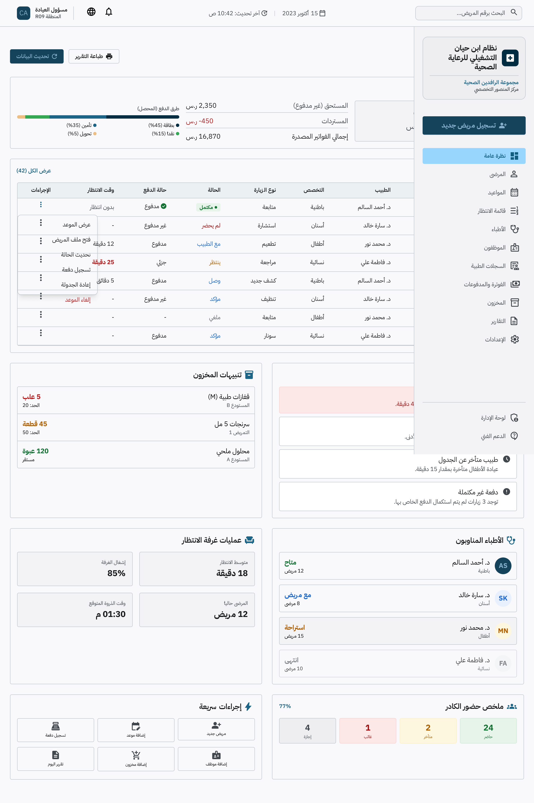

# Ibn Hayan Healthcare Operating System
## Design Bible

> **Document Purpose:** The master design reference for the Ibn Hayan Healthcare Operating System — philosophy, principles, brand identity, visual language, quality bar, and the official registry of approved canonical interface designs.
>
> **Status:** Living · **Version:** 0.2.0 · **Last Updated:** 2026-07-20
>
> This document is part of the official Ibn Hayan Healthcare Operating System
> documentation framework and serves as the authoritative reference for its
> respective domain. It is intended for the entire product, engineering,
> design, clinical, and operations teams.

---

## Table of Contents

1. Design Philosophy
2. Design Principles
3. Brand Identity
4. Visual Language
5. Design Tone & Voice
6. Design Quality Bar
7. Design Review Process
8. Design Documentation Standards
9. Design Governance
10. Design Evolution
11. Approved Screen Registry
12. Approved Screen — Clinic Admin Overview (Arabic RTL, Scrollable Desktop State)
13. Superseded Screen Experiments
14. Related Documents

---

## 1. Design Philosophy

## 2. Design Principles

## 3. Brand Identity

## 4. Visual Language

## 5. Design Tone & Voice

## 6. Design Quality Bar

## 7. Design Review Process

## 8. Design Documentation Standards

## 9. Design Governance

## 10. Design Evolution

---

## 11. Approved Screen Registry

This section is the authoritative registry of every interface design that has been officially approved as canonical for the Ibn Hayan Healthcare Operating System. An entry in this registry constitutes the formal authorisation to implement the screen exactly as described and as depicted in the referenced design asset. Screens not present in this registry are, by definition, not yet approved for implementation.

The registry is append-only. Once an entry is recorded as `APPROVED — CANONICAL`, it must not be silently edited; any change to an approved screen requires either a new registry entry (with a new asset filename) or an explicit supersede record created through the Design Review Process (§7). Superseded entries remain in the registry for historical traceability but carry the status `SUPERSEDED — DO NOT IMPLEMENT`.

The relative design asset path recorded in each row is resolved from the repository root. The canonical design-assets directory is `download/docs/design/screens/`. All approved assets are stored there using the naming convention `<screen-slug>-<locale>-<direction>-<state>-approved.<ext>`.

| # | Screen name | Language and direction | Role | Status | Design asset path | Approval date | Notes |
|---|---|---|---|---|---|---|---|
| 1 | Clinic Admin Overview — Arabic RTL — Scrollable Desktop State | Arabic (ar) — Right-to-Left (RTL) | R09 Clinic Administrator | APPROVED — CANONICAL | `download/docs/design/screens/clinic-admin-overview-ar-rtl-approved.png` | 2026-07-20 | First approved canonical interface. Defines the layout grammar for the clinic-administration surface. See §12 for the full implementation rules. Tenant-scoped and facility-scoped data; patient identifiers masked; no patient names, diagnoses, phone numbers, or addresses rendered. |

---

## 12. Approved Screen — Clinic Admin Overview (Arabic RTL, Scrollable Desktop State)

This section records the full specification of the first approved canonical interface. The approved asset is:

> **Relative path from this document:** `../design/screens/clinic-admin-overview-ar-rtl-approved.png`
> **Absolute path from repository root:** `download/docs/design/screens/clinic-admin-overview-ar-rtl-approved.png`

### 12.1 Screen Identity

| Field | Value |
|---|---|
| Screen name | Clinic Admin Overview — Arabic RTL — Scrollable Desktop State |
| Status | APPROVED — CANONICAL |
| Approval date | 2026-07-20 |
| Approved by | Ibn Hayan Design Authority |
| Role | R09 Clinic Administrator |
| Organisation | مجموعة الرافدين الصحية |
| Facility | مركز المنصور التخصصي |
| Locale | ar |
| Direction | RTL |
| Form factor | Desktop (scrollable) |
| Design asset | `clinic-admin-overview-ar-rtl-approved.png` |
| Asset SHA-256 | `217685d775f650860db42fc335d0d3e55285baf8d209b27c5332471fbef48851` |
| Asset dimensions | 2560 × 3846 px, 8-bit RGBA PNG |

### 12.2 Approved Implementation Rules

The following rules are binding on any implementation of this screen. They are part of the approval; an implementation that violates any rule is, by definition, not an implementation of the approved screen and must not be deployed.

**Layout grammar**

- **Fixed compact top navigation.** The top navigation bar must remain fixed at the viewport top and must use a compact height so that the maximum vertical real estate is reserved for operational content. It must not scroll with the page.
- **Fixed right-side Clinic Admin sidebar.** The clinic-administration navigation rail must be anchored to the right edge of the viewport (because the locale is Arabic RTL), must remain fixed during vertical scrolling, and must expose the Clinic Admin navigation vocabulary. It must not scroll with the page.
- **Vertically scrollable main-content area.** Only the main-content region between the top navigation and the bottom of the viewport scrolls. The fixed top navigation and fixed right sidebar must remain visible at all scroll positions.
- **No oversized blank safe-area bands.** The layout must not introduce oversized empty safe-area bands between regions or around the content. Edge protection must be tight and consistent (see next rule).
- **Balanced 20px to 24px edge protection.** All content regions must apply a balanced edge-protection gutter between 20px and 24px. The gutter must be symmetrical within a given region and must not drift outside this range.

**Language, typography, and direction**

- **True Arabic RTL.** The screen must be authored in true Arabic right-to-left reading order. The `dir="rtl"` and `lang="ar"` attributes must be applied at the document root. Mirroring must be semantic, not visual: every layout, every icon direction, every chart axis, and every progress indicator must read naturally in RTL.
- **IBM Plex Sans Arabic.** The approved typography is IBM Plex Sans Arabic for all Arabic-language text. Latin/numeric runs inside an Arabic string must remain LTR within the RTL flow but must use a typographically compatible weight. No font substitution is permitted without a new approval entry in the registry (§11).

**Data scoping and privacy**

- **Tenant-scoped and facility-scoped data.** Every datum rendered on this screen must be scoped to the active tenant context and the active facility context established by the canonical session-context module. The screen must never display data from another tenant or another facility, even if the user holds cross-facility permissions.
- **Masked patient identifiers.** Patient identifiers must be rendered masked. The approved design depicts the masked form; any implementation must preserve the same masking posture and must not reveal more of the identifier than the approved design does.
- **No patient names, diagnoses, phone numbers, or addresses.** The screen must not render patient names, diagnoses, phone numbers, or addresses in any region. This is a hard privacy rule; it overrides any downstream request to "show more detail" and is enforced independently of the masked-identifier rule above.

**Content regions (in approved reading order)**

The following regions are part of the approved screen composition and must all be present. The order below is the approved RTL reading order, beginning at the top-right of the main-content area.

- **Appointment Actions menu.** A menu of the canonical appointment actions available to R09 within the facility context. Actions must be permission-gated server-side; the menu must not render actions the user is not authorised to perform.
- **Financial Snapshot.** A financial overview region showing facility-scoped financial KPIs. Figures must be aggregated at the facility level; no per-patient financial data may be shown.
- **Operational Alerts.** An operational-alerts region surfacing facility-scoped operational events (e.g., scheduling conflicts, room availability, staffing gaps). Alerts must be tenant-and-facility scoped.
- **Inventory Alerts.** An inventory-alerts region surfacing facility-scoped inventory warnings (e.g., low stock, near-expiry). Alerts must not reveal supplier pricing or procurement contracts.
- **Doctors on Duty.** A region listing practitioners currently on duty within the facility. The list must show only the information depicted in the approved design and must not include patient assignments.
- **Waiting Room Operations.** A region depicting the operational state of the waiting room. Patient identifiers must be masked; patient names, diagnoses, phone numbers, and addresses must not appear.
- **Staff Attendance Summary.** A region summarising staff attendance for the facility. The summary must be aggregated; individual staff member contact information must not be shown.
- **Quick Actions.** A region of quick-action shortcuts relevant to R09 within the facility context. Actions must be permission-gated server-side.

### 12.3 Implementation Posture

This approval registers the design as canonical; it does not authorise implementation. Implementation of this screen is part of the Enterprise Application Shell batch and must not be begun before that batch is formally opened. The implementation must reference this section (§12) and the registry entry (§11) in its worklog entry, and must reproduce the layout grammar, language rules, data-scoping rules, and content regions exactly as specified above. Any deviation requires a new approval entry in §11.

---

## 13. Superseded Screen Experiments

This section records prior Clinic Admin Overview experiments that have been superseded by the entry in §11 and §12. The historical records of these experiments are retained for traceability; they must not be implemented. New implementations must follow §12 exclusively.

| # | Experiment | Source | Status | Superseded by | Notes |
|---|---|---|---|---|---|
| 1 | Legacy prototype — `clinic-admin-laser.html` Super Admin / Clinic Admin dashboard composition | `upload/clinic-admin-laser.html` (legacy prototype; untracked; SHA-256 recorded in `download/docs/99_WORKLOG/LEGACY_PROTOTYPE_EXTRACTION.md` §2.11 row 5) | SUPERSEDED — DO NOT IMPLEMENT | §12 of this document (Approved Screen — Clinic Admin Overview — Arabic RTL — Scrollable Desktop State) | The legacy prototype used LocalStorage-based state, hardcoded credentials, client-side routing, raw innerHTML rendering, and unscoped patient data. It is rejected as an implementation reference and retained only as evidence of original product intent. See `download/docs/99_WORKLOG/LEGACY_PROTOTYPE_EXTRACTION.md` §8 for the full rejection list. |
| 2 | Legacy prototype — `index.html` + `app.js` platform Super Admin dashboard adapted for clinic-admin use | `upload/index.html`, `upload/app.js` (legacy prototypes; untracked; SHA-256 recorded in `download/docs/99_WORKLOG/LEGACY_PROTOTYPE_EXTRACTION.md` §2.11 rows 1 and 2) | SUPERSEDED — DO NOT IMPLEMENT | §12 of this document | The legacy platform dashboard conflated platform-surface and clinic-surface concerns, used LocalStorage for tenancy, and rendered patient data without masking. It is rejected as an implementation reference. |

Future supersede records will be appended to this table. Historical records must not be deleted.

---

## 14. Related Documents

- `download/docs/05_UI_UX/DESIGN_SYSTEM.md` — the canonical design-system reference (tokens, components, patterns, layout, color, typography, spacing, iconography, motion, theming).
- `download/docs/05_UI_UX/ENTERPRISE_DESIGN_BRIEF.md` — the enterprise application-shell brief that governs the shell into which the approved screen in §12 will be implemented.
- `download/docs/05_UI_UX/GOOGLE_STITCH_MASTER_BRIEF.md` — the Google Stitch brief that produced the three visual directions evaluated for the canonical shell.
- `download/docs/99_WORKLOG/LEGACY_PROTOTYPE_EXTRACTION.md` — the extraction record for the legacy prototypes referenced in §13, including the SHA-256 source manifest and the security rejection list.
- `download/docs/02_PRODUCT/USER_ROLES.md` — the canonical role catalogue (R01–R14) that defines R09 Clinic Administrator.
