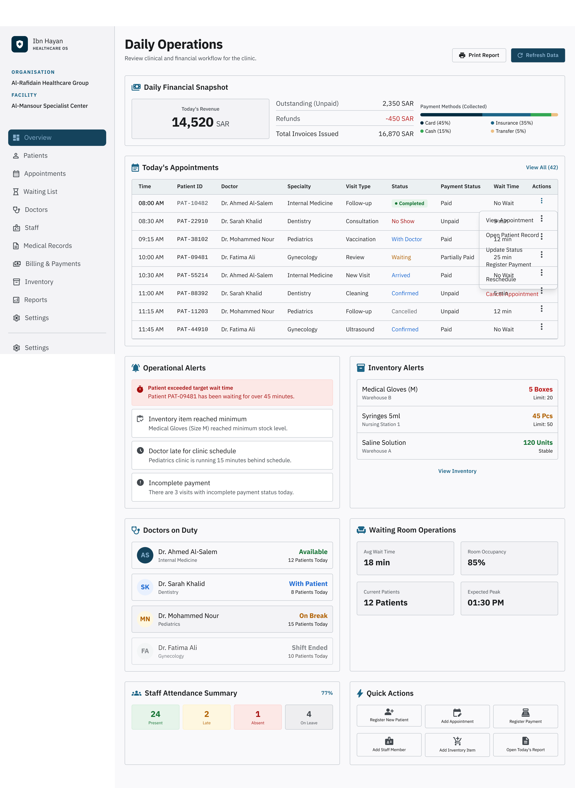
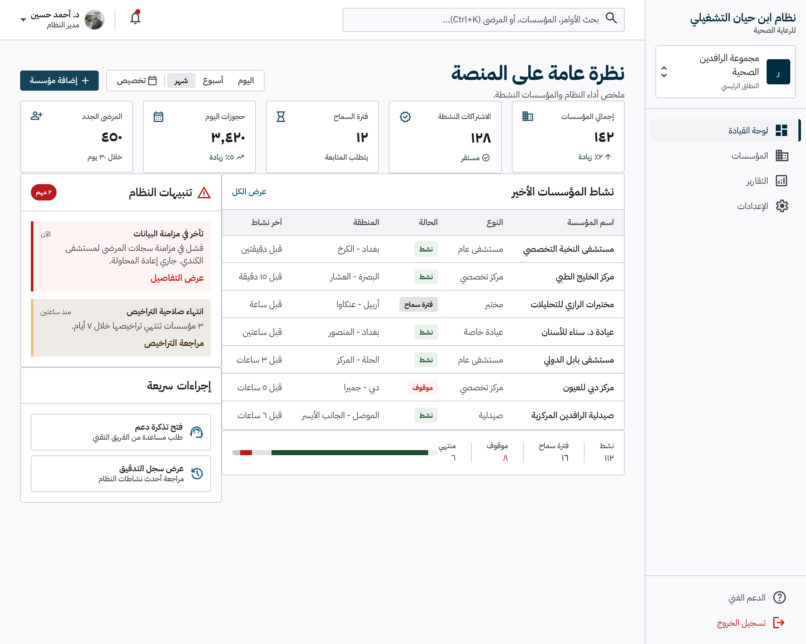
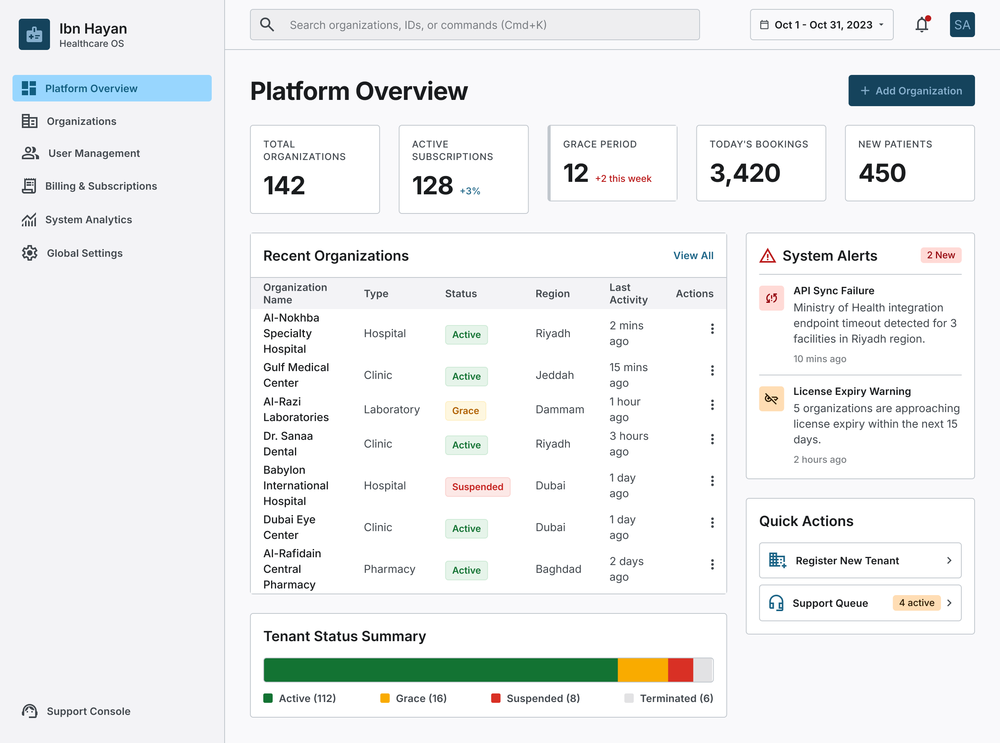

# Ibn Hayan Healthcare Operating System
## Design Bible

> **Document Purpose:** The master design reference for the Ibn Hayan Healthcare Operating System — philosophy, principles, brand identity, visual language, quality bar, and the official registry of approved canonical interface designs.
>
> **Status:** Living · **Version:** 0.4.0 · **Last Updated:** 2026-07-20
>
> This document is part of the official Ibn Hayan Healthcare Operating System
> documentation framework and serves as the authoritative reference for its
> respective domain. It is intended for the entire product, engineering,
> design, clinical, and operations teams.

---

## Table of Contents

1. Design Philosophy
2. Design Principles
3. Brand Identity
4. Visual Language
5. Design Tone & Voice
6. Design Quality Bar
7. Design Review Process
8. Design Documentation Standards
9. Design Governance
10. Design Evolution
11. Approved Screen Registry
12. Approved Screen — Clinic Admin Overview (Arabic RTL, Scrollable Desktop State)
13. Approved Screen — Clinic Admin Overview (English LTR, Scrollable Desktop State)
14. Superseded Screen Experiments
15. Approved Screen — Platform Super Admin Overview (Arabic RTL, Refined Desktop State)
16. Approved Screen — Platform Super Admin Overview (English LTR, Refined Desktop State)
17. Related Documents

---

## 1. Design Philosophy

## 2. Design Principles

## 3. Brand Identity

## 4. Visual Language

## 5. Design Tone & Voice

## 6. Design Quality Bar

## 7. Design Review Process

## 8. Design Documentation Standards

## 9. Design Governance

## 10. Design Evolution

---

## 11. Approved Screen Registry

This section is the authoritative registry of every interface design that has been officially approved as canonical for the Ibn Hayan Healthcare Operating System. An entry in this registry constitutes the formal authorisation to implement the screen exactly as described and as depicted in the referenced design asset. Screens not present in this registry are, by definition, not yet approved for implementation.

The registry is append-only. Once an entry is recorded as `APPROVED — CANONICAL`, it must not be silently edited; any change to an approved screen requires either a new registry entry (with a new asset filename) or an explicit supersede record created through the Design Review Process (§7). Superseded entries remain in the registry for historical traceability but carry the status `SUPERSEDED — DO NOT IMPLEMENT`.

The relative design asset path recorded in each row is resolved from the repository root. The canonical design-assets directory is `download/docs/design/screens/`. All approved assets are stored there using the naming convention `<screen-slug>-<locale>-<direction>-<state>-approved.<ext>`.

Entries whose status is `APPROVED — CANONICAL` are the binding specification for both the visual reference and the implementation rules. Entries whose status is `APPROVED — CANONICAL VISUAL REFERENCE` are the binding visual reference for the depicted layout, typography, palette, and content composition; their binding implementation rules are documented in the corresponding section of this document and may include explicit corrections to known generator limitations in the visual reference. Both statuses are authoritative; neither supersedes the other. Where two entries are declared as language-direction counterparts, they describe the same product surface in two locales and must be kept in lockstep.

| # | Screen name | Language and direction | Role | Status | Design asset path | Approval date | Notes |
|---|---|---|---|---|---|---|---|
| 1 | Clinic Admin Overview — Arabic RTL — Scrollable Desktop State | Arabic (ar) — Right-to-Left (RTL) | R09 Clinic Administrator | APPROVED — CANONICAL | `download/docs/design/screens/clinic-admin-overview-ar-rtl-approved.png` | 2026-07-20 | First approved canonical interface. Defines the layout grammar for the clinic-administration surface. See §12 for the full implementation rules. Tenant-scoped and facility-scoped data; patient identifiers masked; no patient names, diagnoses, phone numbers, or addresses rendered. |
| 2 | Clinic Admin Overview — English LTR — Scrollable Desktop State | English (en) — Left-to-Right (LTR) | R09 Clinic Administrator | APPROVED — CANONICAL VISUAL REFERENCE | `download/docs/design/screens/clinic-admin-overview-en-ltr-approved.png` | 2026-07-20 | English-language counterpart of registry row 1 (Arabic RTL). Same Clinic Administrator product surface, mirrored for LTR. Neither entry supersedes the other. See §13 for the full implementation rules and the two mandatory implementation corrections (Time column and Patient ID label). Tenant-scoped and facility-scoped data; patient identifiers masked; no patient names, diagnoses, phone numbers, or addresses rendered. Counterpart: registry row 1 (Arabic RTL). |
| 3 | Platform Super Admin Overview — Arabic RTL — Refined Desktop State | Arabic (ar) — Right-to-Left (RTL) | R13 System Administrator | APPROVED — CANONICAL VISUAL REFERENCE | `download/docs/design/screens/platform-super-admin-overview-ar-rtl-approved.png` | 2026-07-20 | First approved canonical interface for the Platform Super Admin surface. Defines the layout grammar for the platform-administration surface. See §15 for the full implementation rules. Platform-scoped only; aggregated organisation/tenant/billing/analytics metrics; no patient-identifying information rendered; no direct clinic-level operations. Counterpart: registry row 4 (English LTR). |
| 4 | Platform Super Admin Overview — English LTR — Refined Desktop State | English (en) — Left-to-Right (LTR) | R13 System Administrator | APPROVED — CANONICAL VISUAL REFERENCE | `download/docs/design/screens/platform-super-admin-overview-en-ltr-approved.png` | 2026-07-20 | English-language counterpart of registry row 3 (Arabic RTL). Same Platform Super Admin product surface, mirrored for LTR. Neither entry supersedes the other. See §16 for the full implementation rules. Platform-scoped only; aggregated organisation/tenant/billing/analytics metrics; no patient-identifying information rendered; no direct clinic-level operations. Counterpart: registry row 3 (Arabic RTL). |

---

## 12. Approved Screen — Clinic Admin Overview (Arabic RTL, Scrollable Desktop State)

This section records the full specification of the first approved canonical interface. The approved asset is:

> **Relative path from this document:** `../design/screens/clinic-admin-overview-ar-rtl-approved.png`
> **Absolute path from repository root:** `download/docs/design/screens/clinic-admin-overview-ar-rtl-approved.png`

### 12.1 Screen Identity

| Field | Value |
|---|---|
| Screen name | Clinic Admin Overview — Arabic RTL — Scrollable Desktop State |
| Status | APPROVED — CANONICAL |
| Approval date | 2026-07-20 |
| Approved by | Ibn Hayan Design Authority |
| Role | R09 Clinic Administrator |
| Organisation | مجموعة الرافدين الصحية |
| Facility | مركز المنصور التخصصي |
| Locale | ar |
| Direction | RTL |
| Form factor | Desktop (scrollable) |
| Design asset | `clinic-admin-overview-ar-rtl-approved.png` |
| Asset SHA-256 | `217685d775f650860db42fc335d0d3e55285baf8d209b27c5332471fbef48851` |
| Asset dimensions | 2560 × 3846 px, 8-bit RGBA PNG |

### 12.2 Approved Implementation Rules

The following rules are binding on any implementation of this screen. They are part of the approval; an implementation that violates any rule is, by definition, not an implementation of the approved screen and must not be deployed.

**Layout grammar**

- **Fixed compact top navigation.** The top navigation bar must remain fixed at the viewport top and must use a compact height so that the maximum vertical real estate is reserved for operational content. It must not scroll with the page.
- **Fixed right-side Clinic Admin sidebar.** The clinic-administration navigation rail must be anchored to the right edge of the viewport (because the locale is Arabic RTL), must remain fixed during vertical scrolling, and must expose the Clinic Admin navigation vocabulary. It must not scroll with the page.
- **Vertically scrollable main-content area.** Only the main-content region between the top navigation and the bottom of the viewport scrolls. The fixed top navigation and fixed right sidebar must remain visible at all scroll positions.
- **No oversized blank safe-area bands.** The layout must not introduce oversized empty safe-area bands between regions or around the content. Edge protection must be tight and consistent (see next rule).
- **Balanced 20px to 24px edge protection.** All content regions must apply a balanced edge-protection gutter between 20px and 24px. The gutter must be symmetrical within a given region and must not drift outside this range.

**Language, typography, and direction**

- **True Arabic RTL.** The screen must be authored in true Arabic right-to-left reading order. The `dir="rtl"` and `lang="ar"` attributes must be applied at the document root. Mirroring must be semantic, not visual: every layout, every icon direction, every chart axis, and every progress indicator must read naturally in RTL.
- **IBM Plex Sans Arabic.** The approved typography is IBM Plex Sans Arabic for all Arabic-language text. Latin/numeric runs inside an Arabic string must remain LTR within the RTL flow but must use a typographically compatible weight. No font substitution is permitted without a new approval entry in the registry (§11).

**Data scoping and privacy**

- **Tenant-scoped and facility-scoped data.** Every datum rendered on this screen must be scoped to the active tenant context and the active facility context established by the canonical session-context module. The screen must never display data from another tenant or another facility, even if the user holds cross-facility permissions.
- **Masked patient identifiers.** Patient identifiers must be rendered masked. The approved design depicts the masked form; any implementation must preserve the same masking posture and must not reveal more of the identifier than the approved design does.
- **No patient names, diagnoses, phone numbers, or addresses.** The screen must not render patient names, diagnoses, phone numbers, or addresses in any region. This is a hard privacy rule; it overrides any downstream request to "show more detail" and is enforced independently of the masked-identifier rule above.

**Content regions (in approved reading order)**

The following regions are part of the approved screen composition and must all be present. The order below is the approved RTL reading order, beginning at the top-right of the main-content area.

- **Appointment Actions menu.** A menu of the canonical appointment actions available to R09 within the facility context. Actions must be permission-gated server-side; the menu must not render actions the user is not authorised to perform.
- **Financial Snapshot.** A financial overview region showing facility-scoped financial KPIs. Figures must be aggregated at the facility level; no per-patient financial data may be shown.
- **Operational Alerts.** An operational-alerts region surfacing facility-scoped operational events (e.g., scheduling conflicts, room availability, staffing gaps). Alerts must be tenant-and-facility scoped.
- **Inventory Alerts.** An inventory-alerts region surfacing facility-scoped inventory warnings (e.g., low stock, near-expiry). Alerts must not reveal supplier pricing or procurement contracts.
- **Doctors on Duty.** A region listing practitioners currently on duty within the facility. The list must show only the information depicted in the approved design and must not include patient assignments.
- **Waiting Room Operations.** A region depicting the operational state of the waiting room. Patient identifiers must be masked; patient names, diagnoses, phone numbers, and addresses must not appear.
- **Staff Attendance Summary.** A region summarising staff attendance for the facility. The summary must be aggregated; individual staff member contact information must not be shown.
- **Quick Actions.** A region of quick-action shortcuts relevant to R09 within the facility context. Actions must be permission-gated server-side.

### 12.3 Implementation Posture

This approval registers the design as canonical; it does not authorise implementation. Implementation of this screen is part of the Enterprise Application Shell batch and must not be begun before that batch is formally opened. The implementation must reference this section (§12) and the registry entry (§11) in its worklog entry, and must reproduce the layout grammar, language rules, data-scoping rules, and content regions exactly as specified above. Any deviation requires a new approval entry in §11.

---

## 13. Approved Screen — Clinic Admin Overview (English LTR, Scrollable Desktop State)

This section records the full specification of the approved English-language canonical visual reference for the Clinic Administrator product surface. It is the language-direction counterpart of §12 (Arabic RTL). The two sections describe the same product surface in two locales; neither supersedes the other. The approved asset is:

> **Relative path from this document:** `../design/screens/clinic-admin-overview-en-ltr-approved.png`
> **Absolute path from repository root:** `download/docs/design/screens/clinic-admin-overview-en-ltr-approved.png`

### 13.1 Screen Identity

| Field | Value |
|---|---|
| Screen name | Clinic Admin Overview — English LTR — Scrollable Desktop State |
| Status | APPROVED — CANONICAL VISUAL REFERENCE |
| Approval date | 2026-07-20 |
| Approved by | Ibn Hayan Design Authority |
| Role | R09 Clinic Administrator |
| Organisation | Al-Rafidain Healthcare Group |
| Facility | Al-Mansour Specialist Center |
| Locale | en |
| Direction | LTR |
| Form factor | Desktop (scrollable) |
| Design asset | `clinic-admin-overview-en-ltr-approved.png` |
| Asset SHA-256 | `c7ff4ef2ebc17fc30c59bd446877dd186501b13c0b0d1df44cc56d97326fb253` |
| Asset dimensions | 2805 × 3846 px, 8-bit RGBA PNG |
| Arabic counterpart | Clinic Admin Overview — Arabic RTL — Scrollable Desktop State (see §12) |
| Counterpart relation | Language-direction counterparts of the same Clinic Administrator product surface. Neither supersedes the other. |

### 13.2 Approved Visual Structure

The following elements are approved as the canonical visual reference for this screen. They are binding on any implementation of the English LTR variant.

**Layout grammar**

- **Fixed compact top navigation.** The top navigation bar must remain fixed at the viewport top and must use a compact height so that the maximum vertical real estate is reserved for operational content. It must not scroll with the page.
- **Fixed left Clinic Admin sidebar.** The clinic-administration navigation rail must be anchored to the left edge of the viewport (because the locale is English LTR), must remain fixed during vertical scrolling, and must expose the Clinic Admin navigation vocabulary. It must not scroll with the page. (This is the LTR mirror of the Arabic RTL right-side sidebar in §12.)
- **Vertically scrollable main-content region.** Only the main-content region between the top navigation and the bottom of the viewport scrolls. The fixed top navigation and fixed left sidebar must remain visible at all scroll positions.
- **Eleven Clinic Admin navigation items.** The Clinic Admin sidebar must expose exactly eleven navigation items. The eleven items are part of the approved visual reference; their canonical labels and ordering are determined by the Clinic Admin navigation vocabulary recorded in `download/docs/05_UI_UX/ENTERPRISE_DESIGN_BRIEF.md` and the canonical module catalogue (M01–M19) in `download/docs/02_PRODUCT/MODULES.md`.
- **Balanced 20px to 24px edge protection.** All content regions must apply a balanced edge-protection gutter between 20px and 24px. The gutter must be symmetrical within a given region and must not drift outside this range. (Same rule as §12.)
- **Enterprise operational density.** The visual density must be the enterprise operational density depicted in the approved asset: tight row heights, multi-region composition, and KPI strips. The density must not be loosened into a marketing-style layout.

**Language, typography, and palette**

- **True English LTR.** The screen must be authored in true English left-to-right reading order. The `dir="ltr"` and `lang="en"` attributes must be applied at the document root. (This is the LTR mirror of the Arabic RTL rule in §12.)
- **Inter typography.** The approved typography is Inter for all English-language text. Numeric runs must use Inter's tabular figures. No font substitution is permitted without a new approval entry in the registry (§11). (This is the LTR counterpart of the IBM Plex Sans Arabic rule in §12.)
- **Deep teal-blue institutional palette.** The approved colour palette is the deep teal-blue institutional palette depicted in the approved asset. The palette tokens are defined in `download/docs/05_UI_UX/DESIGN_SYSTEM.md` and `download/docs/05_UI_UX/COLORS.md`; the implementation must use those tokens, not hard-coded hex values.

**Data scoping and privacy**

- **Tenant-scoped and facility-scoped data.** Every datum rendered on this screen must be scoped to the active tenant context and the active facility context established by the canonical session-context module. The screen must never display data from another tenant or another facility. (Same rule as §12.)
- **Masked patient identifiers.** Patient identifiers must be rendered masked. The approved design depicts the masked form; any implementation must preserve the same masking posture and must not reveal more of the identifier than the approved design does.
- **No patient names, diagnoses, phone numbers, or addresses.** The screen must not render patient names, diagnoses, phone numbers, or addresses in any region. This is a hard privacy rule; it overrides any downstream request to "show more detail" and is enforced independently of the masked-identifier rule above.

**Content regions (in approved reading order)**

The following regions are part of the approved screen composition and must all be present. The order below is the approved LTR reading order, beginning at the top-left of the main-content area.

- **Financial Snapshot.** A financial overview region showing facility-scoped financial KPIs. Figures must be aggregated at the facility level; no per-patient financial data may be shown.
- **Today's Appointments with eight rows.** A daily-appointments table for the active facility and day. The approved visual reference depicts exactly eight appointment rows. The mandatory column set and row content are specified in §13.3 (Mandatory Implementation Corrections) below; the column set in the approved visual reference is incomplete and must be corrected in implementation per §13.3.
- **Operational Alerts.** An operational-alerts region surfacing facility-scoped operational events (e.g., scheduling conflicts, room availability, staffing gaps). Alerts must be tenant-and-facility scoped.
- **Inventory Alerts.** An inventory-alerts region surfacing facility-scoped inventory warnings (e.g., low stock, near-expiry). Alerts must not reveal supplier pricing or procurement contracts.
- **Doctors on Duty.** A region listing practitioners currently on duty within the facility. The list must show only the information depicted in the approved design and must not include patient assignments.
- **Waiting Room Operations.** A region depicting the operational state of the waiting room. Patient identifiers must be masked; patient names, diagnoses, phone numbers, and addresses must not appear.
- **Staff Attendance Summary.** A region summarising staff attendance for the facility. The summary must be aggregated; individual staff member contact information must not be shown.
- **Quick Actions.** A region of quick-action shortcuts relevant to R09 within the facility context. Actions must be permission-gated server-side.

### 13.3 Mandatory Implementation Corrections

The approved visual reference was produced by Google Stitch and contains two known generator limitations. These limitations are documented here as binding implementation corrections. They are **not** reasons to reject or redesign the approved visual reference; the visual reference remains approved as canonical. The implementation, however, must apply these corrections and must not copy the two limitations into production.

**Correction 1 — Today's Appointments table must include the Time column**

The approved visual reference depicts the Today's Appointments table without a visible Time column. The production implementation must include a Time column as the first column of the table. The complete and binding column set, in binding order, is:

1. **Time**
2. **Patient ID**
3. **Doctor**
4. **Specialty**
5. **Visit Type**
6. **Status**
7. **Payment Status**
8. **Wait Time**
9. **Actions**

The eight appointment rows must use exactly these eight appointment times, in this order:

1. `08:00 AM`
2. `08:30 AM`
3. `09:15 AM`
4. `10:00 AM`
5. `10:30 AM`
6. `11:00 AM`
7. `11:15 AM`
8. `11:45 AM`

**Correction 2 — The first table-column label must read `Patient ID`, not `Client ID`**

The approved visual reference labels the first data column of the Today's Appointments table as "Client ID". The production implementation must label that column `Patient ID`. The label `Client ID` must not be used anywhere on this screen or on any other screen of the Ibn Hayan Healthcare Operating System, because the canonical domain term is `Patient` (per `download/docs/02_PRODUCT/PRODUCT_BIBLE.md` and the canonical role catalogue R01–R14 in `download/docs/02_PRODUCT/USER_ROLES.md`).

These two corrections apply only to the production implementation; the approved visual reference itself is not altered by them. Any future re-generation of the visual reference by Google Stitch should resolve these limitations, at which point a new registry entry (with a new asset filename) may be recorded and the existing entry may be marked `SUPERSEDED — DO NOT IMPLEMENT` per the registry rules in §11.

### 13.4 Implementation Posture

This approval registers the design as a canonical visual reference; it does not authorise implementation. Implementation of this screen is part of the Enterprise Application Shell batch and must not be begun before that batch is formally opened. The implementation must reference this section (§13) and the registry entry (§11, row 2) in its worklog entry, and must reproduce the visual structure, language rules, palette rules, data-scoping rules, content regions, and the two mandatory implementation corrections in §13.3 exactly as specified above. Any deviation requires a new approval entry in §11.

---

## 14. Superseded Screen Experiments

This section records prior screen experiments and legacy prototype references that must be respected before any new implementation begins. Entries in this section belong to one of two distinct product surfaces and must not be conflated. The Clinic Administrator surface entries have been superseded by the approved Clinic Admin Overview specifications in §12 (Arabic RTL) and §13 (English LTR); they must not be implemented, and new implementations of the Clinic Administrator surface must follow §12 and §13 exclusively. The Platform Super Admin surface entries have been superseded by the approved Platform Super Admin Overview specifications in §15 (Arabic RTL) and §16 (English LTR); they must not be implemented, and new implementations of the Platform Super Admin surface must follow §15 and §16 exclusively. Insecure legacy code recorded in this section must never be reused under any circumstances; the historical records are retained for traceability only.

| # | Experiment | Source | Status | Superseded by | Notes |
|---|---|---|---|---|---|
| 1 | Legacy prototype — `clinic-admin-laser.html` Super Admin / Clinic Admin dashboard composition | `upload/clinic-admin-laser.html` (legacy prototype; untracked; SHA-256 recorded in `download/docs/99_WORKLOG/LEGACY_PROTOTYPE_EXTRACTION.md` §2.11 row 5) | SUPERSEDED — DO NOT IMPLEMENT | §12 (Arabic RTL) and §13 (English LTR) of this document | The legacy prototype used LocalStorage-based state, hardcoded credentials, client-side routing, raw innerHTML rendering, and unscoped patient data. It is rejected as an implementation reference and retained only as evidence of original product intent. See `download/docs/99_WORKLOG/LEGACY_PROTOTYPE_EXTRACTION.md` §8 for the full rejection list. |
| 2 | Legacy prototype — `index.html` + `app.js` Platform Super Admin console | `upload/index.html`, `upload/app.js` (legacy prototypes; untracked; SHA-256 recorded in `download/docs/99_WORKLOG/LEGACY_PROTOTYPE_EXTRACTION.md` §2.11 rows 1 and 2) | SUPERSEDED — DO NOT IMPLEMENT | §15 (Arabic RTL) and §16 (English LTR) of this document | This prototype was historical product-intent evidence for the Platform Super Admin surface. The visual and interaction reference for the Platform Super Admin Overview is now superseded by the approved Arabic RTL §15 and English LTR §16 canonical references. Historical product-intent evidence remains retained, but none of the legacy code may be reused. It is not superseded by any Clinic Admin screen (§12, §13); the Platform Super Admin and Clinic Administrator surfaces are different roles, scopes and product surfaces. |

Future supersede and replacement records will be appended to this table. Historical records must not be deleted.

---

## 15. Approved Screen — Platform Super Admin Overview (Arabic RTL, Refined Desktop State)

This section records the full specification of the approved Arabic-language canonical visual reference for the Platform Super Admin Overview. It is the language-direction counterpart of §16 (English LTR). The two sections describe the same Platform Super Admin product surface in two locales; neither supersedes the other. The approved asset is:

> **Relative path from this document:** `../design/screens/platform-super-admin-overview-ar-rtl-approved.png`
> **Absolute path from repository root:** `download/docs/design/screens/platform-super-admin-overview-ar-rtl-approved.png`

### 15.1 Screen Identity

| Field | Value |
|---|---|
| Screen name | Platform Super Admin Overview — Arabic RTL — Refined Desktop State |
| Status | APPROVED — CANONICAL VISUAL REFERENCE |
| Approval date | 2026-07-20 |
| Approved by | Ibn Hayan Design Authority |
| Role | R13 System Administrator |
| Role authority | `download/docs/02_PRODUCT/USER_ROLES.md` §6.1 ("System Administrator (R13)"); `download/docs/05_UI_UX/ENTERPRISE_DESIGN_BRIEF.md` §X ("R13 (System Administrator) is the canonical human role for interactive platform administration") |
| Surface | Platform Super Administration (platform scope, not tenant or facility scope) |
| Locale | ar |
| Direction | RTL |
| Form factor | Desktop (refined) |
| Design asset | `platform-super-admin-overview-ar-rtl-approved.png` |
| Asset SHA-256 | `9a69840e34e14589293ad65eb1fe3db831a6a67308da06b329dac276ba5b8ac2` |
| Asset dimensions | 2560 × 2046 px, 8-bit RGBA PNG |
| English counterpart | Platform Super Admin Overview — English LTR — Refined Desktop State (see §16) |
| Counterpart relation | Language-direction counterparts of the same Platform Super Admin product surface. Neither supersedes the other. |

### 15.2 Approved Visual Structure

The following elements are approved as the canonical visual reference for this screen. They are binding on any implementation of the Arabic RTL variant.

**Layout grammar**

- **Fixed compact desktop top navigation.** The top navigation bar must remain fixed at the viewport top and must use a compact height so that the maximum vertical real estate is reserved for operational content. It must not scroll with the page.
- **Fixed right-side Platform Super Admin sidebar.** The platform-administration navigation rail must be anchored to the right edge of the viewport (because the locale is Arabic RTL), must remain fixed during vertical scrolling, and must expose the canonical Platform Super Admin navigation vocabulary (see §15.3). It must not scroll with the page. (This is the RTL mirror of the English LTR left-side sidebar in §16.)
- **Refined desktop main-content region.** The main-content region between the top navigation and the bottom of the viewport must compose five principal platform KPI cards, a Recent Organisations table, a System Alerts panel, a Quick Actions panel, and a Tenant Status Summary, in the approved Arabic RTL reading order (top-right first).
- **Balanced outer-edge protection.** All content regions must apply a balanced outer-edge-protection gutter between 20px and 24px. The gutter must be symmetrical within a given region and must not drift outside this range. (Same rule as §12.)
- **Enterprise operational density.** The visual density must be the enterprise operational density depicted in the approved asset: tight row heights, multi-region composition, KPI strips, and dense tabular summaries. The density must not be loosened into a marketing-style layout.

**Language, typography, and palette**

- **True Arabic RTL.** The screen must be authored in true Arabic right-to-left reading order. The `dir="rtl"` and `lang="ar"` attributes must be applied at the document root. Mirroring must be semantic, not visual.
- **IBM Plex Sans Arabic.** The approved typography is IBM Plex Sans Arabic for all Arabic-language text, consistent with §12. Latin/numeric runs inside an Arabic string must remain LTR within the RTL flow. No font substitution is permitted without a new approval entry in the registry (§11).
- **Deep teal-blue institutional palette.** The approved colour palette is the deep teal-blue institutional palette depicted in the approved asset. The palette tokens are defined in `download/docs/05_UI_UX/DESIGN_SYSTEM.md` and `download/docs/05_UI_UX/COLORS.md`; the implementation must use those tokens, not hard-coded hex values.
- **Restrained status colours.** Status indicators (tenant status, alert severity, lifecycle state) must use the restrained status colours depicted in the approved asset, drawn from the canonical status-colour tokens. Status colours must not be saturated, must not pulse, and must not be used decoratively outside their semantic scope.
- **Accessible typography and contrast.** All text and interactive elements must meet the accessibility contrast floor defined in `download/docs/05_UI_UX/ACCESSIBILITY.md`. No text may be rendered below the approved minimum size for its hierarchy tier.
- **No gradients, no glassmorphism, no marketing imagery, no decorative medical clichés.** The screen must use flat surfaces, opaque cards, and operational iconography only. Gradients, glassmorphism, marketing photography, and decorative medical clichés (stethoscopes, caducei, stock patient photography) are forbidden on this surface.

**Data scoping and privacy**

- **Platform scope only.** Every datum rendered on this screen must be scoped to the platform scope established by the canonical session-context module. The screen must never display tenant-internal, facility-internal, or patient-level operational data; only platform-aggregated metrics, organisation/tenant lifecycle state, billing/subscription aggregates, platform analytics, and platform-level alerts may appear.
- **Aggregated metrics only.** Organisation-wide totals, tenant-status aggregates, billing aggregates, and analytics aggregates may be shown. No patient-identifying information may appear anywhere on the screen — not masked, not redacted, not even as a count of one. This is a hard privacy rule for the platform surface and overrides any downstream request to "drill into patient-level data" from the overview.
- **No direct clinic-level operations.** The screen must not surface direct Clinic Administrator operations: no patient registration, no patient-record management, no clinic waiting-room operations, no individual-appointment management, no clinic-level payment recording, no clinic-inventory management, and no clinic-staff-attendance management. Such operations belong to the Clinic Administrator surface (§12, §13) and must not be reachable from this Platform Super Admin Overview as actionable controls.

**Content regions (in approved Arabic RTL reading order)**

The following regions are part of the approved screen composition and must all be present. The order below is the approved RTL reading order, beginning at the top-right of the main-content area.

- **Five principal platform KPI cards.** A row of exactly five platform-level KPI cards. Each card must aggregate one principal platform metric (e.g., total organisations, total tenants, active subscriptions, platform-level alerts, system-health indicator). The exact KPI labels and ordering are determined by the canonical Platform Super Admin metric catalogue defined in `download/docs/05_UI_UX/ENTERPRISE_DESIGN_BRIEF.md` and the canonical module catalogue (M01–M19) in `download/docs/02_PRODUCT/MODULES.md`. No KPI may display patient-identifying information.
- **Recent Organisations table.** A table listing the most recently created or modified organisations on the platform. Columns must include organisation identifier, organisation name, tenant linkage, lifecycle status, and a last-modified timestamp. The table must not display patient data. Column set is binding on implementation.
- **System Alerts panel.** A panel surfacing platform-scoped operational and security alerts (e.g., tenant provisioning failures, integration outages, audit anomalies). Alerts must be tenant-and-platform scoped; no patient-identifying alert payload may appear.
- **Quick Actions panel.** A panel of quick-action shortcuts relevant to R13 within the platform scope (e.g., create organisation, suspend tenant, open support ticket, view audit log). Actions must be permission-gated server-side; the panel must not render actions the user is not authorised to perform.
- **Tenant Status Summary.** A summary of tenant-status aggregates across the platform (active, suspended, provisioning, terminated). The summary must be aggregated; per-tenant operational detail must not appear in this region.

### 15.3 Approved Platform Super Admin Navigation

The canonical Platform Super Admin navigation vocabulary represented by this approved visual reference, reconciled with the canonical repository terminology, is exactly the following six items, in this binding order:

1. **Platform Overview** — `نظرة عامة على المنصة`
2. **Organisations** — `المؤسسات`
3. **User Management** — `إدارة المستخدمين`
4. **Billing & Subscriptions** — `الفوترة والاشتراكات`
5. **System Analytics** — `تحليلات النظام`
6. **Global Settings** — `الإعدادات العامة`

No Clinic Administrator navigation items (Appointments, Doctors, Patients, Inventory, Waiting Room, Staff Attendance, etc.) may appear in this navigation. Any additional visible affordances depicted in the approved visual reference beyond these six items (for example, a Support Console affordance) are not part of the canonical navigation scope of this approved Overview screen and must be treated as future canonical platform-admin surfaces to be registered separately in §11.

### 15.4 Implementation Posture

This approval registers the design as a canonical visual reference; it does not authorise implementation. Implementation of this screen is part of the Enterprise Application Shell batch and must not be begun before that batch is formally opened. The implementation must reference this section (§15) and the registry entry (§11, row 3) in its worklog entry, and must reproduce the visual structure, language rules, palette rules, data-scoping rules, content regions, and the six-item canonical navigation vocabulary in §15.3 exactly as specified above. Any deviation requires a new approval entry in §11.

---

## 16. Approved Screen — Platform Super Admin Overview (English LTR, Refined Desktop State)

This section records the full specification of the approved English-language canonical visual reference for the Platform Super Admin Overview. It is the language-direction counterpart of §15 (Arabic RTL). The two sections describe the same Platform Super Admin product surface in two locales; neither supersedes the other. The approved asset is:

> **Relative path from this document:** `../design/screens/platform-super-admin-overview-en-ltr-approved.png`
> **Absolute path from repository root:** `download/docs/design/screens/platform-super-admin-overview-en-ltr-approved.png`

### 16.1 Screen Identity

| Field | Value |
|---|---|
| Screen name | Platform Super Admin Overview — English LTR — Refined Desktop State |
| Status | APPROVED — CANONICAL VISUAL REFERENCE |
| Approval date | 2026-07-20 |
| Approved by | Ibn Hayan Design Authority |
| Role | R13 System Administrator |
| Role authority | `download/docs/02_PRODUCT/USER_ROLES.md` §6.1 ("System Administrator (R13)"); `download/docs/05_UI_UX/ENTERPRISE_DESIGN_BRIEF.md` §X ("R13 (System Administrator) is the canonical human role for interactive platform administration") |
| Surface | Platform Super Administration (platform scope, not tenant or facility scope) |
| Locale | en |
| Direction | LTR |
| Form factor | Desktop (refined) |
| Design asset | `platform-super-admin-overview-en-ltr-approved.png` |
| Asset SHA-256 | `522ea1e9a4a3760f83105b4042e3be4a773f55aab2b57e1159ecda7a5b4ba669` |
| Asset dimensions | 2560 × 1904 px, 8-bit RGBA PNG |
| Arabic counterpart | Platform Super Admin Overview — Arabic RTL — Refined Desktop State (see §15) |
| Counterpart relation | Language-direction counterparts of the same Platform Super Admin product surface. Neither supersedes the other. |

### 16.2 Approved Visual Structure

The following elements are approved as the canonical visual reference for this screen. They are binding on any implementation of the English LTR variant.

**Layout grammar**

- **Fixed compact desktop top navigation.** The top navigation bar must remain fixed at the viewport top and must use a compact height so that the maximum vertical real estate is reserved for operational content. It must not scroll with the page. (Same rule as §15.)
- **Fixed left-side Platform Super Admin sidebar.** The platform-administration navigation rail must be anchored to the left edge of the viewport (because the locale is English LTR), must remain fixed during vertical scrolling, and must expose the canonical Platform Super Admin navigation vocabulary (see §16.3). It must not scroll with the page. (This is the LTR mirror of the Arabic RTL right-side sidebar in §15.)
- **Refined desktop main-content region.** The main-content region between the top navigation and the bottom of the viewport must compose five principal platform KPI cards, a Recent Organisations table, a System Alerts panel, a Quick Actions panel, and a Tenant Status Summary, in the approved English LTR reading order (top-left first). (Same composition as §15.)
- **Balanced outer-edge protection.** All content regions must apply a balanced outer-edge-protection gutter between 20px and 24px. The gutter must be symmetrical within a given region and must not drift outside this range. (Same rule as §15.)
- **Enterprise operational density.** The visual density must be the enterprise operational density depicted in the approved asset: tight row heights, multi-region composition, KPI strips, and dense tabular summaries. The density must not be loosened into a marketing-style layout. (Same rule as §15.)

**Language, typography, and palette**

- **True English LTR.** The screen must be authored in true English left-to-right reading order. The `dir="ltr"` and `lang="en"` attributes must be applied at the document root. (This is the LTR mirror of the Arabic RTL rule in §15.)
- **Inter typography.** The approved typography is Inter for all English-language text. Numeric runs must use Inter's tabular figures. No font substitution is permitted without a new approval entry in the registry (§11). (This is the LTR counterpart of the IBM Plex Sans Arabic rule in §15 and is consistent with §13.)
- **Deep teal-blue institutional palette.** The approved colour palette is the deep teal-blue institutional palette depicted in the approved asset. The palette tokens are defined in `download/docs/05_UI_UX/DESIGN_SYSTEM.md` and `download/docs/05_UI_UX/COLORS.md`; the implementation must use those tokens, not hard-coded hex values. (Same rule as §15.)
- **Restrained status colours.** Status indicators (tenant status, alert severity, lifecycle state) must use the restrained status colours depicted in the approved asset, drawn from the canonical status-colour tokens. Status colours must not be saturated, must not pulse, and must not be used decoratively outside their semantic scope. (Same rule as §15.)
- **Accessible typography and contrast.** All text and interactive elements must meet the accessibility contrast floor defined in `download/docs/05_UI_UX/ACCESSIBILITY.md`. No text may be rendered below the approved minimum size for its hierarchy tier. (Same rule as §15.)
- **No gradients, no glassmorphism, no marketing imagery, no decorative medical clichés.** The screen must use flat surfaces, opaque cards, and operational iconography only. Gradients, glassmorphism, marketing photography, and decorative medical clichés (stethoscopes, caducei, stock patient photography) are forbidden on this surface. (Same rule as §15.)

**Data scoping and privacy**

- **Platform scope only.** Every datum rendered on this screen must be scoped to the platform scope established by the canonical session-context module. The screen must never display tenant-internal, facility-internal, or patient-level operational data; only platform-aggregated metrics, organisation/tenant lifecycle state, billing/subscription aggregates, platform analytics, and platform-level alerts may appear. (Same rule as §15.)
- **Aggregated metrics only.** Organisation-wide totals, tenant-status aggregates, billing aggregates, and analytics aggregates may be shown. No patient-identifying information may appear anywhere on the screen — not masked, not redacted, not even as a count of one. This is a hard privacy rule for the platform surface and overrides any downstream request to "drill into patient-level data" from the overview. (Same rule as §15.)
- **No direct clinic-level operations.** The screen must not surface direct Clinic Administrator operations: no patient registration, no patient-record management, no clinic waiting-room operations, no individual-appointment management, no clinic-level payment recording, no clinic-inventory management, and no clinic-staff-attendance management. Such operations belong to the Clinic Administrator surface (§12, §13) and must not be reachable from this Platform Super Admin Overview as actionable controls. (Same rule as §15.)

**Content regions (in approved English LTR reading order)**

The following regions are part of the approved screen composition and must all be present. The order below is the approved LTR reading order, beginning at the top-left of the main-content area.

- **Five principal platform KPI cards.** A row of exactly five platform-level KPI cards. Each card must aggregate one principal platform metric (e.g., total organisations, total tenants, active subscriptions, platform-level alerts, system-health indicator). The exact KPI labels and ordering are determined by the canonical Platform Super Admin metric catalogue defined in `download/docs/05_UI_UX/ENTERPRISE_DESIGN_BRIEF.md` and the canonical module catalogue (M01–M19) in `download/docs/02_PRODUCT/MODULES.md`. No KPI may display patient-identifying information. (Same composition as §15.)
- **Recent Organisations table.** A table listing the most recently created or modified organisations on the platform. Columns must include organisation identifier, organisation name, tenant linkage, lifecycle status, and a last-modified timestamp. The table must not display patient data. Column set is binding on implementation. (Same as §15.)
- **System Alerts panel.** A panel surfacing platform-scoped operational and security alerts (e.g., tenant provisioning failures, integration outages, audit anomalies). Alerts must be tenant-and-platform scoped; no patient-identifying alert payload may appear. (Same as §15.)
- **Quick Actions panel.** A panel of quick-action shortcuts relevant to R13 within the platform scope (e.g., create organisation, suspend tenant, open support ticket, view audit log). Actions must be permission-gated server-side; the panel must not render actions the user is not authorised to perform. (Same as §15.)
- **Tenant Status Summary.** A summary of tenant-status aggregates across the platform (active, suspended, provisioning, terminated). The summary must be aggregated; per-tenant operational detail must not appear in this region. (Same as §15.)

### 16.3 Approved Platform Super Admin Navigation

The canonical Platform Super Admin navigation vocabulary represented by this approved visual reference, reconciled with the canonical repository terminology, is exactly the following six items, in this binding order:

1. **Platform Overview**
2. **Organisations**
3. **User Management**
4. **Billing & Subscriptions**
5. **System Analytics**
6. **Global Settings**

(The canonical Arabic counterparts of these six items are recorded in §15.3.) No Clinic Administrator navigation items (Appointments, Doctors, Patients, Inventory, Waiting Room, Staff Attendance, etc.) may appear in this navigation. Any additional visible affordances depicted in the approved visual reference beyond these six items (for example, a Support Console affordance) are not part of the canonical navigation scope of this approved Overview screen and must be treated as future canonical platform-admin surfaces to be registered separately in §11.

### 16.4 Implementation Posture

This approval registers the design as a canonical visual reference; it does not authorise implementation. Implementation of this screen is part of the Enterprise Application Shell batch and must not be begun before that batch is formally opened. The implementation must reference this section (§16) and the registry entry (§11, row 4) in its worklog entry, and must reproduce the visual structure, language rules, palette rules, data-scoping rules, content regions, and the six-item canonical navigation vocabulary in §16.3 exactly as specified above. Any deviation requires a new approval entry in §11.

---

## 17. Related Documents

- `download/docs/05_UI_UX/DESIGN_SYSTEM.md` — the canonical design-system reference (tokens, components, patterns, layout, color, typography, spacing, iconography, motion, theming).
- `download/docs/05_UI_UX/ENTERPRISE_DESIGN_BRIEF.md` — the enterprise application-shell brief that governs the shell into which the approved screens in §12 (Clinic Admin Arabic RTL), §13 (Clinic Admin English LTR), §15 (Platform Super Admin Arabic RTL), and §16 (Platform Super Admin English LTR) will be implemented.
- `download/docs/05_UI_UX/GOOGLE_STITCH_MASTER_BRIEF.md` — the Google Stitch brief that produced the three visual directions evaluated for the canonical shell, and which designates R13 System Administrator as the canonical human role for interactive platform administration.
- `download/docs/99_WORKLOG/LEGACY_PROTOTYPE_EXTRACTION.md` — the extraction record for the legacy prototypes referenced in §14, including the SHA-256 source manifest and the security rejection list.
- `download/docs/02_PRODUCT/USER_ROLES.md` — the canonical role catalogue (R01–R14) that defines R09 Clinic Administrator and R13 System Administrator (§6.1, the canonical human role for interactive platform administration).
- `download/docs/02_PRODUCT/PRODUCT_BIBLE.md` — the canonical product reference that defines the `Patient` domain term used in §13.3 Correction 2 and the platform-scope vs tenant-scope vs facility-scope distinction used in §15 and §16.
- `download/docs/02_PRODUCT/PERMISSIONS.md` — the canonical permission framework that defines the SC1 platform scope under which R13 operates for the Platform Super Admin surface approved in §15 and §16.
