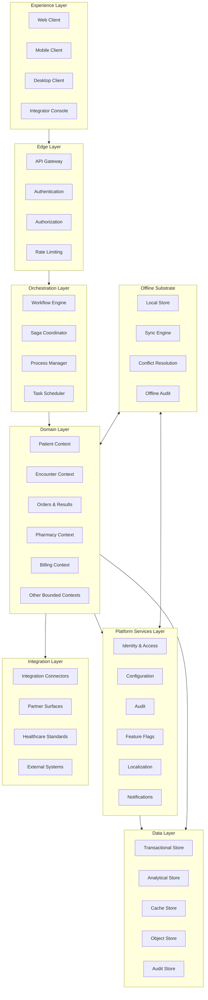

====================================================================================================
FILE 1 of 16
PATH: /home/z/my-project/download/docs/01_ARCHITECTURE/SYSTEM_ARCHITECTURE.md
WORDS: 24945  |  LINES: 2356  |  CHARS: 178306
====================================================================================================
# Ibn Hayan Healthcare Operating System — System Architecture

| Field | Value |
|---|---|
| Document Title | System Architecture |
| Project | Ibn Hayan Healthcare Operating System |
| Document Type | Canonical Architectural Reference |
| Authority Level | Authoritative — Source of Truth |
| Version | 2.0.0 |
| Status | Ratified |
| Owner | Office of the Chief Software Architect |
| Custodian | Architecture Council |
| Review Cadence | Quarterly, with off-cycle revision when an Architecture Decision Record is ratified |
| Audience | Senior software architects, engineering leadership, module owners, integration architects, security architects, SRE leadership |
| Scope | System-level architecture: principles, layers, contexts, configuration, modules, multi-tenancy, integration, security, scalability, extensibility, deployment, offline, localization, audit, reporting, AI readiness, evolution |
| Out of Scope | Implementation details, source code, database schemas, API contracts, UI specifications, deployment runbooks, vendor selection, technology commits |
| Conflict Resolution | This document prevails over every other architectural or module document. Any conflict between this document and a downstream document is resolved in favor of this document until this document is amended. |
| Amendment Mechanism | Architecture Council ratification through an Architecture Decision Record (ADR); recorded in CHANGELOG with explicit version increment |
| Predecessor | v1.0.0 (initial) |
| Supersedes | All prior architectural drafts and internal memos |

---

## Table of Contents

1. Architecture Overview
2. Architectural Vision
3. System Philosophy
4. Architectural Principles
5. High-Level Architecture
6. Platform Layers
7. Domain-Driven Architecture
8. Configuration-Driven Architecture
9. Modular Architecture
10. Multi-Tenant Architecture
11. Organization Hierarchy
12. Clinic Hierarchy
13. Module Architecture
14. Feature Flag Strategy
15. Configuration Strategy
16. Workflow Engine Philosophy
17. State Management Philosophy
18. Event-Driven Concepts
19. Integration Architecture
20. Security Architecture
21. Scalability Strategy
22. Extensibility Strategy
23. Deployment Models
24. Offline-First Architecture
25. Synchronization Strategy
26. Localization Architecture
27. Audit Architecture
28. Reporting Architecture
29. AI Readiness
30. Future Evolution Strategy

---

## 1. Architecture Overview

### 1.1 Purpose of This Document

This document is the canonical architectural reference for the Ibn Hayan Healthcare Operating System. It defines what the platform is as an architectural artefact — its layers, its contexts, its contracts, its primitives, its commitments. Every downstream architectural document, every module specification, every Architecture Decision Record, every operational runbook, and every integration contract must align with this document. Where alignment is not possible, either the downstream artefact is incorrect or this document must be amended through the Architecture Council.

This document is not an implementation guide. It contains no source code, no database schemas, no API endpoint specifications, no UI component catalogues, and no technology commitments. It describes the architectural decisions and commitments that implementations are expected to honour. Implementation choices are governed by `SOFTWARE_ARCHITECTURE.md` and `CODING_STANDARDS.md`; this document governs what those choices must produce.

The document is written for senior software architects who already understand distributed systems, domain-driven design, multi-tenant SaaS delivery, healthcare-grade operational rigour, and decade-horizon architectural thinking. It does not explain what a bounded context is, what eventual consistency is, or why audit is a primitive. It assumes that literacy and focuses on the architectural decisions that distinguish Ibn Hayan from every other healthcare platform.

### 1.2 Scope and Authority

The scope of this document is the entire Ibn Hayan platform as an architectural artefact. The document holds authority over the following classes of downstream artefacts:

- `SOFTWARE_ARCHITECTURE.md`, `MODULE_ARCHITECTURE.md`, `CONFIGURATION_ARCHITECTURE.md`, `CODING_STANDARDS.md`, `FOLDER_STRUCTURE.md` — these elaborate the system architecture into implementation-grade specifications.
- All Architecture Decision Records under `docs/12_ADR/` — these ratify specific architectural decisions and must be consistent with the principles in Section 4.
- All module specifications under `docs/07_MODULES/` — these define module internals and must align with the module architecture in Section 13.
- All security documents under `docs/09_SECURITY/` — these define security controls and must align with the security architecture in Section 20.
- All integration documents under `docs/08_INTEGRATIONS/` — these define integration contracts and must align with the integration architecture in Section 19.
- All database documents under `docs/04_DATABASE/` — these define data architecture and must align with the bounded contexts in Section 7.
- All deployment documents under `docs/13_DEPLOYMENT/` — these define deployment models and must align with the deployment models in Section 23.

A downstream artefact that contradicts this document is, by definition, defective. The remedy is to either correct the downstream artefact or amend this document through an ADR. Silent contradiction is not permitted.

### 1.3 Architectural Posture

The Ibn Hayan platform is architected on the following non-negotiable posture:

- **Healthcare-native, not healthcare-adapted.** The architecture begins from healthcare semantics. Generic enterprise patterns are borrowed only where they do not compromise healthcare fidelity.
- **Configuration-driven, not customization-dependent.** The platform adapts to customer needs through declarative configuration. Source-level customization is excluded as a delivery mechanism.
- **Multi-tenant SaaS as default.** The platform serves every customer from a single shared runtime. Customer-specific deployments are deployment choices, not code branches.
- **Offline-first as primitive.** The platform operates locally by default, with synchronization to the central platform. Offline is not a fallback mode; it is the primary mode for client surfaces.
- **Audit as primitive.** Every consequential action is recorded in an immutable audit trail. Audit is built into every module's contract, not added as a feature.
- **Decade-horizon thinking.** Architectural decisions are made on a ten-year horizon, not on a quarter-by-quarter horizon. Decisions that optimize for the short term at the cost of the decade are rejected.

These six posture commitments are not negotiable. They are the architectural expression of the product principles defined in `PRODUCT_BIBLE.md`, and they govern every architectural decision in this document.

### 1.4 Technology-Agnostic Posture

This document is deliberately technology-agnostic. It does not name specific programming languages, frameworks, databases, message brokers, or cloud vendors. Technology selection is an implementation choice governed by the criteria in `SOFTWARE_ARCHITECTURE.md`, not an architectural commitment.

The technology-agnostic posture is a direct consequence of the decade-horizon thinking (Section 2.2). Technologies change on shorter cycles than the platform's viability horizon. An architecture that commits to a specific technology commits to that technology's lifecycle, which is typically shorter than the platform's required lifecycle. The architecture therefore commits to patterns, principles, and contracts — not to technologies.

Where this document references a technology category (e.g., "transactional data store", "message broker", "object storage"), the reference is to the category, not to a specific product. The choice of product within a category is an implementation decision governed by selection criteria, not by architectural commitment.

### 1.5 Relationship to Product Bible

This document is the architectural expression of the product commitments defined in `PRODUCT_BIBLE.md`. The product principles (P-1 through P-9) and design principles (D-1 through D-10) defined in `PRODUCT_BIBLE.md` are the basis for the architectural principles (Section 4) defined here. The architectural principles translate product commitments into architectural decisions.

Where this document and `PRODUCT_BIBLE.md` appear to conflict, the Product Bible prevails. The product is the source of truth; the architecture serves the product, not the reverse. A conflict between product and architecture is resolved by amending the architecture to serve the product, not by amending the product to fit the architecture.

### 1.6 Document Structure

The document is organized in six movements:

1. **Architecture identity** (Sections 2 through 4) — establishes the architectural vision, philosophy, and principles that govern every decision.
2. **Structural architecture** (Sections 5 through 13) — defines the platform's layers, bounded contexts, modules, and the hierarchies they serve.
3. **Behavioural architecture** (Sections 14 through 18) — defines the configuration, feature flag, workflow, state, and event-driven behaviour of the platform.
4. **Cross-cutting architecture** (Sections 19 through 22) — defines integration, security, scalability, and extensibility as cross-cutting concerns.
5. **Operational architecture** (Sections 23 through 28) — defines deployment, offline, synchronization, localization, audit, and reporting as operational concerns.
6. **Forward architecture** (Sections 29 and 30) — defines AI readiness and future evolution as forward-looking concerns.

Each section is self-contained but cross-references other sections rather than restating their content. The architectural principles in Section 4 are referenced throughout the document as the basis for specific architectural decisions.

### 1.7 How to Read This Document

A first-time reader should read Sections 1 through 5 in order to internalize the architectural posture and principles, then jump to Section 7 (Domain-Driven Architecture) and Section 13 (Module Architecture) to understand the platform's structural decomposition. Sections 14 through 22 may be consulted as reference for specific behavioural and cross-cutting concerns. Sections 23 through 30 are essential for anyone responsible for deployment, operations, or long-term platform evolution.

A reader looking for a specific architectural decision rule should consult Section 4 (Architectural Principles) first; this section is the decision framework that governs every architectural choice. A reader looking for structural decomposition should consult Section 5 (High-Level Architecture) and Section 7 (Domain-Driven Architecture). A reader looking for a specific module's architecture should consult `MODULE_ARCHITECTURE.md`. A reader looking for a specific architectural decision's rationale should consult the relevant ADR under `docs/12_ADR/`.

---

## 2. Architectural Vision

### 2.1 Vision Statement

The architectural vision of Ibn Hayan is to provide a durable, healthcare-native, configuration-driven, multi-tenant platform that serves every healthcare organization from a solo practitioner to a multinational hospital network, that remains viable across a ten-year horizon, and that absorbs unanticipated capability without architectural rework.

The vision is not stated in terms of features or capabilities. It is stated in terms of architectural properties — durability, healthcare nativeness, configuration-driven behaviour, multi-tenancy, scale range, and future-proofness. These properties are the architectural expression of the product vision defined in `PRODUCT_BIBLE.md`.

### 2.2 The Decade Horizon

The architectural vision is stated on a ten-year horizon. This is not a marketing flourish; it is an architectural commitment that shapes every decision in this document. The decade horizon has the following architectural consequences:

- **Stable bounded contexts.** The bounded contexts defined in Section 7 are designed to outlast any specific implementation. Contexts are not reorganized to accommodate features; features are accommodated within the existing context structure.
- **Explicit contracts.** Every module boundary is governed by explicit contracts — commands, queries, events, configuration schemas. Contracts are versioned and evolve through documented deprecation, not through silent breaking change.
- **First-class extension points.** The platform's extensibility surface (Section 22) is first-class. Extensions are not bolt-ons; they are governed by the same architectural rigour as core platform capabilities.
- **Technology-agnostic posture.** The architecture does not commit to specific technologies. Technology selection is an implementation choice governed by architectural criteria, not by architectural identity.
- **Conservative evolution.** The platform evolves deliberately, with each change justified against the architectural principles. Change that is fast but wrong on the decade horizon is rejected as debt.

The decade horizon does not mean the architecture is static. It means the architecture evolves through amendable principles and explicit decisions, not through ad hoc adaptation. The architecture is the durable artefact; implementations are its stewards.

### 2.3 The Three Architectural Vectors

The architectural vision unfolds along three vectors that are pursued simultaneously and in tension with each other:

- **Structural coherence.** The platform's structural decomposition — layers, contexts, modules — must be coherent enough that a new architect can understand the platform in a defined period. Coherence is measured by the clarity of boundaries, the explicitness of contracts, and the absence of circular dependencies.
- **Behavioural richness.** The platform's behavioural surface — configuration, workflow, events, state — must be rich enough to express the operational reality of every supported clinic type without source-level modification. Richness is measured by configuration coverage of clinic types, workflow expressiveness, and event-driven completeness.
- **Operational durability.** The platform's operational posture — deployment, offline, synchronization, audit, security, scalability — must be durable enough to meet healthcare-grade operational rigour across the decade horizon. Durability is measured by availability, recoverability, audit completeness, security posture, and scalability under load.

Tension among the three vectors is intentional. Structural coherence without behavioural richness produces a clean architecture that cannot serve healthcare. Behavioural richness without structural coherence produces a feature pile that cannot be maintained. Operational durability without structural coherence or behavioural richness produces a stable platform that cannot evolve. Ibn Hayan pursues all three vectors simultaneously.

### 2.4 What the Vision Excludes

The architectural vision explicitly excludes the following ambitions, which are common in healthcare software architecture but incompatible with Ibn Hayan's posture:

- **Technology lock-in.** The architecture does not commit to a specific technology as architectural identity. Technology choices are implementation decisions.
- **Customization as adaptation.** The architecture does not support source-level customization as an adaptation mechanism. Configuration is the only adaptation mechanism.
- **Single-tenant default.** The architecture does not default to single-tenant deployment. Multi-tenancy is the default; single-tenancy is a deployment choice.
- **Online-only operation.** The architecture does not assume continuous network connectivity. Offline-first is the default for client surfaces.
- **Feature-driven architecture.** The architecture is not organized around features. It is organized around bounded contexts and module boundaries that outlast features.
- **Monolithic deployment.** The architecture does not require monolithic deployment. Deployment is decoupled from architecture; the same architecture supports multiple deployment models.

### 2.5 Vision Alignment Test

Every architectural decision is tested against the vision by asking four questions in sequence:

1. Does this decision preserve the structural coherence of the platform?
2. Does this decision extend the behavioural richness of the platform within the configuration surface?
3. Does this decision maintain or improve the operational durability of the platform?
4. Does this decision remain viable on the decade horizon?

A decision that answers yes to all four questions is consistent with the vision. A decision that answers no to any question is rejected or escalated to the Architecture Council for adjudication, with the tension made explicit rather than hidden. This test is the operational expression of the architectural vision; it is not a checklist but a discipline.

---

## 3. System Philosophy

### 3.1 Philosophy Overview

The system philosophy is the set of architectural beliefs that shape every decision in this document. The philosophy is not derived from technology trends; it is the lens through which technology trends are evaluated. Where a trend contradicts the philosophy, the trend is regarded as wrong for Ibn Hayan until the philosophy is amended.

The philosophy is stated as six beliefs, each with direct architectural consequences.

### 3.2 Belief One — Architecture Serves the Product

The architecture exists to serve the product, not the reverse. Architectural decisions are made in service of product commitments, not in service of architectural elegance. Where architectural elegance and product value conflict, product value prevails, and the architectural decision is recorded with the trade-off explicit.

The consequence is that this document defers to `PRODUCT_BIBLE.md` on all product-level matters. The architecture does not define what the product should be; it defines how the product's commitments are honoured architecturally.

### 3.3 Belief Two — Healthcare Semantics Are Primary

Healthcare semantics — patients, encounters, orders, results, medications, observations — are the primary organizing principle of the architecture. Generic enterprise patterns are borrowed only where they do not compromise healthcare fidelity. The architecture does not adapt healthcare to enterprise patterns; it adapts enterprise patterns to healthcare.

The consequence is that the bounded contexts (Section 7) are organized around healthcare work. The clinical encounter is the central organizing entity of the data model. The role and permission model reflects healthcare operational reality. The configuration surface is expressed in healthcare terms.

### 3.4 Belief Three — Configuration Is the Adaptation Surface

Configuration is the primary adaptation mechanism. The architecture is designed to express customer-specific behaviour through declarative, version-controlled, tenant-scoped configuration, not through source-level modification. The configuration surface is a first-class architectural concern with its own layer, its own validation framework, and its own audit trail.

The consequence is that the configuration architecture (Section 8) is treated with the same rigour as the module architecture (Section 13). Configuration is not a settings file; it is a discipline that governs how the platform adapts without forking.

### 3.5 Belief Four — The Platform Outlasts Every Implementation

The platform's architecture outlasts every specific implementation, every specific technology choice, and every specific team. This requires that the architecture be larger than any implementation's preferences, that decisions be recorded rather than carried in heads, and that the architecture's evolution be governed by amendable principles rather than by personal authority.

The consequence is that every architectural decision of consequence is recorded in an ADR. The ADR is the durable artefact; the implementation is its steward. An implementation that contradicts a ratified ADR is defective.

### 3.6 Belief Five — Audit Is a Primitive, Not a Feature

Audit is not a feature added to the platform; it is a primitive that the platform is built upon. Every consequential action — clinical, financial, operational, configurational — is recorded in an immutable audit trail. Audit is built into every module's contract, enforced at the platform layer, and protected against tampering.

The consequence is that audit is non-negotiable. A module that does not audit its consequential actions is defective and is not shipped. An implementation that compromises audit completeness for performance or convenience is defective.

### 3.7 Belief Six — Open Contracts Beat Closed Implementations

The platform's contracts — module contracts, integration contracts, configuration schemas, event schemas — are open and documented. Closed implementations that hide behaviour behind undocumented interfaces are rejected. The platform's behaviour is visible to its users, its integrators, and its future maintainers.

The consequence is that every module's contract is documented as part of the definition of done. Every integration surface is documented as a contract. Every configuration schema is documented. Undocumented behaviour is defective behaviour.

### 3.8 Philosophy in Practice

The six beliefs are applied as decision tests. When an architectural decision is unclear, the architect asks which belief governs and what that belief requires. When two beliefs appear to conflict, the conflict is named explicitly and resolved through the architectural principles (Section 4), which provide precedence. When a belief is shown to be wrong, the belief is amended through the Architecture Council, and the amendment is recorded in this document with explicit reasoning.

---

## 4. Architectural Principles

### 4.1 Purpose of Architectural Principles

Architectural Principles are the decision rules that govern architectural choices. They are not aspirations; they are operating constraints. Every architectural decision of consequence is justifiable by reference to one or more Architectural Principles. A decision that cannot be justified by reference to a principle is, by definition, out of scope for the architecture.

Architectural Principles are distinguished from the Product Principles in `PRODUCT_BIBLE.md` as follows: Product Principles state *what* the product commits to; Architectural Principles state *how* the architecture honours those commitments. Architectural Principles are derived from Product Principles and from the system philosophy (Section 3).

### 4.2 Principle P1 — Healthcare Safety Overrides All Others

Healthcare safety — patient safety, clinical safety, medication safety, data safety — is the highest architectural principle. When a decision pits healthcare safety against any other principle — performance, convenience, simplicity, cost — healthcare safety prevails.

**Applies to:** every architectural decision with potential patient-safety implications, including data integrity, audit completeness, offline operation, synchronization conflict resolution, and access control.

**Precedence:** absolute. No other principle overrides P1.

### 4.3 Principle P2 — Configuration Before Customization

The platform adapts to customer needs through configuration, not through source-level customization. Customization is rejected as an architectural mechanism. Configuration is the primary adaptation surface and is treated as a first-class architectural concern.

**Applies to:** every customer-specific adaptation request, every module extension decision, every integration scope decision.

**Precedence:** P2 is co-equal with P3 and P4. Conflicts among them are resolved by the Architecture Council.

### 4.4 Principle P3 — One Platform, Many Organizations

The platform is a single code base, a single configuration model, and a single operational runtime serving every customer. Variations between customers are expressed as configuration, not as forks. The platform does not maintain customer-specific branches.

**Applies to:** release management, tenant isolation strategy, configuration inheritance, module packaging.

**Precedence:** P3 is co-equal with P2 and P4.

### 4.5 Principle P4 — Loose Coupling, High Cohesion

Modules are loosely coupled and highly cohesive. Coupling is through explicit contracts — commands, queries, events, configuration schemas — never through direct data access. Cohesion is achieved by organizing modules around bounded contexts. Circular dependencies are forbidden.

**Applies to:** module boundary design, dependency management, communication patterns.

**Precedence:** P4 is co-equal with P2 and P3. P4 prevails over P9 when loose coupling conflicts with reversibility, because coupling debt is harder to repay than reversibility debt.

### 4.6 Principle P5 — Consistency Over Availability for Clinical Data

For clinical data — patient records, encounters, orders, results, medications — consistency prevails over availability in the event of a partition. The platform prefers to be unavailable for a write than to accept a write that may conflict with patient safety. For non-clinical data — operational telemetry, analytics, notifications — availability may prevail over consistency.

**Applies to:** data store selection, synchronization strategy, conflict resolution, partition tolerance.

**Precedence:** P5 prevails over P9 (reversibility) when clinical correctness is at stake.

### 4.7 Principle P6 — Reversibility Over Permanence

Architectural decisions should be reversible where reversibility does not compromise healthcare safety, consistency, or audit completeness. Reversibility is achieved through explicit contracts, versioned evolution, and conservative commitment. Decisions that are difficult to reverse are made deliberately, with the irreversibility acknowledged.

**Applies to:** technology selection, contract design, data model evolution, deployment topology.

**Precedence:** P6 is subordinate to P1, P5, and P13. Reversibility is valuable but not at the cost of safety, consistency, or audit.

### 4.7.1 Principle P7 — Documented Before Implemented

No architectural decision is implemented until it is documented. Documentation includes the decision, the alternatives considered, the rationale, the consequences, and the amendment mechanism. Documentation is the durable artefact; the implementation is its expression.

**Applies to:** every architectural decision of consequence, recorded as an ADR.

**Precedence:** P7 is subordinate to P1 but prevails over schedule pressure.

### 4.8 Principle P8 — Bounded Contexts Are Stable

Bounded contexts (Section 7) are stable. Contexts are not reorganized to accommodate features. Features are accommodated within the existing context structure, or new contexts are added through deliberate architectural decision. Context boundaries are designed to outlast any specific implementation.

**Applies to:** domain decomposition, module boundary design, data model evolution.

**Precedence:** P8 is subordinate to P1 but prevails over feature-driven reorganization.

### 4.9 Principle P9 — Extensibility Through Defined Points

Extension is through defined extension points, not through ad hoc modification. Extension points are first-class architectural concerns with their own contracts, their own validation, and their own lifecycle. Extensions that bypass defined points are defective.

**Applies to:** plugin architecture, integration architecture, customization requests that exceed configuration surface.

**Precedence:** P9 is subordinate to P1, P4, and P13.

### 4.10 Principle P10 — Multi-Tenancy as Default

Multi-tenancy is the default delivery and isolation model. Single-tenancy is a deployment choice, not an architectural choice. Every module's contract is multi-tenant by default. Single-tenant deployment runs the same code paths as multi-tenant deployment.

**Applies to:** module design, data partitioning, query scoping, audit scoping.

**Precedence:** P10 is co-equal with P2 and P3.

### 4.11 Principle P11 — Offline-First as Default

Offline-first is the default operational mode for client surfaces. The platform operates locally by default, with synchronization to the central platform. Online-only operation is a special case, not the general case.

**Applies to:** client architecture, synchronization strategy, conflict resolution, audit recording.

**Precedence:** P11 is subordinate to P1 and P5 but prevails over P14 (simplicity) when offline operation adds complexity.

### 4.12 Principle P12 — Open Standards Over Proprietary

The platform prefers open standards over proprietary ones for integration, data formats, and protocols. Proprietary approaches are used only where open standards are not yet viable, and the use is documented with a transition path to open standards when they mature.

**Applies to:** integration architecture, data exchange, protocol selection, format selection.

**Precedence:** P12 is subordinate to P1, P5, and P13.

### 4.13 Principle P13 — Auditability as Primitive

Audit is a primitive, not a feature. Every consequential action is recorded in an immutable audit trail. Audit is built into every module's contract, enforced at the platform layer, and protected against tampering. Audit completeness is non-negotiable.

**Applies to:** every module, every integration, every configuration change, every security-relevant action.

**Precedence:** P13 is co-equal with P1 and P5 for consequential actions. Audit completeness prevails over performance, convenience, and cost.

### 4.14 Principle P14 — Simplicity Over Complexity

Architectural choices should be as simple as the requirements allow, and no simpler. Complexity is added only when justified by a documented requirement. Unjustified complexity is debt and is rejected.

**Applies to:** pattern selection, technology selection, module boundary design, dependency management.

**Precedence:** P14 is subordinate to P1, P5, P11, and P13. Simplicity is valuable but not at the cost of safety, consistency, offline operation, or audit.

### 4.15 Principle P15 — Observability as Primitive

Observability is a primitive, not a feature. Every operational component is observable through telemetry. Every consequential action is auditable. Every architectural decision is documented. The platform is observable, auditable, and accountable by design.

**Applies to:** every operational component, every module, every integration.

**Precedence:** P15 is co-equal with P13.

### 4.16 Principle P16 — Composable, Not Monolithic

The platform is composed of modules with explicit boundaries, explicit contracts, and explicit dependencies. Composition is governed by bounded contexts, not by feature catalogues. The platform is not a monolith in which everything is always present, and it is not a marketplace in which anything goes.

**Applies to:** module architecture, dependency management, deployment topology.

**Precedence:** P16 is co-equal with P4.

### 4.17 Principle P17 — Regional Adaptation Without Forking

The platform is built for global use, with regional adaptation as a configuration surface. Regional adaptation does not require code branching. Multiple regulatory regimes, clinical coding systems, and payment models coexist within a single tenant.

**Applies to:** localization architecture, regulatory compliance, data residency, multi-region operation.

**Precedence:** P17 is co-equal with P3.

### 4.18 Principle P18 — Decade-Horizon Viability

Architectural decisions are made on a ten-year horizon. Decisions that optimize for the short term at the cost of decade-horizon viability are rejected. The architecture favours choices that remain viable across technology shifts, market cycles, and leadership transitions.

**Applies to:** every architectural decision of consequence.

**Precedence:** P18 is the temporal expression of P1. Decade-horizon viability prevails over short-term optimization when the two conflict.

### 4.19 Precedence Hierarchy

The architectural principles have the following precedence hierarchy, in descending order:

1. **P1 (Healthcare Safety)** — absolute; overrides all others.
2. **P5 (Consistency for Clinical Data)** and **P13 (Auditability)** — co-equal; override P6, P9, P11, P14, P18 when clinical correctness or audit completeness is at stake.
3. **P18 (Decade-Horizon Viability)** — overrides short-term optimization principles.
4. **P2 (Configuration Before Customization)**, **P3 (One Platform)**, **P4 (Loose Coupling)**, **P10 (Multi-Tenancy)**, **P16 (Composability)**, **P17 (Regional Adaptation)** — co-equal structural principles; conflicts among them are resolved by the Architecture Council.
5. **P7 (Documented)**, **P8 (Bounded Contexts Stable)**, **P11 (Offline-First)**, **P12 (Open Standards)**, **P14 (Simplicity)**, **P15 (Observability)** — operating principles; subordinate to the structural principles but prev over schedule pressure and ad hoc preferences.
6. **P6 (Reversibility)** and **P9 (Extensibility)** — valuable but subordinate; do not override safety, consistency, audit, or structural principles.

Conflicts are not hidden. When a decision requires precedence, the precedence applied is recorded in the ADR's rationale.

### 4.20 Principles Are Not a Checklist

Architectural principles are not invoked mechanically. They are the lens through which decisions are made. A decision that requires no principle to justify it is usually a decision that is out of scope or insufficiently considered. A decision that requires three principles to justify is usually a decision that is tension-laden and requires explicit Architecture Council attention. The principles exist to make tensions visible, not to resolve them by rote.

---

## 5. High-Level Architecture

### 5.1 Purpose of This Section

This section presents the high-level architecture of the Ibn Hayan platform. It identifies the major layers that compose the platform, the responsibilities of each layer, and the dependency direction among layers. The detailed treatment of each layer is in Section 6.

The high-level architecture is the single load-bearing structural diagram of the platform. Every downstream architectural decision must be consistent with this structure. A decision that does not fit the layered structure is either out of scope or requires an architectural amendment.

### 5.2 Architectural Layers Diagram

The platform is composed of eight layers, organized from the user-facing edge to the durable data and offline substrates. The layers and their dependency direction are shown in the following diagram.



The dependency direction is downward for synchronous request flow (Experience → Edge → Orchestration → Domain → Platform Services → Data) and bidirectional for offline synchronization (Offline Substrate ↔ Domain and Platform Services). The Integration Layer is consumed by the Domain Layer through defined contracts, not directly by the Experience Layer.

### 5.3 Layer Responsibilities

Each layer has a defined responsibility. Layers do not cross responsibilities; a layer that takes on another layer's responsibility is architecturally defective.

| Layer | Responsibility |
|---|---|
| Experience | User-interface surfaces for practitioners, administrators, integrators |
| Edge | Request ingress, authentication, authorization, rate limiting, request routing |
| Orchestration | Workflow coordination, saga management, process management, task scheduling |
| Domain | Bounded contexts implementing clinical, operational, financial, administrative logic |
| Platform Services | Cross-cutting services: identity, configuration, audit, feature flags, localization, notifications |
| Integration | Connectors to external systems, partner-facing surfaces, healthcare standard support |
| Data | Transactional, analytical, cache, object, and audit stores |
| Offline Substrate | Local stores, synchronization engine, conflict resolution, offline audit |

### 5.4 Layer Communication Rules

Layers communicate according to the following rules:

| Rule | Description |
|---|---|
| Downward only for synchronous flow | Synchronous request flow proceeds downward through layers; upward flow is forbidden for synchronous requests |
| Bidirectional for events | Events flow bidirectionally through the Event-Driven Concepts (Section 18) |
| No layer skipping | A layer may not bypass an intermediate layer to access a lower layer directly |
| Contract-based | Cross-layer communication is through explicit contracts, not through shared state |
| Tenant-scoped | Every cross-layer communication carries tenant context; tenant-agnostic communication is forbidden |

### 5.5 Cross-Cutting Concerns

Certain concerns cross all layers and are not the responsibility of any single layer:

| Concern | Cross-Cutting Implementation |
|---|---|
| Security | Authentication, authorization, encryption enforced at every layer |
| Audit | Audit recording at every layer where consequential actions occur |
| Observability | Telemetry emission at every layer |
| Tenant Context | Tenant context propagation through every layer |
| Localization | Localization applied at the Experience Layer and respected by all layers |
| Configuration | Configuration consumed at every layer that has configurable behaviour |

Cross-cutting concerns are implemented as platform-level primitives (Section 6, Platform Services Layer) and consumed by all layers through defined contracts.

### 5.6 Architecture and Deployment

The layered architecture is independent of deployment topology. The same architecture supports multi-tenant SaaS deployment, single-tenant dedicated deployment, hybrid deployment, air-gapped deployment, and region-specific deployment. The deployment model (Section 23) determines how layers are distributed across infrastructure, not how layers are organized.

This independence is a direct consequence of Principle P3 (One Platform, Many Organizations) and Principle P18 (Decade-Horizon Viability). An architecture that is tied to a specific deployment model is an architecture that cannot adapt to deployment evolution across the decade horizon.

---

## 6. Platform Layers

### 6.1 Purpose of This Section

This section defines each of the eight platform layers in detail. For each layer, the section identifies the layer's responsibilities, its internal components, its contracts with other layers, and the architectural principles that govern it. The treatment is structural; behavioural aspects of specific components are treated in later sections.

### 6.2 Experience Layer

The Experience Layer is the user-facing surface of the platform. It comprises the clients that practitioners, administrators, and integrators use to interact with the platform. The Experience Layer is thin; it contains no business logic and holds no durable state beyond what is required for offline operation (Section 24).

**Components:**
- Web client — browser-based client for practitioners and administrators
- Mobile client — native mobile client for practitioners
- Desktop client — desktop client for facilities requiring richer client capability
- Integrator console — browser-based console for integrators and system administrators

**Contracts:**
- Consumes: Edge Layer contracts (request-response, events, file transfer)
- Produces: user actions translated into Edge Layer requests
- Does not: access Domain Layer directly, access Data Layer directly, hold business state

**Governing principles:** P5 (Practitioner Experience, from Product Bible), P11 (Offline-First), P14 (Simplicity)

### 6.3 Edge Layer

The Edge Layer is the platform's request ingress and policy enforcement point. It terminates external connections, authenticates requests, authorizes requests against the tenant and user context, applies rate limiting, and routes requests to the appropriate Orchestration or Domain component.

**Components:**
- API gateway — request ingress, routing, protocol termination
- Authentication service — identity verification, session management
- Authorization service — permission checks against tenant, user, and resource context
- Rate limiting service — tenant-scoped rate limiting to preserve tenant operational isolation

**Contracts:**
- Consumes: Experience Layer requests; Platform Services (IAM) for authentication and authorization
- Produces: authenticated, authorized, rate-limited requests to Orchestration and Domain
- Does not: contain business logic, hold business state, access Data Layer directly

**Governing principles:** P1 (Healthcare Safety, through access control), P10 (Multi-Tenancy), P13 (Auditability), P15 (Observability)

### 6.4 Orchestration Layer

The Orchestration Layer coordinates multi-step workflows that span multiple bounded contexts. It is responsible for saga management (long-running transactions across contexts), process management (stateful workflow coordination), and task scheduling (deferred and recurring tasks).

**Components:**
- Workflow engine — executes configured workflows across bounded contexts
- Saga coordinator — manages long-running transactions with compensation
- Process manager — coordinates stateful processes that span multiple contexts
- Task scheduler — schedules deferred and recurring tasks

**Contracts:**
- Consumes: Edge Layer requests; Domain Layer commands; Platform Services (Configuration, Audit)
- Produces: coordinated commands to Domain Layer; events to Event-Driven Concepts
- Does not: hold business state beyond workflow state; access Data Layer directly except for workflow state

**Governing principles:** P4 (Loose Coupling), P5 (Consistency for Clinical Data), P13 (Auditability), P16 (Composability)

### 6.5 Domain Layer

The Domain Layer contains the bounded contexts that implement clinical, operational, financial, and administrative logic. This is the core of the platform — where healthcare semantics live. The Domain Layer is organized around bounded contexts (Section 7), each of which is a cohesive area of domain responsibility.

**Components:**
- Bounded contexts — 19 contexts covering clinical, operational, financial, administrative, and platform domains (detailed in Section 7)
- Each context exposes commands, queries, events, and configuration schemas as contracts
- Contexts communicate through contracts, not through direct data access

**Contracts:**
- Consumes: Orchestration Layer commands; Platform Services; Integration Layer adapters
- Produces: domain events; query results; audit records
- Does not: access other contexts' data directly; bypass Platform Services for cross-cutting concerns

**Governing principles:** P1 (Healthcare Safety), P2 (Configuration Before Customization), P4 (Loose Coupling), P8 (Bounded Contexts Stable), P16 (Composability)

### 6.6 Platform Services Layer

The Platform Services Layer contains cross-cutting services consumed by all other layers. These services are primitives, not features — they are the foundation on which the rest of the platform is built. Platform Services are multi-tenant by default and are governed by the same architectural rigour as the Domain Layer.

**Components:**
- Identity & Access (IAM) — authentication, authorization, identity, session management
- Configuration — configuration management, validation, versioning, audit
- Audit — audit trail, audit query, audit reporting
- Feature Flags — flag management, evaluation, lifecycle
- Localization — language, calendar, regulatory framework adaptation
- Notifications — notification dispatch across channels

**Contracts:**
- Consumes: Data Layer for state; Configuration for service configuration
- Produces: cross-cutting services consumed by all other layers
- Does not: contain domain logic; access Domain Layer directly

**Governing principles:** P1 (Healthcare Safety), P10 (Multi-Tenancy), P13 (Auditability), P15 (Observability)

### 6.7 Integration Layer

The Integration Layer connects the platform to external systems — laboratory systems, imaging systems, pharmacy systems, insurance systems, government systems, medical devices, and other healthcare software. The Integration Layer is consumed by the Domain Layer through defined contracts; it does not expose external systems directly to the Experience Layer.

**Components:**
- Integration connectors — adapters to specific external systems
- Partner surfaces — surfaces exposed by the platform for partner consumption
- Healthcare standards support — support for recognized healthcare integration standards
- External system registry — registry of integrated external systems per tenant

**Contracts:**
- Consumes: Domain Layer requests for external system interaction; Platform Services (Audit, Configuration)
- Produces: external system responses to Domain Layer; events from external systems
- Does not: contain business logic; bypass Platform Services for audit and configuration

**Governing principles:** P4 (Loose Coupling), P9 (Extensibility), P12 (Open Standards), P13 (Auditability)

### 6.8 Data Layer

The Data Layer contains the durable state of the platform. It is segmented by data class — transactional, analytical, cache, object, and audit — with each class served by an appropriate store type. The segmentation is a direct consequence of Principle P5 (Consistency Over Availability for Clinical Data) and Principle P13 (Auditability), which require different store characteristics for different data classes.

**Components:**
- Transactional store — clinical, operational, financial data with strong consistency
- Analytical store — aggregated, historical data for reporting and analytics
- Cache store — ephemeral data for performance
- Object store — documents, images, exports
- Audit store — immutable audit trail

**Contracts:**
- Consumes: queries and commands from Domain Layer and Platform Services
- Produces: query results; persistence confirmations; audit records
- Does not: contain business logic; expose data outside its tenant scope

**Governing principles:** P1 (Healthcare Safety), P5 (Consistency for Clinical Data), P13 (Auditability), P10 (Multi-Tenancy)

### 6.9 Offline Substrate

The Offline Substrate is the platform's local-first foundation. It enables client surfaces to operate offline, with synchronization to the central platform when connectivity is available. The Offline Substrate is a first-class architectural concern, not a fallback mode.

**Components:**
- Local store — durable local state on client devices
- Sync engine — bidirectional synchronization with the central platform
- Conflict resolution — resolution of conflicts between local and central state
- Offline audit — local audit trail that synchronizes with the central audit trail

**Contracts:**
- Consumes: client actions; central platform state when available
- Produces: local query results; synchronization events to central platform
- Does not: bypass conflict resolution; compromise audit completeness

**Governing principles:** P1 (Healthcare Safety), P5 (Consistency for Clinical Data), P11 (Offline-First), P13 (Auditability)

### 6.10 Layer Independence

The eight layers are independent in responsibility but coupled in execution. The independence is what allows each layer to evolve without forcing evolution of the others — the Edge Layer can adopt new authentication mechanisms without changing the Domain Layer; the Data Layer can adopt new store technologies without changing the Domain Layer; the Offline Substrate can adopt new sync strategies without changing the Experience Layer.

The coupling is through contracts. Each layer's contracts are versioned and evolve through documented deprecation. Breaking contract changes are architectural decisions ratified through ADRs, not casual implementation choices.

### 6.11 Layer Evolution

Layers evolve at different rates. The Experience Layer evolves quickly, as user-experience expectations shift. The Domain Layer evolves slowly, as healthcare semantics are stable. The Data Layer evolves at the pace of data infrastructure, which is faster than domain semantics but slower than user-experience fashion. The Offline Substrate evolves at the pace of connectivity infrastructure.

The varying evolution rates are why the layered architecture exists. A monolithic architecture forces uniform evolution; a layered architecture allows each layer to evolve at its natural rate. This is a direct consequence of Principle P18 (Decade-Horizon Viability) — the architecture must absorb evolution without rework.

---

## 7. Domain-Driven Architecture

### 7.1 Purpose of This Section

This section defines the platform's domain-driven architecture. It identifies the bounded contexts that organize the platform's domain logic, the responsibilities of each context, and the relationships among contexts. Bounded contexts are the primary structural organizing principle of the Domain Layer (Section 6.5) and are governed by Principle P8 (Bounded Contexts Are Stable).

### 7.2 Bounded Context Catalogue

The platform is organized into 19 bounded contexts. The contexts are stable; they are not reorganized to accommodate features. New contexts are added only through deliberate architectural decision ratified by an ADR.

| Code | Bounded Context | Category | Responsibility |
|---|---|---|---|
| BC01 | Patient | Clinical | Patient identity, demographics, consent, medical record lifecycle |
| BC02 | Encounter | Clinical | Encounter management across outpatient, inpatient, emergency, telehealth |
| BC03 | Clinical Documentation | Clinical | Clinical notes, structured documentation, templates, assessments |
| BC04 | Orders & Results | Clinical | Order entry, result management, decision support, result reporting |
| BC05 | Pharmacy | Clinical | Medication management, dispensing, clinical pharmacy |
| BC06 | Scheduling | Operational | Appointment scheduling, resource scheduling, queue management |
| BC07 | Billing | Financial | Billing, claims, payments, insurance submission, subscription billing (per ADR-009) |
| BC08 | Accounting | Financial | General ledger, accounts payable, accounts receivable, financial reporting |
| BC09 | Inventory | Operational | Inventory management, supply chain, stock movement |
| BC10 | Workforce | Administrative | Workforce scheduling, time and attendance, credentials |
| BC11 | CRM | Administrative | Patient relationships, outreach, communications |
| BC12 | HR | Administrative | Human resources, payroll, employee records |
| BC13 | Documents | Operational | Document management, document templates, document workflow |
| BC14 | Notifications | Operational | Notifications, reminders, alerts across channels |
| BC15 | Identity & Access | Platform | Authentication, authorization, identity, session management |
| BC16 | Configuration | Platform | Configuration management, validation, versioning, audit |
| BC17 | Audit | Platform | Audit trail, audit query, audit reporting |
| BC18 | Feature Flags | Platform | Flag management, evaluation, lifecycle |
| BC19 | Localization | Platform | Language, calendar, regulatory framework adaptation |

### 7.3 Context Relationships

Contexts relate to each other through defined relationships. The relationships are governed by the dependency rules in Section 13.4 and by the following principles:

- **Customer-Supplier.** Where one context consumes another context's data or capability, the consuming context is the customer and the providing context is the supplier. The supplier defines the contract; the customer consumes it.
- **Conformist.** Where one context must conform to another context's model (e.g., a context that consumes a standard healthcare coding system conforms to the coding system's model).
- **Anticorruption Layer.** Where one context consumes an external system's data, an anticorruption layer translates the external model to the platform's model, preventing external model leakage.
- **Shared Kernel.** Where multiple contexts share a small, explicit, versioned kernel of common concepts (e.g., patient identity), the kernel is governed by joint ownership and explicit change control.

### 7.4 Context Contracts

Each context exposes four contract types:

| Contract Type | Description |
|---|---|
| Commands | Requests to perform an action that changes state |
| Queries | Requests to retrieve state without changing it |
| Events | Notifications that something has happened in the context |
| Configuration Schemas | Declarative definitions of the context's configurable behaviour |

Contracts are versioned. Breaking changes follow the platform's deprecation policy, with old versions supported through a defined transition window. Contracts are documented as part of the definition of done for a context; undocumented contracts are defective.

### 7.5 Context Internals

Within a context, the internal structure follows domain-driven design patterns. The internals are not constrained by this document; they are constrained by `MODULE_ARCHITECTURE.md` and `SOFTWARE_ARCHITECTURE.md`. The constraint at this level is that the internals must honour the context's contracts and must not bypass the platform's cross-cutting concerns (security, audit, observability, configuration).

Contexts own their data. A context's data is not accessed directly by other contexts; it is accessed through the context's query contracts. Direct data access across context boundaries is a defect and is rejected at code review.

### 7.6 Context Stability

Contexts are stable (Principle P8). Stability is achieved by organizing contexts around enduring domain responsibilities rather than around features. A feature is accommodated within the existing context structure; a context is not created or reorganized to accommodate a feature.

New contexts are added only when an enduring domain responsibility is identified that does not fit any existing context. The addition is ratified by an ADR, with the rationale explicit and the alternatives considered recorded. Context removal is rare and is undertaken only with multi-year transition support for affected modules.

### 7.7 Context and Module Alignment

Bounded contexts and modules (Section 13) are related but distinct. A bounded context is a domain responsibility area; a module is a deployable unit that implements one or more bounded contexts. In Ibn Hayan, the typical mapping is one-to-one — one module implements one bounded context — but the architecture allows for one-to-many and many-to-one mappings where justified by deployment or evolution requirements.

The current module catalogue (Section 19 of `PRODUCT_BIBLE.md`) is aligned one-to-one with the bounded context catalogue in the typical case. Documented deviations are ratified by ADR. The Inventory bounded context (BC09) remains its own context (ADR-010); medication inventory integrates tightly with the Pharmacy module (M05) for pharmacy-specific inventory flows, while non-pharmacy inventory module packaging is deferred and no Inventory M-code is assigned. The Feature Flags bounded context (BC18) remains conceptually separate from Configuration (ADR-007); for v1 its management surface is packaged inside the Configuration/Settings module (M15) as an implementation decision, not a domain ownership transfer, preserving BC18's independent contracts, audit semantics, and future extractability. The Notifications bounded context (BC14) maps normally to the Notifications module (M08) and is consumed broadly by other modules through its published contract — this broad consumption is the standard integration pattern for a cross-cutting operational capability, not a mapping exception. The Integration module (M17) and the Reporting module (M18) do not correspond to dedicated bounded contexts; they are the deployable expressions of the Integration Layer (Section 19) and the Reporting Layer (Section 28) respectively.

### 7.8 Context Evolution

Contexts evolve through contract versioning, not through reorganization. A context's contracts evolve to accommodate new capability; the context's boundaries remain stable. Contract evolution is governed by the platform's deprecation policy, with old contracts supported through a defined transition window.

Where a context's responsibility has materially changed — for example, through the emergence of a new sub-domain that warrants its own context — the change is ratified by an ADR, with the new context's boundaries explicitly defined and the transition plan documented.

---

## 8. Configuration-Driven Architecture

### 8.1 Purpose of This Section

This section defines the platform's configuration-driven architecture. Configuration is the platform's primary adaptation mechanism (Principle P2) and is a first-class architectural concern with its own layer, its own validation framework, and its own audit trail. The detailed treatment of configuration internals is in `CONFIGURATION_ARCHITECTURE.md`; this section defines the architectural commitments that govern configuration.

### 8.2 Configuration as Architectural Concern

Configuration is not a settings file; it is an architectural concern. The platform's behaviour is, in principle, configurable — every behavioural decision of consequence can be expressed through declarative configuration without source-level modification. The configuration surface is large, versioned, validated, and audited.

The configuration-driven architecture has the following consequences:

- The platform has a layered configuration model with explicit precedence (Section 15).
- Every module exposes its configuration surface as a documented contract.
- Configuration changes are validated before application, with five validation rule categories (Section 15.6).
- Configuration changes are versioned and audited, with rollback supported.
- Configuration governance is a customer-scoped practice supported by platform tooling.

### 8.3 Configuration Surface

The configuration surface is the complete set of configurable behaviours exposed by the platform. The surface is organized by module, by capability, and by scope. Each module's configuration surface is documented as part of the module's contract (Section 13).

The configuration surface is bounded by what can be expressed without source-level modification. Behaviours that would require source modification are either out of scope or candidates for platform evolution through the extension surface (Section 22). The boundary between configuration and source is explicit and is governed by the platform's extensibility strategy.

### 8.4 Configuration and Bounded Contexts

Each bounded context exposes its own configuration schema as part of its contract. The configuration schema defines what aspects of the context's behaviour are configurable, what the configuration keys are, what the valid values are, and what the precedence rules are.

Configuration schemas are versioned alongside the context's other contracts. Breaking changes to configuration schemas follow the platform's deprecation policy, with old schemas supported through a defined transition window.

### 8.5 Configuration and Multi-Tenancy

Configuration is tenant-scoped. Each tenant has its own configuration, layered on top of the platform default and the edition configuration. The layered model (Section 15) ensures that tenant configuration inherits from higher-scope layers, with tenant-specific overrides applied at the tenant layer.

Multi-tenancy and configuration together produce the platform's adaptation model: one code base, one configuration framework, many tenants, each with their own configuration that adapts the platform to their operational reality without forking the code.

### 8.6 Configuration and Audit

Every configuration change is audited. The audit record includes the configurator, the time, the scope, the previous value, the new value, and the validation result. Configuration audit records are immutable and are the basis for compliance reporting and incident investigation.

Configuration audit is distinct from operational audit (Section 27). Operational audit records what users did; configuration audit records how the platform was configured to behave. Both are required for accountability, and both are governed by Principle P13 (Auditability as Primitive).

### 8.7 Configuration Governance

Configuration governance is the practice of managing configuration change over time. Governance includes change approval workflows, compliance review for regulatory-impacting changes, sandbox testing before production application, and change communication to affected users.

Governance is customer-scoped. The platform provides the tooling and the audit trail; the customer defines the governance workflow within the platform's framework. The platform does not impose a specific governance workflow; it imposes the framework within which governance is exercised.

---

## 9. Modular Architecture

### 9.1 Purpose of This Section

This section defines the platform's modular architecture at the system level. Modules are the unit of composition, the unit of enablement, and the unit of dependency management. The detailed treatment of module internals is in `MODULE_ARCHITECTURE.md`; this section defines the architectural commitments that govern modules.

### 9.2 Module Definition

A module is a deployable unit that implements one or more bounded contexts. A module has:

- Explicit boundaries that align with bounded contexts
- Explicit contracts (commands, queries, events, configuration schemas)
- Explicit dependencies on other modules
- Independent enablement per tenant, subject to dependency constraints
- Versioned evolution with documented deprecation

Modules are not microservices by default. The platform's default deployment is a modular monolith — modules are deployed together, communicating through in-process contracts. Modules may be extracted to separate services when justified by operational requirements, but extraction is a deployment choice, not an architectural commitment.

### 9.3 Module Catalogue

The module catalogue is defined in Section 19 of `PRODUCT_BIBLE.md`. The catalogue comprises 19 modules aligned with the 19 bounded contexts defined in Section 7 of this document. The alignment is one-to-one in most cases, with documented exceptions for contexts that span multiple modules or modules that span multiple contexts.

### 9.4 Module Dependency Rules

Module dependencies follow the bounded context dependencies and are governed by the following rules:

| Rule | Description |
|---|---|
| Acyclic | Module dependencies are acyclic; circular dependencies are forbidden |
| Explicit | Dependencies are explicit, documented, and validated at build time |
| Contract-based | Modules communicate through contracts, not through direct data access |
| Hierarchical | Platform modules may be depended upon by all other modules; category-specific modules depend on Platform modules and on Patient (M01) where appropriate |
| Versioned | Dependencies are versioned; breaking changes follow the deprecation policy |

The dependency graph is documented in `MODULE_ARCHITECTURE.md`. The graph is validated continuously; violations are treated as build failures.

### 9.5 Module Communication

Modules communicate through four mechanisms:

| Mechanism | Description | When Used |
|---|---|---|
| In-process commands | Synchronous command invocation within the same deployment | Default for modular monolith deployment |
| Events | Asynchronous event publication and subscription | When the consuming module does not need synchronous response |
| Queries | Synchronous query invocation | When the consuming module needs to read another module's state |
| Integration contracts | Communication through the Integration Layer | When the consuming module is an external system |

Direct data access across module boundaries is forbidden. A module that accesses another module's data store directly is defective and is rejected at code review.

### 9.6 Module Lifecycle

Modules have a lifecycle that governs their evolution:

| Stage | Code | Description |
|---|---|---|
| Candidate | LC1 | Module under design; not available to customers |
| Pilot | LC2 | Module deployed to pilot customers for validation |
| General Availability | LC3 | Module available to all customers per edition packaging |
| Mature | LC4 | Module in steady-state; long-term support commitment |
| Deprecation Candidate | LC5 | Module considered for deprecation; transition planning underway |
| Deprecated | LC6 | Module deprecated; new customers cannot enable; existing customers supported through transition window |
| Retired | LC7 | Module removed from the platform; transition window closed |

Lifecycle transitions are ratified by the Architecture Council. Transitions are recorded in the module's documentation and in the platform's CHANGELOG.

### 9.7 Module and Edition Packaging

Modules are packaged into editions per Section 16 of `PRODUCT_BIBLE.md`. Edition packaging determines which modules are enabled by default for a customer; it does not modify module internals. All editions run the same code; editions differ only in configuration.

A module that is not in a customer's edition is not enabled for that customer, but it is still present in the code base. Edition packaging is a configuration concern, not a code branching concern. This is a direct consequence of Principle P3 (One Platform, Many Organizations).

### 9.8 Module Extension

Modules are extended through the platform's extension surface (Section 22), not through source-level modification. Extension points are first-class architectural concerns with their own contracts, their own validation, and their own lifecycle.

An extension that requires modifying a module's source is, by definition, customization, and is rejected by Principle P2. Extensions that cannot be expressed through the extension surface are candidates for platform evolution, not for customer-specific customization.

---

## 10. Multi-Tenant Architecture

### 10.1 Purpose of This Section

This section defines the platform's multi-tenant architecture. Multi-tenancy is the default delivery model (Principle P10) and is the architectural expression of Principle P3 (One Platform, Many Organizations). The detailed treatment of multi-tenant operations is in the operational documentation; this section defines the architectural commitments that govern multi-tenancy.

### 10.2 Tenant Isolation Levels

The platform supports three isolation levels, available as deployment choices but never as code branches:

| Isolation Level | Code | Description | Typical Use |
|---|---|---|---|
| Logical | IL1 | Shared compute, shared storage, logical tenant separation | Default; serves the majority of customers |
| Logical with Dedicated Compute | IL2 | Shared storage, dedicated compute per tenant | Customers with specific performance or compliance needs |
| Physical | IL3 | Dedicated infrastructure, single-tenant deployment | Customers with regulatory or contractual physical-separation requirements |

All three isolation levels run the same code, the same configuration model, and the same operational runtime. The choice of isolation level is a deployment decision (Section 23), not a product or architectural decision.

### 10.3 Tenant Isolation Enforcement

Tenant isolation is enforced at every layer of the platform:

| Layer | Isolation Enforcement |
|---|---|
| Experience | User sessions are scoped to a single tenant; cross-tenant access is forbidden |
| Edge | Every request is tenant-scoped; requests without tenant context are rejected |
| Orchestration | Workflows are tenant-scoped; cross-tenant workflow steps are forbidden |
| Domain | Every command, query, and event carries tenant context; cross-tenant data access is forbidden |
| Platform Services | Tenant context is propagated through all service calls |
| Integration | Integration credentials are tenant-scoped; cross-tenant integration is forbidden |
| Data | Data is partitioned by tenant; queries are scoped to a single tenant |
| Offline Substrate | Local stores are tenant-scoped; cross-tenant offline operation is forbidden |

A module or component that does not enforce tenant isolation is defective and is not shipped. Tenant isolation is not a feature; it is a primitive (Principle P10).

### 10.4 Tenant Lifecycle

Tenants have a lifecycle that governs their creation, operation, and decommissioning:

| Stage | Code | Description |
|---|---|---|
| Provisioned | TL1 | Tenant created; default configuration applied |
| Onboarding | TL2 | Customer-specific configuration applied; first encounter targeted |
| Active | TL3 | Tenant in steady-state operation |
| Expansion | TL4 | Tenant expanding scope — additional facilities, modules, specialties |
| Suspension | TL5 | Tenant suspended; data preserved |
| Offboarding | TL6 | Tenant being decommissioned; data export executed |
| Decommissioned | TL7 | Tenant removed; data retention period observed |

Tenant lifecycle transitions are governed by documented processes. Transitions are auditable, with the audit trail showing who initiated the transition, when, and with what authorization.

### 10.5 Tenant Configuration Inheritance

Tenant configuration inherits from the platform default and from the edition, with tenant-level configuration overriding as defined in Section 15. Tenants within a customer may inherit from a customer-level baseline, enabling a customer to define common configuration once and apply it across multiple tenants.

Inheritance is explicit and documented. A customer's multi-tenant configuration is auditable end-to-end; the audit trail shows which configuration was applied at which layer for any given tenant at any given time.

### 10.6 Tenant Data Residency

Tenant data residency is governed by the customer's contract and by the regulatory framework in force for the tenant's region. The platform supports regional data residency — a tenant's data is stored in the region specified by the customer's contract, and is not moved across regions without explicit authorization.

Data residency is enforced at the storage layer. A tenant's data is partitioned by region, and access to data is governed by the tenant's region. Cross-region data access is permitted only for documented operational reasons (e.g., disaster recovery) and is auditable.

### 10.7 Tenant Operational Isolation

Tenant operational isolation ensures that one tenant's operational behaviour does not affect another tenant. A tenant that generates high load does not degrade service for other tenants; a tenant that experiences an operational incident does not cause incidents for other tenants. Operational isolation is achieved through resource partitioning, rate limiting, and graceful degradation under load.

Operational isolation is not absolute. The platform shares infrastructure across tenants, and shared infrastructure has finite capacity. The platform's scalability strategy (Section 21) is designed to maintain operational isolation under normal and peak load, with documented degradation behaviour under extreme load.

---

## 11. Organization Hierarchy

### 11.1 Purpose of This Section

This section defines the organizational hierarchy that the platform supports. The hierarchy governs how a customer's organizational structure is represented in the platform, how configuration inherits through the hierarchy, and how permissions are scoped through the hierarchy. The hierarchy is the structural backbone for multi-facility and multi-region operation.

### 11.2 Hierarchy Levels

The platform supports a five-level organizational hierarchy:

| Level | Code | Description |
|---|---|---|
| Customer | H1 | The organizational entity that holds the commercial relationship with Ibn Hayan |
| Organization Unit | H2 | A major division within the customer (e.g., a regional health authority, a hospital network) |
| Facility | H3 | A physical or logical facility where healthcare is delivered (e.g., a clinic, a hospital) |
| Department | H4 | A department within a facility (e.g., cardiology department, emergency department) |
| Care Team | H5 | A care team within a department (e.g., a primary care team, an intensive care team) |

The hierarchy is not mandatory in full. A solo practitioner operates with only the Customer and Facility levels. A small practice operates with Customer, Facility, and Department levels. A hospital network operates with all five levels. The platform's configuration surface accommodates partial hierarchy use.

### 11.3 Hierarchy and Configuration Inheritance

Configuration inherits through the organizational hierarchy, with higher levels providing defaults and lower levels overriding as needed. The inheritance is governed by the configuration layer model (Section 15) and is documented in `CONFIGURATION_ARCHITECTURE.md`.

The hierarchy provides natural configuration layers:

- Customer-level configuration applies to all organization units, facilities, departments, and care teams within the customer.
- Organization-unit-level configuration applies to all facilities, departments, and care teams within the organization unit.
- Facility-level configuration applies to all departments and care teams within the facility.
- Department-level configuration applies to all care teams within the department.
- Care-team-level configuration applies to the care team.

Inheritance is explicit. A configuration applied at a higher level propagates to lower levels unless overridden. Overrides are validated, versioned, and auditable.

### 11.4 Hierarchy and Permission Scoping

Permissions are scoped through the organizational hierarchy. A role assigned at a higher level applies to lower levels unless restricted; a role assigned at a lower level does not propagate upward. Scoping is governed by the permission philosophy (Section 21 of `PRODUCT_BIBLE.md`) and is implemented by the Identity & Access module (M14).

Permission scoping is critical for healthcare operations. A clinician seeing patients in clinic A does not automatically have access to patients in clinic B, even within the same organization. The permission framework enforces scoping at the action level, not at the page level; a clinician without read permission on a patient cannot access that patient's record through any surface.

### 11.5 Hierarchy and Data Residency

The organizational hierarchy interacts with data residency for multi-region customers. A facility in one region operates under that region's regulatory framework, with data residency enforced at the storage layer. A facility in another region operates under its own regulatory framework.

The hierarchy allows a customer to operate across regions within a single tenant, with regional variation expressed through facility-level configuration and facility-level data residency. This is a direct consequence of Principle P17 (Regional Adaptation Without Forking).

### 11.6 Hierarchy Evolution

Organizational hierarchies evolve as customers grow, merge, reorganize, or divest. The platform's hierarchy supports evolution through:

- **Addition** of new organization units, facilities, departments, or care teams
- **Reorganization** of the hierarchy (e.g., moving a facility from one organization unit to another)
- **Merge** of hierarchies (e.g., when two customers merge)
- **Divestiture** of hierarchy portions (e.g., when a customer divests a facility)

Hierarchy evolution is a configuration operation, not a code change. Evolution is auditable, with the audit trail showing who initiated the change, when, and with what authorization. Evolution may trigger data migration (e.g., when a facility moves to a different region), with migration governed by documented processes.

### 11.7 Hierarchy and Reporting

Reporting respects the organizational hierarchy. Reports can be generated at any hierarchy level, with roll-up to higher levels and drill-down to lower levels. Reporting at the customer level includes all organization units, facilities, departments, and care teams within the customer. Reporting at the facility level includes all departments and care teams within the facility.

Hierarchy-respecting reporting is critical for healthcare operations. A clinical leader needs to see reporting across their scope of authority; a facility administrator needs to see reporting for their facility; a care-team lead needs to see reporting for their care team. The platform's reporting architecture (Section 28) supports hierarchy-respecting reporting as a first-class capability.

---

## 12. Clinic Hierarchy

### 12.1 Purpose of This Section

This section defines the clinic hierarchy that the platform supports. The clinic hierarchy governs how clinical work is organized within a facility, distinct from the organizational hierarchy (Section 11) which governs administrative structure. The clinic hierarchy is the operational expression of healthcare delivery within the platform.

### 12.2 Clinic Hierarchy Levels

The clinic hierarchy operates within the facility level of the organizational hierarchy and comprises three levels:

| Level | Code | Description |
|---|---|---|
| Clinic Type | CH1 | The type of clinical service delivered (e.g., general practice, cardiology, emergency) |
| Service Line | CH2 | A grouping of related clinic types (e.g., primary care service line, specialty care service line) |
| Care Episode | CH3 | A discrete clinical episode for a patient within a clinic type (e.g., a cardiology consultation, an emergency visit) |

The clinic hierarchy is orthogonal to the organizational hierarchy. A single facility may operate multiple clinic types, organized into service lines, with care episodes occurring within each clinic type. The clinic hierarchy is governed by the clinic type catalogue (Section 18 of `PRODUCT_BIBLE.md`).

### 12.3 Clinic Type Configuration Overlays

Each clinic type has a configuration overlay that adjusts the platform's default configuration to match the clinic type's operational reality. Overlays cover encounter templates, documentation structure, order sets, role definitions, permission defaults, and reporting views.

Overlays are layered on top of the organizational hierarchy configuration. The precedence is:

1. Platform default (lowest)
2. Edition
3. Customer
4. Organization unit
5. Facility
6. Department
7. Care team
8. Clinic type overlay
9. User
10. Session (highest)

The clinic type overlay is applied between the care-team level and the user level, ensuring that clinic-type-specific configuration applies regardless of the organizational position, but can be overridden at the user and session levels for individual practitioner preferences.

### 12.4 Service Lines

Service lines group related clinic types for operational and reporting purposes. A primary care service line may include general practice, family medicine, and internal medicine clinic types. A specialty care service line may include cardiology, dermatology, and endocrinology clinic types. An emergency service line may include emergency department and urgent care clinic types.

Service lines are not a structural level of the organizational hierarchy; they are a clinical grouping within a facility. Service lines are used for reporting, for resource allocation, and for clinical governance. Service lines do not affect permission scoping, which is governed by the organizational hierarchy.

### 12.5 Care Episodes

Care episodes are discrete clinical events within a clinic type. A care episode may be a routine consultation, an emergency visit, an inpatient admission, a surgical procedure, or a telehealth encounter. Care episodes are the primary unit of clinical work and are governed by the Encounter bounded context (BC02).

Care episodes are linked to patients through the Patient bounded context (BC01), to orders and results through the Orders & Results bounded context (BC04), and to documentation through the Clinical Documentation bounded context (BC03). The relationships among these contexts are governed by the bounded context relationships defined in Section 7.3.

### 12.6 Clinic Hierarchy and the Encounter

The encounter is the central organizing entity of the platform's clinical data model. Every clinical action — assessment, order, result, medication, observation — is associated with an encounter, which is associated with a patient, which is associated with a facility, which is associated with a customer. The encounter-centred data model is a direct consequence of Design Principle D-1 (Healthcare First, Architecture Second) and is the architectural expression of healthcare-native design.

The encounter's position in the clinic hierarchy determines the configuration overlay applied, the encounter template used, the order sets available, and the documentation structure required. The encounter's position in the organizational hierarchy determines the permission scope applied and the reporting roll-up applied.

---

## 13. Module Architecture

### 13.1 Purpose of This Section

This section defines the platform's module architecture at the system level. The detailed treatment of module internals — contracts, dependencies, communication patterns, versioning, extension points — is in `MODULE_ARCHITECTURE.md`. This section defines the architectural commitments that govern module architecture and the relationships among modules.

### 13.2 Module Boundary Principles

Module boundaries are governed by the following principles:

| Principle | Description |
|---|---|
| Bounded context alignment | Module boundaries align with bounded context boundaries |
| Single responsibility | Each module has a single, cohesive responsibility |
| Explicit contracts | Module boundaries are defined by explicit contracts, not by implementation |
| Independent evolution | Modules evolve independently, subject to contract compatibility |
| Acyclic dependencies | Module dependencies are acyclic; circular dependencies are forbidden |

Module boundaries are not determined by feature catalogues, by team organization, or by deployment convenience. They are determined by domain decomposition, which is the basis of the bounded context catalogue (Section 7).

### 13.3 Module Contract Surface

Each module exposes a contract surface that defines how other modules interact with it. The contract surface comprises:

| Contract Type | Description |
|---|---|
| Commands | Requests to perform an action that changes state |
| Queries | Requests to retrieve state without changing it |
| Events | Notifications that something has happened in the module |
| Configuration Schemas | Declarative definitions of the module's configurable behaviour |

Contracts are versioned. Breaking changes follow the platform's deprecation policy, with old contracts supported through a defined transition window. Contracts are documented as part of the definition of done for a module; undocumented contracts are defective.

### 13.4 Module Dependency Graph

Module dependencies follow the bounded context dependencies and are governed by the rules in Section 9.4. The high-level dependency direction is:

- Platform modules (M14–M19) depend on each other in defined ways but not on category-specific modules.
- Administrative modules (M11–M13) depend on Platform modules and on Patient (M01).
- Financial modules (M09–M10) depend on Platform modules and on Patient (M01) and Encounter (M02).
- Operational modules (M06–M08) depend on Platform modules and on Patient (M01) and Encounter (M02).
- Clinical modules (M01–M05) depend on Platform modules; Clinical modules may depend on each other in defined ways.

The full dependency graph is documented in `MODULE_ARCHITECTURE.md` and is validated continuously. Dependency violations are treated as build failures.

### 13.5 Module Communication Patterns

Modules communicate through four patterns, each appropriate to different use cases:

| Pattern | Description | When Used |
|---|---|---|
| Synchronous command | The consuming module invokes a command on the providing module and waits for response | When the consuming module needs immediate confirmation |
| Synchronous query | The consuming module queries the providing module for state | When the consuming module needs to read state |
| Asynchronous event | The providing module publishes an event that the consuming module subscribes to | When the consuming module does not need immediate response |
| Outbox pattern | The providing module writes events to an outbox that is reliably delivered to consumers | When event delivery must be reliable, even across failures |

The choice of pattern is governed by the use case's latency requirements, reliability requirements, and coupling tolerance. The platform's module architecture supports all four patterns, with the pattern selected per interaction through architectural decision.

### 13.6 Module Versioning

Modules are versioned independently. Versioning follows semantic versioning principles, with major versions indicating breaking changes, minor versions indicating backward-compatible additions, and patch versions indicating backward-compatible fixes.

Module versioning interacts with contract versioning. A module's contracts may evolve independently of the module's version, with contract versions tracked separately. A module that has multiple contract versions in production must support all of them through their deprecation windows.

### 13.7 Module Extension Points

Modules expose extension points that allow capability to be added without modifying the module's source. Extension points are first-class architectural concerns with their own contracts, their own validation, and their own lifecycle. Extension points are governed by the platform's extensibility strategy (Section 22).

An extension point that requires source modification of the extended module is, by definition, customization, and is rejected by Principle P2. Extensions that cannot be expressed through extension points are candidates for platform evolution, not for customer-specific customization.

### 13.8 Module Isolation Strategy

Modules are isolated from each other through three isolation dimensions:

| Dimension | Description |
|---|---|
| Contract isolation | Modules interact only through documented contracts; internal implementation is private |
| State isolation | Modules own their state; direct data access across module boundaries is forbidden |
| Failure isolation | A module's failure does not cascade to other modules, except where dependency requires |

Failure isolation is achieved through bulkheading, circuit breaking, and graceful degradation. A module that fails should degrade its own capability without bringing down dependent modules. Dependent modules should handle the failure through fallback behaviour, retry, or user-visible notification.

### 13.9 Module Testing Strategy

Modules are tested at multiple levels:

| Test Level | Description |
|---|---|
| Unit tests | Tests of individual module components in isolation |
| Contract tests | Tests that verify the module's contracts behave as documented |
| Integration tests | Tests that verify the module's interaction with other modules |
| End-to-end tests | Tests that verify complete workflows spanning multiple modules |
| Operational tests | Tests that verify the module's behaviour under operational stress |

Testing strategy is detailed in the testing documentation. The architectural commitment is that modules are testable at all five levels, with contract tests being mandatory for contract evolution.

---

## 14. Feature Flag Strategy

### 14.1 Purpose of This Section

This section defines the platform's feature flag strategy. Feature flags are a first-class architectural concern that enables controlled capability exposure, controlled rollout, and controlled experimentation. The strategy is governed by the configuration-driven architecture (Section 8) and is implemented by the Feature Flags bounded context (BC18).

### 14.2 Feature Flag Types

The platform supports five feature flag types, each with its own use case and lifecycle:

| Flag Type | Code | Description | When Used |
|---|---|---|---|
| Release Flag | FF1 | Controls visibility of new capability during rollout | Gradual rollout of new features |
| Experiment Flag | FF2 | Controls variant assignment for experimentation | A/B testing, multivariate testing |
| Operational Flag | FF3 | Controls operational behaviour (e.g., enabling a circuit breaker) | Operational response to incidents, degradation control |
| Permission Flag | FF4 | Controls access to capability for specific tenants or users | Beta access, early access, restricted features |
| Migration Flag | FF5 | Controls behaviour during data or contract migration | Phased migration between contract versions |

Feature flags are not a substitute for configuration. Flags control binary or near-binary capability exposure; configuration controls continuous behavioural parameters. The distinction is important: a behaviour that should be a configuration key is defective as a feature flag, and vice versa.

### 14.3 Feature Flag Lifecycle

Feature flags have a lifecycle that prevents flag accumulation:

| Stage | Code | Description |
|---|---|---|
| Defined | FFL1 | Flag defined; not yet evaluated |
| Active | FFL2 | Flag in use; evaluation produces a result |
| Static-True | FFL3 | Flag permanently true; scheduled for removal |
| Static-False | FFL4 | Flag permanently false; scheduled for removal |
| Removed | FFL5 | Flag removed from the platform |

The transition from Active to Static-True or Static-False is critical for preventing flag accumulation. A flag that has been at the same value for a defined period is transitioned to static status and scheduled for removal. A flag that has been at Static status for a defined period is removed.

### 14.4 Feature Flag Evaluation

Feature flag evaluation is governed by the following rules:

| Rule | Description |
|---|---|
| Tenant-scoped | Flag evaluation produces a result per tenant, not globally |
| User-scoped | Some flags (FF4) evaluate per user within a tenant |
| Session-scoped | Some flags (FF2) evaluate per session for experimentation consistency |
| Deterministic | Flag evaluation is deterministic for a given tenant, user, and session |
| Auditable | Flag evaluation is auditable, with the result recorded for consequential actions |

Flag evaluation is fast. The evaluation path is optimized to minimize latency impact, as flags may be evaluated on every request. Flags that cannot be evaluated quickly are re-architected or moved to configuration.

### 14.5 Feature Flag Governance

Feature flags are governed by the platform's configuration governance framework (Section 22.7 of `PRODUCT_BIBLE.md`). Flag changes are auditable, with the audit trail showing who changed the flag, when, and with what authorization.

Flag governance distinguishes between flag definition (a platform-level decision) and flag evaluation (a tenant-scoped decision). Flag definition is owned by the platform team; flag evaluation is owned by the customer's system administrator, within the constraints defined by the flag type.

### 14.6 Feature Flag and Configuration Distinction

Feature flags and configuration are distinct architectural concerns:

| Dimension | Feature Flag | Configuration |
|---|---|---|
| Cardinality | Binary or near-binary | Continuous |
| Lifetime | Temporary (until removal) | Permanent |
| Change frequency | High (per rollout, per experiment) | Low (per operational change) |
| Use case | Capability exposure | Behavioural parameter |
| Governance | Platform team primarily | Customer primarily |

A capability that requires continuous parameterization is a configuration key, not a feature flag. A capability that requires binary exposure is a feature flag, not a configuration key. The distinction is enforced at architectural review.

### 14.7 v1 Implementation Packaging (ADR-007)

BC18 Feature Flags remains conceptually separate from the Configuration bounded context (BC16). For v1 of the platform, feature-flag management may be packaged inside the Configuration/Settings module (M15) surface as an implementation decision ratified by ADR-007. This packaging does not transfer Feature Flags domain ownership to Configuration. BC18 retains its own bounded context, its own contracts, its own audit semantics, and its own lifecycle (Section 14.3); the v1 management-surface packaging inside M15 preserves BC18's future extractability as a separate deployable unit. The distinction enforced at architectural review (Section 14.6) is unchanged by the v1 packaging decision.

---

## 15. Configuration Strategy

### 15.1 Purpose of This Section

This section defines the platform's configuration strategy. Configuration is the platform's primary adaptation mechanism (Principle P2) and is treated as a first-class architectural concern. The detailed treatment of configuration internals is in `CONFIGURATION_ARCHITECTURE.md`; this section defines the architectural commitments that govern configuration.

### 15.2 Configuration Layer Model

The platform's configuration layer model defines eight layers with explicit precedence:

| Layer | Code | Scope | Typical Owner |
|---|---|---|---|
| Platform default | L1 | All customers, all tenants | Ibn Hayan product team |
| Edition | L2 | All customers on an edition | Ibn Hayan product team |
| Tenant | L3 | A single customer's tenant | Customer system administrator |
| Facility | L4 | A facility within a customer | Customer facility administrator |
| Department | L5 | A department within a facility | Customer department administrator |
| Care team | L6 | A care team within a department | Customer care team lead |
| User | L7 | A single user | The user or their delegate |
| Session | L8 | A single session | The user, transient |

Precedence is from L1 (lowest) to L8 (highest). A configuration at a higher layer overrides a configuration at a lower layer. Overrides are validated, versioned, and auditable. Not all configuration keys are overridable at all layers; some keys are fixed at lower layers for safety or regulatory reasons.

### 15.3 Configuration Key Catalogue

The platform maintains a configuration key catalogue that lists every configuration key exposed by the platform. The catalogue is the canonical reference for what is configurable, what the valid values are, and what the precedence rules are. The catalogue is documented as part of the platform's contract surface.

Configuration keys are namespaced by module and by capability. A key's namespace reflects its owning module and its semantic grouping. The namespace is stable; keys are not renamed casually, and renaming follows the platform's deprecation policy.

### 15.4 Configuration Validation

Every configuration change is validated before it is applied. Validation covers five rule categories:

| Rule Category | Code | Description |
|---|---|---|
| Structural | V1 | Configuration conforms to the schema (types, required fields, formats) |
| Referential | V2 | Configuration references resolve (e.g., a referenced module exists, a referenced role is defined) |
| Semantic | V3 | Configuration is internally consistent (e.g., a workflow's steps form a valid graph) |
| Contextual | V4 | Configuration is consistent with its scope (e.g., a facility-level configuration does not contradict a tenant-level invariant) |
| Regulatory | V5 | Configuration is consistent with the regulatory framework in force for the tenant's region |

A configuration that fails validation is not applied. The validation failure is reported to the configurator with diagnostic information. Validation failures are auditable.

### 15.5 Configuration Versioning

Every configuration change is versioned. The version history is immutable and is the basis for configuration audit, rollback, and change review. Configuration changes can be rolled back to any prior version, with the rollback itself versioned and auditable.

Configuration versioning is the configuration-surface equivalent of source-code versioning. It enables controlled evolution, controlled experimentation, and controlled recovery. A customer that applies a configuration change that produces undesired behaviour can roll back without engineering intervention.

### 15.6 Configuration Audit

Every configuration change is recorded in the audit trail, including the configurator, the time, the scope, the previous value, the new value, and the validation result. Configuration audit records are immutable and are the basis for compliance reporting and for incident investigation.

Configuration audit is distinct from operational audit (Section 27). Operational audit records what users did; configuration audit records how the platform was configured to behave. Both are required for accountability, and both are governed by Principle P13 (Auditability as Primitive).

### 15.7 Configuration Sandbox

The platform supports configuration sandboxes — non-production tenants where configuration changes can be tested before application to production tenants. Sandbox tenants inherit from production tenants, ensuring that sandbox testing reflects production reality.

Configuration sandbox is a critical governance tool. A configuration change that has not been tested in a sandbox is not applied to production, except for emergency changes that follow a documented expedited pathway. The sandbox requirement is a direct consequence of Principle P1 (Healthcare Safety) — untested configuration changes can compromise clinical safety.

### 15.8 Configuration Hot-Reload

The platform supports configuration hot-reload for configuration keys that do not require module restart. Hot-reload enables configuration changes to take effect without service interruption, supporting operational agility.

Hot-reload is not universal. Some configuration keys require module restart, either because the key affects module initialization or because hot-reload would compromise consistency. Keys that require restart are documented as such, and changes to those keys follow a documented deployment pathway.

---

## 16. Workflow Engine Philosophy

### 16.1 Purpose of This Section

This section defines the platform's workflow engine philosophy. The workflow engine is the platform's mechanism for coordinating multi-step processes that span bounded contexts. The philosophy governs how workflows are defined, how they execute, and how they evolve.

### 16.2 Workflow Definition

Workflows are defined declaratively through configuration. A workflow definition specifies the steps, the conditions, the actors, the inputs, the outputs, and the exception handling. Workflow definitions are versioned, validated, and auditable, in keeping with the configuration-driven architecture (Section 8).

Workflow definitions are not code. A workflow that requires source-level implementation is not a workflow; it is a feature. The workflow engine is designed to execute configured workflows, not to host custom code.

### 16.3 Workflow Execution

Workflow execution is governed by the Orchestration Layer (Section 6.4). The workflow engine coordinates the execution of steps across bounded contexts, handling state management, error handling, compensation, and audit.

Workflow execution is:

| Property | Description |
|---|---|
| Stateful | Workflow state is durable across execution steps |
| Auditable | Every workflow step is recorded in the audit trail |
| Recoverable | Workflows recover from failures, with compensation or retry as configured |
| Observable | Workflow execution is observable through telemetry |
| Tenant-scoped | Workflows execute within a single tenant |

### 16.4 Workflow Patterns

The workflow engine supports the following patterns:

| Pattern | Description | When Used |
|---|---|---|
| Sequential | Steps execute in sequence | Linear processes (e.g., patient registration) |
| Parallel | Steps execute in parallel | Concurrent processes (e.g., order placement and insurance verification) |
| Conditional | Steps execute based on conditions | Decision-driven processes (e.g., triage-driven care pathway) |
| Looping | Steps repeat based on conditions | Iterative processes (e.g., treatment cycle) |
| Saga | Long-running transactions with compensation | Multi-step transactions with rollback (e.g., billing workflow) |

The choice of pattern is governed by the workflow's requirements. The workflow engine supports all five patterns, with the pattern selected per workflow through configuration.

### 16.5 Workflow and Bounded Contexts

Workflows coordinate activity across bounded contexts. A workflow step typically invokes a command on a bounded context, waits for the result, and proceeds based on the result. Workflows do not bypass bounded context contracts; they orchestrate contract invocation.

The relationship between workflows and bounded contexts is governed by Principle P4 (Loose Coupling, High Cohesion). Workflows depend on bounded context contracts, not on bounded context internals. A bounded context's contract evolution may affect workflows that depend on it, with the effect managed through the platform's deprecation policy.

### 16.6 Workflow and State Management

Workflow state is managed by the workflow engine, not by the bounded contexts that the workflow coordinates. This separation is critical: bounded contexts do not hold workflow state, and workflows do not hold domain state. The separation preserves bounded context cohesion and workflow engine focus.

Workflow state is durable. A workflow that is interrupted (e.g., by a system failure) can resume from its last durable state. The durability is governed by Principle P5 (Consistency Over Availability for Clinical Data) — workflow state is treated as clinical data when the workflow affects clinical outcomes.

### 16.7 Workflow Evolution

Workflows evolve through configuration versioning. A workflow definition can be revised, with the revision versioned and auditable. Revisions can be rolled back, with rollback itself versioned and auditable.

Workflow evolution interacts with bounded context contract evolution. A bounded context contract change may require workflow definition changes, with the dependency managed through the platform's deprecation policy. The workflow engine supports multiple contract versions, allowing workflows to migrate to new contract versions at their own pace.

---

## 17. State Management Philosophy

### 17.1 Purpose of This Section

This section defines the platform's state management philosophy. State management governs how the platform stores, accesses, and evolves the state that represents its operation. The philosophy is the basis for the data architecture defined in the database documentation.

### 17.2 State Categories

The platform's state is categorized by its characteristics and is stored in different stores accordingly:

| State Category | Characteristics | Store Type |
|---|---|---|
| Transactional | Strong consistency, low latency, high write rate | Transactional store |
| Analytical | Eventual consistency, query-optimized, low write rate | Analytical store |
| Cache | Ephemeral, low latency, replaceable | Cache store |
| Object | Large binary, immutable or append-only | Object store |
| Audit | Immutable, append-only, query-optimized for investigation | Audit store |

The categorization is a direct consequence of Principle P5 (Consistency Over Availability for Clinical Data) and Principle P13 (Auditability). Different state categories have different requirements, and treating them uniformly produces either over-engineered infrastructure or under-rigorous controls.

### 17.3 State and Bounded Contexts

State is owned by bounded contexts. Each bounded context owns its state, and other contexts access that state only through the context's query contracts. Direct data access across context boundaries is a defect.

State ownership is the basis for the platform's modular architecture (Section 9). A bounded context that owns its state can evolve independently of other contexts, subject to contract compatibility. A bounded context that does not own its state is coupled to other contexts' implementations and cannot evolve independently.

### 17.4 State Consistency

State consistency is governed by the state category:

| State Category | Consistency Model |
|---|---|
| Transactional | Strong consistency within a bounded context; eventual consistency across contexts |
| Analytical | Eventual consistency (typically delayed by ETL pipeline) |
| Cache | Eventual consistency (cache invalidation is best-effort) |
| Object | Strong consistency for immutable objects; append-only for mutable objects |
| Audit | Strong consistency (audit records are immutable once written) |

Strong consistency across bounded contexts is achieved through saga coordination (Section 16.4), not through distributed transactions. Distributed transactions are avoided because they introduce coupling and availability constraints that are incompatible with the platform's bounded context model.

### 17.5 State and Multi-Tenancy

State is tenant-scoped. Every state record belongs to a tenant, and access to state is governed by tenant context. State stores enforce tenant scoping at the storage layer; queries that attempt to access state across tenants are rejected.

Tenant scoping is critical for tenant isolation (Section 10.3). A state store that does not enforce tenant scoping is defective and is not shipped.

### 17.6 State and Audit

State changes are auditable. Every consequential state change — a clinical record update, a financial transaction, a configuration change — is recorded in the audit trail, with the audit record capturing the previous state, the new state, the actor, and the time.

The relationship between state and audit is governed by Principle P13 (Auditability as Primitive). Audit is not optional; it is enforced at the platform layer. A state change that is not audited is defective, regardless of the operational convenience of skipping audit.

### 17.7 State Evolution

State evolves through schema migration. Schema migrations are versioned, tested, and applied through documented processes. Migrations that affect production state are exercised in sandbox environments before production application.

State evolution interacts with bounded context contract evolution. A contract change may require a state schema migration, with the migration planned and executed alongside the contract change. The platform's deprecation policy governs the transition window during which both old and new schemas are supported.

---

## 18. Event-Driven Concepts

### 18.1 Purpose of This Section

This section defines the platform's event-driven concepts. Events are a first-class communication mechanism that enables loose coupling, asynchronous processing, and eventual consistency across bounded contexts. The detailed treatment of event internals is in `MODULE_ARCHITECTURE.md`; this section defines the architectural commitments that govern events.

### 18.2 Event Types

The platform supports three event types:

| Event Type | Description | When Used |
|---|---|---|
| Domain Event | Notification that something has happened in a bounded context | Default event type for cross-context communication |
| Integration Event | Notification intended for external system consumption | When external systems need to react to platform events |
| Audit Event | Notification of an auditable action | When audit recording is event-driven |

Events are categorized by their purpose, not by their content. A domain event and an integration event may carry the same payload but have different consumers and different lifecycle governance.

### 18.3 Event Lifecycle

Events have a lifecycle that governs their production, distribution, and consumption:

| Stage | Code | Description |
|---|---|---|
| Produced | EL1 | Event produced by a bounded context |
| Persisted | EL2 | Event persisted to the event log (outbox pattern) |
| Distributed | EL3 | Event distributed to subscribers |
| Consumed | EL4 | Event consumed by a subscriber |
| Archived | EL5 | Event archived for long-term retention |

The lifecycle is governed by the platform's reliability commitments. An event that is produced must be persisted before the producing transaction is considered complete. An event that is persisted must be distributed to all subscribers. An event that is distributed must be consumed by all subscribers, with consumption failures retried.

### 18.4 Event Reliability

Event reliability is governed by the outbox pattern. A bounded context that produces an event writes the event to an outbox as part of the producing transaction. The outbox is then reliably delivered to subscribers, with delivery guaranteed by the platform's event distribution infrastructure.

The outbox pattern ensures that events are not lost, even in the event of producer failure. A producer that crashes after committing its transaction but before distributing its events will have its events distributed by the outbox processor. This is a direct consequence of Principle P5 (Consistency Over Availability for Clinical Data) — event loss is unacceptable for clinical events.

### 18.5 Event Ordering

Event ordering is governed by the following rules:

| Ordering | Description | When Used |
|---|---|---|
| Per-aggregate ordering | Events for the same aggregate are delivered in order | Default for domain events |
| Per-stream ordering | Events for the same stream are delivered in order | When stream semantics are required |
| Global ordering | Events are delivered in global order | Rarely used; introduces coupling and performance constraints |

Per-aggregate and per-stream ordering are sufficient for most use cases. Global ordering is avoided because it introduces coupling among unrelated events and constrains performance.

### 18.6 Event Schema Evolution

Event schemas evolve through versioning. A new event version is produced alongside the old version during a transition window, with subscribers migrating to the new version at their own pace. After the transition window, the old version is deprecated and eventually retired.

Event schema evolution is governed by the platform's deprecation policy. Breaking changes to event schemas are architectural decisions ratified through ADRs, with the transition window and migration plan documented.

### 18.7 Event and Audit

Events are auditable. Every event production and consumption is recorded in the audit trail, with the audit record capturing the event type, the producer, the consumer, and the time. Event audit records are immutable and are the basis for compliance reporting and incident investigation.

The relationship between events and audit is governed by Principle P13 (Auditability as Primitive). Events are not a substitute for audit; they are a communication mechanism. Audit captures what happened, including what events were produced and consumed.

---

## 19. Integration Architecture

### 19.1 Purpose of This Section

This section defines the platform's integration architecture. Integration is a first-class architectural concern that connects the platform to external systems. The detailed treatment of integration contracts is in `docs/08_INTEGRATIONS/`; this section defines the architectural commitments that govern integration.

### 19.2 Integration Patterns

The platform supports four integration patterns:

| Pattern | Description | When Used |
|---|---|---|
| Synchronous request-response | The platform calls an external system and waits for response | Real-time queries (e.g., insurance eligibility check) |
| Asynchronous messaging | The platform exchanges messages with an external system through a queue | High-volume, low-latency-tolerant exchanges (e.g., laboratory orders and results) |
| Event-based | The platform publishes events that external systems consume | Notifications to external systems (e.g., patient registration event) |
| Batch file exchange | The platform exchanges batch files with an external system on a schedule | Regulatory reporting, bulk data exchange |

The choice of pattern is governed by the integration's latency requirements, volume characteristics, and the external system's capabilities. The platform's integration framework supports all four patterns, with the pattern selected per integration through architectural decision.

### 19.3 Integration Standards

The platform supports recognized healthcare integration standards. The platform's posture is to support open healthcare integration standards as they emerge and mature, with proprietary integration supported where open standards are not yet viable. Specific standards are referenced in the integration documentation; this document does not commit to specific standards, as standards evolve and the platform's support is maintained continuously.

The preference for open standards is a direct consequence of Principle P12 (Open Standards Over Proprietary). A proprietary integration that could be replaced by an open standard is a candidate for migration, with the migration planned when the open standard reaches sufficient maturity.

### 19.4 Integration and Bounded Contexts

Integrations are consumed by bounded contexts through anticorruption layers. An anticorruption layer translates the external system's model to the platform's model, preventing external model leakage. The anticorruption layer is part of the Integration Layer (Section 6.7), not part of the bounded context.

The anticorruption layer pattern is critical for integration evolution. An external system that changes its model affects the anticorruption layer, not the bounded context. A bounded context that depends directly on an external system's model is coupled to that model and cannot evolve independently.

### 19.5 Integration and Multi-Tenancy

Integrations are tenant-scoped. Each tenant configures its own integrations, with integration credentials stored securely per tenant. Cross-tenant integration is forbidden; an integration configured for one tenant cannot access another tenant's data.

Tenant scoping is enforced at the Integration Layer. Integration requests carry tenant context, and the Integration Layer rejects requests that lack valid tenant context. A tenant's integration configuration is auditable, with changes recorded in the audit trail.

### 19.6 Integration and Audit

Integration actions are audited with the same completeness as direct user actions. Every integration request and response is recorded in the audit trail, with the audit record capturing the external system, the operation, the tenant, and the time. Integration audit records are immutable.

The relationship between integration and audit is governed by Principle P13 (Auditability as Primitive). Integration is not a way to bypass audit; integration actions are audited with the same rigour as direct user actions.

### 19.7 Integration Reliability

Integration reliability is governed by the integration pattern:

| Pattern | Reliability Mechanism |
|---|---|
| Synchronous request-response | Retry with backoff; circuit breaker for external system failures |
| Asynchronous messaging | Queue-based delivery; dead-letter queue for undeliverable messages |
| Event-based | Outbox pattern (Section 18.4); reliable event distribution |
| Batch file exchange | File delivery confirmation; retry for failed deliveries |

Integration reliability is critical because external systems are outside the platform's control. A failed integration can affect clinical operations (e.g., a failed laboratory result delivery) and must be handled with the same rigour as internal failures.

---

## 20. Security Architecture

### 20.1 Purpose of This Section

This section defines the platform's security architecture. Security is a primitive (Principle P1, Principle P13) that governs every architectural and operational decision. The detailed treatment of security controls is in `docs/09_SECURITY/`; this section defines the architectural commitments that govern security.

### 20.2 Security Posture

The platform's security posture is stated as the following commitments:

| Commitment | Description |
|---|---|
| Defence in depth | Security is layered; no single layer is relied upon exclusively |
| Zero-trust | No implicit trust based on network location; every request is authenticated and authorized |
| Least privilege | Users and systems receive the minimum permissions required for their function |
| Encryption everywhere | Data is encrypted in transit and at rest; key management is governed |
| Continuous monitoring | Security events are monitored continuously; anomalies are investigated |
| Incident readiness | Incident response is documented, tested, and improved |
| Customer sovereignty | Customers retain control of their data; the platform is custodian, not owner |

### 20.3 Security as Primitive

Security is a primitive, not a feature. Every module's contract enforces security requirements. Every query, every command, every event is authenticated, authorized, and audited. A module that does not enforce security is defective and is not shipped.

Security primitives are implemented at the platform layer (Section 6.6), not at the module layer. Modules consume security primitives; they do not implement their own. This ensures consistency across the platform and prevents security gaps from emerging as modules evolve independently.

### 20.4 Authentication and Authorization

Authentication and authorization are governed by the Identity & Access bounded context (BC15). Authentication verifies identity; authorization verifies permission. The two are distinct and are not conflated.

| Concern | Description |
|---|---|
| Authentication | Verification that a principal is who they claim to be |
| Authorization | Verification that an authenticated principal has permission to perform an action |
| Session management | Management of authenticated sessions, including lifecycle and revocation |
| Identity lifecycle | Management of identities, including creation, modification, and decommissioning |

Authentication and authorization are enforced at the Edge Layer (Section 6.3). Every request passes through authentication and authorization before reaching the Orchestration or Domain layers. Requests that fail authentication or authorization are rejected at the Edge.

### 20.5 Encryption

Encryption is applied to data in transit and at rest. Data in transit is encrypted using recognized protocols. Data at rest is encrypted using recognized algorithms, with key management governed by a key management service.

| Encryption Surface | Description |
|---|---|
| Data in transit | Encrypted using recognized transport protocols |
| Data at rest | Encrypted using recognized algorithms; keys managed by KMS |
| Backup data | Encrypted using recognized algorithms; keys managed separately from production keys |
| Audit data | Encrypted and integrity-protected; tamper-evident |

Key management is governed by documented processes, with key rotation practiced regularly. Keys are not embedded in source code, not stored in plain text, and not accessible to unauthorized personnel.

### 20.6 Security and Audit

Security and audit are tightly coupled. Every security-relevant action is recorded in the audit trail, and every audit record is protected against tampering. The audit trail is itself a security control — it enables incident investigation, compliance demonstration, and accountability.

The relationship between security and audit is governed by Principle P13 (Auditability as Primitive). Security protects against unauthorized action; audit records what action was taken, by whom, and with what authorization. The two together provide defence in depth against both unauthorized action and undetected action.

### 20.7 Security Incident Response

The platform's security incident response is documented, tested, and improved. The response process covers detection, triage, containment, eradication, recovery, post-incident review, and customer notification. The detailed process is documented in the security incident response plan.

Incident response is tested periodically through tabletop exercises and through simulated incidents. Test results are recorded and used to improve the response process.

### 20.8 Security and Compliance

The platform's security posture is designed to meet the compliance requirements of the regions in which it operates. Compliance is not a separate activity from security; it is a consequence of the platform's security posture. Where a region's compliance requirements exceed the platform's default posture, the platform's configuration surface and deployment choices accommodate the additional requirements without architectural change.

Compliance is documented per region in the platform's compliance documentation. The documentation is updated as regulatory frameworks evolve, with changes communicated to affected customers through the platform's change-management channel.

---

## 21. Scalability Strategy

### 21.1 Purpose of This Section

This section defines the platform's scalability strategy. Scalability is the operational expression of Design Principle D-5 (Enterprise Scalability) in `PRODUCT_BIBLE.md` and is a product-level commitment, not an engineering afterthought. The strategy defines how the platform grows to accommodate increasing customers, increasing users, increasing data volume, and increasing geographic distribution.

### 21.2 Scalability Dimensions

The platform scales along five dimensions, each with its own strategy:

| Dimension | Description | Scaling Strategy |
|---|---|---|
| Tenant count | Number of customers served | Horizontal scaling of stateless components; partitioning of stateful components by tenant |
| User count | Number of concurrent users per tenant | Horizontal scaling of stateless components; rate limiting per tenant; graceful degradation |
| Data volume | Volume of data per tenant | Partitioning by tenant and by bounded context; archival of cold data; tiered storage |
| Transaction rate | Rate of transactions per tenant | Horizontal scaling of transaction processing; queueing for non-critical transactions; prioritization of clinical transactions |
| Geographic distribution | Number of regions served | Regional deployment with data residency; cross-region replication for disaster recovery |

The five dimensions are independent but interrelated. Scaling decisions are made per dimension, with the interdependencies considered. A scaling decision that optimizes one dimension at the cost of another is recorded with the trade-off explicit.

### 21.3 Scalability Posture

The platform's scalability posture is stated as the following commitments:

| Commitment | Description |
|---|---|
| Linear scaling within a tenant | Adding users to a tenant produces proportional load without architectural change |
| Sub-linear scaling across tenants | Adding tenants produces sub-proportional infrastructure cost due to shared platform services |
| No architectural change across customer spectrum | A solo practitioner and a hospital network run on the same architecture |
| Graceful degradation under extreme load | The platform degrades gracefully, preserving clinical safety over convenience |
| Regional scaling without forking | The platform scales to new regions through deployment, not through code branching |

### 21.4 Stateless Component Scaling

Stateless components — the Edge Layer, Orchestration Layer, and Platform Services Layer components without durable state — scale horizontally. Additional instances are added as load increases, with a load balancer distributing requests across instances. Stateless components do not hold session state; session state is externalized to a session store.

Horizontal scaling of stateless components is the primary scaling mechanism for tenant count and user count. The platform's architecture is designed to maximize the stateless surface, with state pushed to stateful components only where required by consistency or durability constraints.

### 21.5 Stateful Component Scaling

Stateful components — the Data Layer, the Offline Substrate, and Platform Services components with durable state — scale through partitioning. Partitioning is by tenant and by bounded context, with each partition owning a defined subset of state.

Partitioning strategy is documented per component. The strategy defines the partition key, the partition count, the rebalancing mechanism, and the cross-partition query strategy. Partitioning decisions are architectural decisions ratified through ADRs, with the trade-offs documented.

### 21.6 Data Volume Scaling

Data volume scales through partitioning, archival, and tiered storage. Hot data — data accessed frequently — is stored in high-performance storage. Warm data — data accessed occasionally — is stored in standard storage. Cold data — data accessed rarely — is archived to low-cost storage, with access through a documented retrieval pathway.

Archival is governed by retention policies, with retention periods defined per data class. Retention policies are regionally configurable, accommodating regulatory variation in retention requirements. Archival is auditable, with audit records capturing what was archived, when, and by whom.

### 21.7 Geographic Distribution Scaling

Geographic distribution scales through regional deployment. Each region operates an independent deployment of the platform, with data residency enforced at the storage layer. Cross-region communication is minimized, with each region operating autonomously for routine operations.

Cross-region replication is used for disaster recovery, with replication governed by documented recovery objectives. Replication is one-way for disaster recovery (primary to secondary); bidirectional replication for active-active operation is supported where justified by latency and availability requirements, with the complexity acknowledged.

### 21.8 Scalability and the Decade Horizon

Scalability decisions are made on the decade horizon (Principle P18). A scaling strategy that optimizes for the current quarter at the cost of decade-horizon scalability is rejected. Specifically:

- The platform does not adopt scaling strategies that require architectural rework to absorb 10x growth.
- The platform does not adopt scaling strategies that lock in a specific infrastructure vendor.
- The platform does not adopt scaling strategies that compromise tenant isolation under load.
- The platform does not adopt scaling strategies that compromise audit completeness under load.

### 21.9 Scalability Measurement

Scalability is measured continuously through operational telemetry. The primary scalability metrics are:

| Metric | Description | Target |
|---|---|---|
| Practitioner-felt latency | Latency as experienced by practitioners at the point of care | Sub-second for routine actions; documented targets for complex actions |
| Tenant isolation integrity | Degree to which one tenant's load affects another's performance | Measurable impact below defined threshold |
| Audit completeness under load | Percentage of consequential actions audited, measured under peak load | 100% — no degradation under load |
| Regional parity | Degree to which the platform performs equivalently across regions | Regional performance within defined parity threshold |
| Cost per tenant | Infrastructure cost per tenant, normalized by tenant size | Sub-linear with tenant count growth |

Scalability metrics are reviewed quarterly. Erosion in any metric is treated as a strategic risk and addressed through architectural or operational response.

---

## 22. Extensibility Strategy

### 22.1 Purpose of This Section

This section defines the platform's extensibility strategy. Extensibility is the architectural mechanism by which capability is added to the platform without source-level modification of existing modules. Extensibility is governed by Principle P9 (Extensibility Through Defined Points) and is a first-class architectural concern.

### 22.2 Extension Point Categories

The platform defines four categories of extension points:

| Category | Code | Description | When Used |
|---|---|---|---|
| Configuration Extension | EP1 | Extension through configuration of existing modules | When the capability can be expressed through configuration of existing bounded contexts |
| Module Extension | EP2 | Extension through addition of new modules | When the capability requires a new bounded context |
| Integration Extension | EP3 | Extension through integration with external systems | When the capability is delivered by an external system |
| UI Extension | EP4 | Extension through configuration of user-interface surfaces | When the capability requires user-interface changes that can be expressed through configuration |

Extension points are not customization. Customization modifies existing module source; extension points add capability through defined surfaces without modifying existing source. The distinction is critical and is enforced at architectural review.

### 22.3 Configuration Extension Points

Configuration extension points allow capability to be added through configuration of existing modules. Examples include new workflow definitions, new encounter templates, new order sets, new report definitions, and new role definitions. Configuration extensions are governed by the configuration strategy (Section 15) and are the most common extension mechanism.

Configuration extensions are tenant-scoped. A configuration extension defined by one tenant is not available to other tenants, unless the extension is promoted to platform default through the platform's evolution process.

### 22.4 Module Extension Points

Module extension points allow new modules to be added to the platform. New modules follow the module lifecycle (Section 9.6), starting as Candidate modules and progressing through Pilot to General Availability. New modules must align with the bounded context catalogue (Section 7), either implementing an existing context or defining a new context through architectural decision.

Module extensions are platform-level, not tenant-scoped. A new module is available to all tenants subject to edition packaging. Customer-specific modules are not supported; the platform's one-platform principle (Principle P3) forbids customer-specific code.

### 22.5 Integration Extension Points

Integration extension points allow the platform to integrate with external systems, extending the platform's capability through external capability. Integration extensions follow the integration architecture (Section 19) and are governed by the platform's integration standards.

Integration extensions are tenant-scoped. Each tenant configures its own integrations, with integration credentials stored securely per tenant. Integration extensions do not modify platform source; they configure the Integration Layer to consume external system capability.

### 22.6 UI Extension Points

UI extension points allow user-interface surfaces to be extended through configuration. Examples include configurable dashboards, configurable form layouts, configurable report layouts, and configurable navigation. UI extensions do not modify platform source; they configure the Experience Layer to present information differently.

UI extensions are tenant-scoped, with user-level overrides supported. A UI extension defined at the tenant level applies to all users within the tenant, with users able to override within the bounds defined by the tenant configuration.

### 22.7 Extension Governance

Extensions are governed by the platform's configuration governance framework. Extension changes are auditable, with the audit trail showing who created the extension, when, and with what authorization. Extensions that affect regulatory compliance are reviewed by compliance officers before activation.

Extension governance distinguishes between extension definition (a tenant-level decision) and extension consumption (a user-level decision). Extension definition is owned by the customer's system administrator; extension consumption is owned by the user, within the constraints defined by the extension definition.

### 22.8 Extension and Customization Distinction

The boundary between extension and customization is explicit:

| Dimension | Extension | Customization |
|---|---|---|
| Source modification | No | Yes |
| Tenant-scoped | Yes (typically) | N/A (rejected) |
| Platform evolution path | May promote to platform default | N/A |
| Lifecycle governance | Yes | N/A |
| Audit | Yes | N/A |

An extension that requires source modification is, by definition, customization, and is rejected by Principle P2. Extensions that cannot be expressed through the four extension point categories are candidates for platform evolution, not for customer-specific customization.

---

## 23. Deployment Models

### 23.1 Purpose of This Section

This section defines the platform's deployment models. Deployment is decoupled from architecture; the same architecture supports multiple deployment models. The choice of deployment model is a customer decision, governed by the customer's regulatory, contractual, and operational requirements.

### 23.2 Deployment Model Catalogue

The platform supports five deployment models:

| Model | Code | Description | Typical Use |
|---|---|---|---|
| Multi-Tenant SaaS | DM1 | Shared infrastructure, logical tenant isolation | Default; serves the majority of customers |
| Single-Tenant Dedicated | DM2 | Dedicated infrastructure, single-tenant deployment | Customers with regulatory or contractual physical-separation requirements |
| Hybrid | DM3 | Combination of multi-tenant and single-tenant deployment | Customers with mixed requirements across facilities or regions |
| Air-Gapped | DM4 | Isolated deployment with no external network connectivity | Customers with extreme security or regulatory requirements |
| Region-Specific | DM5 | Deployment in a specific region for data residency | Customers with regional data residency requirements |

All five deployment models run the same code, the same configuration model, and the same operational runtime. The choice of deployment model is a deployment decision, not a product or architectural decision.

### 23.3 Multi-Tenant SaaS Deployment

Multi-Tenant SaaS deployment is the default. Customers operate as tenants within a shared platform, with logical isolation of data, configuration, and operational state. The platform's multi-tenant architecture (Section 10) governs this deployment model.

Multi-Tenant SaaS deployment offers the lowest operational cost, the fastest onboarding, and the most consistent operational posture. It is the recommended deployment model for customers whose regulatory and contractual requirements permit it.

### 23.4 Single-Tenant Dedicated Deployment

Single-Tenant Dedicated deployment provides dedicated infrastructure for a single customer. The customer's tenant runs on infrastructure that is not shared with other customers, providing physical separation in addition to logical separation.

Single-Tenant Dedicated deployment offers stronger isolation guarantees and supports customer-specific operational practices (e.g., customer-managed encryption keys, customer-managed network controls). It is more expensive than Multi-Tenant SaaS and requires longer onboarding. It is recommended for customers whose regulatory or contractual requirements demand physical separation.

### 23.5 Hybrid Deployment

Hybrid deployment combines Multi-Tenant SaaS and Single-Tenant Dedicated deployment for a single customer. The customer may operate some facilities on the shared platform and other facilities on dedicated infrastructure, with synchronization between the two where required.

Hybrid deployment is complex and is undertaken only when justified by specific customer requirements. The platform supports hybrid deployment through its integration architecture (Section 19), with the customer's facilities connected through documented integration contracts.

### 23.6 Air-Gapped Deployment

Air-Gapped deployment provides complete network isolation from external networks, including the Internet. The platform operates entirely within the customer's isolated network, with no external connectivity. Updates are delivered through physical media or documented secure pathways.

Air-Gapped deployment is the most restrictive and the most expensive. It is undertaken only for customers with extreme security or regulatory requirements, typically military, intelligence, or highly classified healthcare operations. The platform's offline-first architecture (Section 24) is particularly relevant for Air-Gapped deployment, as it is designed for operation without continuous external connectivity.

### 23.7 Region-Specific Deployment

Region-Specific deployment provides deployment in a specific geographic region for data residency. The customer's tenant operates entirely within the specified region, with no data crossing regional boundaries except for documented disaster recovery purposes.

Region-Specific deployment is undertaken for customers whose regulatory framework requires data residency within a specific region. The platform's localization architecture (Section 26) and data residency enforcement (Section 10.6) support Region-Specific deployment.

### 23.8 Deployment and Architecture Independence

The five deployment models are independent of the platform's architecture. The architecture does not change based on deployment model; only the infrastructure topology changes. This independence is a direct consequence of Principle P3 (One Platform, Many Organizations) and Principle P18 (Decade-Horizon Viability).

A customer that begins on Multi-Tenant SaaS deployment and later transitions to Single-Tenant Dedicated deployment does not face a migration project. The transition is a deployment operation, not an architectural change. The customer's configuration, data, and operational state transfer to the new deployment without rework.

### 23.9 Deployment and Operational Posture

Deployment model affects operational posture:

| Deployment Model | Operational Posture |
|---|---|
| Multi-Tenant SaaS | Platform-managed operations; customer has limited operational responsibility |
| Single-Tenant Dedicated | Shared operational responsibility; customer may manage some infrastructure aspects |
| Hybrid | Complex operational responsibility; customer manages dedicated infrastructure aspects |
| Air-Gapped | Customer-managed operations; platform team provides updates and remote support |
| Region-Specific | Platform-managed operations within the region; customer has limited operational responsibility |

Operational posture is documented per deployment model in the operational documentation. Customers select a deployment model that matches their operational capacity as well as their regulatory requirements.

---

## 24. Offline-First Architecture

### 24.1 Purpose of This Section

This section defines the platform's offline-first architecture. Offline-first is a primitive (Principle P11) that governs the platform's operational mode for client surfaces. The architecture is the basis for the offline strategy defined in Section 28 of `PRODUCT_BIBLE.md`.

### 24.2 Offline-First Posture

The platform is offline-first. This means that the platform's default behaviour is to operate locally, with synchronization to the central platform occurring when connectivity is available. Offline-first is not a fallback mode; it is the primary mode of operation for client surfaces.

Offline-first has the following architectural consequences:

- Client surfaces operate locally, with local stores holding durable state
- Synchronization is bidirectional, with conflict resolution handling divergent state
- Audit is recorded locally and synchronized with the central audit trail
- Configuration is cached locally, with periodic refresh when connectivity is available
- Read operations prefer local state; write operations are queued for synchronization

### 24.3 Local Store

The local store is the client's durable state. It holds the patient records, encounters, orders, results, and other data that the client has accessed or produced. The local store is query-optimized, supporting the client's read operations without network round-trips.

The local store is tenant-scoped. A client that operates across multiple tenants (rare, but possible for some integrator roles) maintains separate local stores per tenant. Cross-tenant local state is forbidden.

The local store is encrypted at rest, with encryption keys managed by the platform's key management service. A lost or stolen client device does not compromise patient data, as the local store is encrypted and the encryption keys are not accessible without authentication.

### 24.4 Synchronization Engine

The synchronization engine reconciles local state with central platform state. Synchronization is bidirectional — local changes are pushed to the central platform, and central changes are pulled to the local store. Synchronization is governed by the conflict resolution strategy (Section 25).

The synchronization engine operates continuously when connectivity is available, with changes propagated in near-real-time. When connectivity is not available, the engine queues changes for synchronization when connectivity is restored. The queue is durable, surviving client restarts.

### 24.5 Offline Scope

Offline operation covers the following capabilities:

| Capability | Offline Behaviour |
|---|---|
| Patient registration | Supported offline; synchronized when connectivity is restored |
| Encounter documentation | Supported offline; synchronized when connectivity is restored |
| Order entry | Supported offline; orders are queued and submitted when connectivity is restored |
| Result viewing | Supported offline for previously synchronized results; new results require connectivity |
| Medication administration | Supported offline; synchronized when connectivity is restored |
| Scheduling | Supported offline; synchronized when connectivity is restored |
| Billing | Supported offline for charge capture; claim submission requires connectivity |
| Configuration | Not supported offline; configuration changes require connectivity to the central platform |
| Reporting | Limited offline support for pre-cached reports; full reporting requires connectivity |

Capabilities marked as supported offline are designed to operate fully offline, with synchronization handling data integrity. Capabilities marked as not supported offline require connectivity because they involve central platform state that cannot be safely cached locally.

### 24.6 Offline and Audit

Offline actions are audited locally with the same completeness as online actions. The local audit trail is synchronized with the central audit trail when connectivity is restored, with conflict resolution ensuring audit completeness.

Audit records are immutable, including offline audit records. An offline audit record cannot be modified before synchronization; the local audit store is append-only and tamper-evident. Synchronization preserves audit record integrity, with conflicts resolved in favour of the original record.

### 24.7 Offline and Multi-Tenancy

Offline operation is tenant-scoped. A client operates within a single tenant, with the local store holding only that tenant's data. Cross-tenant offline operation is forbidden.

Tenant scoping is enforced at the local store. A client that attempts to access another tenant's data is rejected, regardless of whether the client is online or offline. Tenant scoping is a primitive, not a configuration choice.

### 24.8 Offline and Configuration

Configuration is cached locally for offline operation. The cache is refreshed when connectivity is available, with the refresh frequency governed by configuration. Configuration changes made at the central platform are propagated to clients on the next refresh.

Configuration changes cannot be made offline. Configuration changes require connectivity to the central platform, ensuring that configuration versioning and audit are centralized. A client that attempts to make configuration changes offline is rejected.

---

## 25. Synchronization Strategy

### 25.1 Purpose of This Section

This section defines the platform's synchronization strategy. Synchronization is the process by which offline state is reconciled with central platform state. The strategy is governed by Principle P5 (Consistency Over Availability for Clinical Data) and is implemented by the Offline Substrate (Section 6.9).

### 25.2 Conflict Resolution Strategies

The platform supports three conflict resolution strategies:

| Strategy | Code | Description | When Used |
|---|---|---|---|
| Last-Write-Wins | CR1 | The most recent write prevails; earlier writes are recorded in audit history | Non-clinical data where recency is the primary concern |
| Field-Level Merge | CR2 | Conflicts are resolved at the field level; non-conflicting fields are merged | Clinical documentation where multiple practitioners may edit different parts |
| Manual Resolution | CR3 | Conflicts are flagged for manual resolution by a designated role | High-stakes conflicts where automated resolution is unsafe |

The choice of strategy is governed by the data type, the clinical context, and the regulatory framework. The platform's synchronization framework supports all three strategies, with the strategy selected per data type through configuration.

### 25.3 Last-Write-Wins Strategy

The Last-Write-Wins (LWW) strategy resolves conflicts in favour of the most recent write, based on timestamp. The earlier write is preserved in the audit history, ensuring traceability, but the current state reflects the most recent write.

LWW is appropriate for non-clinical data where recency is the primary concern and where the cost of conflict is low. Examples include operational metadata, user preferences, and non-clinical configuration. LWW is not appropriate for clinical data, where the cost of conflict may be patient safety.

### 25.4 Field-Level Merge Strategy

The Field-Level Merge (FLM) strategy resolves conflicts at the field level. If two practitioners edit different fields of the same record, both edits are preserved. If two practitioners edit the same field, the conflict is resolved by LWW for that field, with the earlier value preserved in audit history.

FLM is appropriate for clinical documentation where multiple practitioners may edit different parts of a record concurrently. Examples include clinical notes, where one practitioner may edit the assessment while another edits the plan. FLM preserves both edits, with conflicts only on overlapping fields.

### 25.5 Manual Resolution Strategy

The Manual Resolution (MR) strategy flags conflicts for resolution by a designated role. The conflict is recorded with both values, and the designated role is notified to resolve the conflict. The conflict remains unresolved until manual resolution occurs.

MR is appropriate for high-stakes conflicts where automated resolution is unsafe. Examples include medication dosage conflicts, where two practitioners may record different dosages for the same medication. MR ensures that the conflict is reviewed by a qualified role before resolution.

### 25.6 Synchronization and Audit

Synchronization is auditable. Every synchronization event is recorded in the audit trail, with the audit record capturing the data synchronized, the conflict resolution strategy applied, and the result. Synchronization audit records are immutable and are the basis for compliance reporting and incident investigation.

The relationship between synchronization and audit is governed by Principle P13 (Auditability as Primitive). Synchronization is not a way to bypass audit; synchronization events are audited with the same rigour as direct user actions.

### 25.7 Synchronization and Consistency

Synchronization is governed by Principle P5 (Consistency Over Availability for Clinical Data). For clinical data, the platform prefers to delay synchronization than to accept a synchronization that may compromise patient safety. For non-clinical data, the platform may accept eventual consistency.

The consistency model per data type is documented in the data architecture documentation. The model is selected per data type through architectural decision, with the trade-offs documented in the relevant ADR.

### 25.8 Synchronization and Performance

Synchronization is designed for performance. The synchronization engine operates incrementally, synchronizing only the data that has changed. Full synchronization is rare, undertaken only for initial setup or for recovery from corruption.

Synchronization performance is measured through operational telemetry. The primary metrics are:

| Metric | Description | Target |
|---|---|---|
| Synchronization latency | Time from local change to central platform update | Sub-minute for routine changes |
| Conflict rate | Percentage of synchronization events that result in conflicts | Below defined threshold per data type |
| Synchronization failure rate | Percentage of synchronization events that fail | Below defined threshold |
| Local store size | Size of the local store on client devices | Bounded by defined limits |

Synchronization metrics are reviewed quarterly. Erosion in any metric is treated as a strategic risk and addressed through architectural or operational response.

---

## 26. Localization Architecture

### 26.1 Purpose of This Section

This section defines the platform's localization architecture. Localization is a first-class architectural concern (Design Principle D-6 in `PRODUCT_BIBLE.md`) that governs how the platform adapts to regional and linguistic contexts. The architecture is the basis for the localization strategy defined in Section 25 of `PRODUCT_BIBLE.md`.

### 26.2 Localization Dimensions

The platform localizes along eight dimensions:

| Dimension | Description | Adaptation Mechanism |
|---|---|---|
| Language | User-interface language, content language, document language | Translation catalogues; multi-language content per tenant |
| Calendar | Calendar system (Gregorian, Hijri, others as required) | Calendar adapters; configurable default per tenant |
| Date and time | Date format, time format, timezone | Locale-aware formatting; tenant-configured defaults |
| Number and currency | Number format, currency symbol, decimal separator | Locale-aware formatting; tenant-configured defaults |
| Regulatory framework | Regional regulatory requirements (data protection, clinical records, prescribing) | Regulatory framework adapters; per-region compliance packs |
| Clinical coding system | Regional clinical coding (diagnosis, procedure, medication) | Coding system adapters; per-region coding packs |
| Payment model | Regional payment models (insurance, single-payer, out-of-pocket, hybrid) | Payment model adapters; per-region billing packs |
| Cultural workflow | Cultural expectations about clinical workflow (e.g., consent, communication, family involvement) | Configuration overlays per region |

The eight dimensions are independent but interrelated. Localization decisions are made per dimension, with the interdependencies considered.

### 26.3 Localization as Configuration

Localization is a configuration surface, not a code branch. The platform's configuration framework (Section 15) supports regional configuration overlays that adapt the platform's behaviour to a specific region without source-level modification.

Localization configuration is layered on top of the standard configuration layers (Section 15.2). A regional overlay applies at the tenant level (or at the facility level for multi-region tenants), with the overlay's precedence documented in the configuration layer model.

### 26.4 Localization and Bounded Contexts

Each bounded context exposes its own localization surface as part of its configuration schema. The localization surface defines what aspects of the context's behaviour are regionally configurable, what the configuration keys are, and what the valid values are.

The Localization bounded context (BC19) provides cross-cutting localization services consumed by all other contexts. These services include translation catalogue lookup, calendar conversion, date and time formatting, number and currency formatting, and regulatory framework query. Other contexts consume these services through defined contracts, rather than implementing their own localization.

### 26.5 Multi-Region Tenants

A customer operating across multiple regions receives a multi-region tenant configuration. The tenant has a customer-level baseline configuration, with regional overlays applied per facility or per organizational unit. A facility in Baghdad and a facility in Riyadh within the same customer operate with different localization packs but share the customer's baseline configuration.

Multi-region tenancy does not require multiple tenants. The platform's configuration surface allows regional variation within a single tenant, with data residency enforced at the storage layer (Section 10.6). A customer that requires strict data segregation between regions may operate multiple tenants, but this is a customer choice, not a platform requirement.

### 26.6 Localization and Clinical Safety

Localization is a clinical safety concern, not a cosmetic concern. A clinician who reads a medication dosage in the wrong number format, or who records a date in the wrong calendar system, may make a clinical error with patient safety consequences. Localization is therefore subject to the same rigour as clinical safety, with validation including clinical workflow testing by practitioners of the target region.

Localization packs are validated by regional clinical informatics specialists, not by translators. A localization pack that has been validated linguistically but not clinically is not validated. The platform's localization governance requires both linguistic validation and clinical validation before a localization pack achieves Validated status.

### 26.7 Localization and Audit

Localization is auditable. Every localization configuration change is recorded in the audit trail, with the audit record capturing the previous value, the new value, the configurator, and the time. Localization audit records are immutable.

Audit records themselves are localized. An audit record generated in a region displays in that region's language and format when viewed by a user in that region. The underlying audit data is invariant; only the presentation is localized.

### 26.8 Localization Evolution

Localization packs evolve as regions' regulatory frameworks, clinical coding systems, and payment models evolve. The platform's configuration versioning (Section 15.5) supports localization pack evolution, with old versions supported through defined transition windows.

Localization pack evolution is governed by the platform's regional adaptation roadmap (Section 31 of `PRODUCT_BIBLE.md`). New regions are added to the roadmap as candidate regions, with localization packs developed and validated through the intake process.

---

## 27. Audit Architecture

### 27.1 Purpose of This Section

This section defines the platform's audit architecture. Audit is a primitive (Principle P13) that governs how the platform records consequential actions. The architecture is the basis for the audit commitments defined throughout this document and in `PRODUCT_BIBLE.md`.

### 27.2 Audit as Primitive

Audit is a primitive, not a feature. Every consequential action — clinical, financial, operational, configurational — is recorded in an immutable audit trail. Audit is built into every module's contract, enforced at the platform layer, and protected against tampering.

The audit primitive has the following architectural consequences:

- Audit is non-negotiable. A module that does not audit its consequential actions is defective and is not shipped.
- Audit is enforced at the platform layer. Modules consume audit services; they do not implement their own.
- Audit records are immutable. Once written, an audit record cannot be modified or deleted.
- Audit is complete. Every consequential action is audited, regardless of the surface through which it was performed.

### 27.3 Audit Surface

Audit covers the following surfaces:

| Surface | Description |
|---|---|
| Clinical actions | Patient registration, encounter documentation, order entry, result viewing, medication administration |
| Financial actions | Billing, claim submission, payment posting, accounting entries |
| Operational actions | Scheduling, document management, notification dispatch |
| Configuration actions | Configuration changes, feature flag changes, role and permission changes |
| Security actions | Authentication, authorization, emergency access, integration actions |
| Administrative actions | User management, tenant management, integration management |

Every action of consequence on every surface is audited. There is no audit gap for actions performed through integrations, through administrative tools, or through edge-case workflows.

### 27.4 Audit Record Structure

An audit record captures:

| Field | Description |
|---|---|
| Timestamp | When the action occurred |
| Actor | Who performed the action (user, system, integration) |
| Action | What action was performed |
| Resource | What resource was affected |
| Tenant | Which tenant the action belongs to |
| Scope | Organizational hierarchy scope (customer, facility, department, care team) |
| Previous state | The state before the action (for state-changing actions) |
| New state | The state after the action (for state-changing actions) |
| Authorization | The authorization basis for the action (role, permission, emergency access) |
| Result | The outcome of the action (success, failure, partial) |
| Context | Additional context (session, IP address, user agent) |

The audit record structure is stable. New fields may be added, but existing fields are not removed or renamed, ensuring backward compatibility of audit queries.

### 27.5 Audit Store

The audit store is a dedicated store for audit records, separate from the transactional store. The separation is a direct consequence of Principle P13 (Auditability as Primitive) — audit records have different retention, query, and integrity requirements than transactional data.

The audit store is:

| Property | Description |
|---|---|
| Immutable | Records cannot be modified or deleted once written |
| Append-only | New records are appended; existing records are not changed |
| Tamper-evident | Records are integrity-protected; tampering is detectable |
| Query-optimized | Records are indexed for investigation queries |
| Retention-managed | Records are retained per regulatory requirements |

### 27.6 Audit Query

Audit query is the mechanism by which audit records are retrieved for investigation, compliance reporting, and operational review. Audit query is governed by the permission framework — only authorized roles can query audit records, and queries are scoped to the querier's authority.

Audit query supports:

| Query Type | Description |
|---|---|
| Time-range query | Retrieve records within a time range |
| Actor query | Retrieve records for a specific actor |
| Resource query | Retrieve records for a specific resource |
| Action query | Retrieve records for a specific action type |
| Tenant query | Retrieve records for a specific tenant (platform-level only) |
| Composite query | Combine multiple query types |

Audit queries are themselves auditable. A query for audit records is recorded in the audit trail, ensuring that audit investigation is itself auditable.

### 27.7 Audit and Offline

Offline actions are audited locally with the same completeness as online actions. The local audit trail is synchronized with the central audit trail when connectivity is restored, with conflict resolution ensuring audit completeness.

Audit records are immutable, including offline audit records. An offline audit record cannot be modified before synchronization; the local audit store is append-only and tamper-evident. Synchronization preserves audit record integrity, with conflicts resolved in favour of the original record.

### 27.8 Audit and Compliance

Audit is the basis for compliance demonstration. Compliance reporting is generated from audit records, with reports tailored to specific regulatory requirements. Compliance reports are themselves auditable, with report generation recorded in the audit trail.

The platform's compliance documentation defines, per region, what audit records are required, how they are retained, and how they are made available to regulators. The platform's audit architecture is designed to meet these requirements without architectural change, with regional variation expressed through configuration.

---

## 28. Reporting Architecture

### 28.1 Purpose of This Section

This section defines the platform's reporting architecture. Reporting is a first-class architectural concern that governs how the platform generates, distributes, and consumes reports. The architecture is the basis for the reporting commitments defined in `PRODUCT_BIBLE.md` and is implemented by the Reporting bounded context.

### 28.2 Reporting Categories

The platform supports three reporting categories, each with its own characteristics:

| Category | Description | Latency | Data Source |
|---|---|---|---|
| Operational | Reports for daily operational use | Real-time to near-real-time | Transactional store |
| Analytical | Reports for trend analysis and decision support | Near-real-time to delayed | Analytical store |
| Regulatory | Reports for regulatory compliance | Defined by regulatory framework | Audit store, transactional store |

The three categories have different requirements. Operational reports prioritize freshness and availability; analytical reports prioritize query performance and historical depth; regulatory reports prioritize completeness, accuracy, and auditability.

### 28.3 Operational Reporting

Operational reporting supports daily operational use. Examples include patient lists, encounter summaries, order status, queue status, and daily operational dashboards. Operational reports are generated from the transactional store, with minimal latency between data change and report availability.

Operational reports are tenant-scoped and respect the organizational hierarchy. A clinician sees reports for their patients; a facility administrator sees reports for their facility; a customer executive sees reports for their customer. Permission scoping is enforced at the reporting layer.

### 28.4 Analytical Reporting

Analytical reporting supports trend analysis and decision support. Examples include patient outcome trends, financial performance trends, operational efficiency trends, and population health analytics. Analytical reports are generated from the analytical store, which is populated from the transactional store through an ETL pipeline.

The analytical store is optimized for query performance, with denormalized data structures and pre-computed aggregates. The ETL pipeline introduces latency between transactional data change and analytical data availability, with the latency documented per data type.

### 28.5 Regulatory Reporting

Regulatory reporting supports compliance with regulatory requirements. Examples include adverse event reporting, controlled substance reporting, financial reporting to regulators, and audit trail reporting. Regulatory reports are generated from the audit store and the transactional store, with the report format defined by the regulatory framework.

Regulatory reports are immutable once generated. A regulatory report that has been submitted to a regulator cannot be modified, even if subsequent data changes would produce a different report. The immutability is a compliance requirement and is enforced at the reporting layer.

### 28.6 Report Definition

Reports are defined declaratively through configuration. A report definition specifies the data source, the query, the layout, the distribution, and the retention. Report definitions are versioned, validated, and auditable, in keeping with the configuration-driven architecture (Section 8).

Report definitions are not code. A report that requires source-level implementation is not a report; it is a feature. The reporting engine is designed to execute configured report definitions, not to host custom code.

### 28.7 Report Distribution

Report distribution is governed by the report definition. Distribution mechanisms include:

| Mechanism | Description |
|---|---|
| On-demand | Report generated on user request |
| Scheduled | Report generated on a defined schedule |
| Event-driven | Report generated in response to a defined event |
| Subscription | Report delivered to subscribers on a defined schedule |

Distribution is auditable. Every report generation and distribution is recorded in the audit trail, with the audit record capturing the report, the recipients, and the time.

### 28.8 Reporting and Audit

Reporting is auditable. Every report generation is recorded in the audit trail, with the audit record capturing the report definition, the parameters, the data sources, and the recipients. Report audit records are immutable.

The relationship between reporting and audit is governed by Principle P13 (Auditability as Primitive). Reporting is not a way to bypass audit; reporting is audited with the same rigour as direct user actions. Regulatory reports that are submitted to regulators are themselves auditable, with submission recorded.

---

## 29. AI Readiness

### 29.1 Purpose of This Section

This section defines the platform's AI readiness. AI readiness is the architectural posture that enables the platform to absorb AI-assisted capability — clinical decision support, predictive analytics, workflow automation — without architectural rework. The section is governed by Principle P1 (Healthcare Safety Overrides All Others) and by Belief Four (the patient as ultimate stakeholder) in `PRODUCT_BIBLE.md`.

### 29.2 AI Readiness Posture

The platform's AI readiness posture is stated as the following commitments:

| Commitment | Description |
|---|---|
| Data is structured for AI consumption | The platform's data model and event architecture support AI-assisted analysis |
| Contracts are explicit | AI capability consumes platform contracts, not internal implementation |
| Audit extends to AI actions | AI-assisted actions are audited with the same completeness as direct user actions |
| Human oversight is preserved | AI assists clinicians; it does not replace them |
| Patient data sovereignty is preserved | Patient data is not used to train public AI models without explicit consent |

### 29.3 Data Architecture for AI

The platform's data architecture is structured for AI consumption. Bounded contexts expose their state through query contracts that support both operational and analytical access. The analytical store (Section 17.2) is designed for analytical query, including AI-assisted analysis.

The event-driven architecture (Section 18) supports AI consumption through event subscription. AI services can subscribe to domain events and process them in near-real-time, enabling AI-assisted decision support that is informed by current operational state.

### 29.4 AI as Extension

AI capability is added to the platform through the extension surface (Section 22), not through source-level modification of existing modules. AI services consume platform contracts and produce recommendations, predictions, or automations that are consumed by the platform through defined contracts.

AI as extension preserves the platform's modular architecture. An AI service that becomes obsolete can be replaced without modifying the platform's core. An AI service that becomes strategic can be promoted to a first-class module through the module lifecycle (Section 9.6).

### 29.5 AI and Audit

AI-assisted actions are audited with the same completeness as direct user actions. The audit record captures that the action was AI-assisted, which AI service provided the assistance, what input the AI service received, and what output the AI service produced.

AI audit records are the basis for AI accountability. An AI-assisted action that produces an undesired outcome can be investigated through the audit trail, with the AI service's contribution visible. The auditability is a direct consequence of Principle P13 (Auditability as Primitive) and is non-negotiable.

### 29.6 AI and Human Oversight

AI assists clinicians; it does not replace them. The platform's AI capabilities are designed to provide recommendations, predictions, and automations that are reviewed and acted upon by qualified human practitioners. The platform does not support fully autonomous AI action for clinical decisions.

Human oversight is preserved through the platform's workflow architecture (Section 16). AI recommendations are surfaced to practitioners through workflow steps that require human action. A practitioner may accept, modify, or reject an AI recommendation, with the decision recorded in the audit trail.

### 29.7 AI and Patient Data Sovereignty

Patient data is not used to train public AI models without explicit consent. The platform's data custody model (Section 12.4 of `PRODUCT_BIBLE.md`) governs AI training data use, with patient consent required for any use of patient data for AI training that is not strictly necessary for the patient's care.

AI services that operate on patient data are tenant-scoped. A tenant's patient data is not shared with AI services that operate on other tenants' data, unless the customer has explicitly authorized such sharing. Cross-tenant AI training is forbidden by default.

### 29.8 AI Evolution

AI capability evolves through the platform's extension surface and through the platform's evolution process. New AI services are added as extensions, with promotion to first-class modules through the module lifecycle. AI capability that becomes obsolete is deprecated and retired through the documented deprecation process.

AI evolution is governed by the same architectural rigour as other platform capability. AI services must honour the platform's contracts, the platform's audit requirements, the platform's security posture, and the platform's patient data sovereignty commitments. An AI service that cannot meet these requirements is not integrated, regardless of its capability.

---

## 30. Future Evolution Strategy

### 30.1 Purpose of This Section

This section defines the platform's future evolution strategy. The strategy is the architectural expression of the decade-horizon thinking (Principle P18) and the future vision defined in Section 30 of `PRODUCT_BIBLE.md`. The strategy governs how the platform evolves over the decade horizon without architectural rework.

### 30.2 Evolution Principles

The platform's evolution is governed by the following principles:

| Principle | Description |
|---|---|
| Bounded context stability | Bounded contexts are stable; evolution occurs within contexts, not through reorganization |
| Contract versioning | Contracts evolve through versioning, with old versions supported through transition windows |
| Extension before modification | Capability is added through extension surfaces, not through modification of existing modules |
| Deprecation discipline | Old capability is deprecated and retired through documented processes, not through neglect |
| Architectural decision records | Evolution decisions are ratified through ADRs, with rationale explicit |

### 30.3 Evolution Vectors

The platform evolves along four vectors, matching the future vision pillars defined in `PRODUCT_BIBLE.md`:

| Vector | Description | Architectural Consequence |
|---|---|---|
| Depth expansion | Deepening specialty coverage | New specialty-specific module extensions; deeper configuration overlays |
| Breadth expansion | Broadening organizational function coverage | New bounded contexts and modules; broader integration catalogue |
| Reach expansion | Extending regional coverage | New localization packs; regional deployment expansion |
| Intelligence integration | Integrating operational intelligence | AI extension surface; AI-assisted capability through defined contracts |

The four vectors are pursued simultaneously and in tension with each other, in keeping with the architectural vision's three vectors (Section 2.3). Tension among the vectors is expected and is not avoided.

### 30.4 Evolution and Backward Compatibility

Evolution preserves backward compatibility. Existing contracts continue to operate as documented, even as new contracts are added. Breaking changes to existing contracts follow the platform's deprecation policy, with old contracts supported through defined transition windows.

Backward compatibility is critical for customer trust. A customer that has integrated with the platform's contracts expects those contracts to continue to operate. Breaking changes without transition support erode trust and are rejected.

### 30.5 Evolution and Deprecation

Deprecation is the disciplined removal of capability that is no longer needed. Deprecation follows a defined process:

| Stage | Code | Description |
|---|---|---|
| Deprecation Candidate | DS1 | Capability considered for deprecation; transition planning underway |
| Deprecated | DS2 | Capability deprecated; new customers cannot adopt; existing customers supported through transition window |
| End-of-Life | DS3 | Transition window closed; capability removed from the platform |

Deprecation is not neglect. A capability that is no longer used is identified, documented, and deprecated through the defined process. Silent removal is not permitted.

### 30.6 Evolution and Architectural Decision Records

Evolution decisions are ratified through Architecture Decision Records. An ADR documents the decision, the alternatives considered, the rationale, the consequences, and the amendment mechanism. ADRs are the durable artefact; the implementation is its expression.

ADRs are reviewed by the Architecture Council, with ratification recorded in the ADR's status. ADRs are amended through the same process, with amendments recorded in the ADR's revision history.

### 30.7 Evolution and the Decade Horizon

Evolution is pursued on the decade horizon (Principle P18). Short-term optimization that compromises decade-horizon viability is rejected. Evolution that increases decade-horizon viability at the cost of short-term convenience is favoured.

The decade horizon is the test the Architecture Council applies when evaluating evolution decisions. An evolution that is fast but wrong on the decade horizon is rejected as debt. An evolution that is slow but right on the decade horizon is favoured, even when short-term pressure suggests otherwise.

### 30.8 The Decade Commitment

The Ibn Hayan platform is committed to decade-horizon viability. This commitment is not a marketing claim; it is an architectural commitment that governs every decision in this document. The platform is designed to remain viable across technology shifts, market cycles, regulatory evolution, and leadership transitions.

The decade commitment is the architectural expression of the platform's identity (Section 1.5 of `PRODUCT_BIBLE.md`). Ibn Hayan is built to outlast its current implementation, its current technology choices, and its current team. The architecture is the durable artefact; implementations are its stewards. This is the architectural standard the platform holds itself to, and the standard against which every architectural decision is measured.


====================================================================================================
FILE 2 of 16
PATH: /home/z/my-project/download/docs/01_ARCHITECTURE/MODULE_ARCHITECTURE.md
WORDS: 18021  |  LINES: 954  |  CHARS: 125637
====================================================================================================
# Ibn Hayan Healthcare Operating System — Module Architecture

| Field | Value |
|---|---|
| Document Title | Module Architecture |
| Project | Ibn Hayan Healthcare Operating System |
| Document Type | Implementation-Grade Architectural Specification |
| Authority Level | Authoritative — Elaboration of SYSTEM_ARCHITECTURE |
| Version | 2.0.0 |
| Status | Ratified |
| Owner | Office of the Chief Software Architect |
| Custodian | Architecture Council |
| Review Cadence | Quarterly, with off-cycle revision when a related Architecture Decision Record is ratified |
| Audience | Senior software architects, module owners, engineering managers, principal engineers, integration architects, security architects |
| Scope | Module architecture: catalogue, boundaries, contracts, dependencies, lifecycle, communication patterns, versioning, extension points, configuration surface, isolation strategy, testing strategy, governance |
| Out of Scope | Implementation details, source code, database schemas, API endpoint specifications, UI component catalogues, deployment runbooks, vendor selection, technology commits |
| Conflict Resolution | SYSTEM_ARCHITECTURE.md prevails. Any conflict between this document and SYSTEM_ARCHITECTURE.md is resolved in favour of SYSTEM_ARCHITECTURE.md until SYSTEM_ARCHITECTURE.md is amended through an ADR. |
| Amendment Mechanism | Architecture Council ratification through an Architecture Decision Record (ADR); recorded in CHANGELOG with explicit version increment |
| Predecessor | v1.0.0 (initial elaboration) |
| Supersedes | All prior module-architecture drafts and internal memos |

---

## Table of Contents

1. Module Architecture Overview
2. Module Catalogue
3. Module Boundaries
4. Module Contracts
5. Module Dependencies
6. Module Lifecycle
7. Module Communication Patterns
8. Module Versioning
9. Module Extension Points
10. Module Configuration Surface
11. Module Isolation Strategy
12. Module Testing Strategy
13. Module Governance

---

## 1. Module Architecture Overview

### 1.1 Purpose and Scope

This document defines the implementation-grade module architecture of the Ibn Hayan Healthcare Operating System. It elaborates the module-level commitments of `SYSTEM_ARCHITECTURE.md` — specifically the catalogue of modules, the boundaries that separate them, the contracts they expose, the dependencies they declare, the lifecycle they follow, the communication patterns they employ, the versioning rules they obey, the extension points they offer, the configuration surface they accept, the isolation they enforce, the testing discipline they require, and the governance that holds them accountable. Where `SYSTEM_ARCHITECTURE.md` states what the platform commits to at the modular level, this document specifies how those commitments are realized in structural and operational terms.

The scope of this document is the module surface of the platform. It does not specify source code, database schemas, API endpoint specifications, or UI components; those are governed by `CODING_STANDARDS.md`, `FOLDER_STRUCTURE.md`, the database documentation, and the UI specification respectively. It does not ratify technology choices; specific technologies are implementation decisions governed by `SOFTWARE_ARCHITECTURE.md` Sections 10 and 11. It does, however, govern every structural decision that an implementer faces when translating a bounded context into a deployable module with a contract surface, a dependency graph, and an operational posture.

This document honours the product posture defined in `PRODUCT_BIBLE.md` — healthcare-native, configuration-driven, multi-tenant, offline-first, auditable, decade-horizon. Every commitment in this document is traceable to a product principle in `PRODUCT_BIBLE.md` or an architectural principle in `SYSTEM_ARCHITECTURE.md` Section 4. Where a module-level decision appears to conflict with one of those principles, the principle prevails and this document is amended to honour it.

### 1.2 Relationship to System Architecture

This document elaborates specific sections of `SYSTEM_ARCHITECTURE.md` and must not contradict them. The elaboration map is as follows:

| SYSTEM_ARCHITECTURE Section | Elaborated Here |
|---|---|
| Section 4 (Architectural Principles P1–P18) | Sections 3, 4, 5, 9, 11, 13 (each section binds its commitments to the governing principle) |
| Section 7 (Domain-Driven Architecture) | Section 2 (Module and Bounded Context Alignment), Section 3 (Boundary principles) |
| Section 8 (Configuration-Driven Architecture) | Section 10 (Module Configuration Surface) |
| Section 9 (Modular Architecture) | Sections 2, 3, 4, 5, 6, 8 (catalogue, boundaries, contracts, dependencies, lifecycle, versioning) |
| Section 13 (Module Architecture) | Sections 3 through 12 (full module-internal treatment) |
| Section 18 (Event-Driven Concepts) | Section 7 (Module Communication Patterns), Section 4.5 (Domain Event Contracts) |
| Section 22 (Extensibility Strategy) | Section 9 (Module Extension Points) |
| Section 27 (Audit Architecture) | Section 4 (audit as contract dimension), Section 11 (isolation), Section 13 (compliance) |
| Section 30 (Future Evolution Strategy) | Section 6 (Module Lifecycle), Section 8 (Versioning and Deprecation) |

Where this document and `SYSTEM_ARCHITECTURE.md` appear to conflict, `SYSTEM_ARCHITECTURE.md` prevails. This document is amended only through the ADR process; ad-hoc deviations are defects and are corrected on discovery. The same posture applies to `PRODUCT_BIBLE.md` Section 19: where this document and the Product Bible's module catalogue conflict, the Product Bible prevails until it is amended through product governance.

### 1.3 Audience

The primary audience is senior software architects and principal engineers who design and govern module boundaries, contracts, and dependencies, and engineering managers who own modules and must enforce structural discipline within their teams. The secondary audience is engineers implementing module internals, who must understand the structural boundaries their work operates within. The document assumes literacy in domain-driven design, modular monolith architecture, contract-driven integration, multi-tenant SaaS delivery, and healthcare-grade operational rigour; it does not explain foundational concepts.

Integration architects, security architects, and SRE leaders should read Sections 4, 7, 10, and 11 to understand the contract surface, communication patterns, configuration surface, and isolation posture that integration code, security code, and operational tooling must honour. Module owners should read Sections 3 through 8 and Section 13 to understand the full set of rules their modules are governed by. ADR authors should read Section 8 and Section 13 to understand the versioning and governance constraints that proposed decisions must satisfy.

### 1.4 Document Conventions

Sections are numbered for stable cross-referencing. Tables summarize decisions where prose would obscure them; prose carries the rationale that tables cannot. Where a rule has exceptions, the exceptions are stated explicitly and never left to inference. The verbs *must*, *should*, and *may* are used in their normative sense: *must* denotes a non-negotiable rule; *should* denotes a default from which deviation requires documented justification; *may* denotes permission, not encouragement.

Cross-references to `SYSTEM_ARCHITECTURE.md` use the form "SYSTEM_ARCHITECTURE Section N" or "SYSTEM_ARCHITECTURE Section N.M". Cross-references to `PRODUCT_BIBLE.md` use the form "PRODUCT_BIBLE Principle P-N", "PRODUCT_BIBLE Design Principle D-N", or "PRODUCT_BIBLE Section N". Cross-references to ADRs use the form "ADR-NNN". Cross-references to peer documents use the form "SOFTWARE_ARCHITECTURE Section N" or "CONFIGURATION_ARCHITECTURE Section N". Module identifiers use the form "MNN Module Name" (e.g., "M01 Patient"); bounded context identifiers use the form "BCNN" (e.g., "BC01").

### 1.5 Authority and Amendment

This document is authoritative for module architecture. It prevails over downstream implementation documents — per-module specifications under `docs/07_MODULES/`, per-domain specifications, integration contracts — but is subordinate to `SYSTEM_ARCHITECTURE.md` and `PRODUCT_BIBLE.md`. A downstream document that contradicts this document is defective; the remedy is to correct the downstream document or to amend this document through an ADR.

Amendment is by Architecture Council ratification only. A proposed amendment is recorded as an ADR, reviewed by the Architecture Council, and ratified or rejected. Ratification is recorded in the ADR's status and in the platform's CHANGELOG, with an explicit version increment. Off-cycle amendment is permitted when a ratified ADR requires it; routine amendment occurs at the quarterly review cadence. Amendments that affect the module catalogue (Section 2) require additional ratification by the Product Council, because the module catalogue is jointly owned by architecture and product governance.

---

## 2. Module Catalogue

### 2.1 Catalogue Authority and Derivation

The module catalogue is the canonical reference for the platform's module-level capability surface. It defines what modules exist, what each module is responsible for, and how each module aligns with the bounded context catalogue defined in SYSTEM_ARCHITECTURE Section 7.2. The catalogue is jointly governed by architecture and product: architecture governs the bounded context alignment, the boundary integrity, and the contract surface; product governs the capability scope, the edition packaging, and the customer-visible module identity. The catalogue is the architectural expression of the product commitment documented in PRODUCT_BIBLE Section 19 (Product Modules Overview).

The catalogue is stable. Modules are not added, removed, renamed, or reclassified to accommodate features; features are accommodated within the existing module structure or, when an enduring domain responsibility is identified that does not fit any existing module, a new module is added through deliberate ADR ratification (SYSTEM_ARCHITECTURE Section 7.8, Principle P8). Catalogue stability is a direct consequence of bounded context stability; the two catalogues are aligned and evolve together.

The catalogue comprises 19 modules organized into five categories. The five categories — Clinical, Operational, Financial, Administrative, Platform — are the in-scope capability categories defined in PRODUCT_BIBLE Section 11.2. Each module belongs to exactly one category; cross-category membership is forbidden and is treated as a structural defect indicating that the module's boundary has been compromised.

### 2.2 Module Inventory

The platform's module catalogue comprises the 19 modules listed below, each aligned with its owning bounded context (SYSTEM_ARCHITECTURE Section 7.2). The alignment is one-to-one in most cases; documented exceptions are noted in the Bounded Context column and explained in Section 2.4.

| Code | Module | Category | Bounded Context | Primary Responsibility |
|---|---|---|---|---|
| M01 | Patient | Clinical | BC01 | Patient identity, demographics, consent, medical record lifecycle |
| M02 | Encounter | Clinical | BC02 | Encounter management across outpatient, inpatient, emergency, telehealth |
| M03 | Clinical Documentation | Clinical | BC03 | Clinical notes, structured documentation, templates, assessments |
| M04 | Orders & Results | Clinical | BC04 | Diagnostic and therapeutic orders, result management, decision support |
| M05 | Pharmacy | Clinical | BC05; consumes BC09 contracts for medication inventory (ADR-010) | Medication management, dispensing, clinical pharmacy; integrates with BC09 for medication inventory |
| M06 | Scheduling | Operational | BC06 | Appointment scheduling, resource scheduling, queue management |
| M07 | Documents | Operational | BC13 | Document management, document templates, document workflow |
| M08 | Notifications | Operational | BC14 | Notifications, reminders, alerts across channels; consumed by all other modules |
| M09 | Billing | Financial | BC07 | Billing, claims, payments, insurance submission, subscription billing (per ADR-009) |
| M10 | Accounting | Financial | BC08 | General ledger, accounts payable, accounts receivable, financial reporting |
| M11 | CRM | Administrative | BC11 | Patient relationships, outreach, marketing, communications |
| M12 | HR | Administrative | BC12 | Human resources, payroll inputs, employee records, benefits |
| M13 | Workforce | Administrative | BC10 | Workforce scheduling, time and attendance, credentials |
| M14 | Identity & Access | Platform | BC15 | Authentication, authorization, identity, session management |
| M15 | Configuration | Platform | BC16; hosts the BC18 management surface for v1 packaging only (ADR-007) | Configuration management, validation, versioning, audit; exposes Feature Flags management without owning BC18 |
| M16 | Audit | Platform | BC17 | Audit trail, audit query, audit reporting |
| M17 | Integration | Platform | Integration Layer surface (no dedicated BC) | Integration framework, connectors, partner surfaces, anticorruption layers |
| M18 | Reporting | Platform | Reporting Layer surface (no dedicated BC) | Operational, analytical, regulatory reporting |
| M19 | Localization | Platform | BC19 | Language, calendar, regulatory framework, clinical coding system adaptation |

This catalogue is the architectural reference for module identity. Per-module specifications under `docs/07_MODULES/` must align with this catalogue; a per-module specification that introduces a module not present in this catalogue is defective, and a per-module specification that contradicts the alignment in this catalogue is defective.

### 2.3 Module Classification

Modules are classified by their role in the platform. The classification governs dependency direction (Section 5), edition packaging (Section 2.5), and operational expectations (Section 13). Classification is stable; a module does not change category without an ADR, and category changes are rare because they indicate that the module's domain responsibility has materially shifted.

| Category | Modules | Characteristics | Typical Consumers |
|---|---|---|---|
| Clinical | M01, M02, M03, M04, M05 | Healthcare-native; clinical safety is paramount; consistency prevails over availability (Principle P5); audit is non-negotiable (Principle P13) | Operational, Financial, Administrative modules |
| Operational | M06, M07, M08 | Support daily operations; clinical-adjacent; may tolerate brief unavailability under P5 carve-out for non-clinical data | Clinical, Financial, Administrative modules |
| Financial | M09, M10 | Regulatory compliance; financial integrity; reconciliation-critical | Administrative modules; integration adapters (payment gateways, claims clearinghouses) |
| Administrative | M11, M12, M13 | Back-office; cross-references Clinical for patient and practitioner identity | Platform modules; cross-references Clinical through contracts |
| Platform | M14, M15, M16, M17, M18, M19 | Cross-cutting; depended upon by all other modules; themselves depend on the data layer and on each other in defined ways | All other modules; the Experience Layer; the Orchestration Layer |

The Platform category holds a special position: Platform modules are depended upon by all other modules and must not depend on category-specific modules (Section 5.1). This rule preserves the acyclic dependency graph and ensures that Platform modules remain reusable across every edition, every tenant, and every deployment topology.

### 2.4 Module and Bounded Context Alignment

The alignment between modules and bounded contexts is governed by SYSTEM_ARCHITECTURE Section 7.7. A bounded context is a domain responsibility area; a module is a deployable unit that implements one or more bounded contexts. The typical mapping is one-to-one, but the architecture permits one-to-many and many-to-one mappings where justified by deployment or evolution requirements.

The current alignment has documented deviations from strict one-to-one mapping, each ratified by ADR. First, the Inventory bounded context (BC09) remains its own bounded context (ADR-010); medication inventory integrates tightly with the Pharmacy module (M05) for pharmacy-specific inventory flows, while non-pharmacy inventory module packaging is deferred and no Inventory M-code is assigned. The Pharmacy module does not universally own the Inventory context. Second, the Feature Flags bounded context (BC18) remains conceptually separate from Configuration (ADR-007); for v1, its management surface is packaged inside the Configuration module (M15) as an implementation decision, not a domain ownership transfer. BC18's independent contracts, audit semantics, and future extractability are preserved, and the flag lifecycle remains owned by BC18. Third, the Integration module (M17) does not correspond to a dedicated bounded context; it is the deployable expression of the Integration Layer (SYSTEM_ARCHITECTURE Section 19) and hosts the anticorruption layers, adapters, and partner surfaces that connect the platform to external systems. Fourth, the Reporting module (M18) does not correspond to a dedicated bounded context; it is the deployable expression of the Reporting Layer (SYSTEM_ARCHITECTURE Section 28) and consumes read models projected from other modules' state.

These deviations are stable and documented. New deviations require ADR ratification, with the rationale explicit, the alternatives considered recorded, and the transition plan documented (Principle P8). A deviation that emerges without ratification is a defect and is corrected either by aligning the module to the bounded context or by ratifying the deviation through an ADR.

### 2.5 Module Edition Packaging

Modules are packaged into editions per PRODUCT_BIBLE Section 16. Edition packaging determines which modules are enabled by default for a customer; it does not modify module internals. All editions run the same code; editions differ only in configuration. This is a direct consequence of Principle P3 (One Platform, Many Organizations) and is the architectural expression of the configuration-driven posture (Principle P2).

A module that is not in a customer's edition is not enabled for that customer, but it is still present in the code base and is still subject to the platform's build, test, and release discipline. Edition packaging is a configuration concern, not a code branching concern. The configuration surface (Section 10) governs how edition packaging is expressed and how a customer's edition can be upgraded or extended without forking the platform.

Edition packaging interacts with module lifecycle (Section 6) and module dependencies (Section 5). A module in Pilot (LC2) may be packaged into a subset of editions for validation; a module in General Availability (LC3) is packaged into the editions defined by product governance; a module in Deprecated (LC6) remains packaged through its transition window to give existing customers time to migrate. Module dependencies are honoured by edition packaging: an edition that includes a module must also include every module that the included module depends on, or the edition is defective.

### 2.6 Module Ownership and Custodianship

Each module has a clear owner — a team responsible for the module's design, implementation, operation, and evolution. Ownership is recorded in the module registry (Section 13.3) and is updated through defined handover processes. A module without a clear owner is a defect; ownership gaps are surfaced at quarterly review and are closed by assignment, not by abandonment. Module ownership is distinct from code ownership: code ownership tracks who may modify a code path; module ownership tracks who is accountable for the module's contract surface, its dependencies, its lifecycle, and its operational health.

Custodianship is the architectural counterpart to ownership. The Architecture Council is the custodian of every module's boundary, contract surface, and dependency posture; module owners may propose changes, but the Council ratifies them. This separation preserves catalogue stability (Principle P8) and ensures that module evolution honours the architectural principles rather than the immediate preferences of the owning team.

Where ownership and custodianship conflict, custodianship prevails for structural decisions and ownership prevails for implementation decisions. The boundary between structural and implementation decisions is itself governed by this document: anything governed by Sections 3 through 13 is structural; anything else is implementation. The Architecture Council is the arbiter of the boundary; a dispute that cannot be resolved at the Council level is escalated to the Office of the Chief Software Architect.

---

## 3. Module Boundaries

### 3.1 Boundary Definition

A module boundary is the surface between a module and the rest of the platform. Everything inside the boundary is private to the module; everything on the boundary is public. The boundary is defined by the module's contract surface (Section 4) and is the only legitimate surface through which other modules, the Orchestration Layer, and the Experience Layer may interact with the module. Boundary integrity is the most consequential module-level commitment; a well-designed boundary enables independent evolution, while a compromised boundary creates coupling that propagates through the dependency graph.

Boundary design is governed by bounded context alignment (SYSTEM_ARCHITECTURE Section 13.2). A module's boundary aligns with its owning bounded context's boundary; a module that exposes capability outside its bounded context is over-reaching, and a module that consumes another module's internals is leaking. Both are defects. Boundary integrity is the architectural expression of Principle P4 (Loose Coupling, High Cohesion) and is enforced through contract testing, static analysis, and architectural review (Section 11.2).

The boundary is the unit of evolution. A module evolves by changing its internals without changing its boundary (backward-compatible evolution) or by changing its boundary through documented version increments (Section 8). A module that changes its boundary without versioning is breaking its contract; this is a defect and is corrected either by reverting the change or by ratifying the change as a breaking change with a documented deprecation window.

### 3.2 Boundary Design Criteria

A module boundary should satisfy the following design criteria. Each criterion is a default, not an absolute; deviation requires documented justification through an ADR.

| Criterion | Description | Governing Principle |
|---|---|---|
| Cohesive capability | The capabilities exposed on the boundary are related and serve a coherent purpose | P4 (Loose Coupling, High Cohesion) |
| Implementation privacy | Internal data structures, algorithms, and processes are not visible on the boundary | P4 (Loose Coupling, High Cohesion) |
| Stability | The boundary evolves through backward-compatible changes; breaking changes follow the deprecation policy | P8 (Bounded Contexts Are Stable), P6 (Reversibility) |
| Minimality | The boundary exposes only what consumers need; speculative capabilities are not exposed | P14 (Simplicity Over Complexity) |
| Documentation | Each capability on the boundary is documented with its contract, semantics, and failure modes | P7 (Documented Before Implemented) |
| Auditability | Every consequential capability on the boundary produces an audit record | P13 (Auditability as Primitive) |
| Healthcare safety | Clinical capabilities honour clinical safety constraints, including consistency and offline operation | P1 (Healthcare Safety), P5 (Consistency for Clinical Data) |

A boundary that satisfies all seven criteria is well-formed. A boundary that satisfies five or six is acceptable with documented justification for the gap. A boundary that satisfies fewer than five is defective and is corrected through boundary refactoring (Section 3.4). The criteria are not weighted equally: healthcare safety is absolute (Principle P1) and overrides every other criterion; auditability is co-equal with healthcare safety for consequential actions (Principle P13); the remaining criteria are co-equal and trade off against each other in normal architectural discourse.

### 3.3 Boundary Anti-Patterns

The following anti-patterns compromise boundary integrity. Each is forbidden; each is detected through review, contract testing, or static analysis; each is corrected through boundary refactoring.

| Anti-Pattern | Description | Why Forbidden | Detection |
|---|---|---|---|
| Leaky abstraction | The boundary exposes implementation details (internal data structures, internal identifiers, internal sequencing) | Couples consumers to implementation; defeats independent evolution | Architectural review; contract test review |
| God contract | A single contract handles many unrelated responsibilities | Violates single responsibility; creates a coupling magnet | Cohesion analysis; contract review |
| Chatty boundary | Consumers must make many calls to accomplish one operation | Inefficient; brittle; couples consumer to producer's sequencing | Interaction profiling; integration test review |
| Anemic boundary | The boundary exposes data but no behavior | Reduces the module to a data store; defeats domain encapsulation | Contract review; data-flow analysis |
| Undocumented boundary | Capabilities are not documented | Consumers guess at behavior; defects emerge at integration | Documentation audit; definition-of-done check |
| Unstable boundary | The boundary changes frequently in breaking ways | Consumers cannot depend on it; trust erodes | Version history review; deprecation cadence review |
| Cross-context leakage | The boundary exposes capability that belongs to another bounded context | Violates bounded context alignment; defeats catalogue stability | Bounded context mapping; architectural review |

A module exhibiting one or more anti-patterns is flagged for refactoring. Refactoring priority is set by the anti-pattern's blast radius: cross-context leakage and leaky abstraction are high-priority because they propagate coupling; god contract and chatty boundary are medium-priority because they impose operational cost; anemic boundary and undocumented boundary are lower-priority but must still be addressed within the module's next release cycle. Unstable boundary is treated as a process defect and is corrected through versioning discipline (Section 8) rather than through refactoring.

### 3.4 Boundary Refactoring

Module boundaries may be refactored, but only through a deliberate process. Boundary refactoring is expensive — it propagates through consumers, through documentation, through tests, and through operational tooling — and is undertaken only when the cost of not refactoring exceeds the cost of refactoring. The process is governed by SOFTWARE_ARCHITECTURE Section 5 (architectural evolution) and by Principle P6 (Reversibility Over Permanence).

| Step | Activity | Output |
|---|---|---|
| 1 | Justification | Documented case that the current boundary imposes unacceptable cost |
| 2 | ADR | Architecture Decision Record ratifying the refactoring, with alternatives and consequences |
| 3 | Migration path | Documented path from the current boundary to the target boundary, including consumer migration |
| 4 | Parallel running | Old and new boundaries operate in parallel through a deprecation window |
| 5 | Consumer migration | Consumers migrate from the old boundary to the new boundary |
| 6 | Old boundary retirement | The old boundary is retired when its deprecation window closes |

A refactoring that bypasses this process is a defect. A refactoring that fails to document its migration path is a defect. A refactoring that retires the old boundary before consumers have migrated is a defect and is treated as a breaking change without a deprecation window — a violation of Principle P6 that is escalated to the Architecture Council.

### 3.5 Boundary Stability and Evolution

Boundary stability is the architectural commitment that a module's contract surface evolves predictably. Stability does not mean immutability; it means evolution through backward-compatible changes by default and through documented breaking changes by exception. Stability is achieved by conservative contract design (Section 4.2), by versioning discipline (Section 8), and by architectural review that resists speculative expansion of the boundary.

Boundary evolution follows three trajectories. The first is additive: new capabilities are added to the boundary without modifying existing capabilities; this is the default trajectory and is always backward-compatible. The second is corrective: an existing capability is modified to correct a defect or to refine its semantics; this is backward-compatible when the correction is a strict generalization and is a breaking change when the correction narrows the contract. The third is reductive: a capability is removed from the boundary; this is always a breaking change and follows the deprecation policy.

The platform favours additive evolution and resists reductive evolution. Reductive changes are reserved for capabilities that have proven harmful (e.g., a capability that compromises clinical safety) or that have been superseded by a successor capability with a documented migration path. Reductive changes without a documented successor are forbidden; they leave consumers without a migration target and violate Principle P6 (Reversibility).

---

## 4. Module Contracts

### 4.1 Contract Surface

Every module exposes a contract surface consisting of four elements. The contract surface is the only legitimate interaction surface between the module and the rest of the platform; internal implementation is not part of the contract and is not accessible to consumers. The four contract elements are defined in SYSTEM_ARCHITECTURE Section 7.4 and Section 13.3 and are restated here for completeness.

| Contract Element | Purpose | Examples |
|---|---|---|
| Commands | Operations that change state | RegisterPatient, ScheduleAppointment, SubmitClaim, DispenseMedication |
| Queries | Operations that return state without changing it | GetPatient, ListAppointments, GetClaimStatus, GetMedicationProfile |
| Domain Events | Notifications of state changes | PatientRegistered, AppointmentScheduled, ClaimSubmitted, MedicationDispensed |
| Configuration Schemas | Declarative definitions of configurable behaviour | Patient validation rules, appointment slot durations, billing rate cards |

A module may not expose any other surface. Internal data structures, internal identifiers, internal sequencing, and internal algorithms are not part of the contract. A consumer that depends on an internal is coupled to an unstable surface and is defective; the remedy is to either promote the internal to a documented contract or to refactor the consumer to use the documented contract surface.

Contracts are versioned (Section 8) and documented as part of the module's definition of done (PRODUCT_BIBLE Principle P-7). An undocumented contract is a defect; a contract whose documentation diverges from its implementation is a defect. Both are corrected through the module's release discipline.

### 4.2 Contract Definition Elements

Each contract — whether command, query, event, or configuration schema — is defined explicitly with the following elements. The elements are mandatory; a contract missing any element is incomplete and is defective.

| Element | Description |
|---|---|
| Name | A stable, descriptive identifier, namespaced by the module |
| Version | Semantic version (major.minor.patch) of the contract, tracked independently of the module version |
| Inputs | Parameters with types and constraints; for events, the payload schema |
| Outputs | Return values with types and constraints; for commands, the acknowledgement or result |
| Errors | Possible errors with codes and meanings; both business errors and infrastructure errors |
| Preconditions | Conditions that must hold for the operation to be valid |
| Postconditions | Conditions that hold after the operation succeeds |
| Idempotency | Whether the operation is idempotent and, if so, the idempotency key strategy |
| Authorization | Required permissions, scoped by tenant and by role |
| Audit | What is captured in the audit log on success, on failure, and on authorization denial |
| Observability | What telemetry is emitted on execution, including tracing and metric identifiers |

Contracts are defined in a standard format and are version-controlled alongside the module's source code. The standard format is governed by `CODING_STANDARDS.md`; this document governs the elements that must be present but not the format in which they are expressed. Contract definitions are part of the module's published documentation and are reviewed at architectural review (Section 13.2).

### 4.3 Command Contracts

Commands are operations that change state. Every command is named in the imperative (e.g., `RegisterPatient`, not `PatientRegistration`), carries a unique identifier for idempotency, is authorized before execution, is validated before execution, is audited on execution, and emits one or more domain events on success. The set of events a command may emit is part of the command's contract; a command that emits an undocumented event is defective.

Commands may be synchronous or asynchronous. A synchronous command returns its result to the caller within the same invocation; an asynchronous command acknowledges receipt and returns its result later, typically through an event or a follow-up query. The choice is part of the command's contract and is governed by the operational characteristics of the operation: short, deterministic operations default to synchronous; long-running or non-deterministic operations default to asynchronous. The default is synchronous because it is simpler (Principle P14); deviation to asynchronous requires documented justification.

Commands that change clinical state (commands issued by M01–M05) are governed by Principle P5 (Consistency Over Availability for Clinical Data). Such commands must execute atomically with their state change and with the persistence of their events to the outbox (Section 7.4). A clinical command that returns success to the caller before its events are persisted is defective; this is the dual-write problem, and the outbox pattern is the architectural mitigation.

### 4.4 Query Contracts

Queries are operations that return state without changing it. Every query is named in the interrogative or as a noun (e.g., `GetPatient`, `PatientList`), is authorized before execution, is tenant-scoped by default, is cacheable where appropriate, and does not emit domain events. Queries are side-effect-free with respect to module state; a query that mutates state is defective and is either refactored into a command or removed from the contract surface.

Queries may be paginated, filtered, sorted, and projected. The query contract defines the supported parameters and their semantics, including the maximum page size, the supported filter operators, the supported sort keys, and the supported projection shapes. A query that accepts arbitrary parameters is a leaky abstraction (Section 3.3) and is corrected by constraining the parameter surface.

Queries that read clinical state (queries against M01–M05) are governed by Principle P5. Such queries must reflect the most recently committed state and may not return stale data from a cache that has not been invalidated. Queries that read non-clinical state may return cached data with explicit staleness bounds, and the staleness bound is part of the query's contract. A query that returns stale data without documenting its staleness bound is defective.

### 4.5 Domain Event Contracts

Domain events are notifications of state changes. Every event is named in the past tense (e.g., `PatientRegistered`, `AppointmentScheduled`), carries a unique identifier for idempotent consumption, carries a timestamp of when the event occurred, carries a tenant identifier for tenant-scoped consumption, carries a producer identifier naming the module that emitted it, carries a payload describing the state change, and carries a schema version for evolution. Events are emitted by the module that owns the state change, through the outbox pattern (Section 7.4), and are delivered to subscribers at least once.

Events are categorized by purpose into three types (SYSTEM_ARCHITECTURE Section 18.2): domain events for cross-module communication, integration events for external system consumption, and audit events for audit recording. A single state change may produce events of multiple types; for example, a patient registration may produce a domain event for CRM consumption, an integration event for an external master patient index, and an audit event for the audit trail. The three event types have different consumer contracts and different lifecycle governance, but they share the same reliability guarantees (Section 7.4).

Event payloads are minimal. An event carries the identifiers and the change summary necessary for a consumer to decide whether to react and, if so, to fetch the full state through a query. An event that carries the full state of the changed aggregate is a snapshot event; snapshot events are permitted but are governed by the schema evolution rules (Section 8) because they couple the consumer to the producer's internal state shape. The default posture is to carry minimal payloads and to require consumers to fetch full state through queries; this preserves producer autonomy and minimizes the cost of schema evolution.

### 4.6 Configuration Schema Contracts

Configuration schemas define what configuration a module accepts. Every schema declares configuration keys with types, defaults, and constraints; declares validation rules across five categories (structural, referential, semantic, contextual, regulatory — see CONFIGURATION_ARCHITECTURE Section 6); declares inheritance behaviour across the configuration layer model (SYSTEM_ARCHITECTURE Section 15); declares default values used when no value is provided; and is versioned alongside the module's other contracts.

Configuration schemas are governed by SYSTEM_ARCHITECTURE Section 8 (Configuration-Driven Architecture) and are detailed in `CONFIGURATION_ARCHITECTURE.md`. This document governs the module-level commitment: every module exposes its configuration surface as a documented, versioned contract; the configuration surface is part of the module's definition of done; configuration changes are validated before application and are audited on application (Principle P13). A module that accepts configuration without a published schema is defective; a module that accepts configuration outside its schema is defective.

Configuration schema evolution is governed by the same versioning rules as other contracts (Section 8). Backward-compatible changes (adding an optional key with a default, relaxing a constraint, adding a new validation rule that accepts a superset of prior values) are minor version increments. Breaking changes (removing a key, tightening a constraint, changing a default in a way that alters behaviour for existing tenants) are major version increments and follow the deprecation policy. Breaking changes to configuration schemas are particularly consequential because they may alter the platform's behaviour for existing tenants; such changes are ratified by ADR and are accompanied by tenant communication and migration tooling.

---

## 5. Module Dependencies

### 5.1 Dependency Rules

Module dependencies follow the rules in SYSTEM_ARCHITECTURE Section 9.4 and the dependency direction in SYSTEM_ARCHITECTURE Section 13.4. The rules are normative: violation is a defect and is treated as a build failure. The rules are:

| Rule | Description |
|---|---|
| Acyclic | Module dependencies are acyclic; circular dependencies are forbidden |
| Explicit | Dependencies are explicit, documented, and validated at build time |
| Contract-based | Modules communicate through contracts, not through direct data access |
| Hierarchical | Platform modules may be depended upon by all other modules; category-specific modules depend on Platform modules and on appropriate upstream domain modules |
| Versioned | Dependencies are versioned; breaking changes follow the deprecation policy |
| Minimal | Modules declare only the dependencies they actually use; speculative dependencies are forbidden |

The acyclic rule is the most consequential. A circular dependency makes the modules involved impossible to reason about independently, impossible to deploy independently, and impossible to evolve independently. The platform's dependency graph is validated continuously through static analysis; a cycle is a build failure and is corrected either by breaking the cycle through contract refactoring or by extracting the shared capability into a downstream module.

The contract-based rule prohibits direct data access across module boundaries (SYSTEM_ARCHITECTURE Section 9.5). A module that reads another module's data store directly is defective; the remedy is to use the other module's query contract. The rule applies to every kind of data store: transactional, analytical, cache, object, audit. Direct data access bypasses the contract's authorization, audit, and validation, and is therefore both a structural defect and a security incident.

### 5.2 Dependency Direction by Module Category

Dependencies flow downward and inward (SOFTWARE_ARCHITECTURE Section 3). The typical dependency direction by module category is:

| Source Module Category | May Depend On | May Not Depend On |
|---|---|---|
| Clinical (M01–M05) | Platform modules (M14–M19); other Clinical modules through contracts | Operational, Financial, Administrative modules; the Experience Layer; the Orchestration Layer |
| Operational (M06–M08) | Platform modules; Clinical modules through contracts; other Operational modules through contracts | Financial, Administrative modules; the Experience Layer; the Orchestration Layer |
| Financial (M09–M10) | Platform modules; Clinical and Operational modules through contracts; integration adapters (e.g., payment gateways) | Administrative modules; the Experience Layer; the Orchestration Layer |
| Administrative (M11–M13) | Platform modules; Clinical and Operational modules through contracts | Financial modules (Administrative does not depend on Financial); the Experience Layer; the Orchestration Layer |
| Platform (M14–M19) | The Data Layer; other Platform modules through contracts | Any category-specific module; the Experience Layer; the Orchestration Layer |

The table is normative. A dependency that violates the table is a defect and is corrected either by removing the dependency or by ratifying the deviation through an ADR. The most common violations are Platform modules depending on category-specific modules (forbidden because Platform must remain reusable across every category) and Clinical modules depending on Operational modules (forbidden because Clinical must remain a stable foundation for Operational to build upon).

Within categories, dependencies are permitted but governed by the acyclic rule (Section 5.1). For example, within Clinical, Pharmacy (M05) may depend on Orders & Results (M04) for medication orders, and Orders & Results may depend on Patient (M01) for patient identity. Such dependencies are documented in the module's dependency inventory (Section 5.3) and are validated at build time.

### 5.3 Dependency Inventory and Manifest

Each module maintains a dependency inventory — a documented list of modules it depends on, the contracts it depends on, and the contract versions it accepts. The inventory is version-controlled alongside the module's source code, is reviewed during architectural review, and is the basis for impact analysis when a contract changes. A module that depends on a contract not listed in its inventory is defective; the inventory is the source of truth for the module's dependency surface.

The dependency inventory is expressed as a manifest at build time. The manifest enumerates the module's direct dependencies, the acceptable version range for each dependency, and the contracts within each dependency that the module consumes. The manifest is validated at build time against the platform's dependency graph; a manifest that violates the dependency rules (Section 5.1) is a build failure. The manifest is also validated at deployment time against the deployment's edition packaging; a deployment that includes a module without including its dependencies is defective and is rejected by the deployment tooling.

Transitive dependencies are tracked but are not direct dependencies of the module. A module that consumes a contract exposed by a transitive dependency is defective; the remedy is to either promote the transitive dependency to a direct dependency or to refactor the module to consume only its direct dependencies' contracts. This rule preserves the module's dependency surface as a faithful expression of its actual coupling.

### 5.4 Forbidden Dependencies

The following dependencies are explicitly forbidden and are detected through static analysis at build time. Each is a build failure; each is corrected before the module can be released.

| Forbidden Dependency | Why |
|---|---|
| Domain module → Experience Layer | The Experience Layer is a rendering surface, not a capability source; depending on it inverts the dependency direction |
| Domain module → Orchestration Layer | The Orchestration Layer coordinates domain modules; the reverse inverts the dependency direction |
| Domain module → Another module's internals | Internals are private; only contracts are public (Principle P4) |
| Domain module → Another module's data store | Direct data access bypasses authorization, audit, and validation (Principle P4, P13) |
| Platform module → Domain module | Platform modules are depended upon by domains, not vice versa; the reverse creates a cycle through the dependency graph |
| Circular dependency | Cycles make the system impossible to reason about and to deploy independently (Principle P4) |
| Cross-category upward dependency | A lower-tier category may not depend on a higher-tier category (e.g., Clinical may not depend on Operational) |

Forbidden dependencies are non-negotiable. A team that argues for an exception is required to either refactor to eliminate the dependency or to ratify the exception through an ADR with explicit rationale, alternatives, and consequences. Ratification of a forbidden-dependency exception is rare and is escalated to the Office of the Chief Software Architect.

### 5.5 Dependency Validation and Enforcement

Dependencies are validated at three points in the development lifecycle. At design time, architectural review (Section 13.2) verifies that a proposed contract change does not introduce a forbidden dependency or a cycle. At build time, static analysis validates the module's manifest against the platform's dependency graph; violations are build failures. At deployment time, the deployment tooling validates that the deployment includes every module in the deployment's transitive dependency closure; missing dependencies are deployment failures.

Validation is automated wherever possible. Manual validation is brittle and erodes under schedule pressure (Principle P14 acknowledges simplicity, but automation is the correct response to schedule pressure, not manual review). The platform's continuous integration pipeline enforces dependency validation on every commit; the platform's release pipeline enforces dependency validation on every release candidate. A release that has not passed dependency validation is not a release.

Dependency violations are tracked in the module's health metrics (Section 13.4). A module with a history of dependency violations is flagged for architectural review and may be required to refactor its dependency surface before being permitted to add new dependencies. This enforcement posture preserves the integrity of the dependency graph over time and is the operational expression of Principle P4.

### 5.6 Dependency Evolution and Migration

Dependencies evolve. A module's dependency on another module's contract may be replaced by a dependency on a different contract, by a dependency on a different module, or by elimination of the dependency through internalization of the capability. Dependency evolution is governed by the same versioning and deprecation rules as contract evolution (Section 8): backward-compatible evolution is the default; breaking evolution is exceptional and follows the deprecation policy.

Dependency migration is the process of moving a module from one dependency surface to another. Migration is undertaken when a dependency is being deprecated (Section 6.4), when a successor module is being introduced, or when a contract is being replaced by a more appropriate contract. Migration follows a documented path: the new dependency is introduced, the module is updated to consume both the old and the new dependency during a transition window, the module is updated to consume only the new dependency, and the old dependency is retired.

Migration is the responsibility of the consuming module's owner, not the producing module's owner. The producing module's owner is responsible for publishing the new contract, documenting the migration path, and supporting consumers through the transition window. The consuming module's owner is responsible for executing the migration within the transition window. A consumer that fails to migrate within the window is in defect and is escalated to the Architecture Council.

---

## 6. Module Lifecycle

### 6.1 Lifecycle States

Modules follow a defined lifecycle (SYSTEM_ARCHITECTURE Section 9.6, PRODUCT_BIBLE Section 19.5). The lifecycle governs a module's availability, its support posture, and its evolution trajectory. Lifecycle states are stable; a module does not transition between states without ratification by the Architecture Council (and, for transitions affecting edition packaging, by the Product Council).

| Stage | Code | Description | Edition Packaging | Support Posture |
|---|---|---|---|---|
| Candidate | LC1 | Module under design; not available to customers | Not packaged | Best-effort; no operational support |
| Pilot | LC2 | Module deployed to pilot customers for validation | Packaged for pilot editions only | Pilot support; incident response during business hours |
| General Availability | LC3 | Module available to all customers per edition packaging | Packaged per product governance | Full support; 24×7 incident response for clinical modules |
| Mature | LC4 | Module in steady-state; long-term support commitment | Packaged per product governance | Full support; long-term stability commitment |
| Deprecation Candidate | LC5 | Module considered for deprecation; transition planning underway | Packaged per product governance | Full support; deprecation timeline under preparation |
| Deprecated | LC6 | Module deprecated; new customers cannot enable; existing customers supported through transition window | Packaged for existing customers only | Full support for existing customers; no new enablement |
| Retired | LC7 | Module removed from the platform; transition window closed | Not packaged | No support; archival and purge per retention policy |

The transition from General Availability (LC3) to Mature (LC4) is automatic after a defined period of stable operation, typically four consecutive quarters without a contract-breaking change. Other transitions are explicit and are ratified by the Architecture Council. The transition from Mature (LC4) to Deprecation Candidate (LC5) is undertaken only when a successor is available or when the module's capability is being structurally reconsidered.

### 6.2 Lifecycle Transitions

Lifecycle transitions are governed by the following triggers and requirements. Each transition is recorded in the module's documentation and in the platform's CHANGELOG; each transition that affects edition packaging is also recorded in the Product Council's minutes.

| Transition | Trigger | Requirements |
|---|---|---|
| LC1 → LC2 | Implementation complete; pilot customer identified | Contract tests pass; documentation complete; security review passed; pilot customer onboarded |
| LC2 → LC3 | Sufficient stability and adoption across pilot customers | Operational readiness criteria met; performance validated; documentation published; product governance ratification |
| LC3 → LC4 | Defined period of stable operation (typically four quarters) | No contract-breaking changes during the period; no Severity-1 incidents attributable to the module; documentation current |
| LC4 → LC5 | Successor available or structural reconsideration | Successor ADR ratified (if applicable); deprecation timeline drafted; affected editions identified |
| LC5 → LC6 | Deprecation timeline finalized and communicated | Deprecation timeline published; affected tenants notified; migration tooling available |
| LC6 → LC7 | Deprecation window elapsed | All tenants migrated; data preserved per retention policy; contracts removed; archival completed |

Transitions that skip states are forbidden. A module may not move from LC1 directly to LC3; pilot validation is required for any module whose contract surface is novel. A module may not move from LC3 directly to LC6; the Deprecation Candidate stage (LC5) is mandatory to ensure that deprecation timelines are deliberate and that affected tenants are notified before deprecation takes effect.

### 6.3 Module Promotion (LC1 to LC4)

Module promotion is the process of moving a module from Candidate (LC1) through Pilot (LC2) and General Availability (LC3) to Mature (LC4). Promotion is governed by operational readiness criteria that verify the module is fit for the next stage. The criteria are cumulative: a module at LC3 must satisfy every criterion required at LC1, LC2, and LC3, plus the additional criteria for LC3.

The promotion criteria include contract test coverage, documentation completeness, security review, performance validation, disaster-recovery validation, observability instrumentation, and pilot customer feedback. Each criterion has a measurable threshold; criteria without thresholds are defective and are corrected by defining thresholds. The thresholds are reviewed annually to ensure they remain appropriate as the platform evolves.

Promotion is the responsibility of the module owner, with custodial oversight by the Architecture Council. The module owner assembles the promotion case; the Architecture Council reviews it; the Product Council ratifies the LC2-to-LC3 transition because it affects edition packaging. Promotion is recorded in the module registry (Section 13.3) and is announced through the platform's release notes.

### 6.4 Module Deprecation and Retirement (LC5 to LC7)

Module deprecation and retirement are the most consequential lifecycle transitions. Deprecation signals that a module's capability will eventually be unavailable; retirement makes the unavailability permanent. Both are governed by Principle P6 (Reversibility Over Permanence): deprecation is reversible (a module may be un-deprecated if circumstances change), retirement is irreversible (once retired, a module's data is archived or purged and its contracts are removed).

The deprecation timeline is announced at the LC5-to-LC6 transition, not at the LC6-to-LC7 transition. The timeline is long enough for every affected tenant to migrate — typically measured in quarters, not weeks — and is documented with a per-tenant migration plan. Tenants with custom integrations to the deprecated module are given additional time and migration support. The timeline is reviewed at every quarterly review until the retirement is complete.

Retirement is undertaken only when every tenant has migrated or when the retention window for non-migrated tenants has elapsed. Data preservation is governed by the platform's retention policy: contractual data is preserved per the tenant's contract; audit data is preserved per the regulatory retention window; operational data is archived and then purged per the platform's data lifecycle. Retirement is recorded in the module registry, in the platform's CHANGELOG, and in the audit trail (Principle P13).

### 6.5 Lifecycle and Edition Interplay

Module lifecycle interacts with edition packaging (Section 2.5) and with tenant enablement. An LC2 (Pilot) module is packaged only for pilot editions and is not enabled for tenants outside the pilot cohort. An LC3 (General Availability) module is packaged per product governance and may be enabled by any tenant whose edition includes it. An LC6 (Deprecated) module remains packaged for existing customers but is not enabled for new customers; the platform's enablement tooling refuses new enablements of LC6 modules.

The interplay creates three constraints on edition composition. First, an edition may not include an LC1 module; LC1 modules are not packaged. Second, an edition may include an LC2 module only if the edition is explicitly a pilot edition and the tenant is in the pilot cohort. Third, an edition may include an LC6 module only for tenants that had the module enabled before deprecation; new tenants are refused.

These constraints are enforced by the platform's edition configuration tooling and are validated at tenant provisioning time. A tenant provisioning request that violates the constraints is rejected. The constraints preserve catalogue stability across the lifecycle: a module's lifecycle state determines its availability, and availability is enforced structurally rather than left to operational discipline.

---

## 7. Module Communication Patterns

### 7.1 Communication Mechanisms

Modules communicate through the mechanisms defined in SYSTEM_ARCHITECTURE Section 9.5 and Section 13.5. Each mechanism is appropriate to a different class of interaction; the choice is governed by the use case's latency requirements, reliability requirements, and coupling tolerance. The four mechanisms are:

| Mechanism | Coupling | Latency | Reliability | When Used |
|---|---|---|---|---|
| Synchronous command | Synchronous; consumer blocked until result | Sub-second typically | Consumer fails if producer fails | When the consumer needs immediate confirmation |
| Synchronous query | Synchronous; consumer blocked until result | Sub-second typically | Consumer fails or degrades if producer fails | When the consumer needs to read another module's state |
| Asynchronous event | Asynchronous; consumer reacts to past events | Eventual; seconds to minutes | Reliable via outbox pattern (Section 7.4) | When the consumer does not need immediate response |
| Outbox-pattern event | Asynchronous; producer writes event with state change | Eventual; seconds to minutes | Atomic with state change; reliable delivery | When event reliability must match state-change reliability |

Direct data access across module boundaries is forbidden (Section 5.1). A module that accesses another module's data store directly is defective and is rejected at code review. The prohibition applies to every data store category (transactional, analytical, cache, object, audit) and to every access mode (read, write, schema introspection).

The default mechanism is synchronous command or query, because synchronous is simpler (Principle P14). Deviation to asynchronous requires documented justification: the use case must either tolerate eventual consistency, require decoupling of producer and consumer availability, or require reliable event emission that matches state-change reliability. Synchronous is the default; asynchronous is the exception with a documented rationale.

### 7.2 Synchronous Command and Query

Synchronous communication (in-process command, in-process query, or network-based command/query for extracted services) is used when the consumer needs the result immediately, when the operation is short-lived, or when the consumer and producer are in the same transactional context. Synchronous communication couples the consumer to the producer's availability and performance; where the producer is unavailable or slow, the consumer must fail, degrade, or retry.

Synchronous commands that change clinical state are governed by Principle P5 (Consistency Over Availability for Clinical Data). Such commands must execute atomically with their state change and with the persistence of their events to the outbox. A clinical command that returns success to the caller before its state is durably persisted is defective. Synchronous commands that change non-clinical state may use weaker consistency, with the consistency level documented in the command's contract.

Synchronous queries that read clinical state must return the most recently committed state. A query that returns stale clinical state is defective, unless the staleness is explicitly documented in the query's contract and the consumer has explicitly accepted the staleness bound. Synchronous queries that read non-clinical state may return cached data with explicit staleness bounds, governed by the query's contract and by the configuration surface (Section 10).

Cross-module synchronous calls are protected by circuit breakers, timeouts, and bulkheads (Section 11.4). A consumer that does not protect its synchronous calls is defective; an unprotected call propagates producer failure into consumer failure, defeating the failure isolation commitment. The protection mechanisms are governed by the consumer's contract with its own callers: a consumer that fails fast must declare fail-fast in its contract; a consumer that degrades must declare its degradation behaviour.

### 7.3 Asynchronous Event Communication

Asynchronous communication through domain events is used when the consumer does not need the result immediately, when the operation can tolerate eventual consistency, or when the producer should not be coupled to the consumer's availability or performance. Asynchronous communication decouples the producer from the consumer: the producer emits the event and continues; the consumer reacts at its own pace. This decoupling allows consumers to be added, removed, or modified without coordinating with the producer.

Events are categorized by purpose (SYSTEM_ARCHITECTURE Section 18.2): domain events for cross-module communication, integration events for external system consumption, audit events for audit recording. A module that emits events emits them through the outbox pattern (Section 7.4); direct event publication without the outbox is forbidden because it does not guarantee atomicity with state change.

Event consumers subscribe to events through a documented subscription contract. The subscription contract specifies the event types the consumer subscribes to, the consumer's idempotency strategy, the consumer's failure handling strategy, and the consumer's delivery guarantees. A consumer without a documented subscription contract is defective; the contract is part of the consumer's definition of done and is reviewed at architectural review.

Eventual consistency is the default for asynchronous communication. A consumer that requires stronger consistency must use synchronous communication or must explicitly document its consistency expectations and accept the operational cost. The platform does not provide synchronous-event semantics; a consumer that needs synchronous semantics must request them through a command, not through an event.

### 7.4 Outbox Pattern

The outbox pattern is used to reliably emit domain events in coordination with state changes. When a module changes state, it writes the state change and the corresponding event to the outbox in the same transaction. A separate process reads the outbox and publishes the events to the event infrastructure. The pattern is governed by SYSTEM_ARCHITECTURE Section 18.4 and is mandatory for every module that emits domain events.

The outbox pattern solves the dual-write problem. Without the outbox, a module that writes state and then publishes an event may fail between the two operations: the state is changed but the event is not published, or the event is published but the state change is rolled back. The outbox ensures atomicity: the state change and the event are written together in the same transaction, and the event is published asynchronously by the outbox processor. A producer that crashes after committing its transaction but before distributing its events will have its events distributed by the outbox processor.

All modules that emit domain events must use the outbox pattern. Direct event publication (without the outbox) is forbidden. A module that publishes events directly is defective and is corrected by refactoring to use the outbox. The prohibition applies to every event type: domain, integration, and audit events are all emitted through the outbox. Audit events emitted through the outbox are governed by Principle P13 (Auditability as Primitive) and are subject to additional integrity protections documented in SYSTEM_ARCHITECTURE Section 27.

The outbox processor is a platform-level component, not a module-level component. Modules write to the outbox; the platform reads from the outbox and distributes events. This separation ensures that every module's event emission honours the same reliability guarantees, regardless of the module's implementation. The outbox processor is operated by the platform's SRE function; its health is monitored as a platform-level metric.

### 7.5 Idempotent Consumption

Event consumers must be idempotent (SYSTEM_ARCHITECTURE Section 18.3). Processing the same event twice must produce the same outcome as processing it once. Idempotency is required because the event infrastructure delivers events at least once, not exactly once: a consumer that crashes after processing an event but before acknowledging it will receive the event again on restart.

Idempotency is achieved through three mechanisms. First, stable event identifiers: each event carries a unique identifier that the consumer uses for deduplication. Second, consumer-side deduplication: the consumer tracks processed event identifiers and skips duplicates. Third, idempotent state transitions: applying the same event twice produces the same state, even if deduplication fails. The three mechanisms are complementary; a consumer that relies on only one is fragile.

A consumer that is not idempotent is defective. Defects manifest as duplicate side effects: a notification sent twice, a charge applied twice, a record created twice. Such defects are detected through operational monitoring and are corrected by making the consumer idempotent. The correction is the consumer owner's responsibility; the platform does not provide exactly-once delivery because doing so would compromise the platform's scalability and reliability posture.

### 7.6 Communication Pattern Selection

The choice of communication pattern is governed by the use case's characteristics. The selection criteria are:

| Criterion | Favour Synchronous | Favour Asynchronous |
|---|---|---|
| Latency requirement | Consumer needs immediate result | Consumer tolerates eventual result |
| Consistency requirement | Consumer needs strong consistency | Consumer tolerates eventual consistency |
| Coupling tolerance | Consumer can tolerate producer's availability | Consumer must be decoupled from producer's availability |
| Reliability requirement | Consumer can retry on failure | Consumer needs reliable delivery via outbox |
| Transactional scope | Consumer and producer in same transaction | Consumer and producer in separate transactions |
| Volume characteristic | Low volume, low fan-out | High volume, high fan-out |

The selection is documented as part of the consuming module's contract with its own callers. A module that consumes another module's command or event without documenting the consumption pattern is defective; the documentation is the basis for impact analysis when the producer's contract changes. The selection is reviewed at architectural review; a selection that does not match the use case's characteristics is corrected by changing the pattern or by documenting the justification for the deviation.

The platform supports all four patterns (Section 7.1) and does not prescribe a single pattern for a given use case. The architectural commitment is that the pattern is selected deliberately, documented explicitly, and honoured consistently. A module that mixes patterns for the same use case — for example, sometimes calling a command synchronously and sometimes emitting an event for the same operation — is defective and is corrected by selecting one pattern and applying it consistently.

---

## 8. Module Versioning

### 8.1 Semantic Versioning

Module contracts are versioned using semantic versioning (SYSTEM_ARCHITECTURE Section 13.6). Semantic versioning expresses the nature of changes through three version components: major, minor, and patch. Each component signals a different class of change and triggers a different consumer response.

| Version Component | Incremented When | Consumer Impact |
|---|---|---|
| Major | A backward-incompatible change is introduced | Consumers must update to consume the new version |
| Minor | A backward-compatible capability is added | Consumers may update to consume the new capability; existing consumers are unaffected |
| Patch | A defect is corrected without changing capability | Consumers may update to receive the correction; existing consumers are unaffected |

Consumers depend on a contract version range and are protected from breaking changes within that range. A consumer that depends on a single exact version is fragile; a consumer that depends on an unbounded range is reckless. The platform's default version range is bounded: a consumer accepts minor and patch updates within a major version, but does not accept major-version updates without explicit migration.

Module versioning interacts with contract versioning. A module's contracts may evolve independently of the module's version, with contract versions tracked separately (SYSTEM_ARCHITECTURE Section 13.6). A module that has multiple contract versions in production must support all of them through their deprecation windows. The module's version reflects the cumulative state of its contracts; a major-version bump of any contract triggers a major-version bump of the module.

### 8.2 Backward Compatibility

A change is backward-compatible if existing consumers can continue to operate without modification. Backward-compatible changes are minor or patch version increments; they do not require consumer migration. Backward-incompatible changes are major version increments; they require consumer migration through a deprecation window (Section 8.3).

| Change | Backward-Compatible? | Version Increment |
|---|---|---|
| Adding an optional field to a command's input | Yes | Minor |
| Adding a new operation to a contract | Yes | Minor |
| Adding a new event type | Yes | Minor |
| Adding an optional field to an event's payload | Yes | Minor |
| Relaxing a validation constraint | Yes | Minor |
| Adding a new configuration key with a default | Yes | Minor |
| Correcting a defect without changing capability | Yes | Patch |
| Removing a field from a command's input | No | Major |
| Changing a field's type | No | Major |
| Removing an operation | No | Major |
| Changing an operation's semantics | No | Major |
| Tightening a validation constraint | No | Major |
| Removing a configuration key | No | Major |
| Changing a configuration key's default in a behaviour-altering way | No | Major |

The table is normative; a change that does not match a row in the table is escalated to the Architecture Council for classification. The default classification for ambiguous changes is "backward-incompatible" because the cost of an incorrect backward-compatible classification (broken consumers) exceeds the cost of an incorrect backward-incompatible classification (unnecessary migration). This default honours Principle P6 (Reversibility Over Permanence): conservative classification is reversible; aggressive classification is not.

### 8.3 Breaking Changes and Deprecation

Breaking changes follow the platform's deprecation policy (SYSTEM_ARCHITECTURE Section 30.5). The policy is:

1. The old contract version is deprecated; the deprecation is announced through the platform's release notes and through direct communication to affected consumers.
2. The new contract version is published alongside the old version; both versions operate in parallel through the transition window.
3. A migration path is documented, including any tooling that automates the migration.
4. Consumers migrate at their own pace during the deprecation window; the platform provides migration support.
5. After the deprecation window, the old contract version is retired; calls to the retired version are refused.

The deprecation window is long enough for consumers to migrate — typically measured in quarters, not weeks. The window is announced at deprecation time, not at retirement time. The window is reviewed at every quarterly review until the retirement is complete; extensions are granted for consumers with documented migration challenges, but extensions are not indefinite.

Breaking changes that affect clinical data or clinical workflows require additional ratification. Such changes may compromise patient safety if migration is incomplete at retirement; the Architecture Council ratifies the change with explicit attention to clinical safety (Principle P1). A breaking change to a clinical contract without clinical safety review is forbidden and is treated as a defect.

### 8.4 Contract Version Independence

Module contracts evolve independently of the module's version. A module's command contract may be at version 2.3.1, its query contract at version 1.4.0, its event contract at version 3.0.0, and its configuration schema at version 2.0.0. The module's version reflects the cumulative state of its contracts but does not constrain individual contract versions.

This independence has two consequences. First, a module that has multiple contract versions in production must support all of them through their deprecation windows. Supporting multiple versions is the cost of contract evolution; the platform accepts this cost as the price of decoupled consumer migration (Principle P6). Second, a contract version is retired independently of other contracts; a command contract may be retired while the module's query contract continues unchanged. Retirement is per-contract, not per-module.

Contract version independence requires disciplined record-keeping. The module's contract registry (Section 13.3) records every contract version, its lifecycle state, its deprecation timeline, and its consumers. The registry is the source of truth for impact analysis when a contract changes; a contract change without an up-to-date registry entry is defective and is corrected before the change can be released.

### 8.5 Version Compatibility Testing

Contract tests verify compatibility (SYSTEM_ARCHITECTURE Section 13.9). Three types of contract tests are required:

| Test Type | Purpose | Run When |
|---|---|---|
| Provider-side contract test | The module honours its published contracts | Every commit |
| Consumer-side contract test | The module's consumers honour the contracts they depend on | Every commit |
| Compatibility test | The new contract version is backward-compatible with the old version | On every contract version change |

Provider-side and consumer-side contract tests are part of the module's test suite and are run on every change (Section 12.2). A change that breaks a contract test is a breaking change and must follow the deprecation policy (Section 8.3); a change that bypasses contract tests is defective and is corrected by adding the tests.

Compatibility tests are run on every contract version change. The test verifies that a consumer of the old version can consume the new version without modification. A compatibility test that fails indicates a breaking change; the change is either reclassified as a major version increment with a deprecation window, or it is refactored to be backward-compatible. Compatibility tests are the primary defence against accidental breaking changes and are mandatory for every contract version change.

---

## 9. Module Extension Points

### 9.1 Extension Over Modification

Modules are extended, not modified (SYSTEM_ARCHITECTURE Section 13.7, Section 22). Extension is adaptation through published mechanisms — configuration overlays, workflow definitions, event subscriptions, integration adapters — that do not require modification of the module's source code. Modification is adaptation through source code changes; it is architecturally forbidden (ADR-001, Principle P2) and is the structural defect that most directly compromises Principle P3 (One Platform, Many Organizations). The modular-monolith default that hosts these extension points is ratified by ADR-002, which preserves the right to extract modules to separate services when justified by operational requirements; extraction is a deployment choice that does not alter the contract surface or the extension posture.

The distinction between extension and modification is the boundary between configuration and source. Configuration is the platform's primary adaptation surface (SYSTEM_ARCHITECTURE Section 8); source modification is excluded as an adaptation mechanism. An adaptation that requires source modification is, by definition, customization, and is rejected. An adaptation that exceeds the configuration surface is a candidate for platform evolution through the extension surface, not for customer-specific customization.

Extension points are first-class architectural concerns with their own contracts, their own validation, and their own lifecycle (Section 9.3, 9.5). An extension point that requires source modification of the extended module is, by definition, not an extension point; it is a customization hook, and is forbidden. The boundary between extension and customization is governed by the platform's extensibility strategy (SYSTEM_ARCHITECTURE Section 22) and is enforced through architectural review.

### 9.2 Extension Point Categories

The platform supports four extension point categories. Each category has a defined mechanism, governance posture, and lifecycle. Extension points are not created ad hoc; a new extension point category requires ADR ratification, with the rationale, alternatives, and consequences documented.

| Extension Point Category | Mechanism | Governance | Typical Use |
|---|---|---|---|
| Configuration Overlays | Tenant-specific configuration that adapts module behaviour | Configuration governance (CONFIGURATION_ARCHITECTURE Section 9) | Adapting validation rules, business rules, workflow definitions per tenant |
| Workflow Definitions | Custom workflows or modifications to module-provided workflows | Configuration governance; workflow review for clinical workflows | Custom encounter workflows, custom billing workflows, custom document workflows |
| Event Subscriptions | Subscriptions to the module's domain events | Event schema governance; consumer contract governance | Reacting to patient registration, reacting to claim submission, reacting to medication dispensing |
| Integration Adapters | Adapters to external systems, with anticorruption layer | Integration governance (SYSTEM_ARCHITECTURE Section 19) | Connecting to external laboratories, external pharmacies, external billing systems, external master patient indices |

The four categories cover the platform's complete extension surface. An adaptation that does not fit any category is a candidate for platform evolution: either a new extension point category is ratified through an ADR, or the platform's existing capability is extended to cover the adaptation. Customer-specific source modification is never the answer; the platform either adapts through configuration, extends through extension points, or evolves through platform development.

### 9.3 Extension Contracts

Each extension point has a contract that defines what the extension may do, what inputs it receives, what outputs it must produce, and what failure modes are permitted. The contract is versioned and evolves under the same backward-compatibility rules as module contracts (Section 8). An extension point without a contract is defective; an extension that violates its contract is defective and is rejected at deployment.

The extension contract specifies the extension's execution model: synchronous (the extension runs within the module's invocation and must return before the invocation completes), asynchronous (the extension runs after the module emits an event), or batch (the extension runs on a schedule). The execution model determines the extension's performance and reliability characteristics and is part of the contract.

The extension contract specifies the extension's isolation boundary (Section 9.4): what platform resources the extension may access, what module contracts the extension may invoke, and what data the extension may read or write. An extension that exceeds its isolation boundary is defective and is rejected at runtime. The isolation boundary is enforced by the extension sandbox.

### 9.4 Extension Sandboxing

Extensions execute within a sandbox that limits their access to module and platform resources (SYSTEM_ARCHITECTURE Section 22.4). The sandbox is enforced at runtime; an extension that attempts to exceed its sandbox is refused. The sandboxing posture is non-negotiable and is the architectural commitment that makes extension safe in a multi-tenant context (Principle P10).

| Sandbox Dimension | Constraint |
|---|---|
| Tenant scope | An extension may not access another tenant's data; tenant context is propagated and enforced |
| Configuration scope | An extension may not modify module-default configuration; it may only read configuration and propose overlays |
| Contract scope | An extension may invoke only the contracts documented in its extension contract; invocation of undocumented contracts is refused |
| Resource scope | An extension's CPU, memory, and time consumption are bounded; exceeding the bounds terminates the extension |
| Failure scope | An extension's failure is contained; it does not propagate to the module or to other extensions |

Sandboxing is enforced by the extension runtime, not by the extension itself. An extension that attempts to bypass the sandbox — for example, by reaching into another module's data store or by invoking platform-internal contracts — is terminated and is flagged for review. Repeated sandbox violations are escalated to the Architecture Council and may result in the extension being revoked.

The sandboxing posture honours Principle P1 (Healthcare Safety) and Principle P13 (Auditability). An extension that could compromise clinical safety or audit completeness is refused before it can execute. The sandbox is the architectural mechanism that makes extension safe in a healthcare context, where the cost of an extension gone wrong is measured in patient harm rather than in convenience.

### 9.5 Extension Lifecycle

Extensions follow a lifecycle: proposed, validated, deployed, monitored, deprecated, retired. The lifecycle is governed by the extension's category (Section 9.2). Configuration overlays follow configuration governance (CONFIGURATION_ARCHITECTURE Section 9). Workflow definitions follow workflow governance, with additional review for clinical workflows. Event subscriptions follow event schema governance. Integration adapters follow integration governance.

The lifecycle transitions are:

| Transition | Trigger | Requirements |
|---|---|---|
| Proposed → Validated | Extension proposed by tenant or by product | Extension contract honoured; validation tests pass |
| Validated → Deployed | Validation complete | Deployment to a non-production environment for verification |
| Deployed → Monitored | Verification complete | Deployment to production; monitoring active |
| Monitored → Deprecated | Extension no longer needed or extension contract being deprecated | Deprecation timeline published; affected tenants notified |
| Deprecated → Retired | Deprecation window elapsed | Extension removed; data preserved per retention policy |

Extensions are tracked in the platform's extension registry (Section 13.3). The registry records each extension's category, contract, lifecycle state, owning tenant, and operational metrics. A registry entry is the source of truth for the extension's existence and posture; an extension without a registry entry is defective and is removed.

Extension lifecycle interacts with module lifecycle (Section 6). When a module is deprecated, its extensions are also deprecated, with the deprecation timeline aligned to the module's. When a module is retired, its extensions are retired; data preserved by the extensions is migrated to successor extensions or is archived per retention policy. An extension that outlives its module is defective and is corrected by either retiring the extension or by reattaching it to a successor module.

---

## 10. Module Configuration Surface

### 10.1 Configuration Surface Definition

Each module exposes a configuration surface — the set of configuration keys the module accepts, with their types, defaults, validation rules, and inheritance behaviour (Section 4.6). The configuration surface is part of the module's contract and is versioned with it. The configuration surface is the primary mechanism through which the platform adapts to customer needs without source modification (Principle P2).

The configuration surface is bounded by what can be expressed without source-level modification. Behaviours that would require source modification are either out of scope or are candidates for platform evolution through the extension surface (Section 9). The boundary between configuration and source is explicit and is governed by the platform's extensibility strategy (SYSTEM_ARCHITECTURE Section 22). A behaviour that crosses the boundary is either promoted to configuration (if it can be expressed declaratively) or is recognized as requiring platform evolution (if it cannot).

The configuration surface is detailed in `CONFIGURATION_ARCHITECTURE.md`. This document governs the module-level commitment: every module exposes its configuration surface as a documented, versioned contract; the configuration surface is part of the module's definition of done; configuration changes are validated before application and are audited on application. A module that accepts configuration without a published schema is defective; a module that accepts configuration outside its schema is defective.

### 10.2 Configuration Surface Design Criteria

The configuration surface should satisfy the following design criteria. Each criterion is a default; deviation requires documented justification.

| Criterion | Description | Governing Principle |
|---|---|---|
| Cohesive | Configuration keys are related and serve the module's adaptation needs | P4 (Loose Coupling, High Cohesion) |
| Minimal | Only configuration that is genuinely needed is exposed; speculative configuration is not | P14 (Simplicity Over Complexity) |
| Documented | Each key is documented with its purpose, type, default, validation rules, and inheritance behaviour | P7 (Documented Before Implemented) |
| Stable | The configuration surface evolves through backward-compatible changes; breaking changes follow the deprecation policy | P8 (Bounded Contexts Are Stable), P6 (Reversibility) |
| Governed | Configuration changes follow the governance rules in `CONFIGURATION_ARCHITECTURE.md` | P2 (Configuration Before Customization) |
| Validated | Configuration values are validated before application, with five validation rule categories | P1 (Healthcare Safety), P13 (Auditability) |
| Audited | Configuration changes are audited, with the configurator, time, scope, previous value, and new value recorded | P13 (Auditability as Primitive) |

The criteria parallel the boundary design criteria (Section 3.2) because the configuration surface is part of the boundary. A configuration surface that satisfies all seven criteria is well-formed; a surface that satisfies fewer is corrected through configuration surface refactoring, which follows the same process as boundary refactoring (Section 3.4).

The validation criterion is particularly consequential for clinical modules. A configuration change that compromises clinical safety — for example, a change that disables a medication interaction check — is refused by validation. The validation rules that protect clinical safety are themselves governed by clinical safety review and are not overridable by tenant configuration. This honours Principle P1: healthcare safety overrides configuration convenience.

### 10.3 Configuration Categories per Module

A module's configuration typically falls into several categories. The categories are not mutually exclusive; a single configuration key may serve multiple categories. The categories are organizing concepts that help module owners design a coherent configuration surface.

| Category | Examples | Typical Modules |
|---|---|---|
| Behavioural | Workflow definitions, business rules, validation rules | All modules, especially Clinical and Operational |
| Structural | Feature toggles, capability gating | All modules |
| Integration | External system endpoints, credentials, schedules | M17 Integration; modules with integration adapters |
| Localization | Locale-specific templates, formats, terminology | M19 Localization; all modules consume localization configuration |
| Security | Authorization rules, access controls, session policies | M14 Identity & Access; all modules with role-based configuration |
| Performance | Cache settings, batch sizes, timeouts | All modules with operational performance concerns |
| Regulatory | Regulatory framework selection, retention policies, compliance rules | M16 Audit; M09 Billing; M10 Accounting; M05 Pharmacy |

The categories are governed by different stakeholders. Behavioural and structural configuration is typically governed by the module owner and by tenant administrators. Integration configuration is governed by integration architects. Localization configuration is governed by localization specialists. Security configuration is governed by security architects. Regulatory configuration is governed by compliance officers. The governance posture per category is documented in `CONFIGURATION_ARCHITECTURE.md`.

A module's configuration surface must distinguish between categories that are tenant-configurable and categories that are platform-configurable. Tenant-configurable categories may be overridden by tenant administrators within validation constraints; platform-configurable categories are reserved for the platform and may not be overridden by tenants. The distinction is enforced by the configuration service and is part of the configuration schema.

### 10.4 Configuration Resolution and Caching

Configuration is resolved by the configuration service (SYSTEM_ARCHITECTURE Section 6.6, Section 15), not by each module. Modules receive the resolved value for their context; they do not perform their own resolution. This centralizes the resolution logic, prevents inconsistency across modules, and ensures that the configuration layer model (SYSTEM_ARCHITECTURE Section 15) is honoured uniformly.

The resolution process honours the layered configuration model. Configuration values are resolved by combining values from each layer in precedence order: platform default, edition default, tenant override, clinic override (where applicable), and session override (where applicable). The resolution is deterministic: the same inputs produce the same output, and the output is reproducible for audit purposes.

Modules may cache configuration values for performance, with explicit invalidation rules. Cache invalidation is governed by the configuration service, which notifies modules when their configuration changes. A module that uses stale configuration is defective; the staleness may produce incorrect behaviour, and the defect is detected through configuration change monitoring. Cache invalidation is immediate for clinical configuration (Principle P5) and may be eventual for non-clinical configuration, with the eventual consistency bound documented in the module's configuration schema.

### 10.5 Configuration Governance per Module

Configuration governance is the practice of managing configuration change over time (SYSTEM_ARCHITECTURE Section 8.7). Governance is customer-scoped: the platform provides the tooling and the audit trail; the customer defines the governance workflow within the platform's framework. The platform does not impose a specific governance workflow; it imposes the framework within which governance is exercised.

The framework requires that every configuration change is: validated before application (Section 10.2), audited on application (Principle P13), reversible through rollback, and reviewable through the audit trail. The framework supports but does not require: change approval workflows, compliance review for regulatory-impacting changes, sandbox testing before production application, and change communication to affected users.

Each module's governance posture is documented as part of its configuration schema. The posture specifies which categories require approval, which categories require compliance review, which categories require sandbox testing, and which categories require user communication. The posture is set by the module owner in consultation with security, compliance, and operations; it is reviewed at architectural review. A module without a documented governance posture is defective.

---

## 11. Module Isolation Strategy

### 11.1 Isolation Dimensions

Modules are isolated from each other in three dimensions (SYSTEM_ARCHITECTURE Section 13.8). Each dimension protects a different aspect of module autonomy; together, they ensure that a module's behaviour is determined by its own contracts and configuration, not by the behaviour of other modules. Isolation is the architectural expression of Principle P4 (Loose Coupling, High Cohesion) and is the foundation of independent module evolution.

| Dimension | Description | Enforced Through |
|---|---|---|
| Contract isolation | Modules interact only through documented contracts; internal implementation is private | Contract testing; static analysis; architectural review |
| State isolation | Modules own their state; direct data access across module boundaries is forbidden | Data store ownership; query contracts; static analysis |
| Failure isolation | A module's failure does not cascade to other modules, except where dependency requires | Bulkheading; circuit breaking; graceful degradation; timeouts |

The three dimensions are independent. A module may have strong contract isolation and weak failure isolation (for example, a module that exposes clean contracts but has no circuit breakers on its synchronous calls). Such a module is partially isolated and is corrected by strengthening the weak dimension. Full isolation requires all three dimensions to be strong.

Isolation is not absolute. Modules depend on each other (Section 5), and dependencies create isolation compromises: a module that depends on another module's contract is coupled to that contract's stability, and a module that calls another module synchronously is coupled to that module's availability. Isolation manages these compromises; it does not eliminate them. The architectural commitment is that the compromises are explicit, documented, and bounded.

### 11.2 Contract Isolation

Contract isolation is enforced through four mechanisms. First, published contracts: modules expose only their contract surface; internals are inaccessible to other modules. Second, architectural review: new contracts are reviewed before they are added, with attention to whether the contract leaks internals. Third, static analysis: tools detect contract violations, such as a module reaching into another module's internals or accessing another module's data store directly. Fourth, contract testing: contract tests catch violations at the contract level, even when static analysis cannot.

Contract isolation is the most consequential isolation dimension because it is the foundation of independent evolution. A module with strong contract isolation can evolve its internals freely, as long as it honours its contracts. A module with weak contract isolation is coupled to its consumers' assumptions about its internals and cannot evolve without coordinating with consumers.

The enforcement posture is strict. A contract violation is a build failure (Section 5.5); a contract violation that escapes build-time detection is corrected on discovery, with the correction tracked in the module's health metrics. Repeated contract violations are escalated to the Architecture Council and may result in the module being required to refactor its contract surface before being permitted to add new contracts.

### 11.3 State Isolation

State isolation is enforced through three mechanisms. First, context-owned authoritative state: each module owns its authoritative state; other modules hold references or projections, not copies they may mutate. Second, aggregate boundaries: state changes are scoped to aggregates, which are owned by a single module; an aggregate does not span module boundaries. Third, event-driven updates: other modules update their projections by subscribing to domain events, not by directly mutating the source.

State isolation is the architectural expression of the bounded context ownership principle (SYSTEM_ARCHITECTURE Section 7.5). A module's data is not accessed directly by other modules; it is accessed through the module's query contracts. Direct data access across module boundaries is a defect (Section 5.4) and is detected through static analysis. The prohibition applies to every data store category: transactional, analytical, cache, object, audit. The segmented data architecture ratified by ADR-006 underwrites this prohibition by ensuring each data store category is governed by its own contract surface, so direct cross-module access to any category is both structurally forbidden and operationally detectable.

Read models and projections are the legitimate mechanism for cross-module data consumption. A module that needs another module's data subscribes to that module's domain events and maintains a local projection of the data it needs. The projection is owned by the consuming module; the producing module is unaware of the projection. Projections are eventually consistent with the source (Principle P5 carve-out for non-clinical data); a projection that requires strong consistency must use a synchronous query, not an event subscription.

### 11.4 Failure Isolation

Failure isolation is enforced through five mechanisms. The mechanisms are governed by the consumer's contract with its own callers: a consumer declares its failure modes, and the platform enforces them.

| Mechanism | Description | Governing Concern |
|---|---|---|
| Declared failure modes | Each module declares its failure modes (fail-fast, degrade, retry, circuit-break) per operation | Contract surface (Section 4) |
| Circuit breakers | Cross-module calls are protected by circuit breakers that stop attempting operations that are consistently failing | Operational stability |
| Timeouts | Cross-module calls have timeouts, preventing indefinite blocking | Operational stability |
| Bulkheads | Resources (threads, connections) are isolated per module, preventing one module's resource exhaustion from affecting others | Failure containment |
| Graceful degradation | Consumers degrade gracefully when producers fail, returning partial results with explicit indication of what is missing | User experience |

Failure isolation is the most operationally consequential isolation dimension. A module without circuit breakers propagates producer failure into consumer failure; a module without timeouts blocks indefinitely on slow producers; a module without bulkheads allows one module's resource exhaustion to take down the platform. Each of these is a defect and is corrected by adding the missing mechanism.

Clinical modules have additional failure isolation requirements. A clinical module that fails must not silently accept incorrect data (Principle P1, P5); it must fail safe, refusing to proceed when it cannot guarantee correctness. For example, a pharmacy module that cannot verify medication interactions must refuse to dispense, not dispense without verification. The fail-safe posture is part of the clinical module's contract and is enforced through clinical safety review.

### 11.5 Multi-Tenant Isolation Within Modules

Every module is multi-tenant by construction (ADR-004, Principle P10). Multi-tenant isolation within a module is enforced through four mechanisms. First, tenant context propagation: every request carries tenant context, established at the edge and propagated through the call chain. Second, tenant-scoped state: all state is associated with a tenant identifier; queries are tenant-scoped by default. Third, tenant-aware access controls: authorization checks include tenant scope. Fourth, tenant-resolved configuration: configuration values are resolved per tenant context.

A module that fails to enforce tenant isolation is defective and is a security incident. The defect is detected through security review, through tenant isolation testing, and through operational monitoring. A module that exhibits cross-tenant data leakage is escalated immediately and is remediated as a Severity-1 incident, regardless of the module's category.

Multi-tenant isolation within a module interacts with the platform's tenant isolation levels (SYSTEM_ARCHITECTURE Section 10.2). Logical isolation (IL1) relies entirely on within-module enforcement; logical with dedicated compute (IL2) and physical isolation (IL3) provide additional infrastructure-level isolation but do not relax the within-module requirements. Every module enforces multi-tenant isolation identically across all three levels; the level is a deployment choice, not an architectural choice.

The within-module enforcement is the foundation of multi-tenancy. A module that relies on infrastructure-level isolation to compensate for weak within-module enforcement is defective; the infrastructure-level isolation is defence in depth, not the primary defence. The primary defence is the module's own tenant isolation, enforced through the four mechanisms above.

---

## 12. Module Testing Strategy

### 12.1 Test Pyramid

Module testing follows the test pyramid (SYSTEM_ARCHITECTURE Section 13.9). The pyramid organizes tests by scope, frequency, and cost; the broad base of fast, cheap unit tests supports a narrower layer of integration tests and a still narrower layer of end-to-end tests. The pyramid is the architectural commitment to test discipline; a module with an inverted pyramid (many end-to-end tests, few unit tests) is fragile, slow, and expensive to maintain.

| Test Level | Scope | Frequency | Cost |
|---|---|---|---|
| Unit tests | Individual functions and classes in isolation | Every commit | Seconds; low cost |
| Contract tests | Module's contract surface | Every commit | Seconds to minutes; low cost |
| Integration tests | Module's interaction with dependencies | Every commit | Minutes; moderate cost |
| End-to-end tests | User-visible scenarios across modules | Pre-release | Tens of minutes; high cost |
| Operational tests | Module's behaviour under operational stress | Pre-release and periodically | Minutes to hours; high cost |
| Security tests | Module's security posture | Pre-release and periodically | Minutes to hours; high cost |

The pyramid is normative for test composition, not for test count. A module with many unit tests and few end-to-end tests is well-formed; a module with few unit tests and many end-to-end tests is defective. The defect is corrected by pushing tests down the pyramid: end-to-end tests are decomposed into integration tests, integration tests are decomposed into contract tests, contract tests are decomposed into unit tests.

Test coverage is monitored, with thresholds per module. Coverage is a necessary but not sufficient measure of test quality; high coverage with poor test design produces false confidence. Coverage thresholds are set per module based on risk — clinical modules have higher thresholds than non-clinical modules — and are reviewed periodically. A module below its coverage threshold is defective and is corrected by adding tests.

### 12.2 Contract Testing

Contract testing is the primary mechanism for verifying module boundaries (SYSTEM_ARCHITECTURE Section 13.9). Contract tests verify that the module's contracts behave as documented; they are the defence against accidental contract drift. Two types of contract tests are required:

| Test Type | Purpose | Run When |
|---|---|---|
| Provider-side contract test | The module honours its published contracts | Every commit |
| Consumer-side contract test | The module's consumers honour the contracts they depend on | Every commit |

Provider-side contract tests are owned by the module that exposes the contract. They verify that the module's implementation honours the contract's inputs, outputs, errors, preconditions, postconditions, idempotency, authorization, and audit. A provider-side test that fails indicates that the module's implementation has drifted from its contract; the drift is corrected either by fixing the implementation or by ratifying the drift as a contract change (Section 8).

Consumer-side contract tests are owned by the module that consumes the contract. They verify that the consumer's expectations match the provider's contract. A consumer-side test that fails indicates that the consumer's expectations have drifted from the provider's contract; the drift is corrected either by updating the consumer or by ratifying the drift as a contract change.

Contract tests are part of the module's test suite and are run on every change. A change that breaks a contract test is a breaking change and must follow the deprecation policy (Section 8.3). A change that bypasses contract tests is defective and is corrected by adding the tests. Contract tests are mandatory for contract evolution; a contract change without contract tests is not permitted to be released.

### 12.3 Integration and End-to-End Testing

Integration tests verify a module's interaction with its dependencies. They exercise the module's contracts in concert with the contracts of the modules it depends on, verifying that the interactions produce the expected outcomes. Integration tests are slower than unit and contract tests because they involve multiple modules, but they catch defects that unit and contract tests cannot — for example, defects in the assumptions a consumer makes about a provider's behaviour under specific conditions.

End-to-end tests verify user-visible scenarios that span multiple modules. They exercise the platform's capability surface as a user would, verifying that the platform produces the expected outcomes for representative workflows. End-to-end tests are slow and expensive; they are reserved for scenarios that cannot be verified adequately at lower levels. A platform with too many end-to-end tests is fragile; a platform with too few end-to-end tests is at risk of integration defects that lower-level tests cannot catch.

The boundary between integration tests and end-to-end tests is governed by the test's scope. A test that exercises a single workflow across two or three modules is an integration test; a test that exercises a complete user journey across many modules is an end-to-end test. The boundary is not always clear; ambiguous tests are classified by their primary purpose, and the classification is reviewed at test review.

Operational and security tests are run pre-release and periodically. Operational tests verify the module's behaviour under stress — load, failure, recovery. Security tests verify the module's security posture — authorization, authentication, data protection, vulnerability. Both are mandatory for clinical modules and for modules that handle regulated data; both are governed by the platform's operational and security review cadence.

### 12.4 Test Data and Fixtures

Test data is managed through four mechanisms. First, test fixtures: reusable test data, version-controlled alongside the tests, providing a stable basis for test assertions. Second, test data builders: code that constructs test data programmatically, supporting variation and reducing the cost of test data maintenance. Third, test data factories: factories that produce realistic test data, including edge cases that hand-written fixtures might miss. Fourth, synthetic data: for tests that require large datasets, synthetic data is generated, never real patient data.

Real patient data is never used in tests. Using real patient data in tests is a security incident and is escalated immediately. The prohibition applies to every test level, including tests that operate on anonymized or pseudonymized data; the platform's posture is that any data derived from real patient data carries residual privacy risk and is therefore not used in tests. Synthetic data generation is governed by the platform's data governance function and is reviewed periodically to ensure the synthetic data is realistic without being derivative.

Test data management is itself a discipline. A test suite with poorly managed test data is fragile: tests depend on specific data states that are difficult to reproduce, and test failures are difficult to diagnose. Test data management is part of the module's definition of done; a module without disciplined test data management is defective and is corrected by refactoring the test data.

### 12.5 Test Reliability and Performance

Tests must be reliable. Flaky tests — tests that pass or fail non-deterministically — are defects. A flaky test erodes confidence in the test suite, undermines the team's ability to detect real defects, and is itself a source of wasted engineering time. A flaky test is either fixed or quarantined; it is not ignored. Quarantined tests are tracked and are fixed within a defined timeframe; tests that cannot be fixed are removed, with the removal documented.

Tests must be fast. Slow tests discourage running them, which reduces their value. Unit and contract tests run in seconds; integration tests run in minutes; end-to-end tests run in tens of minutes. Tests that exceed their time budget are optimized or split. A test suite that takes hours to run is defective; the defect is corrected by pushing tests down the pyramid, by parallelizing test execution, and by eliminating redundant tests.

Test performance is monitored as a platform-level metric. A test suite whose runtime grows over time is at risk of crossing the threshold where developers stop running it locally; the platform's continuous integration pipeline catches regressions, but local execution is the first line of defence. Test performance regressions are treated as defects and are corrected through test optimization.

Test reliability and test performance are jointly governed by the platform's test discipline. The discipline is documented in the testing documentation; this document governs the architectural commitment: tests must be reliable and fast, and a module whose tests are not reliable or not fast is defective. The commitment is enforced through the platform's continuous integration pipeline and through architectural review.

---

## 13. Module Governance

### 13.1 Module Ownership and Custodianship

Module ownership and custodianship are distinct (Section 2.6). Ownership is the team-level accountability for a module's design, implementation, operation, and evolution. Custodianship is the architecture-level accountability for a module's boundary, contract surface, and dependency posture. Both are recorded in the module registry (Section 13.3); both are reviewed at quarterly review.

Module ownership is assigned by engineering leadership. The owner is a team, not an individual; individual owners create single points of failure and erode under team turnover. The owning team is responsible for the module's release discipline, its operational health, its test discipline, its documentation, and its lifecycle. The owning team is the first responder for incidents affecting the module; the owning team is the proposer of changes to the module's contract surface.

Custodianship is held by the Architecture Council. The Council ratifies contract changes, dependency changes, lifecycle transitions, and boundary refactoring. The Council does not propose changes; it ratifies proposals from owners. The Council's role is to ensure that proposals honour the architectural principles (SYSTEM_ARCHITECTURE Section 4) and the commitments in this document. The Council's decisions are recorded in the ADR register and are reviewable.

Where ownership and custodianship conflict, custodianship prevails for structural decisions and ownership prevails for implementation decisions (Section 2.6). The boundary between structural and implementation decisions is governed by this document: anything governed by Sections 3 through 13 is structural; anything else is implementation. The Architecture Council is the arbiter of the boundary; disputes are escalated to the Office of the Chief Software Architect.

### 13.2 Module Review and Approval

Module review is the process by which the Architecture Council ratifies changes to a module's structural posture. Review is required for new contracts, contract version changes (especially breaking changes), new dependencies, dependency removals, lifecycle transitions, boundary refactoring, and configuration surface changes. Review is not required for implementation changes that do not affect the module's structural posture.

| Review Trigger | Required artefacts | Decision Authority |
|---|---|---|
| New contract | Contract definition (Section 4.2); contract tests; documentation | Architecture Council |
| Contract version change (minor) | Updated contract definition; updated contract tests | Architecture Council (fast-track) |
| Contract version change (major) | ADR; migration path; consumer impact analysis | Architecture Council |
| New dependency | Dependency justification; manifest update; impact analysis | Architecture Council |
| Dependency removal | Removal plan; consumer impact analysis | Architecture Council |
| Lifecycle transition (LC2→LC3, LC4→LC5, LC5→LC6, LC6→LC7) | Transition plan; operational readiness criteria; tenant communication | Architecture Council + Product Council (for edition-affecting transitions) |
| Boundary refactoring | ADR; migration path; consumer impact analysis | Architecture Council |
| Configuration surface change | Schema update; validation rule update; governance posture update | Architecture Council (fast-track for additive changes) |

Review is conducted at the Architecture Council's regular cadence, with fast-track review available for non-breaking changes. Fast-track review verifies that the change is additive, that the contract tests pass, and that the documentation is updated; full review verifies the change's structural implications. A change that bypasses review is defective and is reverted; repeated bypass is escalated to the Office of the Chief Software Architect.

Review decisions are recorded in the ADR register (for major changes) or in the Architecture Council's minutes (for fast-track changes). The record includes the proposal, the alternatives considered, the rationale, and the decision. The record is the source of truth for the module's structural evolution and is reviewable by any stakeholder.

### 13.3 Module Registry

The module registry is the platform's authoritative record of module identity, ownership, custodianship, lifecycle state, contract versions, dependencies, configuration surface, and extension registry. The registry is the single source of truth for the module catalogue; a module not in the registry does not exist, and a registry entry that diverges from the module's actual state is a defect.

| Registry Field | Description |
|---|---|
| Module identifier | Code (M01–M19) and name |
| Category | Clinical, Operational, Financial, Administrative, Platform |
| Owning bounded context | BC01–BC19, with documented exceptions (Section 2.4) |
| Owner | Owning team |
| Custodian | Architecture Council |
| Lifecycle state | LC1–LC7 (Section 6.1) |
| Contract versions | Per-contract version register (Section 8.4) |
| Dependencies | Direct dependencies; transitive dependencies (computed) |
| Configuration surface | Schema version; governance posture |
| Extension registry | Extensions attached to the module (Section 9.5) |
| Health metrics | Current health metrics (Section 13.4) |
| Review history | Architecture Council review decisions |

The registry is maintained by the Architecture Council's secretariat and is updated within one business day of any structural change. The registry is queryable by any stakeholder; the registry is the basis for impact analysis, dependency analysis, and lifecycle planning. A registry that is out of date is a defect; the defect is corrected by the secretariat, with the correction tracked.

The registry is versioned. Historical registry states are preserved, allowing the platform to reconstruct the module catalogue's state at any point in time. Historical states are the basis for audit, for compliance reporting, and for incident investigation. A registry that does not preserve history is defective; the defect is corrected by enabling historical preservation.

### 13.4 Module Metrics and Health

Module health is monitored through a defined set of metrics. The metrics are the operational expression of the architectural commitments in this document; a module whose metrics violate the commitments is flagged for review. The metrics are gathered by the platform's observability infrastructure (Principle P15) and are reviewed at quarterly review.

| Metric Category | Examples | Threshold |
|---|---|---|
| Contract health | Contract test pass rate; contract drift incidents | 100% pass rate; zero drift incidents per quarter |
| Dependency health | Dependency violation count; cycle incidents | Zero violations; zero cycles |
| Lifecycle health | Lifecycle transition adherence; deprecation window adherence | 100% adherence |
| Operational health | Availability; latency; error rate; incident count | Per module's operational posture |
| Test health | Test coverage; flaky test count; test runtime | Per module's test thresholds (Section 12.5) |
| Configuration health | Configuration validation failure count; audit completeness | Zero validation failures; 100% audit completeness |
| Extension health | Extension sandbox violation count; extension lifecycle adherence | Zero violations; 100% adherence |
| Documentation health | Documentation currency; definition-of-done adherence | 100% current; 100% adherence |

Metrics are reviewed at quarterly review. A module with one or more metrics below threshold is flagged for remediation; remediation is the owning team's responsibility and is tracked to completion. A module that remains below threshold across two consecutive quarterly reviews is escalated to the Architecture Council for structural intervention — typically a boundary refactoring, a contract refactoring, or a lifecycle review.

Metrics are aggregated into a module health score that summarizes the module's overall posture. The score is communicated to engineering leadership, to product leadership, and to the Architecture Council. The score is not a performance management tool; it is an architectural health indicator that surfaces structural concerns before they become incidents.

### 13.5 Module Compliance and Audit

Module compliance is the practice of verifying that a module honours its architectural commitments. Compliance is verified through three mechanisms. First, automated verification: contract tests, static analysis, and dependency validation verify structural compliance on every commit. Second, architectural review: the Architecture Council verifies compliance at review (Section 13.2). Third, periodic audit: the platform's audit function verifies compliance at a defined cadence, with findings tracked to closure.

Compliance covers the architectural principles (SYSTEM_ARCHITECTURE Section 4), the module-level commitments in this document, the configuration governance commitments in `CONFIGURATION_ARCHITECTURE.md`, and the security commitments in the security documentation. A module that is non-compliant with any of these is defective; the defect is corrected through remediation, with the remediation tracked in the module's health metrics.

Module audit is governed by Principle P13 (Auditability as Primitive). Every consequential action a module takes is recorded in the audit trail, with the record including the actor, the time, the action, the inputs, the outputs, and the authorization decision. Audit records are immutable, are tamper-evident, and are preserved per the regulatory retention window. A module that does not produce audit records for consequential actions is defective and is corrected by adding the audit recording.

Audit records are the basis for compliance reporting, for incident investigation, and for regulatory examination. The platform's audit function produces compliance reports from audit records; the reports are reviewed at quarterly review and are provided to regulators on request. A module whose audit records are incomplete is a compliance incident and is escalated immediately.

### 13.6 Module Amendment Process

Module amendment is the process by which this document is changed to reflect the platform's evolving module architecture. Amendment is by Architecture Council ratification only; a proposed amendment is recorded as an ADR, reviewed by the Architecture Council, and ratified or rejected. Ratification is recorded in the ADR's status and in the platform's CHANGELOG, with an explicit version increment.

Amendments that affect the module catalogue (Section 2) require additional ratification by the Product Council, because the module catalogue is jointly owned by architecture and product governance (Section 2.1). Amendments that affect edition packaging (Section 2.5) require additional ratification by product governance, because edition packaging is a product concern. Amendments that affect clinical safety (Sections 4, 7, 11) require additional ratification by clinical safety review, because clinical safety is the highest architectural principle (Principle P1).

| Amendment Scope | Required Ratification |
|---|---|
| Module catalogue (Section 2) | Architecture Council + Product Council |
| Module boundaries (Section 3) | Architecture Council |
| Module contracts (Section 4) | Architecture Council; clinical safety review for clinical modules |
| Module dependencies (Section 5) | Architecture Council |
| Module lifecycle (Section 6) | Architecture Council; Product Council for edition-affecting transitions |
| Communication patterns (Section 7) | Architecture Council |
| Module versioning (Section 8) | Architecture Council |
| Extension points (Section 9) | Architecture Council; clinical safety review for clinical workflow extensions |
| Configuration surface (Section 10) | Architecture Council; configuration governance for governance posture |
| Isolation strategy (Section 11) | Architecture Council; security review for security dimensions |
| Testing strategy (Section 12) | Architecture Council |
| Governance (Section 13) | Architecture Council |

Off-cycle amendment is permitted when a ratified ADR requires it; routine amendment occurs at the quarterly review cadence. Amendments are versioned; this document's version reflects the cumulative state of its amendments. A major version increment indicates a structural change to the document; a minor version increment indicates an additive change; a patch version increment indicates a corrective change. Version increments are recorded in the CHANGELOG with a summary of the amendment and a reference to the ratifying ADR.

This document is subordinate to `SYSTEM_ARCHITECTURE.md` and to `PRODUCT_BIBLE.md`. An amendment that conflicts with either of those documents is defective and is either corrected to honour the upstream document or is escalated to amend the upstream document. Silent contradiction is not permitted; a contradiction that is discovered is recorded as a defect and is corrected through the amendment process.


====================================================================================================
FILE 3 of 16
PATH: /home/z/my-project/download/docs/01_ARCHITECTURE/SOFTWARE_ARCHITECTURE.md
WORDS: 11613  |  LINES: 807  |  CHARS: 80939
====================================================================================================
# Ibn Hayan Healthcare Operating System — Software Architecture

| Field | Value |
|---|---|
| Document Title | Software Architecture |
| Project | Ibn Hayan Healthcare Operating System |
| Document Type | Implementation-Grade Architectural Specification |
| Authority Level | Authoritative — Elaboration of SYSTEM_ARCHITECTURE |
| Version | 2.0.0 |
| Status | Ratified |
| Owner | Office of the Chief Software Architect |
| Custodian | Architecture Council |
| Review Cadence | Quarterly, with off-cycle revision when a related Architecture Decision Record is ratified |
| Audience | Senior software architects, module owners, engineering managers, principal engineers, integration architects |
| Scope | Software-structural architecture: patterns, layering, service decomposition, module decomposition, dependency management, cross-cutting concerns, design principles, technology categories, framework selection, trade-offs, technical debt |
| Out of Scope | Implementation details, source code, database schemas, API endpoint specifications, UI component catalogues, deployment runbooks, vendor selection, technology commits |
| Conflict Resolution | SYSTEM_ARCHITECTURE.md prevails. Any conflict between this document and SYSTEM_ARCHITECTURE.md is resolved in favour of SYSTEM_ARCHITECTURE.md until SYSTEM_ARCHITECTURE.md is amended through an ADR. |
| Amendment Mechanism | Architecture Council ratification through an Architecture Decision Record (ADR); recorded in CHANGELOG with explicit version increment |
| Predecessor | v1.0.0 (initial elaboration) |
| Supersedes | All prior software-architecture drafts and internal memos |

---

## Table of Contents

1. Software Architecture Overview
2. Architectural Patterns
3. Layered Architecture
4. Service Architecture
5. Module Decomposition
6. Dependency Management
7. Cross-Cutting Concerns
8. SOLID Principles Application
9. DRY and KISS Principles
10. Technology Stack
11. Framework Selection Criteria
12. Architectural Trade-offs
13. Technical Debt Management

---

## 1. Software Architecture Overview

### 1.1 Purpose and Scope

This document defines the implementation-grade software architecture of the Ibn Hayan Healthcare Operating System. It elaborates the structural commitments of `SYSTEM_ARCHITECTURE.md` — specifically how the platform is organized into layers, services, modules, and components, and how those elements interact through contracts. Where `SYSTEM_ARCHITECTURE.md` is technology-agnostic and abstract, this document specifies the architectural patterns, the layering discipline, the service taxonomy, the module decomposition rules, the dependency rules, and the cross-cutting concern mechanisms that implementations must honour.

The scope of this document is the software-structural surface of the platform. It does not specify source code, database schemas, API endpoint specifications, or UI components; those are governed by `CODING_STANDARDS.md`, `FOLDER_STRUCTURE.md`, the database documentation, and the UI specification respectively. It does not ratify technology choices; specific technologies are selected through the criteria in Sections 10 and 11 and recorded in implementation guides and ADRs. It does, however, govern every structural decision that an implementer faces when translating the system architecture into running software.

This document honours the product posture defined in `PRODUCT_BIBLE.md` — healthcare-native, configuration-driven, multi-tenant, offline-first, auditable, decade-horizon. Every structural commitment in this document is traceable to a product principle or an architectural principle in `SYSTEM_ARCHITECTURE.md` Section 4.

### 1.2 Relationship to System Architecture

This document elaborates specific sections of `SYSTEM_ARCHITECTURE.md` and must not contradict them. The elaboration map is as follows:

| SYSTEM_ARCHITECTURE Section | Elaborated Here |
|---|---|
| Section 4 (Architectural Principles P1–P18) | Section 8 (SOLID), Section 9 (DRY/KISS), Section 12 (Trade-offs) |
| Section 5 (High-Level Architecture) | Sections 2, 3, 4 |
| Section 6 (Platform Layers) | Section 3 (Layered Architecture) |
| Section 7 (Domain-Driven Architecture) | Section 5 (Module Decomposition) |
| Section 9 (Modular Architecture) | Sections 4, 5, 6 |
| Section 13 (Module Architecture) | Section 5 (refer to `MODULE_ARCHITECTURE.md` for module-internal detail) |
| Section 19 (Integration Architecture) | Section 2 (Anti-Corruption Layer, Adapter patterns) |
| Section 22 (Extensibility Strategy) | Section 5 (Module Decomposition), Section 12 (Trade-offs) |
| Section 27 (Audit Architecture) | Section 7 (Cross-Cutting Concerns) |
| Section 30 (Future Evolution Strategy) | Section 13 (Technical Debt Management) |

Where this document and `SYSTEM_ARCHITECTURE.md` appear to conflict, `SYSTEM_ARCHITECTURE.md` prevails. This document is amended only through the ADR process; ad-hoc deviations are defects and are corrected on discovery.

### 1.3 Audience

The primary audience is senior software architects and principal engineers who design and govern the platform's software structure, and engineering managers who own modules and must enforce structural discipline within their teams. The secondary audience is engineers implementing features, who must understand the structural boundaries within which their work operates. The document assumes literacy in distributed systems, domain-driven design, multi-tenant SaaS architecture, and healthcare-grade operational rigour; it does not explain foundational concepts.

Integration architects, security architects, and SRE leaders should read Sections 3, 4, 6, and 7 to understand the structural commitments that integration code, security code, and operational tooling must honour. Module owners should read Sections 4, 5, 6, and 8 to understand the rules their modules are governed by.

### 1.4 Document Conventions

Sections are numbered for stable cross-referencing. Tables summarize decisions where prose would obscure them; prose carries the rationale that tables cannot. Where a principle has exceptions, the exceptions are stated explicitly and never left to inference. The verbs *must*, *should*, and *may* are used in their normative sense: *must* denotes a non-negotiable rule; *should* denotes a default from which deviation requires documented justification; *may* denotes permission, not encouragement.

Cross-references to `SYSTEM_ARCHITECTURE.md` use the form "SYSTEM_ARCHITECTURE Section N" or "SYSTEM_ARCHITECTURE Section N.M". Cross-references to `PRODUCT_BIBLE.md` use the form "PRODUCT_BIBLE Principle P-N" or "PRODUCT_BIBLE Design Principle D-N". Cross-references to ADRs use the form "ADR-NNN". Cross-references to peer documents use the form "MODULE_ARCHITECTURE Section N" or "CONFIGURATION_ARCHITECTURE Section N".

### 1.5 Authority and Amendment

This document is authoritative for software architecture. It prevails over downstream implementation documents — `CODING_STANDARDS.md`, `FOLDER_STRUCTURE.md`, per-module specifications, per-domain specifications — but is subordinate to `SYSTEM_ARCHITECTURE.md`. A downstream document that contradicts this document is defective; the remedy is to correct the downstream document or to amend this document through an ADR.

Amendment is by Architecture Council ratification only. A proposed amendment is recorded as an ADR, reviewed by the Architecture Council, and ratified or rejected. Ratification is recorded in the ADR's status and in the platform's CHANGELOG, with an explicit version increment. Off-cycle amendment is permitted when a ratified ADR requires it; routine amendment occurs at the quarterly review cadence.

---

## 2. Architectural Patterns

### 2.1 Pattern Catalog

Ibn Hayan uses a defined set of architectural patterns, each chosen to address a specific structural concern. Patterns are not mixed arbitrarily; each pattern has a stated purpose, applicability conditions, and consequences that must be understood before adoption. The catalog is stable; new patterns are added only through ADR ratification, with the rationale, alternatives, and consequences documented.

| Pattern | Purpose | Where Applied | Governing Principle |
|---|---|---|---|
| Layered Architecture | Separate concerns horizontally; enforce dependency direction | Across the platform (Section 3) | P4 (Loose Coupling) |
| Modular Monolith | Decompose the platform into autonomous modules with explicit contracts | Domain Layer (ADR-002) | P16 (Composable) |
| Bounded Context | Decompose the domain into coherent, autonomous contexts with ubiquitous language | Domain Layer (SYSTEM_ARCHITECTURE Section 7) | P8 (Contexts Stable) |
| Anti-Corruption Layer | Translate between external and internal models at integration boundaries | Integration Layer (SYSTEM_ARCHITECTURE Section 19.4) | P4, P12 (Open Standards) |
| Domain Events | Communicate state changes across contexts without tight coupling | Cross-context integration (SYSTEM_ARCHITECTURE Section 18) | P4 |
| CQRS (selective) | Separate read models from write models where workloads diverge | Reporting; high-read contexts | P5 (Consistency for Clinical Data) |
| Event Sourcing (selective) | Persist state as a sequence of events where complete auditability is required | Audit context (SYSTEM_ARCHITECTURE Section 27.5) | P13 (Auditability) |
| Saga | Coordinate long-running transactions across contexts | Billing; multi-step clinical workflows | P5 |
| Outbox | Reliably emit domain events in coordination with state changes | All contexts that emit events (SYSTEM_ARCHITECTURE Section 18.4) | P13, P5 |
| Circuit Breaker | Stop attempting operations that are consistently failing | Integration adapters; cross-service calls | P1 (Healthcare Safety) |
| Backpressure | Signal overload to upstream callers | All services under load | P1 |
| Idempotent Consumer | Process events exactly-once in effect, despite at-least-once delivery | All event consumers | P5 |
| Strangler Fig | Incrementally replace legacy components with new ones | Migration scenarios (SYSTEM_ARCHITECTURE Section 30.5) | P18 (Decade-Horizon) |

### 2.2 Pattern Selection Criteria

A pattern is adopted only when its benefits justify its costs. The selection criteria are applied as a sequence of tests; a pattern that fails any test is not adopted, regardless of its popularity or theoretical appeal.

| Criterion | Test |
|---|---|
| Structural need | The pattern addresses a real, identified structural concern — not a hypothetical one |
| Cost acceptance | The pattern's complexity, performance overhead, and operational burden are acceptable relative to the concern addressed |
| Team capability | The team adopting the pattern understands it and can operate it through its lifecycle |
| Architectural alignment | The pattern aligns with the architectural principles (SYSTEM_ARCHITECTURE Section 4) and does not violate any |
| Documented decision | The pattern's adoption is recorded, with rationale, in the module's documentation or an ADR |
| Reversibility | The pattern can be reversed if it proves wrong, or the irreversibility is acknowledged explicitly |

The CQRS and Event Sourcing patterns are marked "selective" because they are powerful but expensive; they are adopted only where the structural concern — divergent read/write workloads or complete auditability — justifies the cost. Adopting them broadly would violate Principle P14 (Simplicity Over Complexity) and is rejected.

### 2.3 Pattern Combinations and Conflicts

Some patterns combine well; others conflict. Known combinations and their disposition are documented to prevent teams from rediscovering the same trade-offs:

| Combination | Compatibility | Notes |
|---|---|---|
| Layered + Modular Monolith | Compatible | Default platform structure; layers organize responsibilities, modules organize the domain layer |
| Bounded Context + Domain Events | Compatible | Default cross-context integration; events decouple producer from consumer |
| CQRS + Event Sourcing | Compatible | Used selectively for audit; event sourcing provides the write model, CQRS the read models |
| Saga + Event Sourcing | Compatible but complex | Avoid unless the workflow genuinely requires both; the complexity is rarely justified |
| Circuit Breaker + Retry | Compatible with care | Retry must operate within circuit-breaker thresholds; otherwise retry amplifies failure |
| Outbox + Domain Events | Required | Events are emitted through the outbox; direct emission without the outbox is a defect |
| Strangler Fig + Anti-Corruption Layer | Compatible | The anti-corruption layer mediates the strangulation boundary |

A pattern combination not listed here requires Architecture Council review before adoption. The burden is on the proposing team to demonstrate that the combination is coherent and that its consequences are understood.

### 2.4 Pattern Governance

Patterns are governed through three mechanisms: documentation, review, and enforcement. Every pattern adoption is documented in the adopting module's specification, with the structural concern, the chosen pattern, the alternatives considered, and the consequences. New pattern adoptions are reviewed by the architecture organization before implementation. Enforcement is through code review, architectural review, and where feasible static analysis.

A pattern that has been adopted but no longer serves its structural concern is a candidate for removal. Removal follows the same discipline as adoption: an ADR documents the decision, the alternatives considered, and the migration path. Pattern removal without an ADR is a defect.

### 2.5 Anti-Patterns

The following anti-patterns are explicitly forbidden. Their presence in a module is a build-blocking defect and is corrected before the module is shipped:

| Anti-Pattern | Why Forbidden |
|---|---|
| Distributed Monolith | Modules that are nominally separate but coupled through shared databases, synchronous dependencies, or coordinated deployments — defeats the purpose of modular decomposition |
| God Object | A single class or component that handles many unrelated responsibilities — violates Single Responsibility (Section 8.1) and obstructs evolution |
| Spaghetti Dependencies | Unstructured dependencies that make the system impossible to reason about — violates the acyclic-dependency rule (Section 6.1) |
| Hidden Coupling | Coupling through shared mutable state, implicit assumptions, or undocumented behaviour — violates the contract-based coupling rule (Section 6.1) |
| Magic | Behaviour that is not discoverable from the code (e.g., reflection-based dispatch without documentation) — violates the documented-before-implemented principle (P7) |
| Premature Optimization | Optimization before profiling has identified the bottleneck — violates P14 (Simplicity) and YAGNI (Section 9.4) |
| Gold Plating | Capabilities built without a demonstrated need — violates YAGNI and Principle P14 |
| Reinvented Cross-Cutting Concern | A module that implements its own logging, audit, or authentication instead of consuming the platform primitives (Section 7) — violates P15 (Observability) and P13 (Auditability) |

---

## 3. Layered Architecture

### 3.1 Layer Inventory and Responsibilities

Ibn Hayan uses an eight-layer architecture, as defined in SYSTEM_ARCHITECTURE Section 6. The layers, repeated here for completeness, organize the platform's responsibilities horizontally; each layer has a single, cohesive responsibility and does not take on another layer's responsibility. The inventory is stable; the addition or removal of a layer is an architectural amendment ratified through an ADR.

| Layer | Responsibility | Elaborates |
|---|---|---|
| Experience | Render results; capture user intent | SYSTEM_ARCHITECTURE Section 6.2 |
| Edge | Authentication; tenant resolution; rate limiting; request routing | SYSTEM_ARCHITECTURE Section 6.3 |
| Orchestration | Workflow coordination; saga management; task scheduling | SYSTEM_ARCHITECTURE Section 6.4 |
| Domain | Bounded contexts; business logic; authoritative state | SYSTEM_ARCHITECTURE Section 6.5 |
| Platform Services | Cross-cutting services: identity, configuration, audit, feature flags, localization, notifications | SYSTEM_ARCHITECTURE Section 6.6 |
| Integration | Adapters to external systems; anticorruption layers | SYSTEM_ARCHITECTURE Section 6.7 |
| Data | Durable storage, segmented by access pattern | SYSTEM_ARCHITECTURE Section 6.8 |
| Offline Substrate | Local stores; synchronization engine; conflict resolution; offline audit | SYSTEM_ARCHITECTURE Section 6.9 |

### 3.2 Dependency Direction Rules

Dependencies flow downward and inward. The dependency direction is the single most consequential structural rule in the platform; violations produce the coupling that defeats decade-horizon viability (P18). The rules are:

1. **No upward dependencies.** A lower layer may not depend on a higher layer. The Data Layer does not invoke Domain Layer logic; the Domain Layer does not invoke Orchestration Layer logic.
2. **No lateral dependencies except through contracts.** Bounded contexts within the Domain Layer may invoke each other only through published contracts (commands, queries) or through domain events.
3. **Platform Services may be depended upon by Domain and Orchestration Layers, but not vice versa.** Platform Services do not depend on Domain contexts; they are primitives consumed by the Domain Layer.
4. **The Integration Layer depends on Domain contracts (for translation) but not on Domain internals.** The anticorruption layer translates external models to internal models at the boundary.
5. **The Experience Layer depends on Edge and Domain contracts, but not on their internals.** The Experience Layer is thin; it holds no business state.
6. **The Offline Substrate is bidirectional with the Domain and Platform Services Layers**, for synchronization, but does not bypass the conflict resolution and audit mechanisms (SYSTEM_ARCHITECTURE Section 25.2).

These rules are enforced through architectural review and through static analysis tooling where available. A dependency violation is a build-blocking defect.

### 3.3 Layer Internal Structure

Within each layer, internal structure follows the same discipline: components have explicit responsibilities, dependencies flow in a defined direction, and cross-component interaction occurs through contracts. The specific internal structure varies by layer — the Domain Layer is decomposed into bounded contexts; the Platform Services Layer is decomposed into services; the Integration Layer is decomposed into adapters — but the discipline is consistent. A layer whose internal structure is undisciplined is a defect, regardless of how clean its external contracts appear.

Internal structure is documented per layer in the layer's architectural description. The Domain Layer's internal structure is documented in `MODULE_ARCHITECTURE.md`; the Platform Services Layer's internal structure is documented in the platform-services specifications; the Integration Layer's internal structure is documented in the integration documentation. The Data Layer's internal structure is documented in the database documentation.

### 3.4 Cross-Layer Concerns

Some concerns cross all layers: observability, security, audit, localization, tenant context propagation, configuration, and feature flags. These are not layers; they are dimensions that cut across the layered architecture. Cross-layer concerns are implemented through platform-wide mechanisms — a telemetry framework, an authentication propagation mechanism, an audit capture mechanism — not through per-layer reinvention.

Cross-layer concerns are governed by Principle P15 (Observability as Primitive), P13 (Auditability as Primitive), and P10 (Multi-Tenancy as Default). A layer that reinvents a cross-cutting concern is defective; the remedy is to consume the platform primitive. The detailed treatment of cross-layer concerns is in Section 7 of this document.

### 3.5 Layer Evolution

Layers evolve independently to the extent their contracts allow. The Data Layer may be re-platformed without affecting the Domain Layer, as long as the Data Layer's contract with the Domain Layer is preserved. The Experience Layer may be re-platformed without affecting Orchestration and Domain Layers, as long as the Experience Layer's contract with lower layers is preserved. The Offline Substrate may adopt new sync strategies without affecting the Experience Layer.

Layers evolve at different rates, as documented in SYSTEM_ARCHITECTURE Section 6.11. The Experience Layer evolves quickly, as user-experience expectations shift; the Domain Layer evolves slowly, as healthcare semantics are stable; the Data Layer evolves at the pace of data infrastructure. This varying evolution rate is why the layered architecture exists — a monolithic architecture forces uniform evolution, while a layered architecture allows each layer to evolve at its natural rate, preserving decade-horizon viability (P18).

### 3.6 Layer Independence and Technology Refresh

Layer independence is the architectural mechanism by which the platform absorbs technology refresh over the decade horizon (SYSTEM_ARCHITECTURE Section 30.6). A technology refresh that affects one layer — for example, replacing the transactional data store, or re-platforming the web client — must not force changes in other layers, provided the layer's contracts are preserved. Contract preservation is the load-bearing commitment that makes technology refresh feasible.

When a technology refresh requires a contract change, the change follows the platform's deprecation policy (SYSTEM_ARCHITECTURE Section 30.5). The old contract is supported through a defined transition window, with both old and new contracts operating in parallel. A contract change without a transition window is a defect and erodes customer trust; it is rejected.

---

## 4. Service Architecture

### 4.1 Service Types

Ibn Hayan distinguishes several types of services, each with its own characteristics, lifecycle, and deployment posture. The distinction is not nominal; it determines how a service is scaled, how it is operated, and how it evolves. A service whose type is unclear is a candidate for architectural review, because unclear type produces unclear operational expectations.

| Service Type | Description | Default Deployment | Governing Principle |
|---|---|---|---|
| Domain Service | Realizes a bounded context; owns authoritative state | In-process (modular monolith) | P8, P16 |
| Platform Service | Provides cross-cutting capability (identity, configuration, audit, etc.) | In-process by default; extractable if justified | P10, P13, P15 |
| Orchestration Service | Coordinates workflows across contexts | In-process | P4, P5 |
| Integration Adapter | Translates between external and internal models at an integration boundary | In-process; extractable for high-throughput integrations | P4, P12 |
| Sync Service | Manages client-server synchronization | Separate service (stateful) | P11 (Offline-First) |
| Reporting Service | Manages the analytical pipeline and report generation | Separate service | P5, P13 |

The default deployment for most service types is in-process, in keeping with the modular monolith commitment (ADR-002). Service extraction to a separate process is a deployment choice, not an architectural commitment; extraction is justified by operational requirements, not by aesthetic preference.

### 4.2 Service Boundaries

Service boundaries follow bounded context boundaries (SYSTEM_ARCHITECTURE Section 7). A service owns one or more bounded contexts; contexts are not split across services, because splitting a context across services produces the distributed-monolith anti-pattern (Section 2.5). Where a service owns multiple contexts, the contexts remain internally separated through contracts, even though they share a process.

Service boundaries are stable. A service boundary that is reorganized to accommodate a feature violates Principle P8 (Bounded Contexts Are Stable) and is rejected. Boundary reorganization is a structural change ratified through an ADR, with the migration path documented.

### 4.3 Service Communication Mechanisms

Services communicate through three mechanisms, chosen per interaction. The default is in-process communication, which is fast and avoids the operational overhead of network calls. Network communication is reserved for services that have been extracted to separate processes for scaling, isolation, or deployment cadence reasons.

| Mechanism | When Used | Trade-off |
|---|---|---|
| In-process contract invocation | Default for module-to-module communication within the modular monolith | Fast; no network overhead; but couples services into a single deployment |
| Domain events | For asynchronous notification of state changes across contexts | Decouples producer from consumer; introduces eventual consistency |
| Network-based contract invocation | For communication with services extracted to separate processes | Enables independent scaling and deployment; introduces network failure modes |

The choice of mechanism is per interaction, not per service. A service may use in-process invocation for some interactions and events for others. The choice is documented in the service's specification.

### 4.4 Service Statelessness

Most services are stateless (SYSTEM_ARCHITECTURE Section 21.4); state lives in the Data Layer. Stateless services scale horizontally — additional instances are added as load increases, with a load balancer distributing requests. Stateless services do not hold session state; session state is externalized to a session store.

Stateful services are exceptions, used where state cannot be externalized without unacceptable cost. The stateful service inventory is small and is treated as operational specialties, not as the default:

| Stateful Service | Why Stateful | Scaling Strategy |
|---|---|---|
| Sync Service | Manages long-lived sync state per client | Sharding by client |
| Workflow Engine | Manages in-flight workflow state | Sharding by tenant and workflow |
| Session Service | Manages user sessions | Replication; sticky routing |
| Cache | Holds cached state by definition | Sharding; replication |

Stateful services have explicit scaling strategies (SYSTEM_ARCHITECTURE Section 21.5), documented per service. A stateful service without a documented scaling strategy is a defect.

### 4.5 Service Lifecycle

Services follow a lifecycle that governs their evolution. The lifecycle is the same as the module lifecycle (SYSTEM_ARCHITECTURE Section 9.6): Candidate, Pilot, General Availability, Mature, Deprecation Candidate, Deprecated, Retired. Lifecycle transitions are governed by ADRs and communicated through release notes.

Service retirement follows the deprecation policy (SYSTEM_ARCHITECTURE Section 30.5), with a defined window during which consumers migrate. Silent retirement — removing a service without deprecation — is forbidden and is a defect. Consumers of a deprecated service are notified through the platform's change-management channel and are supported through the transition.

### 4.6 Service Extraction Criteria

A service is extracted from the modular monolith to a separate process only when justified by operational requirements. Extraction is not undertaken for aesthetic reasons or for fashion; the cost of network communication, deployment complexity, and operational overhead is real and must be justified. The extraction criteria are:

| Criterion | Test |
|---|---|
| Scaling pressure | The service experiences load that exceeds what the shared deployment can absorb, and the load profile differs materially from other services |
| Isolation requirement | The service requires operational isolation (e.g., for compliance, for failure isolation, for security) that the shared deployment cannot provide |
| Deployment cadence | The service benefits from a deployment cadence that differs from the platform's default cadence |
| Team ownership | The service is owned by a team whose release cadence differs from the platform's release cadence |

Extraction requires ADR ratification. The ADR documents the criterion satisfied, the alternatives considered (including remaining in-process with horizontal scaling), the operational consequences, and the migration path. An extraction that proves wrong is reversed through the same discipline; reversibility is preserved where feasible (P6).

---

## 5. Module Decomposition

### 5.1 Decomposition Approach

Module decomposition follows bounded context decomposition (SYSTEM_ARCHITECTURE Section 7). Each bounded context is realized by one module; a small number of contexts are realized by multiple cooperating modules where the context's internal cohesion justifies the split. The decomposition is governed by ADR-002 and is detailed in `MODULE_ARCHITECTURE.md`. This document governs the decomposition discipline; `MODULE_ARCHITECTURE.md` governs the module-internal detail.

The one-to-one mapping between bounded contexts and modules is the default. Deviations from the default — one context realized by multiple modules, or one module realizing multiple contexts — are documented per case and ratified through an ADR. The deviations are rare; the default is preferred because it preserves the structural simplicity that Principle P14 (Simplicity) requires.

### 5.2 Decomposition Criteria

A new module is justified only when the decomposition criteria are satisfied. The criteria are applied as a conjunction: a module is justified only when multiple criteria hold simultaneously. A single criterion, in isolation, is insufficient justification.

| Criterion | Test |
|---|---|
| Distinct ubiquitous language | The domain has a vocabulary that differs meaningfully from existing modules |
| Distinct invariants | The domain has consistency rules that are not shared with existing modules |
| Distinct lifecycle | The domain evolves at a different rate than existing modules |
| Distinct ownership | The domain is owned by a different team than existing modules |
| Distinct deployment cadence | The domain benefits from independent deployment |

Where these criteria do not hold, the domain should be part of an existing module, not a new one. Over-decomposition produces integration overhead without ownership benefits and violates Principle P14 (Simplicity). Under-decomposition produces god-objects (Section 2.5) and violates Principle P4 (Loose Coupling, High Cohesion).

### 5.3 Module Sizes and Cohesion

Modules are not uniform in size, and uniformity is not a goal. The Patient module is large — it owns patient identity, demographics, consents, and identifiers; the Notifications module is smaller — it owns notification templates and delivery. Size is not a primary concern; cohesion and autonomy are. A small, cohesive module is preferable to a large, fragmented one; a large, cohesive module is preferable to two small, coupled ones.

Cohesion is measured by the degree to which a module's responsibilities form a single, coherent domain. A module whose responsibilities span multiple domains has low cohesion, regardless of its size. Cohesion is assessed at architectural review and at module-specification review; a module whose cohesion has eroded is a candidate for refactoring (Section 5.5).

### 5.4 Module Boundary Design

Module boundaries are the published contract surface — commands, queries, events, and configuration schemas. Everything inside the boundary is private; everything on the boundary is public. Boundary design is the most consequential module-level decision, because boundaries are expensive to change once consumers depend on them.

Boundary design follows four rules. First, the boundary exposes the minimum surface necessary for consumers to interact with the module; excess surface is debt. Second, the boundary is expressed in the module's ubiquitous language, not in implementation terms. Third, the boundary is versioned from the first release; unversioned boundaries cannot evolve safely. Fourth, the boundary is documented as part of the module's definition of done; undocumented boundaries are defective.

### 5.5 Refactoring Module Boundaries

Module boundaries may be refactored, but only through a deliberate process. Boundary refactoring is expensive — consumers must migrate, contracts must be supported in parallel, and the migration window must be staffed — and is undertaken only when the cost of not refactoring exceeds the cost of refactoring.

The refactoring process is:

1. **Justification.** The refactoring is justified by a structural concern (e.g., a context that has grown too large, a context that should be split for ownership reasons, a context whose cohesion has eroded).
2. **ADR.** The refactoring is ratified through an ADR, with the alternatives considered and the migration path documented.
3. **Migration path.** A migration path is defined for existing consumers, with a transition window.
4. **Deprecation.** The old boundary is deprecated, with a defined window during which both old and new operate (SYSTEM_ARCHITECTURE Section 30.5).
5. **Retirement.** The old boundary is retired after the deprecation window.

A boundary refactoring that bypasses this process — for example, a silent breaking change — is a defect and erodes customer trust.

### 5.6 Decomposition Anti-Patterns

The following decomposition anti-patterns are forbidden. Their presence is a build-blocking defect:

| Anti-Pattern | Why Forbidden |
|---|---|
| Feature-based decomposition | Modules organized by feature rather than by domain — produces modules that change whenever features change, violating context stability (P8) |
| Layer-based decomposition | Modules organized by layer (a "data access module", a "UI module") — confuses layers with modules and violates cohesion |
| Team-based decomposition | Modules organized by team rather than by domain — produces modules that change whenever teams reorganize |
| Anaemic module | A module with no domain logic, only data — violates Single Responsibility (Section 8.1) and produces an anaemic domain model |
| Over-decomposition | Modules too small to justify their boundaries — produces integration overhead without ownership benefits |
| God module | A module whose responsibilities span multiple domains — violates cohesion and produces a coupling sink |

---

## 6. Dependency Management

### 6.1 Dependency Rules

Module dependencies follow strict rules (SYSTEM_ARCHITECTURE Section 9.4). The rules are repeated here because they are the most consequential operational rules in the platform and the most frequently violated:

| Rule | Description |
|---|---|
| Acyclic | Module dependencies are acyclic; circular dependencies are forbidden and are build-blocking |
| Explicit | Dependencies are explicit, documented, and validated at build time |
| Contract-based | Modules communicate through contracts, never through direct data access |
| Hierarchical | Platform modules may be depended upon by all other modules; category-specific modules depend on Platform modules and on Patient where appropriate |
| Versioned | Dependencies are versioned; breaking changes follow the deprecation policy |
| Downward-only | Modules may depend on Platform Services; Platform Services may not depend on Domain modules |
| Internal-inaccessible | A module may not depend on another module's internals; only the contract surface is accessible |

### 6.2 Dependency Direction Enforcement

Dependencies are enforced through multiple mechanisms, layered so that no single mechanism's failure produces a dependency violation in production:

| Mechanism | Description |
|---|---|
| Architectural review | New dependencies are reviewed before they are added; the review confirms the dependency satisfies the rules in Section 6.1 |
| Static analysis | Tools detect dependency violations (cycles, upward dependencies, lateral dependencies bypassing contracts) at build time |
| Contract testing | Consumers depend on contracts, not implementations; contract tests catch violations when implementations change |
| Module boundaries | Modules expose only their contract surface; internals are inaccessible outside the module |
| Runtime checks | Where static analysis is insufficient, runtime checks verify that tenant context, audit context, and security context are propagated correctly |

A dependency violation detected at any mechanism is a build-blocking defect. The violation is corrected or, in exceptional cases, ratified as an explicit exception through an ADR.

### 6.3 Dependency Versioning

Module dependencies are versioned. A consuming module declares which version range of a dependency it accepts. Backward-compatible changes — new optional fields, new operations, new events — do not require consumer changes and increment the minor version. Backward-incompatible changes — removed fields, changed semantics, changed operation signatures — increment the major version and follow the deprecation policy (SYSTEM_ARCHITECTURE Section 30.5).

Versioning is mandatory from a module's first release. A module that releases an unversioned contract cannot evolve safely and is a defect. The versioning scheme is documented in `MODULE_ARCHITECTURE.md`; this document governs only the rule that versioning is mandatory.

### 6.4 Transitive Dependencies

Transitive dependencies (A depends on B, B depends on C) are managed through declared contracts. A does not depend on C directly; it depends on B's contract, which may internally depend on C. If A needs C's capability, it must declare a direct dependency on C, not rely on transitive access.

This rule prevents hidden coupling through transitive dependencies, which is a common source of fragility in modular systems. A transitive dependency that becomes load-bearing — where A's behaviour depends on C's behaviour through B — is a defect; the remedy is to declare the dependency directly or to expose the needed capability through B's contract.

### 6.5 External Dependencies

External dependencies — third-party libraries, frameworks, services — are managed with discipline, because they introduce risk that is outside the platform's direct control. The discipline is:

| Step | Requirement |
|---|---|
| Justification | Each external dependency is justified; it solves a problem the platform cannot reasonably solve itself |
| License review | External dependencies' licenses are reviewed for compatibility with the platform's licensing model |
| Security review | External dependencies are reviewed for known vulnerabilities and security posture |
| Version pinning | External dependencies are version-pinned to avoid unexpected changes |
| Upgrade cadence | External dependencies are upgraded on a defined cadence, with security upgrades prioritized |
| Replacement plan | For critical external dependencies, a replacement plan exists in case the dependency becomes unsupportable |

An external dependency introduced without these steps is a defect. The Architecture Council reviews external dependencies quarterly and may require replacement of dependencies that have eroded in license, security, or maintainability.

### 6.6 Dependency Inversion at Boundaries

Dependency Inversion (Section 8.5) is applied at module boundaries: modules depend on abstractions (contracts), not on concretions (implementations). The abstraction is owned by the consuming module or by a shared kernel; the implementation is owned by the providing module. This inverts the natural dependency direction and decouples the consumer from the provider's implementation.

Dependency inversion is mandatory at module boundaries and is optional within modules. Within a module, direct dependencies on concretions are permitted where the indirection cost of inversion is not justified. The boundary is the load-bearing surface; the internals are the implementation's discretion.

---

## 7. Cross-Cutting Concerns

### 7.1 Concern Catalog

Cross-cutting concerns are capabilities that every layer and module participates in. They are not layers; they are dimensions that cut across the layered architecture. The catalog is stable; the addition of a new cross-cutting concern is an architectural amendment ratified through an ADR.

| Concern | Description | Implementation Mechanism | Governing Principle |
|---|---|---|---|
| Observability | Logs, metrics, traces, correlation | Platform-wide telemetry framework | P15 (Observability) |
| Security | Authentication, authorization, encryption | Platform-wide security framework | P1 (Healthcare Safety) |
| Audit | Capture of state-changing operations | Audit platform service | P13 (Auditability) |
| Localization | Locale-aware formatting and translation | Localization platform service | P17 (Regional Adaptation) |
| Tenant Context | Tenant identifier propagated through requests | Edge layer establishes; all layers consume | P10 (Multi-Tenancy) |
| Configuration | Configuration resolution and propagation | Configuration platform service | P2 (Configuration Before Customization) |
| Feature Flags | Capability exposure control | Feature flag platform service | P9 (Extensibility) |
| Error Handling | Consistent error reporting | Platform-wide error model | P14 (Simplicity) |
| Caching | Multi-level caching | Platform-wide cache framework | P14 |
| Performance | Latency and throughput monitoring | Platform-wide performance framework | P15, P18 |

### 7.2 Implementation Discipline

Cross-cutting concerns are implemented through platform-wide mechanisms, not reinvented per module. Each concern has a canonical implementation, a contract that modules use to interact with the concern, documentation describing how modules participate, and enforcement through review, tooling, or runtime checks.

A module that reinvents a cross-cutting concern — for example, implementing its own logging framework, its own audit capture, or its own authentication — is defective. The remedy is to consume the platform primitive. Reinvention fragments the concern's behaviour across modules, producing gaps that are difficult to detect and impossible to operate consistently. This is a direct consequence of Principles P13 (Auditability as Primitive) and P15 (Observability as Primitive): a concern that is primitive must be uniform across the platform.

### 7.3 Concern Composition and Ordering

Cross-cutting concerns compose through middleware, interceptors, or decorators — the specific mechanism is an implementation choice. A request flows through the middleware chain, with each concern participating at the appropriate point. The composition order is significant and is governed by the following rules:

| Concern | When Applied | Why |
|---|---|---|
| Tenant Context | At the edge, before any other concern | Every subsequent concern is tenant-scoped; tenant context must be established first |
| Authentication | After tenant context, before authorization | Authentication verifies the principal; the principal is needed before authorization |
| Authorization | After authentication, before the operation | The operation must not execute without authorization |
| Audit | After the operation commits, before response | Audit captures the outcome; the operation must complete first |
| Observability | Around the entire chain | Telemetry captures the full request lifecycle |
| Error Handling | Around the operation | Errors are caught, normalized, and reported consistently |

A concern applied out of order — for example, audit applied before the operation commits — produces incorrect audit records and is a defect. The composition order is documented per concern and is enforced at architectural review.

### 7.4 Concerns as Platform Primitives

Cross-cutting concerns are platform primitives, not module features. This means they are owned by the platform organization, not by module teams; they evolve through platform-level architectural decisions, not through module-level preferences; and they are consumed by modules through contracts, not implemented by modules.

The primitive posture is a direct consequence of Principle P13 (Auditability as Primitive) and P15 (Observability as Primitive), extended by analogy to all cross-cutting concerns. A primitive that is owned by no one is owned by everyone; a primitive that is everyone's responsibility is no one's responsibility. The platform organization owns the primitives; module teams consume them.

### 7.5 Concern Enforcement

Cross-cutting concerns are enforced through three mechanisms: review, tooling, and runtime checks. Architectural review confirms that a new module consumes the platform primitives and does not reinvent them. Tooling — static analysis, build-time checks — detects reinvention automatically and fails the build. Runtime checks — where static analysis is insufficient — verify that concerns are applied correctly at runtime, particularly for tenant context, audit, and authorization.

A concern that is not enforced is a concern that erodes. Enforcement is therefore not optional; it is part of the concern's definition. A concern whose enforcement mechanism has eroded is a defect in the concern, not in the modules that exploit the erosion.

---

## 8. SOLID Principles Application

### 8.1 Single Responsibility Application

The Single Responsibility Principle (SRP) states that a class or module has one reason to change. In Ibn Hayan, SRP is applied at the module level: each module has a single, cohesive domain responsibility, and changes to that responsibility are the module's only reason to change. SRP is also applied at the class and function level within modules, where it guides the decomposition of internal structure.

SRP is enforced through architectural review (for module-level responsibility) and through code review (for class- and function-level responsibility). A module that has multiple reasons to change — for example, a module that handles both clinical documentation and billing — has violated SRP and is a candidate for refactoring (Section 5.5). SRP conflicts with DRY (Section 9.1) when extracting shared logic would produce a class with multiple reasons to change; the conflict is resolved in favour of SRP, with limited duplication accepted.

### 8.2 Open-Closed Application

The Open-Closed Principle (OCP) states that software entities are open for extension and closed for modification. In Ibn Hayan, OCP is applied through the configuration-driven architecture (ADR-001, SYSTEM_ARCHITECTURE Section 8): modules are extended through configuration and through defined extension points (SYSTEM_ARCHITECTURE Section 22), not through source modification. A module that must be modified to accommodate a new capability has violated OCP and is a candidate for architectural review.

OCP is also applied at the contract level: contracts are designed to evolve through additive changes (new optional fields, new operations) without breaking existing consumers. Breaking changes follow the deprecation policy (SYSTEM_ARCHITECTURE Section 30.5). OCP is the principle that makes decade-horizon viability (P18) feasible — a platform whose modules must be modified for every new capability cannot absorb a decade of evolution.

### 8.3 Liskov Substitution Application

The Liskov Substitution Principle (LSP) states that subtypes must be substitutable for their base types. In Ibn Hayan, LSP is applied at the contract level: a contract's implementations must be substitutable for the contract without surprising consumers. A module that consumes a contract must not need to know which implementation it is consuming; the implementation's behaviour must conform to the contract's documented semantics.

LSP is enforced through contract testing. A contract has a published test suite that any implementation must pass; an implementation that passes the contract tests is substitutable, by construction. An implementation that passes the contract tests but exhibits surprising behaviour in production — for example, performance characteristics that differ materially from the contract's documented expectations — has violated LSP in spirit and is a candidate for review.

### 8.4 Interface Segregation Application

The Interface Segregation Principle (ISP) states that clients are not forced to depend on interfaces they do not use. In Ibn Hayan, ISP is applied at the contract level: module contracts are decomposed into cohesive interfaces, and consumers depend only on the interfaces they use. A monolithic contract that exposes all of a module's capability to every consumer violates ISP and is a candidate for decomposition.

ISP is enforced through contract review. A contract that has grown to expose unrelated capability is decomposed into cohesive sub-contracts, with consumers migrated to the sub-contracts that serve their needs. The decomposition follows the boundary refactoring process (Section 5.5) and is ratified through an ADR if the decomposition is breaking.

### 8.5 Dependency Inversion Application

The Dependency Inversion Principle (DIP) states that high-level modules depend on abstractions, not on low-level concretions. In Ibn Hayan, DIP is applied at module boundaries (Section 6.6): modules depend on contracts (abstractions), not on implementations (concretions). The contract is the abstraction; the implementation is the concretion.

DIP is mandatory at module boundaries and is optional within modules. Within a module, direct dependencies on concretions are permitted where the indirection cost of inversion is not justified — for example, in performance-critical internal paths. The boundary is the load-bearing surface; the internals are the implementation's discretion. DIP is the principle that makes contract versioning (Section 6.3) and module extraction (Section 4.6) feasible; without DIP, extraction would require rewriting consumers.

### 8.6 SOLID Conflicts and Resolutions

SOLID principles sometimes conflict. Common conflicts and their resolutions are:

| Conflict | Resolution |
|---|---|
| SRP vs. DRY | Extracting shared logic may violate SRP (the extracted class has multiple reasons to change). Prefer SRP; accept limited duplication if it preserves single responsibility. |
| OCP vs. KISS | The most extensible design is not the simplest. Prefer KISS for short-term needs; introduce extensibility when needed (YAGNI). |
| LSP vs. Performance | A substitutable implementation may be slower than a specialized one. Apply LSP at module boundaries; bypass it within performance-critical internal paths. |
| ISP vs. Contract Cohesion | Decomposing a contract may fragment a cohesive domain. Prefer cohesion; decompose only when the contract has genuinely unrelated capability. |
| DIP vs. Performance | Dependency inversion introduces indirection that affects performance. Apply DIP at module boundaries; bypass it within performance-critical internal paths. |

A conflict that is not resolved by these resolutions is escalated to the Architecture Council, which records the resolution in an ADR. Silent violation of a SOLID principle — without an explicit justification — is a defect.

---

## 9. DRY and KISS Principles

### 9.1 DRY Principle Application

The Don't Repeat Yourself (DRY) principle states that every piece of knowledge has a single, authoritative representation. In Ibn Hayan, DRY is applied across code, configuration, and documentation: a piece of knowledge — a business rule, a validation rule, a default value, a definition — is represented once and is referenced wherever it is needed.

DRY is not about avoiding code duplication mechanically; it is about avoiding knowledge duplication. Two pieces of code that look identical but represent different knowledge (because they change for different reasons) are not DRY violations. Two pieces of code that look different but represent the same knowledge (because they must change together) are DRY violations, regardless of their surface similarity. This distinction is critical and is enforced at code review.

DRY conflicts with SRP (Section 8.6) when extracting shared logic produces a class with multiple reasons to change. The conflict is resolved in favour of SRP; limited duplication is preferred over a class that changes for multiple reasons. Premature DRY extraction — extracting shared logic before the knowledge boundary is clear — produces耦合 that is harder to repay than the duplication would have been.

### 9.2 DRY Across Code, Configuration, and Documentation

DRY applies across the three representation surfaces:

| Surface | DRY Application |
|---|---|
| Code | A business rule is implemented once; consumers reference the implementation. Duplication across modules is a DRY violation. |
| Configuration | A configuration value is defined once at the appropriate layer (SYSTEM_ARCHITECTURE Section 15.2); lower layers inherit. Re-defining the same value at multiple layers is a DRY violation unless the override is intentional. |
| Documentation | A definition is stated once in the authoritative document; other documents reference it. Restating a definition across documents produces drift and is a DRY violation. |

The configuration surface is where DRY is most consequential, because configuration drift across the eight inheritance layers (SYSTEM_ARCHITECTURE Section 15.2) is difficult to detect and produces inconsistent platform behaviour. The configuration validation framework (SYSTEM_ARCHITECTURE Section 15.4) detects some drift; the remainder is detected at architectural review.

### 9.3 KISS Principle Application

The Keep It Simple, Stupid (KISS) principle states that simplicity is a feature; the simplest design that works is preferred. In Ibn Hayan, KISS is applied to every architectural decision: the simplest pattern, the simplest technology, the simplest decomposition that satisfies the requirements is chosen, and complexity is added only when justified by a documented requirement.

KISS is governed by Principle P14 (Simplicity Over Complexity). P14 is subordinate to P1 (Healthcare Safety), P5 (Consistency for Clinical Data), P11 (Offline-First), and P13 (Auditability); simplicity is valuable but not at the cost of safety, consistency, offline operation, or audit. A complex design that is justified by one of these subordinate principles is not a KISS violation; a complex design that is justified by convenience or fashion is.

KISS is enforced through architectural review. A proposed design's complexity must be justified by a documented requirement; unjustified complexity is rejected. The burden is on the proposer to justify complexity, not on the reviewer to disprove it.

### 9.4 YAGNI and Premature Generalization

The You Aren't Gonna Need It (YAGNI) principle states that capabilities should not be built until they are needed. In Ibn Hayan, YAGNI is applied to feature scope and to architectural generalization: speculative features and speculative generalization are rejected, and capability is built when a demonstrated need exists.

YAGNI conflicts with Principle P18 (Decade-Horizon Viability) when the decade horizon requires some future-proofing. The conflict is resolved by distinguishing between speculative generalization (forbidden by YAGNI) and load-bearing architectural commitments (required by P18). A speculative generalization is one that anticipates a need that may not materialize; a load-bearing commitment is one that the architecture depends on for its viability. The distinction is documented in the ADR that ratifies the commitment.

Premature optimization (Section 2.5) is a form of premature generalization: optimizing before profiling has identified the bottleneck. Premature optimization is forbidden and is corrected at code review.

### 9.5 Simplicity Versus Power Trade-off

Simplicity and power are in tension: a more powerful design is often less simple, and a simpler design is often less powerful. Ibn Hayan resolves this tension through the configuration-driven architecture (ADR-001): the platform's core is simple, and power is expressed through configuration, not through complexity in the core.

The trade-off is stated as follows. The platform's core handles the common case simply and well; the configuration surface handles the variation. A capability that cannot be expressed through configuration is a candidate for platform evolution, not for complexity in the core. This resolution honours PRODUCT_BIBLE Design Principle D-4 (Simplicity Without Sacrificing Power) and is the architectural expression of that principle.

The trade-off is reviewed at architectural review. A proposed design that adds complexity to the core to satisfy a specific customer is rejected; the customer's need is addressed through configuration, through extension points, or through platform evolution, in that order of preference.

---

## 10. Technology Stack

### 10.1 Technology-Agnostic Posture

`SYSTEM_ARCHITECTURE.md` commits to a technology-agnostic posture (SYSTEM_ARCHITECTURE Section 1.4): the architecture specifies capabilities, not technologies, wherever possible. This document respects that posture. The technology stack is an implementation concern, governed by the architecture but not specified by it. Specific technology selections are documented in implementation guides and are subject to change through the technology refresh process (SYSTEM_ARCHITECTURE Section 30.6).

This section defines the categories of technology the platform uses and the criteria for selecting specific technologies within each category. Specific products are not named; naming a specific product as an architectural commitment would violate the technology-agnostic posture and would compromise decade-horizon viability (P18), because technologies change on shorter cycles than the platform's viability horizon.

### 10.2 Technology Categories

The platform uses the following technology categories. Each category has a purpose and selection criteria; the specific product within a category is selected per the process in Section 10.3.

| Category | Purpose | Selection Criteria |
|---|---|---|
| Application platform | Runtime for application logic | Multi-tenancy support; performance; ecosystem; long-term support; team capability |
| Transactional data store | Operational state with strong consistency | ACID; multi-tenancy patterns; scalability; operational maturity; P5 compliance |
| Analytical data store | Reporting and analytics | Columnar or lakehouse; analytical query performance; integration with ETL/ELT |
| Cache store | Hot-path reads | Low latency; TTL support; distributed operation; eviction policies |
| Object store | Large binary artifacts | Durability; cost; integration with application platform; lifecycle policies |
| Audit store | Tamper-evident audit | Append-only; cryptographic tamper-evidence; queryability; P13 compliance |
| Message broker | Event distribution | At-least-once delivery; ordering guarantees; throughput; dead-letter handling |
| Search platform | Full-text and structured search | Relevance; multi-tenancy; performance; incremental indexing |
| Identity provider | Authentication and user management | Multi-factor authentication; standards compliance; federation; session management |
| Observability platform | Logs, metrics, traces | Correlation; queryability; retention; alerting; P15 compliance |
| Deployment platform | Compute, network, storage | Multi-region; autoscaling; operational maturity; P10 compliance |
| Key management service | Cryptographic key management | Rotation; audit; separation of duties; P1, P13 compliance |

### 10.3 Selection Process

Technology selections follow a defined process. The process is mandatory for any technology that becomes load-bearing — a technology whose replacement would require architectural rework. Non-load-bearing technologies (e.g., a utility library) follow a lighter process, documented in the implementation guides.

| Step | Activity | Output |
|---|---|---|
| Need identification | A specific need is identified that a technology category must serve | Documented need statement |
| Option evaluation | Candidate technologies are evaluated against the selection criteria | Evaluation matrix |
| Proof of concept | A proof of concept validates the technology against the platform's specific requirements | Proof-of-concept report |
| Decision | A decision is made, documented in an ADR if the choice is load-bearing | ADR (if load-bearing) |
| Adoption | The technology is adopted, with a migration path if replacing an existing technology | Migration plan |
| Review | The technology is reviewed on a defined cadence; replacement is considered if it no longer serves the platform's needs | Review record |

A technology adopted without this process is a defect. The Architecture Council reviews the technology portfolio quarterly and may require replacement of technologies that have eroded in supportability, security, or alignment with the platform's principles.

### 10.4 Vendor Lock-In Avoidance

The platform avoids vendor lock-in through four mechanisms. First, where open standards exist (e.g., recognized healthcare interoperability standards, recognized query languages), the platform uses them. Second, the platform abstracts vendor-specific capabilities behind internal contracts, allowing vendors to be replaced without affecting consumers. Third, critical capabilities are tested for portability across at least two vendors, where feasible. Fourth, for each critical vendor, an exit strategy exists, even if it is never exercised.

Vendor lock-in is not always avoidable; where it is accepted, the acceptance is explicit and documented in an ADR. The ADR records the lock-in accepted, the rationale, the consequences, and the conditions under which the lock-in would be revisited. Silent lock-in — lock-in accepted without documentation — is a defect.

### 10.5 Technology Refresh

Technology refresh is the disciplined replacement of one technology with another within a category. Refresh is governed by SYSTEM_ARCHITECTURE Section 30.6 and is undertaken when a technology has eroded in supportability, security, or alignment, or when a successor technology offers material benefit. Refresh follows the same process as initial selection (Section 10.3), with an additional migration plan that documents the transition from the incumbent to the successor.

Refresh is paced to preserve operational stability. A refresh that disrupts customer operations is rejected unless the disruption is justified by a documented requirement. The decade horizon (P18) means that refresh is expected and planned for, not feared; the architecture absorbs refresh through layer independence (Section 3.6) and contract preservation.

---

## 11. Framework Selection Criteria

### 11.1 Frameworks as Implementation Choices

Frameworks are implementation choices, not architectural commitments. The architecture specifies capabilities (e.g., "a workflow engine that evaluates declarative definitions"); the framework that implements that capability is selected per the technology selection process (Section 10.3). A framework commitment recorded as an architectural commitment is a defect; it violates the technology-agnostic posture (SYSTEM_ARCHITECTURE Section 1.4).

Frameworks may be discussed in architectural trade-offs (Section 12) where the framework's design imposes structural constraints that affect the architecture. In such cases, the trade-off is documented in an ADR; otherwise, framework selection is an implementation concern and is not governed by this document.

### 11.2 Framework Categories

The platform uses the following framework categories. Each category has a purpose; the specific framework within a category is selected per the criteria in Section 11.3.

| Framework Category | Purpose | Architectural Concern |
|---|---|---|
| Web framework | HTTP request handling; routing; middleware | Must support the layered architecture (Section 3) and the cross-cutting concern composition (Section 7.3) |
| ORM / data access | Object-relational mapping; data access | Must preserve the Data Layer contract (SYSTEM_ARCHITECTURE Section 6.8); must not bypass tenant scoping |
| Workflow engine | Declarative workflow evaluation | Must execute configured workflows (SYSTEM_ARCHITECTURE Section 16); must not host custom code |
| Rules engine | Declarative business rule evaluation | Must support configuration-driven rules (ADR-001); must be auditable |
| Form engine | Form rendering from configuration | Must render forms from configuration (ADR-001); must support localization |
| Messaging framework | Event production and consumption | Must support the outbox pattern (Section 2.1); must support idempotent consumption |
| Authentication framework | Authentication flows; session management | Must integrate with the Identity & Access bounded context (BC15) |
| Authorization framework | Authorization checks; role-permission resolution | Must enforce tenant scoping (P10) and hierarchical permission scoping (SYSTEM_ARCHITECTURE Section 11.4) |
| Testing framework | Unit, integration, contract, end-to-end testing | Must support contract testing (Section 6.2) |
| Observability framework | Telemetry emission and correlation | Must support the platform's telemetry contract (P15) |

### 11.3 Framework Selection Criteria

Framework selection applies the technology selection criteria (Section 10.3) with additional criteria specific to frameworks, because frameworks impose structural constraints that libraries do not:

| Criterion | Description |
|---|---|
| Alignment with architecture | The framework supports the platform's architectural patterns (Section 2) and does not impose conflicting patterns |
| Multi-tenancy support | The framework supports multi-tenancy natively or through well-documented patterns; tenant context propagation is enforceable |
| Long-term support | The framework is actively maintained and has a sustainable support model on the decade horizon (P18) |
| Ecosystem | The framework has a healthy ecosystem of extensions, documentation, and community |
| Performance | The framework's performance is acceptable for the platform's workloads, including peak clinical workloads |
| Security posture | The framework has a strong security posture and a track record of timely security fixes |
| License compatibility | The framework's license is compatible with the platform's licensing model |
| Team capability | The team can operate the framework effectively through its lifecycle, including its failure modes |
| Reversibility | The framework can be replaced without architectural rework, or the irreversibility is acknowledged explicitly |

### 11.4 Framework Governance

Frameworks are governed like other external dependencies (Section 6.5), with additional discipline because frameworks impose structural constraints that libraries do not. The governance is:

| Discipline | Requirement |
|---|---|
| Architectural review | New frameworks are reviewed by the architecture organization before adoption; the review confirms the framework satisfies the selection criteria |
| Limitation per category | The platform uses a small number of frameworks per category, to avoid fragmentation; a category with more than two frameworks is a candidate for consolidation |
| Framework upgrades | Frameworks are upgraded on a defined cadence, with security upgrades prioritized over feature upgrades |
| Framework replacement | When a framework is replaced, a migration path is defined and executed over a defined window; the replacement follows the deprecation policy |
| Framework inventory | The framework inventory is documented and reviewed quarterly; frameworks that have eroded are scheduled for replacement |

### 11.5 Framework Replacement

Framework replacement is the disciplined substitution of one framework with another within a category. Replacement is undertaken when a framework has eroded in supportability, security, or alignment, or when a successor framework offers material benefit. Replacement follows the same process as initial selection (Section 10.3), with an additional migration plan that documents the transition from the incumbent to the successor.

Replacement is paced to preserve operational stability and to preserve the contract surface that consumers depend on. Where the incumbent and successor frameworks expose different interfaces, an adapter layer preserves the consumer-facing contract during the transition, and is removed when the transition is complete. A framework replacement that breaks consumer contracts without a transition window is a defect and erodes customer trust.

---

## 12. Architectural Trade-offs

### 12.1 Trade-off Catalog

Architectural decisions involve trade-offs. This section catalogs the most significant trade-offs in Ibn Hayan's software architecture, with the chosen resolution and rationale. The catalog is not exhaustive; it documents the trade-offs that recur and that architects must understand.

| Trade-off | Options | Chosen Resolution | Rationale | Governing ADR |
|---|---|---|---|---|
| Monolith vs. microservices | Single deployable vs. many deployables | Modular monolith | Balances autonomy, performance, and operational simplicity | ADR-002 |
| Strong vs. eventual consistency | ACID everywhere vs. eventual everywhere | Strong within aggregate; eventual across contexts | Matches clinical and financial correctness requirements (P5) | — |
| Configuration vs. flexibility | Limited configurable surface vs. arbitrary extension | Configuration-driven | Preserves upgradability, auditability, and multi-tenancy (P2) | ADR-001 |
| Offline vs. online | Online-only vs. local-first | Local-first | Serves connectivity-challenged settings and clinical safety (P11) | ADR-003 |
| Multi-tenant vs. single-tenant | Shared infrastructure vs. dedicated per customer | Multi-tenant default | Serves customer spectrum economically (P10, P3) | ADR-004 |
| Single store vs. segmented stores | One store for all data vs. specialized stores per access pattern | Segmented | Optimizes each access pattern; preserves audit integrity (P13) | ADR-006 |
| Synchronous vs. asynchronous integration | Blocking calls vs. messaging | Per integration | Matches external system capabilities (SYSTEM_ARCHITECTURE Section 19.2) | — |
| CQRS everywhere vs. selectively | Separate read/write models everywhere vs. where justified | Selectively | Avoids complexity where not justified (P14) | — |
| Event sourcing everywhere vs. selectively | Event-sourced state everywhere vs. where justified | Selectively (audit) | Avoids complexity where not justified (P14) | — |
| Coupling vs. redundancy | Shared abstraction vs. duplicated logic | Per case (Section 9.1) | Distinguishes knowledge duplication from incidental duplication | — |

### 12.2 Trade-off Evaluation Criteria

Trade-offs are evaluated against five criteria. The criteria are applied as a balanced assessment; no single criterion is decisive, and the criteria may conflict. When criteria conflict, the conflict is documented in the ADR's rationale, with the precedence applied recorded.

| Criterion | Test |
|---|---|
| Architectural principles | Does the resolution honour the architectural principles (SYSTEM_ARCHITECTURE Section 4)? |
| Decade horizon | Will the resolution remain viable over the platform's lifetime (P18)? |
| Operational burden | Is the operational burden of the resolution acceptable, given the platform's operational capacity? |
| Team capability | Can the team operate the resolution effectively through its lifecycle, including its failure modes? |
| Reversibility | Is the resolution reversible if it proves wrong (P6), or is the irreversibility acknowledged explicitly? |

A trade-off that fails one or more criteria is not automatically rejected; the failure is documented, and the resolution is justified by the criteria that it satisfies. A trade-off that fails all criteria is rejected.

### 12.3 Documenting Trade-offs

Significant trade-offs are documented in ADRs. The ADR records the trade-off, the options considered, the chosen resolution, the rationale, the criteria applied, and the consequences. The documentation supports future architects who need to understand why a decision was made and whether it remains valid.

An ADR is required for any trade-off that is load-bearing — a trade-off whose reversal would require architectural rework. Non-load-bearing trade-offs are documented in the module's specification. The distinction between load-bearing and non-load-bearing is made by the architect proposing the trade-off and is confirmed at architectural review.

### 12.4 Trade-off Reversibility

Trade-off reversibility is governed by Principle P6 (Reversibility Over Permanence). Reversibility is preferred where it does not compromise safety, consistency, or audit. Decisions that are difficult to reverse are made deliberately, with the irreversibility acknowledged in the ADR's rationale.

Reversibility is preserved through three mechanisms. First, contracts are versioned, so consumers can be migrated gradually. Second, the layered architecture allows components to be replaced without affecting other layers. Third, the extension surface (SYSTEM_ARCHITECTURE Section 22) allows capability to be added and removed without modifying the core. A trade-off that forecloses all three mechanisms is highly irreversible and is undertaken only with Architecture Council ratification.

### 12.5 Trade-off Review Cadence

Trade-offs are reviewed on the quarterly review cadence and off-cycle when a triggering event occurs. Triggering events include: a principle change (e.g., a new architectural principle is ratified); a technology change (e.g., a successor technology becomes viable); an operational event (e.g., an incident reveals a trade-off's hidden cost); or a customer event (e.g., a customer requirement exposes a trade-off's limitation).

A trade-off review does not automatically produce a change; it produces an assessment of whether the trade-off remains valid. A trade-off that remains valid is confirmed; a trade-off that no longer remains valid is scheduled for revisiting, with an ADR scoping the revision. A trade-off that has not been reviewed in the documented cadence is a documentation defect.

---

## 13. Technical Debt Management

### 13.1 Technical Debt Definition

Technical debt is the gap between the current implementation and the implementation that the architecture specifies. Debt arises from shortcuts taken under time pressure, from architectural decisions that proved wrong, from external dependencies that have become unsupportable, and from the natural evolution of the platform's understanding of itself. Debt is inevitable in a platform of Ibn Hayan's scope; unmanaged debt is not.

Not all debt is bad. Strategic debt — taken deliberately, with a documented repayment plan — is a normal part of software development and is acknowledged as such. Unstrategic debt — taken accidentally, without a repayment plan — is a defect and is corrected. The distinction is documented: strategic debt has an ADR or a debt-register entry; unstrategic debt does not.

Technical debt is governed by Principle P18 (Decade-Horizon Viability). Debt that compromises decade-horizon viability is high-priority and is repaid before debt that affects only the current quarter. The decade horizon is the test applied when prioritizing debt repayment.

### 13.2 Debt Categories

Debt is categorized to enable targeted repayment. The categories are not mutually exclusive; a single debt item may span multiple categories, but it is assigned a primary category for prioritization.

| Category | Description | Repayment Approach | Typical Priority |
|---|---|---|---|
| Architectural debt | Implementation diverges from the architecture | Refactoring toward the architecture; ADR-scoped initiatives | High — affects decade-horizon viability |
| Design debt | Implementation violates design principles (Section 8) | Refactoring toward the principles | Medium — affects maintainability |
| Dependency debt | External dependencies are outdated or unsupportable | Upgrade or replacement | High if security-impacting; Medium otherwise |
| Test debt | Insufficient test coverage or quality | Test additions and improvements | Medium — affects confidence |
| Documentation debt | Documentation is missing, outdated, or inaccurate | Documentation updates | Medium — affects onboarding and review |
| Configuration debt | Configuration has accumulated cruft (unused flags, stale records) | Configuration cleanup | Low — affects clarity |
| Operational debt | Operational tooling and runbooks are missing or outdated | Operational improvements | Medium — affects incident response |
| Security debt | Known security weaknesses | Remediation per security incident response | High — affects P1 |

### 13.3 Debt Tracking

Technical debt is tracked in a debt register, maintained by the architecture organization. The register is the single source of truth for debt; debt not in the register is not tracked and is therefore unstrategic. Each debt item records:

| Field | Description |
|---|---|
| Description | What the debt is, in concrete terms |
| Category | Which category (Section 13.2) the debt belongs to |
| Origin | When and why the debt was incurred |
| Impact | What the debt costs (performance, maintainability, risk, customer experience) |
| Repayment plan | How and when the debt will be repaid |
| Priority | Relative priority for repayment, considering impact and urgency |
| Owner | The team or individual responsible for repayment |
| Status | Current status (Open, In Progress, Repaid, Accepted) |

The register is reviewed quarterly by the Architecture Council. Debt items that have eroded in priority are reprioritized; debt items whose repayment plans have slipped are rescheduled with documented reasons. A debt item that has been Open for more than a year without progress is escalated for explicit acceptance or repayment.

### 13.4 Debt Repayment

Debt is repaid through four mechanisms, applied in combination:

| Mechanism | Description | When Applied |
|---|---|---|
| Dedicated repayment time | A portion of each engineering cycle is dedicated to debt repayment | Routinely, for medium-priority debt |
| Opportunistic repayment | Debt is repaid when nearby work is being done (the "boy scout rule") | Routinely, for low-priority debt |
| Targeted campaigns | Specific debt categories are targeted for focused repayment | Periodically, for accumulated debt in a category |
| Architectural initiatives | Significant architectural debt is repaid through dedicated initiatives, ratified through ADRs | For high-priority architectural debt |

Dedicated repayment time is protected. A cycle in which dedicated repayment time is consumed by feature work is a process defect and is recorded; repeated consumption escalates to the Architecture Council. Debt repayment is not optional; it is part of the platform's commitment to decade-horizon viability.

### 13.5 Debt Acceptance

Some debt is accepted as permanent. A legacy module that will never be fully refactored to current standards, because the cost of refactoring exceeds the benefit, is accepted debt. Accepted debt is documented, with the rationale, the cost of non-repayment, and the conditions under which the acceptance would be revisited.

Accepted debt is reviewed on the quarterly cadence. An acceptance that no longer holds — for example, because the legacy module has become load-bearing for a new capability — is revoked, and the debt is scheduled for repayment. Silent acceptance — debt that is implicitly accepted without documentation — is a defect; the remedy is to document the acceptance or to schedule the repayment.

### 13.6 Debt Prevention

Debt prevention is preferable to debt repayment. The platform prevents debt through three mechanisms. First, architectural review catches proposed designs that would incur debt before they are implemented. Second, the documented-before-implemented principle (P7) ensures that decisions are recorded before they are committed, making debt visible at inception. Third, the deprecation policy (SYSTEM_ARCHITECTURE Section 30.5) ensures that old capability is removed disciplinedly, preventing the accumulation of deprecated-but-not-removed debt.

Debt prevention is not perfect; some debt is incurred despite prevention, because of time pressure, unforeseen requirements, or genuine uncertainty. The platform's commitment is not to prevent all debt but to make all debt visible, documented, and managed. A debt item that is invisible — that exists only in the implementation, without a register entry or an ADR — is the defect that the debt management framework is designed to prevent.


====================================================================================================
FILE 4 of 16
PATH: /home/z/my-project/download/docs/01_ARCHITECTURE/CONFIGURATION_ARCHITECTURE.md
WORDS: 12815  |  LINES: 745  |  CHARS: 88915
====================================================================================================
# Ibn Hayan Healthcare Operating System — Configuration Architecture

| Field | Value |
|---|---|
| Document Title | Configuration Architecture |
| Project | Ibn Hayan Healthcare Operating System |
| Document Type | Implementation-Grade Architectural Specification |
| Authority Level | Authoritative — Elaboration of SYSTEM_ARCHITECTURE |
| Version | 2.0.0 |
| Status | Ratified |
| Owner | Office of the Chief Software Architect |
| Custodian | Architecture Council |
| Review Cadence | Quarterly, with off-cycle revision when a related Architecture Decision Record is ratified |
| Audience | Senior software architects, module owners, configuration service owners, principal engineers, security architects, compliance officers, SRE leadership |
| Scope | Configuration architecture: the eight-layer model, tenant and module configuration surfaces, feature flag architecture, storage, the five validation rule categories, lifecycle, environment-specific configuration, security, hot-reload, audit trail, governance |
| Out of Scope | Implementation details, source code, database schemas, API endpoint specifications, vendor- or product-specific configuration syntax, per-key configuration catalogue entries, deployment runbooks |
| Conflict Resolution | SYSTEM_ARCHITECTURE.md prevails. Any conflict between this document and SYSTEM_ARCHITECTURE.md is resolved in favour of SYSTEM_ARCHITECTURE.md until SYSTEM_ARCHITECTURE.md is amended through an Architecture Decision Record (ADR). |
| Amendment Mechanism | Architecture Council ratification through an ADR; recorded in CHANGELOG with explicit version increment |
| Predecessor | v1.0.0 (initial elaboration) |
| Supersedes | All prior configuration-architecture drafts and internal memos |

---

## Table of Contents

1. Configuration Architecture Overview
2. Configuration Layer Model
3. Tenant Configuration
4. Module Configuration
5. Feature Flag Architecture
6. Configuration Storage
7. Configuration Validation
8. Configuration Lifecycle
9. Environment-Specific Configuration
10. Configuration Security
11. Configuration Hot-Reload
12. Configuration Audit Trail
13. Configuration Governance

---

## 1. Configuration Architecture Overview

### 1.1 Purpose and Scope

This document is the implementation-grade elaboration of the configuration architecture for the Ibn Hayan Healthcare Operating System. It expands the configuration commitments codified in `SYSTEM_ARCHITECTURE.md` Sections 8 (Configuration-Driven Architecture), 14 (Feature Flag Strategy), and 15 (Configuration Strategy) into the structural and operational detail required by architects, module owners, and the configuration service team. Where the parent document states architectural commitments, this document defines the layer model, storage architecture, validation engine, lifecycle, and audit semantics that realize them.

The scope of this document is the configuration system itself: how configuration is structured into layers, how it is stored and versioned, how it is validated before application, how it is audited after application, how feature flags differ from configuration, and how the entire system is governed across environments. Out-of-scope topics include the per-key configuration catalogue, vendor- or product-specific configuration syntaxes, deployment runbooks, and the implementation of any individual configuration key. Those concerns belong to per-module specifications and operational documentation.

### 1.2 Architectural Position

Configuration is a first-class architectural citizen of the platform, not an operational afterthought. The platform adapts to customer need through configuration rather than customization, in fulfilment of Principle P-2 (Configuration Before Customization) of `PRODUCT_BIBLE.md` Section 22.8. This positioning has direct structural consequences: configuration has its own bounded context (the Configuration context), its own service (the configuration service), its own store, its own validation engine, its own audit partition, and its own governance framework. None of these are incidental appendages to other systems.

This document sits below `SYSTEM_ARCHITECTURE.md` and alongside `SOFTWARE_ARCHITECTURE.md` and `MODULE_ARCHITECTURE.md` in the architecture-spine hierarchy. It elaborates the configuration commitments of `SYSTEM_ARCHITECTURE.md` without contradicting them. It constrains downstream artifacts, including per-module configuration specifications, the domain-level configuration model, feature flag definitions, and audit architecture documentation. Where a downstream artifact conflicts with this document, this document prevails until an ADR amends it.

### 1.3 Foundational Commitments

The configuration architecture rests on five commitments that recur throughout this document. First, configuration is data — versioned, validated, audited, and treated with the discipline applied to any other durable platform state. Second, configuration is layered — eight layers with explicit precedence, governed by inheritance and override rules. Third, configuration is validated before application — no configuration change reaches production without passing the five validation rule categories defined in `SYSTEM_ARCHITECTURE.md` Section 15.4. Fourth, configuration is auditable after application — every change, including rollback and promotion, is recorded in a tamper-evident audit trail. Fifth, configuration is governed — change approval, sandbox testing, and stakeholder communication are part of the configuration lifecycle, not optional embellishments.

These commitments are not aspirational. They are the architectural floor below which the configuration system is considered defective. A configuration change that bypasses validation is a defect. A configuration change that is not audited is a defect. A configuration change applied to production without sandbox testing is a defect, except through the documented emergency pathway. The remainder of this document defines how these commitments are realized.

### 1.4 Elaboration Map

The table below traces the parent `SYSTEM_ARCHITECTURE.md` sections that this document elaborates. Where this document and the parent appear to conflict, the parent prevails. Cross-references to the parent are explicit throughout, and the section codes (L1–L8, V1–V5, FF1–FF5, FFL1–FFL5) are preserved exactly to permit unambiguous traceability.

| Parent Section | Parent Topic | Elaborated In |
|---|---|---|
| `SYSTEM_ARCHITECTURE.md` 8.2 | Configuration as architectural concern | Section 1.2, Section 2 |
| `SYSTEM_ARCHITECTURE.md` 8.3 | Configuration surface | Section 4.1 |
| `SYSTEM_ARCHITECTURE.md` 8.6 | Configuration and audit | Section 12 |
| `SYSTEM_ARCHITECTURE.md` 8.7 | Configuration governance | Section 13 |
| `SYSTEM_ARCHITECTURE.md` 14.2 | Feature flag types | Section 5.2 |
| `SYSTEM_ARCHITECTURE.md` 14.3 | Feature flag lifecycle | Section 5.3 |
| `SYSTEM_ARCHITECTURE.md` 14.4 | Feature flag evaluation | Section 5.4 |
| `SYSTEM_ARCHITECTURE.md` 14.6 | Flag vs configuration distinction | Section 5.1 |
| `SYSTEM_ARCHITECTURE.md` 15.2 | Configuration layer model | Section 2 |
| `SYSTEM_ARCHITECTURE.md` 15.4 | Configuration validation | Section 7 |
| `SYSTEM_ARCHITECTURE.md` 15.5 | Configuration versioning | Section 8.3 |
| `SYSTEM_ARCHITECTURE.md` 15.6 | Configuration audit | Section 12 |
| `SYSTEM_ARCHITECTURE.md` 15.7 | Configuration sandbox | Section 8.5, Section 9, Section 13.4 |
| `SYSTEM_ARCHITECTURE.md` 15.8 | Configuration hot-reload | Section 11 |
| `PRODUCT_BIBLE.md` 22 | Configuration-driven philosophy | Section 1.2, Section 13 |

### 1.5 Audience and Reading Guide

The primary audience is the architect community: software architects designing configuration-aware modules, the configuration service team operating the configuration store and validation engine, module owners declaring their configuration surfaces, and security architects responsible for configuration access and audit. The secondary audience is engineering managers, compliance officers, and SRE leadership who must understand the configuration system's behaviour during incidents and audits.

Readers seeking a structural overview should read Sections 1 through 5 in order. Readers seeking the operational behaviour of the configuration system should focus on Sections 6 through 11. Readers concerned with audit and governance should focus on Sections 12 and 13. Each H2 section is self-contained; cross-references are explicit and bidirectional where they exist. The verbs *must*, *should*, and *may* are used in their normative sense throughout.

---

## 2. Configuration Layer Model

### 2.1 The Eight-Layer Model

The platform's configuration is organized into eight layers with explicit precedence, as defined in `SYSTEM_ARCHITECTURE.md` Section 15.2 and reflected in `PRODUCT_BIBLE.md` Section 22.3. Each layer has a defined scope, a typical owner, and a defined authority boundary. Layers are not advisory groupings; they are the structural units of configuration inheritance and override.

| Layer | Code | Scope | Typical Owner |
|---|---|---|---|
| Platform default | L1 | All customers, all tenants | Ibn Hayan product team |
| Edition | L2 | All customers on a given edition | Ibn Hayan product team |
| Tenant | L3 | A single customer's tenant | Customer system administrator |
| Facility | L4 | A facility within a customer | Customer facility administrator |
| Department | L5 | A department within a facility | Customer department administrator |
| Care team | L6 | A care team within a department | Customer care team lead |
| User | L7 | A single user | The user or their delegate |
| Session | L8 | A single session | The user, transient |

Precedence runs from L1 (lowest) to L8 (highest). A value at a higher-numbered layer overrides a value at a lower-numbered layer for the same configuration key, subject to the overridability rules in Section 2.3. Layers L1 and L2 are platform-authoritative and customer-immutable; layers L3 through L8 are customer-authoritative within bounds. The platform default and edition layers are governed through the platform's architectural review process and change only with platform releases; the customer layers are governed by the customer's configuration governance framework defined in Section 13.

### 2.2 Layer Precedence and Override Semantics

Layer precedence is governed by four rules. First, the default applies unless overridden: if no layer provides a value for a key, the platform default at L1 applies. Second, more specific overrides less specific: an L4 facility value overrides an L3 tenant value, which overrides an L2 edition value, which overrides the L1 platform default. Third, override is per-key, not per-record: a facility may override selected keys of a configuration record while inheriting the remainder from the tenant layer. Fourth, override is explicit and audited: a layer that does not provide a value inherits from the next layer up, and every override is recorded in the audit trail described in Section 12.

Override semantics are deterministic. For any given (tenant, facility, department, care team, user, session) context and any given configuration key, the resolved value is uniquely determined. Modules never perform their own resolution; they receive the resolved value from the configuration service described in Section 4.3. This centralization is non-negotiable. A module that resolves configuration locally is defective because it bypasses validation, audit, and the cache invalidation mechanism.

### 2.3 Per-Key Overridability

Not every configuration key is overridable at every layer. Some keys are fixed at a lower layer for safety, regulatory, or architectural reasons. The overridability of a key is declared in its schema, as part of the module's configuration surface described in Section 4.2. The schema declares, for each key, the layers at which the key may be overridden and the layers at which it must inherit.

| Overridability Class | Meaning | Example Use |
|---|---|---|
| Fixed at L1 | No layer may override; the platform default is binding | Platform invariants such as audit enablement |
| Fixed at L2 | Only the edition may set the value; lower layers inherit | Module availability per edition |
| Overridable down to L3 | The tenant may override; facility and below inherit | Tenant-wide locale |
| Overridable down to L4 | The facility may override; department and below inherit | Facility operating hours |
| Overridable down to L5 | The department may override; care team and below inherit | Department-specific documentation templates |
| Overridable down to L7 | The user may override; session inherits | User display preferences |
| Overridable at every layer | Any layer may override | Notification routing preferences |

Overridability is enforced at validation time. A configuration record submitted at a layer that lacks override authority for the key is rejected by the validation engine, regardless of who submitted it. This enforcement is the structural mechanism by which the platform protects invariants and regulatory commitments against well-intentioned but out-of-authority configuration changes.

### 2.4 Effective Configuration Composition

A tenant's effective configuration is the composition of all eight layers from L1 down to L8 for the relevant context. Composition is computed by the configuration service at evaluation time, using the inheritance and override rules defined in Section 2.2 and the per-key overridability rules defined in Section 2.3. Consumers receive the resolved value, together with metadata that records which layer supplied the value and when that value was last modified.

Composition is request-scoped, not pre-computed. The configuration service resolves values on demand, using its cache as described in Section 6.5 to maintain performance. Pre-computing the effective configuration for every possible context is infeasible because the context space is large and changes frequently. Request-scoped resolution also ensures that overrides applied moments ago are reflected immediately, subject to the hot-reload semantics in Section 11.

### 2.5 Conflict Detection and Resolution

Where two configuration records at the same layer purport to provide a value for the same key in the same scope, the conflict is detected at validation time, not at evaluation time. The conflict is resolved by, in order: explicit precedence rules declared in the configuration schema; recency, where the schema does not specify precedence; or manual resolution, where automatic resolution is unsafe and the conflict is surfaced to an administrator. A configuration that produces an unresolvable conflict is rejected at submission, before it can affect runtime behaviour.

Conflict detection extends to indirect conflicts. Two records that are individually valid may produce an inconsistent effective configuration when composed — for example, a facility-level record that, combined with a tenant-level record, leaves a workflow unable to reach a terminal state. The semantic validation rule category described in Section 7.4 catches such indirect conflicts at validation time. Conflicts that escape detection at validation time and surface at evaluation time are defects in the validation engine and are remediated as such.

### 2.6 Layer Governance Boundaries

Each layer has a defined governance boundary. Layers L1 and L2 are governed by the Architecture Council through the ADR process; customer personnel cannot modify them. Layer L3 is governed by the customer's system administrator role; delegation to lower roles is itself a configuration action that is audited. Layers L4 through L7 are governed by delegation from L3, with the delegation chain auditable end-to-end. Layer L8 is transient and is governed by the active session's user, within the bounds set by L7.

Governance boundaries are enforced by the authorization model described in Section 10.1. A configuration change that exceeds the submitter's layer authority is rejected before validation, with the rejection itself recorded as a security-relevant audit event. The boundary between layers is structural, not advisory; an administrator with L4 authority cannot exercise L3 authority, even with the L3 administrator's verbal consent, because authority is delegated through configuration actions that are themselves audited.

---

## 3. Tenant Configuration

### 3.1 Tenant Configuration Surface

Tenant configuration adapts the platform to a specific tenant's needs, within the bounds of the tenant's edition. It is the primary mechanism by which one platform serves many organizations, in fulfilment of Principle P-3 (One Platform, Many Organizations) of `PRODUCT_BIBLE.md` Section 22.8. The tenant configuration surface is large and is organized by configuration area, not by module, because tenant administrators think in operational terms rather than module terms.

| Configuration Area | Examples |
|---|---|
| Organizational structure | Facilities, departments, care teams, their hierarchies |
| Module enablement | Which modules are enabled for the tenant, subject to edition constraints |
| Workflow definitions | Tenant-specific clinical and operational workflows |
| Documentation templates | Tenant-specific clinical documentation templates |
| Pricing and billing schedules | Tenant-specific pricing for billing, tax rules, invoice formats |
| Notification templates | Tenant-specific notification content, channels, routing |
| Integration configuration | External system endpoints, schedules, credentials (referenced, not stored) |
| Localization | Tenant locale, calendar, regional formats, preferred languages |
| Security policies | Authentication policies, session policies, MFA requirements |
| Branding | Visual identity, communication templates, public-facing text |

The surface is documented as a contract. A tenant administrator can rely on the surface remaining stable across platform releases, with breaking changes following the deprecation policy. The configuration surface is bounded by what can be expressed without source-level modification; behaviours that would require source changes are out of scope or candidates for platform evolution through the extension surface defined in `SYSTEM_ARCHITECTURE.md` Section 22.

### 3.2 Tenant Overlay Constraints

A tenant's configuration is an overlay on the edition and platform default layers. The overlay cannot violate platform invariants or edition constraints; it can only adapt within them. The overlay is therefore bounded both above (by edition and platform) and below (by the overridability rules in Section 2.3 that govern which keys the tenant layer may set).

| Constraint | Source | Example |
|---|---|---|
| Module availability | Edition | The Essentials edition cannot enable the Accounting module |
| Hierarchy depth | Edition | The Essentials edition cannot have facility-level administrators |
| Feature availability | Edition or entitlement | The Public Sector edition exposes additional regulatory reporting features |
| Regulatory regime | Region | A tenant in a region must comply with that region's regulations |
| Platform invariants | Architecture | A tenant cannot disable audit; a tenant cannot disable validation |
| Overridability | Per-key schema | A key fixed at L1 cannot be overridden by any tenant |

Overlay constraints are enforced at validation time. A tenant configuration record that violates an edition constraint is rejected by the contextual validation rule category described in Section 7.5. A tenant configuration record that violates a regulatory constraint is rejected by the regulatory validation rule category described in Section 7.6. The platform does not permit a tenant to opt out of regulatory compliance through configuration; such opt-outs would require an ADR.

### 3.3 Tenant Configuration Authority and Delegation

Tenant configuration is authorized by the tenant administrator role. The tenant administrator may delegate finer-grained configuration authority to facility administrators, department leads, and care team leads, within the bounds of the tenant's edition and the platform's overridability rules. Delegation is itself a configuration action and is audited. A delegation that exceeds the tenant administrator's authority is rejected at validation time, before it takes effect.

Delegation is scope-bound. A tenant administrator may delegate L4 authority over a specific facility to a specific facility administrator, but cannot delegate L4 authority over all facilities indiscriminately, because doing so would defeat the purpose of layer isolation. Delegated authority is revocable; revocation is an audited configuration action. The delegation chain is reconstructable from the audit trail, supporting post-incident investigation and compliance review.

### 3.4 Tenant Isolation Guarantees

Tenant configuration is isolated from other tenants. A tenant's configuration cannot reference another tenant's data, modules, users, or configuration records. Cross-tenant configuration references are forbidden and are rejected at validation time by the referential validation rule category described in Section 7.3. This isolation is structural, not advisory; the configuration service enforces it regardless of who submits the configuration.

Tenant isolation extends to configuration storage. The configuration store is tenant-scoped at the storage layer, as described in Section 6.1. A query against the configuration store is bound to a tenant context, and the store rejects any query that attempts to read another tenant's configuration without going through the documented cross-tenant pathway (which exists only for platform-level operations and is itself audited). Tenant isolation is a direct consequence of Principle P-3 and is non-negotiable.

### 3.5 Tenant Provisioning Templates

Tenants are provisioned from templates — curated configuration sets that adapt the platform to a customer size tier and clinic type. Templates are maintained by the product organization and are versioned with platform releases. A tenant adopts a template at provisioning time and customizes within its configuration authority thereafter. Templates are not code; they are configuration. A template can be inspected, compared, and customized without platform changes, in keeping with the configuration-driven philosophy of `PRODUCT_BIBLE.md` Section 22.

Templates evolve over time. A new platform release may ship an updated template that reflects evolved best practice, but existing tenants are not migrated to the new template automatically. A tenant may choose to adopt a newer template version through a documented migration pathway, with the migration itself an audited configuration action. Templates that diverge significantly from platform evolution may be deprecated, with deprecation following the same transition window as other platform contracts.

---

## 4. Module Configuration

### 4.1 Module Configuration Surface as Contract

Each module exposes a configuration surface that is part of the module's contract, as defined in `SYSTEM_ARCHITECTURE.md` Section 13 and elaborated in `MODULE_ARCHITECTURE.md`. The configuration surface declares the set of configuration keys the module accepts, together with their types, defaults, validation rules, inheritance behaviour, and deprecation status. The surface is versioned with the module and follows the same deprecation policy as the module's other contracts.

The configuration surface is documented, not implicit. Module owners publish their configuration surface as part of the module's contract documentation, and the configuration service reads the schema at validation time. A configuration key that is not part of a module's published surface is rejected at validation time, even if the module would in principle accept it. This rejection is structural: it prevents unreviewed configuration from being applied to a module, and it forces module owners to declare configuration changes through their contract rather than slipping them in silently.

### 4.2 Module Configuration Schema Elements

A module's configuration schema declares the elements summarized in the table below. The schema is the authoritative source for what the module accepts; the validation engine in Section 7 enforces the schema without exception.

| Element | Description |
|---|---|
| Keys | Configuration key names, with types (string, integer, boolean, enum, object, array) |
| Defaults | Default values, used when no layer provides a value |
| Constraints | Type constraints, ranges, formats, allowed enumerations |
| Validation rules | Structural, referential, semantic, contextual, regulatory rules per Section 7 |
| Inheritance behaviour | Per-key overridability class per Section 2.3 |
| Required vs. optional | Whether the key must be provided or may be omitted |
| Deprecation status | Whether the key is deprecated and scheduled for removal |
| Restart requirement | Whether changes to the key require module restart per Section 11.3 |
| Secrets handling | Whether the value is a secret reference per Section 10.2 |

The schema is the single source of truth for the module's configuration surface. Documentation, runtime validation, and tooling all derive from the schema. A divergence between documented behaviour and schema-declared behaviour is a defect in one or the other and is remediated as such. The schema is also the basis for the configuration key catalogue described in `SYSTEM_ARCHITECTURE.md` Section 15.3.

### 4.3 Configuration Resolution Path

Module configuration is resolved by the configuration service, not by each module. Modules receive the resolved value for their context; they do not perform their own resolution. This centralization is structural, not a convenience: it ensures that the resolution rules in Section 2.2 are applied consistently, that the per-key overridability rules in Section 2.3 are respected, and that the audit trail in Section 12 captures the source of every resolved value.

The resolution path proceeds as follows. First, the module requests the value of a configuration key, providing the current context (tenant, facility, department, care team, user, session). Second, the configuration service resolves the value by walking the layers from L8 down to L1, applying overrides and respecting per-key overridability. Third, the configuration service returns the resolved value, together with metadata recording which layer supplied the value, when the value was last changed, and under what authorization. The module uses the resolved value without further interpretation.

### 4.4 Module Caching and Invalidation

Modules may cache configuration values for performance, subject to explicit invalidation rules. The cache key includes the configuration key and the context (tenant, facility, department, care team, user, session). Each cached value carries a time-to-live, after which it is re-resolved. The configuration service notifies modules when their configuration changes, allowing proactive invalidation before the time-to-live expires. If the configuration service is unavailable, modules may use cached values, with awareness that the values may be stale.

A module that uses stale configuration beyond its time-to-live is defective. The time-to-live is therefore short — typically measured in seconds — and the proactive invalidation mechanism in Section 11.2 ensures that changes propagate promptly. Modules that require longer caching windows must declare the trade-off explicitly in their contract, with the longer window documented as a known latency between configuration change and behavioural change.

### 4.5 Inter-Key Dependencies

Some configuration values depend on others. For example, a notification template may reference a locale, and the locale must be available for the tenant; a workflow definition may reference a role, and the role must exist. The configuration schema declares dependencies, and the validation engine verifies that dependencies are satisfied at submission time. The semantic validation rule category in Section 7.4 governs dependency checks.

Dependencies may be intra-module or inter-module. Intra-module dependencies are declared in the module's own schema. Inter-module dependencies are declared in the dependent module's schema and resolved against the depended-on module's published surface. Inter-module dependencies are part of the module's contract and follow the same deprecation policy as other contract elements. A module that silently depends on another module's configuration key, without declaring the dependency, is defective.

---

## 5. Feature Flag Architecture

### 5.1 Feature Flag vs Configuration Distinction

Feature flags and configuration are distinct mechanisms, as defined in `SYSTEM_ARCHITECTURE.md` Section 14.6. Feature flags control binary or near-binary capability exposure; configuration controls continuous behavioural parameters. The distinction is structural, not stylistic: a behaviour that should be a configuration key is defective as a feature flag, and vice versa. The distinction is enforced at architectural review.

| Dimension | Feature Flag | Configuration |
|---|---|---|
| Cardinality | Binary or near-binary (on/off, variant A/B) | Continuous (ranges, enums, objects) |
| Lifetime | Temporary — scheduled for removal per Section 5.3 | Permanent — persists across releases |
| Change frequency | High — per rollout, per experiment, per incident | Low — per operational change |
| Use case | Capability exposure | Behavioural parameter |
| Governance | Platform team primarily, customer for evaluation | Customer primarily, platform for schema |
| Storage | Feature flag store, optimized for fast evaluation | Configuration store, optimized for audit and versioning |
| Evaluation | Feature flag service, per request | Configuration service, per access |

Both are data, both are versioned, both are audited, both are governed, but they serve different purposes and are managed by separate platform services. A capability that requires continuous parameterization is a configuration key, not a feature flag. A capability that requires binary exposure is a feature flag, not a configuration key. The line between them is policed at architectural review.

### 5.2 Feature Flag Type Catalogue

The platform recognizes five feature flag types, as defined in `SYSTEM_ARCHITECTURE.md` Section 14.2. Each type has its own use case, lifecycle owner, and governance pathway. Flag type is declared at flag definition time and is immutable for the life of the flag.

| Flag Type | Code | Purpose | Lifecycle Owner |
|---|---|---|---|
| Release Flag | FF1 | Decouples deployment from release for new capabilities; controls visibility during gradual rollout | Engineering |
| Experiment Flag | FF2 | Controls variant assignment for A/B or multivariate experimentation | Product |
| Operational Flag | FF3 | Toggles operational behaviour in response to incidents — circuit breakers, fallback paths, degradation controls | Operations / SRE |
| Permission Flag | FF4 | Gates a capability based on user role, tenant, or entitlement — beta access, early access, restricted features | Product |
| Migration Flag | FF5 | Controls behaviour during data or contract migration — phased transition between contract versions | Engineering |

Flag type determines governance. FF1 release flags follow the rollout plan defined at definition. FF2 experiment flags follow the experimentation protocol, including statistical review. FF3 operational flags follow incident procedures and may be toggled by on-call engineers under documented authority. FF4 permission flags follow commercial authorization and require product and commercial sign-off. FF5 migration flags follow the migration plan and are removed when the migration completes. All flag changes are audited.

### 5.3 Feature Flag Lifecycle

Feature flags follow a defined lifecycle, as defined in `SYSTEM_ARCHITECTURE.md` Section 14.3, designed to prevent flag accumulation. A flag that remains in the platform indefinitely is a defect: it accumulates technical debt, obscures the platform's actual behaviour, and complicates testing. The lifecycle is the structural mechanism by which the platform retires flags.

| Stage | Code | Description |
|---|---|---|
| Defined | FFL1 | Flag defined; not yet evaluated |
| Active | FFL2 | Flag in use; evaluation produces a result |
| Static-True | FFL3 | Flag permanently true; scheduled for removal |
| Static-False | FFL4 | Flag permanently false; scheduled for removal |
| Removed | FFL5 | Flag removed from the platform |

The transition from Active (FFL2) to Static-True (FFL3) or Static-False (FFL4) is critical. A flag that has been at the same value for a defined period is transitioned to static status and scheduled for removal. A flag that has been at static status for a defined period is removed (FFL5). The transition windows are type-dependent: FF3 operational flags may have shorter static windows because their purpose is incident response; FF1 release flags may have longer static windows to permit rollback. The lifecycle is enforced by the feature flag service, with overdue transitions surfaced as defects.

### 5.4 Feature Flag Evaluation Semantics

Feature flag evaluation considers context (tenant, edition, user role, facility, custom attributes) and returns a boolean or variant. Evaluation is performed by the feature flag service, not by individual consumers. Within a single request, a flag resolves to the same value regardless of which consumer evaluates it, as required by `SYSTEM_ARCHITECTURE.md` Section 14.4. This consistency is structural: cross-consumer inconsistency would produce incoherent platform behaviour and is forbidden.

| Rule | Description |
|---|---|
| Tenant-scoped | Flag evaluation produces a result per tenant, not globally |
| User-scoped | Some flags (FF4) evaluate per user within a tenant |
| Session-scoped | Some flags (FF2) evaluate per session for experimentation consistency |
| Deterministic | Flag evaluation is deterministic for a given tenant, user, and session |
| Auditable | Flag evaluation is auditable, with the result recorded for consequential actions |

Evaluation is fast. The evaluation path is optimized to minimize latency impact, because flags may be evaluated on every request. Flags that cannot be evaluated quickly are re-architected or moved to configuration. The feature flag service is a separate service from the configuration service precisely because the performance and access profiles differ: the feature flag service optimizes for read latency, while the configuration service optimizes for audit and versioning integrity.

### 5.5 Feature Flag Governance Boundaries

Feature flag governance scales with flag type and scope, as defined in `SYSTEM_ARCHITECTURE.md` Section 14.5. Governance distinguishes between flag definition (a platform-level decision) and flag evaluation (a tenant-scoped decision). Flag definition is owned by the platform team; flag evaluation is owned by the customer's system administrator, within the constraints defined by the flag type. Both are audited.

Governance boundaries are enforced at the flag service. An FF3 operational flag may be toggled by on-call engineers under documented incident authority, but only for the duration of the incident and only within the scope of the incident. An FF4 permission flag requires commercial authorization; engineering cannot toggle it unilaterally. An FF1 release flag follows its rollout plan; deviations from the plan require architectural review. Flag changes that exceed the actor's authority are rejected at the flag service, with the rejection recorded as a security-relevant audit event.

### 5.6 Feature Flag and Bounded Context

Feature flags are implemented by the Feature Flags bounded context (BC18), as defined in `SYSTEM_ARCHITECTURE.md` Section 14.1. The bounded context owns flag definition, flag evaluation, flag lifecycle, and flag audit. Other bounded contexts consume flag evaluation results through the published contract; they do not implement their own flag logic. This centralization is structural: it ensures that flag evaluation is consistent across the platform and that flag lifecycle is enforced uniformly.

The bounded context exposes its configuration surface — the set of flag-related configuration keys it accepts — as part of its contract, per Section 4.1. The configuration surface includes flag definition parameters, evaluation rules, lifecycle thresholds, and audit retention. Changes to the bounded context's configuration surface follow the platform's deprecation policy. The bounded context is itself a module for the purposes of module configuration, and its configuration surface is governed by the same rules as any other module.

### 5.7 v1 Implementation Packaging (ADR-007)

Configuration and Feature Flags are related but distinct mechanisms, as established in Section 5.1. Configuration defines how supported behaviour operates — the continuous behavioural parameters that govern module execution. Feature Flags determine whether capabilities are exposed — the binary or near-binary switches that control capability visibility per tenant, user, or session. The two mechanisms are governed separately, stored separately, evaluated separately, and audited separately; they are not subsumed under a single domain.

For v1 of the platform, feature-flag management may be exposed through the Configuration/Settings module (M15) surface as an implementation-packaging decision ratified by ADR-007. This packaging does not transfer Feature Flags domain ownership to Configuration. The Configuration bounded context (BC16) and the Feature Flags bounded context (BC18) remain conceptually separate: BC16 owns configuration storage, validation, layering, and audit; BC18 owns flag definition, evaluation, lifecycle, and audit. The v1 management-surface packaging inside M15 is an implementation choice that preserves BC18's independent contracts (Section 5.4 evaluation semantics, Section 5.5 governance boundaries), its own audit partition, its own lifecycle (Section 5.3), and its future extractability as a separate deployable unit.

The distinction enforced at architectural review (Section 5.1) is unchanged by the v1 packaging decision. A capability that requires continuous parameterization remains a configuration key, not a feature flag, regardless of where its management surface is exposed; a capability that requires binary exposure remains a feature flag, not a configuration key, regardless of where its management surface is exposed. The packaging decision is reversible through a future ADR without altering the domain boundary between BC16 and BC18.

---

## 6. Configuration Storage

### 6.1 Storage Architecture Principles

Configuration is stored in a configuration store that is segregated from operational data storage, even though both may share underlying infrastructure. The store is tenant-scoped: every configuration record carries a tenant identifier (or the reserved identifier `platform` for platform-level records), and every query is bound to a tenant context. The store is versioned: every record has an immutable version history, retained per regulatory requirements. The store is indexed for efficient resolution by key, tenant, layer, scope, and version.

The storage architecture is shaped by the access pattern. Configuration has a high read-to-write ratio: reads happen on every configuration access, while writes happen only on configuration change. The store is therefore optimized for read latency, with write integrity protected through the validation engine in Section 7 and the audit trail in Section 12. Write integrity is more important than write throughput; a configuration store that optimizes write throughput at the expense of validation or audit is defective.

### 6.2 Configuration Record Anatomy

Each configuration record contains the fields summarized in the table below. The record is the unit of versioning, audit, and rollback; partial-record updates are not permitted. A change to any field of a record produces a new version of the entire record, with the previous version preserved in the version history described in Section 6.3.

| Field | Description |
|---|---|
| Record identifier | Unique identifier for the record |
| Tenant identifier | Tenant the record belongs to (or `platform` for platform defaults) |
| Layer | Configuration layer (L1 through L8) |
| Scope | Specific scope within the layer (e.g., which facility, which department) |
| Key | Configuration key name, namespaced by module |
| Value | Configuration value, typed per schema |
| Schema version | Version of the configuration schema the record conforms to |
| Record version | Version of this specific record, for optimistic concurrency |
| Created at | When the record was created |
| Created by | Who created the record, with authorization context |
| Last modified at | When the record was last modified |
| Last modified by | Who last modified the record, with authorization context |
| Authorization | Under what authorization the change was made |
| Validation result | Outcome of the validation engine's checks at submission |
| Lifecycle state | Current lifecycle state per Section 8.1 |

The record anatomy is the same across all eight layers; layer-specific behaviour is captured in the Layer and Scope fields, not in record structure. This uniformity simplifies the validation engine, the audit trail, and the rollback mechanism, all of which operate on records without layer-specific logic.

### 6.3 Version History and Retention

Every configuration record has a version history. The platform retains history sufficient to support rollback to any prior version within a defined retention window — multi-year, aligned with regulatory retention requirements and described in Section 12.4. Version history is itself audited; transitions in version retention (active, archived, purged) are recorded in the audit trail.

Version history is immutable. Once a version is created, it cannot be modified; the only way to change a configuration is to create a new version. This immutability is structural, not advisory: it is enforced at the storage layer, and any attempt to modify a stored version is treated as a security event. Immutability is the basis for the audit trail's tamper-evidence, the rollback mechanism's correctness, and the regulatory inquiry response's credibility.

### 6.4 Storage Segregation from Operational Data

Configuration storage is segregated from operational data storage. The segregation supports independent scaling, because configuration access patterns differ from operational patterns. It supports independent backup and restore, because configuration can be backed up and restored without affecting operational data. It supports independent monitoring, because configuration access is monitored separately from operational access. And it supports auditability, because configuration changes are audited as first-class events distinct from operational events.

The segregation is logical, not necessarily physical. The configuration store may share physical infrastructure with the operational store, but it is logically separate: separate schemas, separate access paths, separate monitoring, separate audit partition. The logical separation is enforced at the storage layer; an attempt to access configuration through operational paths is rejected, and vice versa. This enforcement is the structural mechanism by which the platform protects configuration integrity against operational errors and vice versa.

### 6.5 Caching Layers and Indexing

Resolved configuration is cached at multiple levels to maintain read performance. Request-scoped caches hold resolved values for the duration of a single request, eliminating repeated resolution within the same request. Service-scoped caches hold resolved values across requests within a single service instance, with the time-to-live rules in Section 4.4 governing freshness. Distributed caches hold resolved values across service instances, with proactive invalidation by the configuration service ensuring that changes propagate promptly.

Indexing supports efficient lookup by the access patterns the configuration service must serve. The primary index is by (tenant, key, layer, scope), supporting the resolution path in Section 4.3. Secondary indexes support audit queries (by timestamp, by actor, by authorization), rollback queries (by key, by version), and governance queries (by lifecycle state, by validation result). Index design is driven by access pattern, not by storage convenience; an index that is not justified by an access pattern is a defect, because it adds maintenance cost without benefit.

---

## 7. Configuration Validation

### 7.1 Validation as Submission Gate

Every configuration change is validated before it is applied. Validation is a submission gate: a configuration that fails validation is not applied, and the failure is reported to the submitter with diagnostic information. Validation is performed by the validation engine, a component of the configuration service, not by individual consumers. Centralization ensures that validation rules are applied consistently and that rule evolution is governed.

Validation covers five rule categories, as defined in `SYSTEM_ARCHITECTURE.md` Section 15.4 and reflected in `PRODUCT_BIBLE.md` Section 22.4. The categories are applied in sequence: structural, then referential, then semantic, then contextual, then regulatory. A failure in any category halts the sequence, and the configuration is rejected. The sequence is ordered by cost and specificity: structural failures are cheapest to detect and most general; regulatory failures are most expensive and most context-specific.

### 7.2 Structural Validation (V1)

Structural validation verifies that the configuration conforms to the schema. It checks types (string, integer, boolean, enum, object, array), required fields, ranges, formats, and allowed enumerations. Structural validation is the first check because it is the cheapest: it does not require cross-record lookup, and it operates on the configuration value in isolation. A configuration that fails structural validation is rejected before any other check is performed.

| Check | Example |
|---|---|
| Type | An integer field must accept only integers |
| Required field | A required field must be present |
| Range | An integer must fall within declared bounds |
| Format | A string must match a declared format (e.g., locale code, ISO date) |
| Enumeration | A value must be one of the declared allowed values |
| Nested structure | An object field must conform to its declared sub-schema |

Structural validation is mechanical. The validation engine reads the schema and applies the declared constraints without semantic interpretation. This mechanical nature makes structural validation fast and reliable; it also makes it the least expressive category, because it cannot catch inconsistencies that require cross-record context. The remaining categories address those inconsistencies.

### 7.3 Referential Validation (V2)

Referential validation verifies that references to other configuration records resolve. A configuration record that references another record — for example, a workflow definition that references a role, or a notification template that references a locale — must reference a record that exists in the same tenant scope. Cross-tenant references are rejected, as are references to records that have been archived or purged.

Referential validation is performed at submission time, against the configuration store's current state. A reference that resolves at submission may not resolve at evaluation time if the referenced record is later removed; the semantic validation in Section 7.4 and the runtime checks in the configuration service catch such drift. Referential validation is therefore necessary but not sufficient; it is the second line of defence, not the last.

### 7.4 Semantic Validation (V3)

Semantic validation verifies that the configuration is internally consistent and safe to apply. It checks invariants that span multiple keys within a single configuration record or across related records. For example, a workflow definition's steps must form a valid directed graph with a single entry and at least one terminal state; a notification routing configuration must not produce cycles; a billing configuration's tax rules must be consistent with the tenant's locale.

Semantic validation is the most expressive category and the most expensive. It requires the validation engine to understand the configuration's meaning, not just its structure. Semantic rules are declared in the configuration schema and are module-specific; the validation engine executes the rules declared by the module owner. A module that does not declare semantic rules for its configuration is defective, because it leaves the platform exposed to internally inconsistent configuration that structural and referential validation cannot catch.

### 7.5 Contextual Validation (V4)

Contextual validation verifies that the configuration is consistent with its scope. A facility-level configuration must not contradict a tenant-level invariant; a tenant-level configuration must not violate an edition constraint; a department-level configuration must not exceed the facility's authority. Contextual validation is what makes the layer model in Section 2 enforceable: without it, a facility could override a tenant-level invariant through configuration, defeating the layer model's purpose.

| Check | Example |
|---|---|
| Layer authority | A facility record cannot set a key fixed at L1 |
| Scope consistency | A facility record cannot reference a department in another facility |
| Edition constraint | A tenant on the Essentials edition cannot enable the Accounting module |
| Module enablement | A configuration that references a disabled module is rejected |
| Hierarchical consistency | A department record cannot exceed the facility's declared authority |

Contextual validation is performed at submission time against the current platform state. It is therefore sensitive to timing: a configuration that is valid at submission may become invalid if the platform state changes (for example, if a referenced module is later disabled). The configuration service's runtime checks catch such drift, and the audit trail in Section 12 records the platform state at submission time to support post-incident investigation.

### 7.6 Regulatory Validation (V5)

Regulatory validation verifies that the configuration complies with the regulatory framework in force for the tenant's region. A tenant in a regulated region must comply with that region's regulations — for example, data residency requirements, retention minimums, consent rules, breach notification thresholds. The platform does not permit a tenant to opt out of regulatory compliance through configuration; such opt-outs would require an ADR.

| Regulatory Domain | Example Configuration Constraint |
|---|---|
| Data residency | A tenant in a regulated region must store data in approved jurisdictions |
| Retention minimums | A tenant's retention configuration must meet or exceed regulatory minimums |
| Consent | A tenant's consent configuration must capture required consent types |
| Breach notification | A tenant's notification configuration must reach required recipients within required windows |
| Access logging | A tenant's audit configuration must meet regulatory logging requirements |
| Encryption | A tenant's encryption configuration must meet regulatory cipher and key-length requirements |

Regulatory validation is the most context-specific category and the most expensive to maintain. The regulatory landscape evolves, and the validation rules must evolve with it. Regulatory rule evolution is governed by the Architecture Council, with input from compliance and legal counsel. Changes to regulatory validation rules are versioned and audited, and they follow the same deprecation policy as other platform contracts to give tenants time to adapt.

---

## 8. Configuration Lifecycle

### 8.1 Lifecycle States

Configuration records follow a lifecycle from draft through active to archived or purged. The lifecycle states are summarized in the table below. The lifecycle is governed by the configuration service, with transitions audited per Section 12.

| State | Meaning |
|---|---|
| Draft | The configuration is being authored; not yet validated or applied |
| Validated | The configuration has passed validation but has not been applied |
| Active | The configuration is in effect for its scope |
| Superseded | The configuration has been replaced by a newer version; retained for history |
| Archived | The configuration has been moved to archival storage per retention policy |
| Purged | The configuration has been purged per data retention and deletion policies |

Lifecycle state is distinct from version. A configuration key may have many versions, of which one is Active and the remainder are Superseded, Archived, or Purged. The state machine ensures that exactly one version of a key is Active for a given scope at any time; if no version is Active, the value is inherited from a higher layer per Section 2.2. The state machine is enforced by the configuration service; ad-hoc state changes are forbidden.

### 8.2 Lifecycle Transitions and Triggers

| Transition | Trigger | Requirements |
|---|---|---|
| Draft → Validated | Submission | All five validation rule categories pass per Section 7 |
| Validated → Active | Application | Authorization verified; audit captured; previous Active version becomes Superseded |
| Active → Superseded | New version applied | New version is Active; old version is retained for history |
| Active or Superseded → Archived | Retention threshold reached | Per retention policy; transition audited |
| Archived → Purged | Purge threshold reached | Per retention and deletion policy; transition audited |
| Active → Draft (rollback) | Rollback request | Target version re-validated against current platform state; new Active version created |

Transitions are atomic. A transition either completes fully or does not occur; partial transitions are not permitted. Atomicity is enforced by the configuration service, using the optimistic concurrency control provided by the record version field. A transition that fails mid-way is rolled back, and the failure is recorded in the audit trail. Atomicity is non-negotiable because partial transitions would leave the configuration store in an inconsistent state.

### 8.3 Configuration Versioning

Every configuration change is versioned, as defined in `SYSTEM_ARCHITECTURE.md` Section 15.5 and reflected in `PRODUCT_BIBLE.md` Section 22.5. The version history is immutable and is the basis for configuration audit, rollback, and change review. Versioning is the configuration-surface equivalent of source-code versioning: it enables controlled evolution, controlled experimentation, and controlled recovery.

A customer that applies a configuration change that produces undesired behaviour can roll back without engineering intervention, in keeping with Principle P-2 (Configuration Before Customization). Rollback is described in Section 8.4. Versioning also supports change review: a compliance officer or auditor can review the version history of any configuration key to understand how the platform was configured at any point in time, supporting the regulatory inquiry use case in Section 12.3.

### 8.4 Configuration Rollback

Rollback restores a previous version of a configuration record. Rollback is itself an audited operation; configuration is never silently reverted. Rollback is supported within the active retention window; records that have been purged cannot be rolled back and must be re-authored if required. Rollback is the primary recovery mechanism for defective configuration changes, and it is the structural reason why version history immutability is non-negotiable.

The rollback process proceeds as follows. First, the administrator identifies the target version, using the audit trail in Section 12 to locate the version that was active before the undesired change. Second, the target version is re-validated against the current platform state, because the platform may have evolved since the target version was active — a workflow definition that was valid six months ago may now reference a step that has been removed. Third, if re-validation passes, the target version is applied as a new Active version, with the previous Active version becoming Superseded. Fourth, the rollback is recorded in the audit trail, with the reason for the rollback captured.

### 8.5 Configuration Promotion from Sandbox to Production

Configuration may be promoted from a sandbox environment to production, as defined in `SYSTEM_ARCHITECTURE.md` Section 15.7. Promotion is the structural mechanism by which the platform enforces the sandbox discipline described in Section 13.4. A configuration change that has not been tested in a sandbox is not applied to production, except through the documented emergency pathway.

The promotion workflow proceeds as follows. First, the configuration is authored and validated in a sandbox environment, using the validation engine described in Section 7. Second, the configuration is tested in the sandbox with realistic data and scenarios, including the test scenarios defined by the configuration's risk tier per Section 13.3. Third, the configuration is submitted for promotion, with the submission including the sandbox test results. Fourth, the promotion is reviewed by the authorized roles defined by the configuration's risk tier. Fifth, the configuration is promoted to production, with the promotion recorded in the audit trail and linked to the sandbox authoring. Promotion preserves audit history; the configuration's authoring in sandbox is linked to its promotion to production, supporting the regulatory inquiry use case.

---

## 9. Environment-Specific Configuration

### 9.1 Environment Inventory

Ibn Hayan operates multiple environments, each with its own purpose and configuration source. The environment inventory is summarized in the table below. Environments are isolated from each other; configuration does not flow between environments except through the documented promotion pathway in Section 8.5.

| Environment | Purpose | Configuration Source | Tenant-Facing? |
|---|---|---|---|
| Development | Engineering development | Engineering-managed | No |
| Staging | Pre-production testing | Mirror of production, with test data | No |
| Sandbox | Tenant configuration testing | Tenant-managed; isolated from production | Yes (sandbox tenants only) |
| Production | Live tenant operation | Tenant-managed; authoritative | Yes (production tenants) |

The environment inventory is governed by the Architecture Council. Adding a new environment requires an ADR, because environments affect configuration isolation, audit partitioning, and operational discipline. The four-environment inventory above is the platform default; customers cannot add environments unilaterally, because doing so would compromise the platform's ability to maintain parity and isolation.

### 9.2 Environment Configuration Isolation

Each environment has its own configuration store, isolated from other environments. Configuration does not flow between environments except through the defined promotion workflow in Section 8.5. Cross-environment configuration references are forbidden and are rejected at validation time, because they would couple environments and defeat the purpose of isolation.

Environment isolation extends to credentials, secrets, and audit trails. Each environment has its own credential store, its own secrets references, and its own audit partition. A secret referenced in one environment's configuration is not visible to another environment, even if the secret identifier is the same. This isolation is structural, not advisory: it is enforced at the storage layer, and any attempt to access another environment's configuration, credentials, or audit is rejected and recorded as a security event.

### 9.3 Environment Parity Discipline

Staging mirrors production, to support realistic testing. Parity includes configuration schema parity (staging uses the same configuration schemas as production), module parity (staging has the same modules enabled as production), data shape parity (staging uses data that is shape-compatible with production, though not real production data), and integration parity (staging integrates with sandbox versions of external systems, not production versions).

Parity is not identity; staging is not a clone of production. Real production data is never copied to staging, because doing so would violate tenant isolation and regulatory commitments. But parity must be sufficient that configuration validated in staging is likely to behave the same in production. Parity drift is a defect; the platform monitors parity and surfaces drift as an operational issue. Parity is maintained through automated checks that compare staging and production schemas, module enablement, and integration surface.

### 9.4 Environment-Specific Overrides

Some configuration is environment-specific by design. The table below summarizes the categories of environment-specific configuration and the reason for their environment specificity. Environment-specific configuration is managed through environment-level configuration overlays, applied on top of the standard configuration layers.

| Configuration | Environment-Specific? | Reason |
|---|---|---|
| External system endpoints | Yes | Staging uses sandbox endpoints; production uses real endpoints |
| Credentials | Yes | Each environment has its own credentials, isolated per Section 9.2 |
| Rate limits | Yes | Staging has lower rate limits to prevent accidental load |
| Feature flag staged populations | Yes | Staging's staged population is engineering-only; production's is broader |
| Tenant configuration | No | Tenant configuration is authored in sandbox and promoted per Section 8.5 |
| Module configuration schema | No | Schema parity is required per Section 9.3 |

Environment-specific overrides are themselves configuration, governed by the same validation, audit, and governance rules as any other configuration. An environment-specific override that violates a platform invariant is rejected, even in development, because the rejection enforces architectural discipline. The only configuration that may legitimately differ between environments is configuration whose value is intrinsically tied to the environment itself.

### 9.5 Cross-Environment Promotion Pathway

Cross-environment promotion follows the workflow defined in Section 8.5, with environment-specific extensions. A configuration change authored in sandbox is submitted for promotion to production through the promotion workflow. The workflow verifies that the configuration has been tested in sandbox, that the sandbox test results are attached, and that the promotion has been reviewed by the authorized roles.

Promotion is one-directional: from sandbox to production, never from production to sandbox. A configuration change discovered in production that should be back-ported to sandbox is re-authored in sandbox and re-tested, not copied backward. This one-directional discipline preserves the integrity of the sandbox as a testing environment. Promotion events are audited in both the source and target environments, with the audit records linked to support traceability.

---

## 10. Configuration Security

### 10.1 Authorization Model

Configuration access is authorized based on layer, scope, action, and configuration type. Layer authorization follows the layer governance boundaries in Section 2.6: platform-default configuration requires architectural review; tenant configuration requires tenant administrator authorization; facility configuration requires facility administrator authorization; and so on. Scope authorization enforces that a user can only modify configuration within their scope — a facility administrator cannot modify another facility's configuration, even within the same tenant.

Action authorization distinguishes read, write, validate, promote, and rollback actions, each with its own authorization requirements. Configuration type authorization recognizes that some configuration types — security policies, authentication policies, audit configuration — require additional authorization beyond the layer's default, because changes to them have outsized security impact. Authorization is enforced by the configuration service; a configuration change that lacks required authorization is rejected, regardless of who attempts it, and the rejection is recorded as a security-relevant audit event.

### 10.2 Secrets Handling

Secrets — credentials, keys, tokens — are not stored in configuration. Configuration references secrets by identifier; the secrets service resolves the reference at runtime, as defined in `SYSTEM_ARCHITECTURE.md` Section 20.5. This separation ensures that secrets are managed with the discipline they require — rotation, expiration, access logging — and that configuration records do not become a security liability.

A configuration record that contains a literal secret value is a security defect. Validation rules reject configuration values that look like secrets — long strings matching credential patterns, values with key-like structure — unless the configuration schema explicitly permits them. The rejection is structural, not advisory: it is enforced at the validation engine, and an attempt to submit a literal secret is recorded as a security event. The platform does not rely on configurator discipline to keep secrets out of configuration; it enforces the rule mechanically.

### 10.3 Encryption at Rest and in Transit

Configuration is encrypted at rest, with tenant-specific keys where supported by the underlying infrastructure. Encryption protects configuration from unauthorized access through storage-level compromise, in keeping with `SYSTEM_ARCHITECTURE.md` Section 20.4. The encryption keys themselves are managed by the secrets service, not stored alongside the configuration they protect; storing keys alongside data would defeat the purpose of encryption.

Configuration is encrypted in transit between the configuration service and its consumers. Encryption is enforced at the transport layer, with mutual authentication where supported. A consumer that attempts to access configuration over an unencrypted transport is rejected, and the attempt is recorded as a security event. Encryption in transit is non-negotiable; the platform does not permit configuration access over plaintext transports, even within a trusted network, because defence in depth requires multiple layers of protection.

### 10.4 Configuration Access Auditing

All configuration access is audited, including reads. The audit record captures who accessed the configuration, what configuration was accessed (key, scope, version), when the access occurred, from where the access originated, under what authorization the access was made, and what action was taken (read, write, delete, validate, promote, rollback). Configuration access auditing supports post-incident investigation and regulatory inquiry, as described in Section 12.

Read auditing is unusual compared to many systems, but it is structural in Ibn Hayan because configuration often contains sensitive information — security policies, integration endpoints, regulatory constraints. An attacker who can read configuration can often infer attack surface; auditing reads deters and detects such reconnaissance. Read audit volume is high, and the audit store is sized accordingly; the audit trail's tamper-evidence mechanisms in Section 12.3 scale to the volume.

### 10.5 Privileged Configuration Defence

Privileged configuration — configuration that affects security posture, audit behaviour, or regulatory compliance — is defended beyond the standard authorization model. Changes to privileged configuration require dual authorization: the change must be authorized by two distinct principals, neither of whom can authorize the change alone. Dual authorization is enforced at the configuration service; a single-principal authorization for privileged configuration is rejected.

Privileged configuration is also subject to enhanced review. Changes to audit configuration must be reviewed by compliance officers; changes to authentication policies must be reviewed by security architects; changes to regulatory validation rules must be reviewed by the Architecture Council. Enhanced review is part of the configuration's risk tier per Section 13.3. The combination of dual authorization and enhanced review ensures that privileged configuration changes cannot be made unilaterally, even by an administrator with nominal authority.

---

## 11. Configuration Hot-Reload

### 11.1 Hot-Reload Capability Definition

Hot-reload is the ability to change configuration without redeploying the platform. Most configuration supports hot-reload; some configuration — configuration that affects platform startup, module initialization, or infrastructure parameters — requires a restart, as described in Section 11.3. Hot-reload is the structural mechanism by which the platform delivers operational agility without deployment overhead, in keeping with `SYSTEM_ARCHITECTURE.md` Section 15.8.

Hot-reload is eventual, not immediate. There is a window between configuration change and module behavioural change, bounded by the notification latency in Section 11.2 and the cache invalidation latency in Section 4.4. The window is monitored and is part of the configuration service's service level objective. The platform does not pretend that hot-reload is instantaneous; it commits to a bounded window and reports the actual window in operational metrics.

### 11.2 Hot-Reload Mechanism

Hot-reload is implemented through a three-step mechanism. First, when configuration changes, the configuration service notifies affected modules through the proactive invalidation channel. Second, modules invalidate their cached configuration values, both at the service-scoped and distributed cache levels. Third, the next configuration access resolves the new value, which is then cached for subsequent access.

The notification channel is reliable but not instantaneous. Notifications may be delayed by network latency, by service-level queueing, or by consumer-side processing. The configuration service tracks notification acknowledgement; a consumer that does not acknowledge within a defined window is flagged as potentially stale, and the configuration service may take corrective action — for example, forcing the consumer to re-resolve on next access. The mechanism is designed for the common case (prompt acknowledgement) and degrades gracefully for the uncommon case (delayed acknowledgement).

### 11.3 Configuration Requiring Restart

Some configuration cannot be hot-reloaded. The table below summarizes the categories of restart-required configuration and the reason restart is required. Configuration that requires restart is marked in the schema, as described in Section 4.2; changes to such configuration trigger a notification that the change will take effect on next restart, not immediately.

| Configuration Category | Reason Restart Required |
|---|---|
| Platform startup parameters | Read once at startup; not re-read thereafter |
| Module initialization parameters | Read once at module initialization; changing them mid-flight would corrupt module state |
| Connection pool sizes | Changing pool sizes requires re-initializing the pool, which requires restart |
| Cache infrastructure configuration | Changing cache infrastructure requires re-initializing the cache, which requires restart |
| Threading model configuration | Changing the threading model requires restart to avoid race conditions |
| Cryptographic primitive configuration | Changing cryptographic primitives requires restart to re-initialize crypto contexts |

Restart-required configuration is not a defect; it is a structural reality. The platform minimizes restart-required configuration by designing modules to read configuration at access time where feasible, but some configuration is intrinsically bound to initialization. Restart-required configuration is documented in the module's contract, and operations runbooks describe the restart procedure for changes to such configuration.

### 11.4 Hot-Reload Consistency Guarantees

Hot-reload must not produce inconsistent state. The hot-reload mechanism validates the new configuration before applying it; invalid configuration is rejected, and the old configuration remains in effect. The mechanism applies the new configuration atomically across affected modules, so that all modules see the new configuration at the same logical moment. Atomicity is enforced by the configuration service through a coordinated commit; partial application is not permitted.

In-flight operations — operations that started before the configuration change and complete after it — may use the old or the new configuration, at the module's discretion. The choice is part of the module's contract and is documented for each configuration key. Modules that require strict consistency — for example, a clinical workflow that must use the same configuration for its entire duration — declare a consistency contract and use the configuration value captured at the operation's start. Modules that tolerate eventual consistency use the latest resolved value at each access.

### 11.5 Hot-Reload Monitoring and Service Level Objective

Hot-reload behaviour is monitored. The configuration service reports the notification latency, the cache invalidation latency, and the end-to-end change-to-behaviour latency for each configuration change. These metrics are part of the configuration service's service level objective and are reviewed in operational reviews. Sustained latency above the objective is treated as an operational issue and is remediated.

The service level objective distinguishes between hot-reload and restart-required configuration. Hot-reload configuration is expected to take effect within seconds; restart-required configuration is expected to take effect on next restart, which may be hours or days away. The platform does not commit to a hot-reload latency for restart-required configuration, because doing so would be dishonest. The restart pathway for restart-required configuration is documented in operations runbooks and is outside the scope of this document.

---

## 12. Configuration Audit Trail

### 12.1 Audit Trail Role and Immutability

The configuration audit trail is the tamper-evident, append-only record of all configuration changes. It is part of the platform's audit store, as defined in `SYSTEM_ARCHITECTURE.md` Section 27, and follows the same immutability, tamper-evidence, and retention rules. The audit trail is the structural mechanism by which the platform satisfies Principle P13 (Auditability as Primitive) for configuration, and the basis for the regulatory inquiry, post-incident analysis, compliance review, rollback, and operational diagnosis use cases described in Section 12.3.

Immutability is structural, not advisory. Once an audit record is written, it cannot be modified or deleted, except through the documented retention lifecycle in Section 12.4. Immutability is enforced at the audit store layer; any attempt to modify an audit record is rejected and recorded as a security event. The platform does not trust the audit trail's integrity to operational discipline alone; it enforces integrity cryptographically, as described in Section 12.3.

### 12.2 Audit Record Anatomy

Each configuration audit record contains the fields summarized in the table below. The record anatomy is consistent across all configuration changes — create, update, delete, validate, promote, rollback — with the Action field distinguishing the change type. The anatomy is the basis for the audit trail's use cases; a use case that cannot be satisfied from the audit record anatomy is a defect in the anatomy.

| Field | Description |
|---|---|
| Timestamp | When the change occurred, with sub-second precision |
| Actor | Who made the change (user, service, automated process) |
| Action | What action was taken (create, update, delete, validate, promote, rollback) |
| Configuration key | Which configuration key was affected |
| Previous value | The value before the change (for updates) |
| New value | The value after the change (for updates) |
| Layer | Which configuration layer was affected (L1 through L8) |
| Scope | Which scope within the layer was affected |
| Authorization | Under what authorization the change was made |
| Validation result | Whether validation passed, with failure details if not |
| Reason | Why the change was made (where applicable) |
| Platform state snapshot | Relevant platform state at submission (enabled modules, edition, region) |
| Linked records | Related audit records (e.g., sandbox authoring linked to production promotion) |

The platform state snapshot field is unusual but structural. It captures the platform state at submission time, so that post-incident investigation can determine whether the configuration was valid given the platform state at the time, even if the platform state has since changed. The snapshot is selective — it captures only the state relevant to the configuration's validation — to avoid unbounded growth.

### 12.3 Audit Trail Tamper-Evidence

The audit trail is tamper-evident, as defined in `SYSTEM_ARCHITECTURE.md` Section 27.5. Tamper-evidence is provided through cryptographic mechanisms — hash chains, Merkle trees, digital signatures — that make any modification detectable. The architecture does not trust the audit trail's integrity to operational discipline alone; it enforces integrity cryptographically, so that an attacker with storage access cannot modify audit records without detection.

Tamper-evidence is verified continuously. The platform runs background verification that recomputes the cryptographic chains and compares them against stored values; a mismatch is treated as a security incident and triggers the incident response process. Verification is also performed on demand, for example during a compliance review or regulatory inquiry, to provide fresh evidence of integrity. The verification mechanism is itself audited, so that the integrity of the integrity check is also accountable.

### 12.4 Audit Trail Retention and Lifecycle

Audit trail retention follows regulatory requirements, which vary by region and by configuration type. The platform supports per-tenant retention configuration, within the bounds of regulatory minimums. Retention transitions — Active to Archived, Archived to Purged — are themselves audited, so that the lifecycle of audit records is itself accountable. The platform does not permit audit records to be purged before the regulatory minimum has elapsed, even at the customer's request; doing so would violate regulatory commitments.

| Lifecycle Stage | Meaning | Trigger |
|---|---|---|
| Active | The record is in the primary audit store, available for query | Initial write |
| Archived | The record is in archival storage, available for query with higher latency | Retention threshold for primary store reached |
| Purged | The record is permanently removed | Purge threshold reached, after regulatory minimum elapsed |

Purge is irreversible. Once an audit record is purged, it cannot be recovered, and the purge is recorded as an audit event in its own right. The irreversibility of purge is the reason the purge threshold is set conservatively, with substantial margin above the regulatory minimum. The platform prefers to retain audit records longer than strictly required rather than risk premature purge that compromises a regulatory inquiry or legal proceeding.

### 12.5 Audit Trail Access and Inquiry

Access to the audit trail is itself audited and tightly controlled, as defined in `SYSTEM_ARCHITECTURE.md` Section 27.6. Audit records may be read by authorized roles — compliance officers, security analysts, auditors — for legitimate purposes. Access is logged, and the access log is itself subject to the same tamper-evidence and retention rules as the audit trail it records. This recursive accountability is structural: an attacker who could read the audit trail without logging would defeat the audit trail's purpose.

Inquiry pathways are documented. A regulatory inquiry follows a defined pathway that produces a verifiable extract of the audit trail, cryptographically signed so that the regulator can verify the extract's integrity. A post-incident analysis follows a defined pathway that produces a timeline of configuration changes relevant to the incident. A compliance review follows a defined pathway that produces a summary of configuration governance adherence over a period. Each pathway is documented, tested, and rehearsed, so that the platform can respond to inquiries promptly and credibly.

---

## 13. Configuration Governance

### 13.1 Governance Framework

Configuration governance is the practice of managing configuration change over time, as defined in `SYSTEM_ARCHITECTURE.md` Section 8.7 and reflected in `PRODUCT_BIBLE.md` Section 22.7. Governance includes change approval workflows, compliance review for regulatory-impacting changes, sandbox testing before production application, and change communication to affected users. Governance is customer-scoped: the platform provides the tooling and the audit trail; the customer defines the governance workflow within the platform's framework.

The platform does not impose a specific governance workflow; it imposes the framework within which governance is exercised. A small clinic may operate with a lightweight governance workflow — a single administrator who authors, tests, and promotes changes. A large hospital network may operate with a heavyweight governance workflow — multiple approvers, compliance review, staged rollout, post-change verification. Both are valid, as long as they operate within the platform's framework: validation before application, audit after application, sandbox before production.

### 13.2 Change Approval Workflows

Change approval workflows are configurable per tenant, within the platform's framework. The framework requires that every configuration change above a defined risk threshold be approved by an authorized role before promotion to production. The risk threshold is determined by the configuration's risk tier per Section 13.3. Changes below the threshold may be auto-approved; changes above the threshold require explicit approval.

| Approval Stage | Purpose | Typical Authorized Role |
|---|---|---|
| Author | Draft the configuration change | Configurator with layer authority |
| Validate | Submit for validation | Configurator with layer authority |
| Test | Execute sandbox test scenarios | Sandbox tester |
| Review | Review for risk and compliance | Risk-tier-appropriate reviewer |
| Approve | Authorize promotion to production | Approver with promotion authority |
| Promote | Apply to production | Configuration service (automated, post-approval) |
| Verify | Verify post-change behaviour | Operations or configurator |

Approval stages are auditable. Each stage is recorded in the audit trail with the actor, the timestamp, and the decision. A change that skips a stage is rejected by the configuration service, even if the change would otherwise be valid. The stage sequence is therefore structural, not advisory: the platform enforces the sequence mechanically, rather than relying on configurator discipline.

### 13.3 Risk-Tiered Change Pathways

Configuration changes are classified by risk tier, with higher-risk changes subject to more stringent pathways. The risk tier is determined by the configuration type, the scope of impact, and the regulatory implications of the change. The platform defines risk tiers in the configuration schema, and module owners declare the risk tier for each configuration key.

| Risk Tier | Examples | Pathway |
|---|---|---|
| Low | User display preferences, notification routing within a care team | Auto-approve; sandbox testing optional |
| Medium | Department workflow definitions, facility notification templates | Single approval; sandbox testing required |
| High | Tenant-wide workflow changes, integration configuration, security policy changes | Dual approval; sandbox testing required; compliance review |
| Critical | Audit configuration, authentication policy, regulatory validation rules | Dual authorization per Section 10.5; Architecture Council review; staged rollout |

Risk tiers are not advisory. A high-risk change cannot be promoted through the low-risk pathway, even with the authorizer's consent. The platform enforces the pathway mechanically, because the consequences of a high-risk change escaping governance — clinical safety impact, regulatory violation, security breach — are too severe to trust to discipline alone. The risk-tier framework is the structural mechanism by which the platform scales governance: light-touch for low-risk changes, rigorous for high-risk changes.

### 13.4 Sandbox Testing Discipline

Sandbox testing is required for medium-risk and above changes, as defined in `SYSTEM_ARCHITECTURE.md` Section 15.7. A configuration change that has not been tested in a sandbox is not applied to production, except through the documented emergency pathway. Sandbox testing is a direct consequence of Principle P1 (Healthcare Safety) of `SYSTEM_ARCHITECTURE.md` Section 4: untested configuration changes can compromise clinical safety, and the platform does not permit them.

Sandbox testing is not a formality. The sandbox must be representative of production, per the environment parity discipline in Section 9.3. Test scenarios must exercise the configuration in realistic conditions, including edge cases and failure modes. Test results are attached to the promotion submission and reviewed by the approver. A promotion submission without test results, or with test results that do not cover the configuration's risk tier, is rejected. The platform does not accept "we tested it informally" as a substitute for documented sandbox testing.

The emergency pathway exists for changes that cannot wait for sandbox testing — for example, an operational flag toggle during an active incident. The emergency pathway requires incident authority, post-change verification, and retroactive sandbox testing once the incident is resolved. Emergency pathway use is audited and reviewed; repeated use of the emergency pathway for non-emergency changes is a defect in governance and is remediated as such.

### 13.5 Communication and Stakeholder Notification

Configuration changes that affect user behaviour are communicated to affected users before application. Communication is part of the governance framework, not an optional courtesy: users who are surprised by a configuration change may resist it, work around it, or report it as a defect, all of which undermine the change's effectiveness. Communication is therefore scheduled into the change workflow, with lead time proportional to the change's impact.

| Change Impact | Communication Lead Time | Communication Channel |
|---|---|---|
| User-visible behaviour change | One week | In-app notification, email to affected users |
| Workflow change for clinical users | Two weeks | In-app notification, team briefing, email to affected users |
| Security policy change | Per compliance review | Email to affected users, mandatory acknowledgement |
| Integration change | Per integration partner agreement | Notification to integration partner, scheduled change window |
| Emergency change | As soon as feasible, post-change | In-app notification, incident channel |

Communication is itself auditable. The communication channel, the recipients, and the acknowledgement are recorded, so that post-change review can verify that communication occurred. A change that was applied without required communication is a governance defect, even if the change itself was valid. The platform's commitment to communication reflects the configuration-driven philosophy of `PRODUCT_BIBLE.md` Section 22: configuration is how the platform adapts to customers, and adaptation is a partnership, not a surprise.


====================================================================================================
FILE 5 of 16
PATH: /home/z/my-project/download/docs/01_ARCHITECTURE/FOLDER_STRUCTURE.md
WORDS: 4160  |  LINES: 447  |  CHARS: 32739
====================================================================================================
# Ibn Hayan Healthcare Operating System
## Folder Structure

> **Document Purpose:** The canonical repository layout for the Ibn Hayan Healthcare Operating System implementation — top-level directories, application structure, shared-package responsibilities, dependency direction, test organisation, and the boundary rules that engineers must follow. This document elaborates the repository structure ratified by ADR-012 to implementation-grade detail. It is the day-to-day reference for engineers; ADR-012 is the authoritative decision record.
>
> **Status:** Ratified · **Version:** 1.0.0 · **Last Updated:** 2026-07-18
>
> This document is part of the official Ibn Hayan Healthcare Operating System
> documentation framework and serves as the authoritative reference for its
> respective domain. It is intended for the entire product, engineering,
> design, clinical, and operations teams.

---

## Table of Contents

1. Repository Layout Overview
2. Top-Level Directories
3. Application Structure
4. Shared Package Structure
5. Dependency Direction and Boundary Rules
6. Test Organisation
7. Documentation and Prototype Layout
8. Configuration Files
9. Build Artifacts and Generated Code
10. Naming Conventions
11. Monorepo vs Polyrepo Strategy
12. Related Documents

---

## 1. Repository Layout Overview

The Ibn Hayan canonical implementation is a TypeScript monorepo managed with pnpm workspaces, ratified by ADR-012. The repository contains two applications, five shared packages, the documentation tree, and the existing prototype references. The top-level layout is:

```
ibn-hayan-healthcare-os/
├── apps/                       # Deployable applications
│   ├── web/                    # Next.js (App Router) + React + strict TypeScript — thin client
│   └── api/                    # NestJS + strict TypeScript — authoritative backend
├── packages/                   # Shared packages consumed by applications
│   ├── contracts/              # Zod-defined API contracts, request/response schemas, error envelopes
│   ├── domain/                 # Bounded-context domain models, use cases, repository interfaces
│   ├── configuration/          # Configuration schema and evaluation helpers (ADR-001, eight-layer precedence)
│   ├── observability/          # Structured logging, audit emission, metrics, PHI redaction
│   └── testing/                # Test fixtures, factories, shared test utilities
├── tests/                      # Cross-application end-to-end tests (Playwright)
│   └── e2e/
├── docs/                       # Existing documentation tree (download/docs/ at scaffolding time)
├── download/                   # Existing prototypes and documentation (preserved per ADR-012 §6.5)
│   ├── docs/                   # Canonical documentation framework
│   ├── mediflow/               # Prototype reference (reference-only per ADR-012 §6.5)
│   └── mediflow-pro/           # Prototype reference (reference-only per ADR-012 §6.5)
├── scripts/                    # Build scripts, scaffolding scripts, documentation generators
├── .github/
│   └── workflows/              # CI workflows
├── package.json                # Workspace root
├── pnpm-workspace.yaml         # Workspace declaration
├── tsconfig.base.json          # Shared TypeScript strict configuration
├── eslint.config.mjs           # Shared ESLint configuration (with package-boundary linting)
├── prettier.config.mjs         # Shared Prettier configuration
├── .env.example                # Documented environment variables (placeholders only)
├── .gitignore
└── README.md
```

The canonical implementation workspace is established at scaffolding time. The `apps/`, `packages/`, and `tests/` directories are created by the scaffolding step authorised by ADR-012 Section 5.3. The existing `download/docs/` documentation tree and the `download/mediflow/` and `download/mediflow-pro/` prototypes remain in their current locations per ADR-012 Section 6.5; they are not moved, renamed, isolated, or deleted by ADR-012 or by this document. The `scripts/` directory continues to hold the existing documentation generators and may hold new scaffolding scripts.

The `apps/` and `packages/` directories are the canonical implementation workspace. Every line of code in these directories is governed by `CODING_STANDARDS.md`. Code outside these directories (the documentation tree, the prototypes, the scripts) is not governed by `CODING_STANDARDS.md`.

---

## 2. Top-Level Directories

| Directory | Purpose | Governed By |
|---|---|---|
| `apps/` | Deployable applications: `web` and `api` | `CODING_STANDARDS.md`, ADR-012, ADR-013 |
| `packages/` | Shared packages: `contracts`, `domain`, `configuration`, `observability`, `testing` | `CODING_STANDARDS.md`, ADR-012 |
| `tests/` | Cross-application end-to-end tests (Playwright) | `CODING_STANDARDS.md` Section 11 |
| `docs/` | Implementation-guide documentation (created at scaffolding time; distinct from `download/docs/`) | Documentation conventions |
| `download/docs/` | Existing canonical documentation framework (preserved) | Documentation conventions, the canonical spine |
| `download/mediflow/` | Existing prototype reference (reference-only per ADR-012 §6.5) | ADR-012 §6.5 |
| `download/mediflow-pro/` | Existing prototype reference (reference-only per ADR-012 §6.5) | ADR-012 §6.5 |
| `scripts/` | Build scripts, scaffolding scripts, documentation generators | Script conventions |
| `.github/workflows/` | CI workflows | CI conventions |

The `docs/` directory at the repository root is distinct from `download/docs/`. The `docs/` directory holds implementation-guide documentation created at scaffolding time (for example, the implementation manifest that records exact package versions per ADR-012 Section 5.3). The `download/docs/` directory holds the canonical documentation framework that exists before scaffolding. Both directories coexist; neither is moved or merged.

---

## 3. Application Structure

### 3.1 `apps/web`

**Purpose.** `apps/web` is the Next.js web application. It is a thin client that consumes published API contracts from `apps/api` via `packages/contracts`. It contains no authoritative business rules per ADR-005 and ADR-012. Its responsibilities are: rendering UI, capturing user input, validating input at the form level (for user feedback; authoritative validation is at the API), calling API endpoints, managing client-side UI state, and supporting Arabic/English, RTL/LTR, accessibility, and keyboard navigation from the first screen.

**Framework.** Next.js with the App Router, React, and strict TypeScript per ADR-012. The App Router is used (not the Pages Router); server components are the default; client components are used only where interactivity requires them.

**Styling.** Tailwind CSS with project-owned accessible UI components per ADR-012. Generated component code (from shadcn/ui-style generators or other scaffolding tools) is reviewed and owned by the repository per `CODING_STANDARDS.md` Section 15.

**Internal structure.**

```
apps/web/
├── package.json
├── tsconfig.json                # Extends tsconfig.base.json; strict mode
├── next.config.ts
├── tailwind.config.ts
├── postcss.config.js
├── playwright.config.ts         # Web-specific Playwright config (extends root)
├── src/
│   ├── app/                     # Next.js App Router
│   │   ├── layout.tsx           # Root layout with providers
│   │   ├── page.tsx             # Root page (redirects to /login or /dashboard)
│   │   ├── (auth)/              # Auth route group (no nav)
│   │   │   ├── login/page.tsx
│   │   │   └── layout.tsx
│   │   ├── (app)/               # App route group (with nav)
│   │   │   ├── layout.tsx       # App layout with sidebar + org/clinic switcher
│   │   │   ├── dashboard/page.tsx
│   │   │   └── patients/
│   │   │       ├── page.tsx     # Patient list + search
│   │   │       ├── new/page.tsx # Create patient
│   │   │       └── [id]/page.tsx # Patient profile
│   │   └── api/                 # Next.js route handlers (NOT the primary backend)
│   │       └── health/route.ts  # Health check only; no business logic
│   ├── components/              # React components
│   │   ├── ui/                  # Project-owned base components (buttons, inputs, etc.)
│   │   ├── patient-form.tsx
│   │   ├── patient-list.tsx
│   │   ├── org-switcher.tsx
│   │   └── nav.tsx
│   ├── lib/                     # Web-only helpers (NOT business rules)
│   │   ├── api-client.ts        # Typed API client using packages/contracts
│   │   ├── i18n.ts              # Internationalisation helpers
│   │   └── format.ts            # Locale-aware formatting helpers
│   ├── middleware.ts            # Auth + locale middleware
│   └── styles/
│       └── globals.css          # Tailwind entrypoint
├── public/
│   ├── locales/
│   │   ├── en.json
│   │   └── ar.json
│   └── favicon.ico
└── test/
    └── integration/             # Web integration tests (Vitest)
```

**Allowed dependencies.** `apps/web` may import from: `packages/contracts`, `packages/configuration`, `packages/observability` (for client-side logging only), `next`, `react`, `react-dom`, `tailwindcss`, `zod` (for form-level validation), and any UI-specific libraries ratified by a future ADR. `apps/web` must not import from: `apps/api`, `packages/domain`, `@prisma/client`, `@nestjs/*`, or any backend-specific library.

**Next.js route handlers.** Next.js route handlers in `apps/web/src/app/api/` are not the primary enterprise backend per ADR-012. They are used only for web-specific concerns (health checks, locale negotiation, static-asset optimisation). Authoritative business rules live in `apps/api`.

### 3.2 `apps/api`

**Purpose.** `apps/api` is the NestJS backend application. It is the authoritative backend per ADR-012. Its responsibilities are: implementing the API surface defined in `packages/contracts`, composing domain use cases from `packages/domain`, implementing persistence adapters that map between Prisma types and domain types, enforcing the per-operation verification chain (session, tenant membership, scope, permission, resource ownership per ADR-013 Section 1.4), emitting audit events through `packages/observability`, and handling errors with the structured error envelope.

**Framework.** NestJS with strict TypeScript per ADR-012. Modules are organised by bounded context (patient, organisation, audit, etc.); controllers handle HTTP; services compose use cases; repositories are implemented in the infrastructure layer.

**Persistence.** The Prisma schema lives at `apps/api/prisma/schema.prisma`. The Prisma client is generated into `apps/api/node_modules/.prisma/client` (managed by pnpm workspace). Migrations live in `apps/api/prisma/migrations/`. Raw SQL migrations (per ADR-012 Section 1.4, safeguard 3) live alongside Prisma migrations and are reviewed per `CODING_STANDARDS.md` Section 14.

**Internal structure.**

```
apps/api/
├── package.json
├── tsconfig.json                # Extends tsconfig.base.json; strict mode
├── nest-cli.json
├── vitest.config.ts             # Unit + integration test config
├── prisma/
│   ├── schema.prisma            # Prisma schema (PostgreSQL-first)
│   ├── migrations/              # Prisma migrations + reviewed raw SQL
│   └── seed.ts                  # Synthesised seed data only (per ADR-013 §1.1.12)
├── src/
│   ├── main.ts                  # Application bootstrap
│   ├── app.module.ts            # Root module
│   ├── common/                  # Cross-cutting concerns within the API
│   │   ├── filters/             # Exception filters (error envelope translation)
│   │   ├── interceptors/        # Audit interceptor, logging interceptor
│   │   ├── guards/              # Auth guard, tenant guard, permission guard
│   │   ├── decorators/          # @CurrentUser, @TenantContext, @RequirePermission
│   │   └── pipes/               # Zod validation pipes
│   ├── modules/                 # Bounded-context modules
│   │   ├── auth/
│   │   │   ├── auth.controller.ts
│   │   │   ├── auth.service.ts
│   │   │   ├── auth.module.ts
│   │   │   └── strategies/      # Password strategy, future OIDC/SAML strategies
│   │   ├── patients/
│   │   │   ├── patients.controller.ts
│   │   │   ├── patients.service.ts    # Composes use cases from packages/domain
│   │   │   └── patients.module.ts
│   │   ├── organisations/
│   │   ├── audit/
│   │   └── ...
│   └── infrastructure/
│       └── persistence/         # Prisma-backed repository implementations
│           ├── prisma.service.ts      # Prisma client wrapper
│           ├── patients/
│           │   ├── prisma-patient-repository.ts  # Implements packages/domain interface
│           │   └── patient-mapper.ts             # Prisma type ↔ domain type
│           └── ...
└── test/
    ├── unit/                    # Unit tests (Vitest)
    └── integration/             # Integration tests (NestJS testing + Supertest)
```

**Allowed dependencies.** `apps/api` may import from: `packages/contracts`, `packages/domain`, `packages/configuration`, `packages/observability`, `@nestjs/*`, `@prisma/client`, `zod`, `argon2`, and any backend-specific libraries ratified by a future ADR. `apps/api` must not import from: `apps/web`, `next`, `react`, or any frontend-specific library.

**Per-operation verification chain.** The verification chain (session, tenant membership, scope, permission, resource ownership per ADR-013 Section 1.4) is implemented in `apps/api/src/common/guards/`. The chain runs on every protected operation; it is not cached across operations.

---

## 4. Shared Package Structure

### 4.1 `packages/contracts`

**Purpose.** `packages/contracts` defines the API contracts shared between `apps/web` and `apps/api`. It contains Zod schemas for request and response payloads, the structured error envelope definition, the API versioning scheme, and the OpenAPI specification helpers. It is the single source of truth for the shape of data that crosses the API boundary.

**Allowed dependencies.** `packages/contracts` may import from: `zod`, `packages/domain` (for domain types referenced in contracts). It must not import from: `apps/web`, `apps/api`, `@prisma/client`, `next`, `react`, `@nestjs/*`, or any framework.

**Internal structure.**

```
packages/contracts/
├── package.json
├── tsconfig.json
├── src/
│   ├── index.ts                 # Public API
│   ├── auth/                    # Auth contracts (login request/response, session)
│   ├── patients/                # Patient contracts (list, create, detail)
│   ├── organisations/           # Organisation contracts
│   ├── audit/                   # Audit query contracts
│   ├── errors/                  # Structured error envelope
│   └── versioning/              # API versioning scheme
└── test/
    └── unit/
```

### 4.2 `packages/domain`

**Purpose.** `packages/domain` contains the bounded-context domain models, use cases, and repository interfaces. It is pure TypeScript: it imports nothing framework-specific. It is the structural expression of ADR-002's modular architecture and ADR-006's commitment that store technologies are implementation decisions.

**Allowed dependencies.** `packages/domain` may import from: its own sub-packages, `packages/configuration` (for configuration-value types referenced in domain logic). It must not import from: `apps/web`, `apps/api`, `@prisma/client`, `next`, `react`, `@nestjs/*`, `zod` (Zod is for boundary validation, not domain invariant enforcement), or any framework or persistence library.

**Internal structure.**

```
packages/domain/
├── package.json
├── tsconfig.json
├── src/
│   ├── index.ts
│   ├── patients/                # BC01 Patient bounded context
│   │   ├── models/              # Patient domain model (hand-authored)
│   │   ├── use-cases/           # CreatePatient, UpdatePatient, etc.
│   │   └── repositories/        # PatientRepository interface (no implementation)
│   ├── organisations/           # BC11 CRM and related contexts
│   ├── audit/                   # Audit domain model and use cases
│   └── ...
└── test/
    └── unit/
```

**Repository interfaces.** Repository interfaces are declared in `packages/domain/{context}/repositories/`. The interface declares methods that take and return domain types. The Prisma-backed implementation lives in `apps/api/src/infrastructure/persistence/{context}/` and is injected at the composition root. The separation is the structural guarantee that makes ORM replacement a bounded cost (per `CODING_STANDARDS.md` Section 5).

### 4.3 `packages/configuration`

**Purpose.** `packages/configuration` defines the configuration schema and evaluation helpers that implement ADR-001's configuration-driven architecture and the eight-layer precedence model. It is consumed by `apps/api` (which loads and evaluates configuration) and by `apps/web` (which reads configuration values surfaced through the API).

**Allowed dependencies.** `packages/configuration` may import from: `zod` (for configuration-value validation), `packages/domain` (for domain types referenced in configuration schema). It must not import from: `apps/web`, `apps/api`, `@prisma/client`, `next`, `react`, `@nestjs/*`, or any framework.

**Internal structure.**

```
packages/configuration/
├── package.json
├── tsconfig.json
├── src/
│   ├── index.ts
│   ├── schema/                  # Configuration schema (Zod)
│   ├── precedence/              # Eight-layer precedence evaluation
│   ├── validation/              # Five-rule validation framework
│   └── types/                   # Configuration type definitions
└── test/
    └── unit/
```

### 4.4 `packages/observability`

**Purpose.** `packages/observability` provides structured logging, audit emission, metrics, and PHI-redaction helpers. It is consumed by `apps/api` (which emits logs and audit events) and by `apps/web` (which emits client-side logs). It is the structural expression of Principle P13 (Auditability as Primitive).

**Allowed dependencies.** `packages/observability` may import from: `zod` (for audit-event schema validation). It must not import from: `apps/web`, `apps/api`, `@prisma/client`, `next`, `react`, `@nestjs/*`, or any framework. The package provides framework-agnostic helpers; framework-specific integration (for example, a NestJS interceptor that uses the audit emitter) lives in the application, not in the package.

**Internal structure.**

```
packages/observability/
├── package.json
├── tsconfig.json
├── src/
│   ├── index.ts
│   ├── logger/                  # Structured logger with PHI redaction
│   ├── audit/                   # Audit emitter (routes events to the audit store)
│   ├── metrics/                 # Metrics helpers
│   └── redaction/               # PHI and credential redaction rules
└── test/
    └── unit/
```

### 4.5 `packages/testing`

**Purpose.** `packages/testing` provides test fixtures, factories, and shared test utilities. It is consumed by `apps/web`, `apps/api`, and the packages' own test suites. It enforces the rule that tests use synthesised data only (per ADR-013 Section 1.1, point 12).

**Allowed dependencies.** `packages/testing` may import from: `packages/contracts`, `packages/domain` (for domain types used in fixtures), and any test-only library. It must not import from: production code in `apps/web` or `apps/api`, `@prisma/client` (test fixtures use domain types, not Prisma types), or any framework. The package is a `devDependency` of every consumer.

**Internal structure.**

```
packages/testing/
├── package.json
├── tsconfig.json
├── src/
│   ├── index.ts
│   ├── fixtures/                # Synthesised test data
│   ├── factories/               # Test-data factories
│   └── helpers/                 # Test helpers (clock abstraction, mock factories)
└── test/
    └── unit/
```

---

## 5. Dependency Direction and Boundary Rules

The dependency direction is the structural expression of the canonical spine's bounded-context architecture and of ADR-005's thin-client philosophy. The following eight dependency principles are mandatory.

### 5.1 Domain packages do not import web, API, NestJS, Next.js, Prisma, or UI framework code

Code in `packages/domain` must not import from `apps/web`, `apps/api`, `@prisma/client`, `next`, `react`, `@nestjs/*`, or any UI or persistence framework. The `packages/domain` package is pure TypeScript: domain models, use cases, and repository interfaces. The enforcement is structural: the package's `package.json` declares no framework dependencies, and an import-attempt fails to compile. This is the structural guarantee that makes ORM replacement a bounded cost (per `CODING_STANDARDS.md` Section 5) and that preserves ADR-006's commitment that store technologies are implementation decisions.

### 5.2 Contracts may be consumed by web and API

`packages/contracts` is the shared boundary between `apps/web` and `apps/api`. Both applications may import from `packages/contracts`. The contracts package is framework-agnostic: it imports only from `zod` and from `packages/domain` (for domain types referenced in contracts). The contracts package is the single source of truth for the shape of data that crosses the API boundary; both applications derive their types from the same Zod schemas.

### 5.3 The API application composes domain use cases and persistence adapters

`apps/api` imports from `packages/domain` (for use cases and repository interfaces), from `packages/contracts` (for API request and response shapes), and from `@prisma/client` (for persistence). The API's responsibility is to compose domain use cases, to inject Prisma-backed repository implementations at the composition root, to enforce the per-operation verification chain (per ADR-013 Section 1.4), and to translate between Prisma types and domain types at the persistence-adapter boundary. The API does not author domain logic; it composes domain logic.

### 5.4 The web application consumes contracts and must not contain authoritative business rules

`apps/web` imports from `packages/contracts` (for API request and response shapes) and from `packages/configuration` (for configuration values surfaced through the API). The web application does not import from `apps/api` or from `packages/domain`. The web application is a thin client per ADR-005 and ADR-012: it renders UI, captures user input, validates input at the form level (for user feedback), and calls API endpoints. Authoritative business rules live in `apps/api` and `packages/domain`. The enforcement is structural: the web application's `package.json` does not declare a dependency on `apps/api` or `packages/domain`, and an import-attempt fails to compile.

### 5.5 Prisma schema and adapters belong to the API infrastructure layer, not the domain package

The Prisma schema lives at `apps/api/prisma/schema.prisma`. The Prisma client is generated into `apps/api/node_modules/.prisma/client`. The Prisma-backed repository implementations live in `apps/api/src/infrastructure/persistence/{context}/`. The mapping between Prisma types and domain types lives in `apps/api/src/infrastructure/persistence/{context}/{context}-mapper.ts`. None of these artefacts live in `packages/domain`. The domain package declares repository interfaces; the API infrastructure layer provides the Prisma-backed implementations. This is the structural guarantee that makes ORM replacement a bounded cost (per `CODING_STANDARDS.md` Section 5).

### 5.6 Cross-cutting helpers must not become an ungoverned shared dumping ground

A helper that is used by `apps/web`, `apps/api`, and `packages/domain` must live in the appropriate shared package: `packages/contracts` (for shared types and Zod schemas), `packages/configuration` (for configuration schema and evaluation), `packages/observability` (for logging and audit), or `packages/testing` (for test fixtures and helpers). A helper that is used by only one application lives in that application. The creation of a `utils/`, `common/`, or `shared/` package is forbidden; cross-cutting helpers are classified into the four shared packages by concern, not dumped into a generic shared package. This rule prevents the emergence of an ungoverned shared dumping ground that every module imports from and that accumulates unrelated helpers.

### 5.7 Tests are colocated where useful, with dedicated integration and E2E locations

Unit tests live next to the source file they test (`patient-repository.test.ts` next to `patient-repository.ts`). Integration tests for `apps/api` live in `apps/api/test/integration/`. Integration tests for `apps/web` live in `apps/web/test/integration/`. Integration tests for shared packages live in the package's `test/integration/` directory. End-to-end tests live in `tests/e2e/` at the repository root. This organisation makes tests easy to find, easy to run, and easy to scope to a specific layer of the test pyramid (per `CODING_STANDARDS.md` Section 11).

### 5.8 Existing documentation and prototype directories remain outside the canonical implementation workspace

The existing `download/docs/` documentation tree, the `download/mediflow/` prototype, and the `download/mediflow-pro/` prototype remain in their current locations. They are not moved, renamed, isolated, or deleted by ADR-012 or by this document. They are not part of the canonical implementation workspace (`apps/`, `packages/`, `tests/`). They are not referenced from the canonical implementation's build, test, or deployment pipeline. The prototypes are reference-only per ADR-012 Section 6.5; their business logic and persistence code must not be ported into the canonical implementation. The documentation tree continues to be governed by documentation conventions, not by `CODING_STANDARDS.md`.

---

## 6. Test Organisation

Tests are organised by the test pyramid (per `CODING_STANDARDS.md` Section 11).

| Test type | Location | Tool | Purpose |
|---|---|---|---|
| Unit tests | Next to source file (e.g., `apps/api/src/modules/patients/patients.service.test.ts`) | Vitest | Test a single unit in isolation |
| Package integration tests | `packages/{package}/test/integration/` | Vitest | Test a package's integration with its dependencies |
| API integration tests | `apps/api/test/integration/` | NestJS testing utilities + Supertest | Test API endpoints with the full NestJS stack |
| Web integration tests | `apps/web/test/integration/` | Vitest | Test web components' integration with the API client |
| End-to-end tests | `tests/e2e/` | Playwright | Test the full stack from browser to database |

Test fixtures and factories live in `packages/testing`. Tests use synthesised data only (per ADR-013 Section 1.1, point 12).

---

## 7. Documentation and Prototype Layout

The documentation tree at `download/docs/` is the canonical documentation framework that exists before scaffolding. It contains the Product Bible, the four architecture documents, the ADRs (including ADR-012 and ADR-013 ratified by this work), the security documents, the downstream module references, and the other documentation artefacts. The documentation tree is governed by documentation conventions and by the canonical spine; it is not governed by `CODING_STANDARDS.md`.

The implementation-guide documentation at `docs/` (created at scaffolding time) is distinct from `download/docs/`. The `docs/` directory holds the implementation manifest (recording exact package versions per ADR-012 Section 5.3), the implementation README, and any implementation-guide documentation that is not part of the canonical spine. The `docs/` directory is governed by documentation conventions.

The prototypes at `download/mediflow/` and `download/mediflow-pro/` are reference-only per ADR-012 Section 6.5. They are not moved, renamed, isolated, or deleted. They are not referenced from the canonical implementation's build, test, or deployment pipeline. Selected visual patterns, wording, RTL behaviour, and workflow ideas may inform the new implementation after review (per ADR-012 Section 6.5); the review is recorded in the implementation manifest or in a design note.

---

## 8. Configuration Files

Configuration files at the repository root are shared across the workspace.

| File | Purpose |
|---|---|
| `package.json` | Workspace root; declares workspace scripts and shared devDependencies |
| `pnpm-workspace.yaml` | Declares the workspace packages (`apps/*`, `packages/*`) |
| `tsconfig.base.json` | Shared TypeScript strict configuration; extended by every package and application |
| `eslint.config.mjs` | Shared ESLint configuration; includes package-boundary linting (e.g., `eslint-plugin-import` or `dependency-cruiser`) to enforce Section 5 |
| `prettier.config.mjs` | Shared Prettier configuration |
| `.env.example` | Documented environment variables with placeholder values only; `.env` is gitignored |
| `.gitignore` | Includes `.env`, `node_modules/`, build artifacts, and other ignored paths |

Per-package and per-application configuration files (`tsconfig.json`, `package.json`, framework-specific config) live in the package or application directory. They extend the shared configuration at the repository root.

---

## 9. Build Artifacts and Generated Code

Build artifacts (`dist/`, `build/`, `.next/`) are gitignored. Generated code (Prisma client, generated types) is gitignored where the generator is deterministic and is run at build time; generated code is committed where the generator is non-deterministic or where committing is more reliable than regenerating (per `CODING_STANDARDS.md` Section 15). The Prisma client is gitignored (it is regenerated by `prisma generate`); Zod-inferred TypeScript types are not committed (they are inferred at compile time); scaffolding-tool-generated UI components are committed (they are owned by the repository per ADR-012 Section 1.1, point 11 and `CODING_STANDARDS.md` Section 15).

---

## 10. Naming Conventions

Naming conventions for files, directories, variables, types, and database and API identifiers are defined in `CODING_STANDARDS.md` Section 3. This document does not repeat them; engineers must follow `CODING_STANDARDS.md` Section 3 for all naming.

The repository's directory names follow these conventions: top-level directories use `lowercase` (`apps`, `packages`, `tests`, `docs`, `scripts`). Application and package names use `lowercase` (`web`, `api`, `contracts`, `domain`, `configuration`, `observability`, `testing`). Subdirectories within applications and packages use `kebab-case` (`patient-repository`, `org-switcher`). React component files use `PascalCase` (`PatientForm.tsx`); all other source files use `kebab-case` (`patient-repository.ts`).

---

## 11. Monorepo vs Polyrepo Strategy

The canonical implementation is a monorepo per ADR-012. The monorepo is the first-implementation structure; it is not a permanent architectural commitment. The modular-monolith architecture (per ADR-012 Section 1.1, point 15) preserves a future path to extracting deployable services. When (and if) a bounded context's scale or availability requirements justify extraction, the extraction is a packaging decision, not a re-architecture: the bounded context's package in `packages/domain/{context}/` becomes a separate service; the repository interface remains the same; the API in `apps/api/src/modules/{context}/` either remains in the monolith or migrates to the new service.

The polyrepo alternative was considered and rejected for the first implementation per ADR-012 Section 3.3. A future ADR may ratify polyrepo extraction for one or more bounded contexts when the extraction is justified. Until then, the monorepo is the structure.

The transition from monorepo to polyrepo is governed by the dependency-direction rules in Section 5. The rules are designed to make the extraction bounded: domain packages do not import framework code; contracts are shared; the API composes domain use cases. A bounded context that respects these rules can be extracted with bounded cost.

---

## 12. Related Documents

- `SYSTEM_ARCHITECTURE.md` — Section 5 (High-Level Architecture), Section 6 (Platform Layers), Section 7 (Domain-Driven Architecture)
- `SOFTWARE_ARCHITECTURE.md` — Section 3 (Layered Architecture), Section 6 (Dependency Management)
- `MODULE_ARCHITECTURE.md` — Section 2 (Module Catalogue)
- `CONFIGURATION_ARCHITECTURE.md` — Section 5 (Configuration Strategy)
- `CODING_STANDARDS.md` — implementation-grade coding standards (companion to this document)
- `12_ADR/012_APPLICATION_PLATFORM_AND_REPOSITORY_STRUCTURE.md` — authoritative ADR ratifying the structure described in this document
- `12_ADR/013_AUTHENTICATION_AND_SESSION_STRATEGY.md` — authentication and session strategy implemented in `apps/api` per this structure


====================================================================================================
FILE 6 of 16
PATH: /home/z/my-project/download/docs/01_ARCHITECTURE/CODING_STANDARDS.md
WORDS: 5492  |  LINES: 356  |  CHARS: 39899
====================================================================================================
# Ibn Hayan Healthcare Operating System
## Coding Standards

> **Document Purpose:** The mandatory coding standards governing all source code in the Ibn Hayan Healthcare Operating System — TypeScript strictness, naming, module and dependency boundaries, domain isolation, validation, error handling, logging, audit, tenant scope, testing, accessibility, localisation, secrets handling, migration review, generated-code review, and commit size. These standards are the implementation-grade baseline required for scaffolding and for the first vertical slice; they are not a complete coding handbook.
>
> **Status:** Ratified · **Version:** 1.0.0 · **Last Updated:** 2026-07-18
>
> This document is part of the official Ibn Hayan Healthcare Operating System
> documentation framework and serves as the authoritative reference for its
> respective domain. It is intended for the entire product, engineering,
> design, clinical, and operations teams.

---

## Table of Contents

1. General Principles
2. TypeScript Standards
3. Naming Conventions
4. Module and Dependency-Boundary Rules
5. Domain Isolation from Framework and ORM Types
6. Validation at External Boundaries
7. Error Handling Standards
8. Logging and PHI Redaction
9. Audit Requirements
10. Tenant-Scope Requirements
11. Testing Standards
12. Accessibility and Localisation Requirements
13. Secrets and Environment-Variable Handling
14. Migration Review Requirements
15. Generated-Code Review Requirements
16. Commit Size and Reviewability
17. Related Documents

---

## 1. General Principles

These coding standards are the implementation-grade baseline required by ADR-012 for scaffolding and for the first vertical slice. They are not a complete coding handbook; they are the minimum rules that every engineer must follow from the first commit. Where a rule is not stated here, the canonical spine (`SYSTEM_ARCHITECTURE.md`, `SOFTWARE_ARCHITECTURE.md`, `MODULE_ARCHITECTURE.md`, `CONFIGURATION_ARCHITECTURE.md`) and the ratified ADRs prevail.

Three principles govern these standards. First, the standards exist to make the canonical spine's commitments enforceable in code; a standard that does not serve a canonical commitment is debt. Second, the standards are minimal but non-negotiable; an engineer who finds a standard inconvenient must raise the inconvenience through the Architecture Council, not ignore the standard. Third, the standards are versioned; changes to these standards require Architecture Council ratification through a version increment of this document, recorded in the platform CHANGELOG.

These standards apply to every line of code in the canonical implementation: `apps/web`, `apps/api`, and every package under `packages/`. They do not apply to the existing prototypes under `download/mediflow/` and `download/mediflow-pro/`, which are reference-only per ADR-012 Section 6.5 and are not part of the canonical implementation. They do not apply to the documentation tree under `download/docs/`, which is governed by documentation conventions, not coding standards.

---

## 2. TypeScript Standards

TypeScript is ratified as the implementation language for both `apps/web` and `apps/api` and for every package under `packages/` per ADR-012. The following TypeScript rules are mandatory.

**Strict mode is mandatory.** Every `tsconfig.json` in the repository must enable `"strict": true`. This enables `noImplicitAny`, `strictNullChecks`, `strictFunctionTypes`, `strictBindCallApply`, `strictPropertyInitialization`, `noImplicitThis`, and `alwaysStrict`. Strict mode is not optional; disabling any strict flag requires Architecture Council ratification through an ADR.

**No implicit `any`.** The `noImplicitAny` flag must remain enabled. Function parameters, return types, and variables must not implicitly resolve to `any`. Where the type is genuinely unknown (for example, when parsing untrusted input), the code must use `unknown` and narrow the type explicitly. The use of `any` as an explicit type annotation requires a justifying comment and is a code-review blocker unless the justification is accepted.

**No unchecked type assertions.** Type assertions (`as Type`) are permitted only with justification. The preferred pattern is type narrowing via `typeof`, `instanceof`, or a type-guard function. Where a type assertion is unavoidable (for example, when bridging a third-party library's loose types), the assertion must be accompanied by a comment explaining why the assertion is safe and why narrowing is not possible. The use of `<Type>value` (angle-bracket assertion syntax) is forbidden in `.ts` files (it conflicts with JSX in `.tsx` files); `value as Type` is the only permitted assertion syntax.

**No non-null assertion operator.** The `!` (non-null assertion) operator is forbidden in domain code (`packages/domain`) and is discouraged elsewhere. Where a value may be `null` or `undefined`, the code must narrow the type explicitly. The use of `!` requires a justifying comment and is a code-review blocker unless the justification is accepted.

**`unknown` over `any` for untrusted input.** Data that crosses an external boundary (HTTP request body, query parameter, environment variable, file content, third-party API response) must be typed as `unknown` until it has been validated by a Zod schema (Section 6). The use of `any` for untrusted input is forbidden.

**Explicit return types on exported functions.** Exported functions must declare their return type explicitly. Inferred return types on exported functions are forbidden because they produce brittle public APIs: a refactor that changes an inferred return type silently changes the public API.

**`enum` is discouraged; union types are preferred.** TypeScript `enum` has runtime and structural quirks that produce bugs. String-literal union types (`type Status = 'active' | 'inactive' | 'revoked'`) are preferred. Where an `enum` is unavoidable (for example, when a library requires it), the `enum` must be declared `const enum` and must be reviewed.

---

## 3. Naming Conventions

Consistent naming reduces cognitive load and makes code searchable. The following conventions are mandatory.

**Files and directories.** File names use `kebab-case` for non-React files (`patient-repository.ts`, `audit-emitter.ts`) and `PascalCase` for React component files (`PatientForm.tsx`, `OrgSwitcher.tsx`). Directory names use `kebab-case`. Test files use the source file's name with a `.test` suffix (`patient-repository.test.ts`) or a `.spec` suffix for end-to-end tests (`login-flow.spec.ts`).

**Variables, functions, and methods.** Use `camelCase` for variables, functions, and methods. Boolean variables and predicates are prefixed with `is`, `has`, or `should` (`isActive`, `hasPermission`, `shouldRotate`). Single-letter variable names are forbidden except for loop indices (`i`, `j`, `k`) and coordinate axes (`x`, `y`).

**Types, interfaces, and classes.** Use `PascalCase` for types, interfaces, and classes. Interface names do not have an `I` prefix (the `I` prefix is a Hungarian-notation artefact that TypeScript does not need). Type names are singular (`Patient`, not `Patients`); collection types are suffixed with `List`, `Map`, or `Set` as appropriate (`PatientList`, `PatientMap`).

**Constants.** Use `SCREAMING_SNAKE_CASE` for module-level constants that are truly constant (`DEFAULT_PAGE_SIZE`, `MAX_LOGIN_ATTEMPTS`). Use `camelCase` for constants that are computed at runtime or that are configuration values loaded from environment or configuration.

**Enums and union types.** Union type members use `kebab-case` string literals (`type Status = 'active' | 'inactive' | 'revoked'`) for serialised values and `PascalCase` for in-memory-only values. When a union type is used for serialised values, the values must be stable across versions; renaming a serialised value is a breaking change.

**Database and API identifiers.** Database table names use `snake_case` (`patients`, `audit_logs`, `organisation_memberships`). Database column names use `snake_case` (`created_at`, `tenant_id`, `last_activity_at`). API URL paths use `kebab-case` (`/api/v1/organisation-memberships`). API JSON field names use `camelCase` (`organisationId`, `lastActivityAt`) for response payloads and accept `snake_case` aliases on request payloads only where a third-party integration requires it. The translation between `snake_case` database columns and `camelCase` API fields happens at the persistence-adapter boundary in `apps/api`, not in `packages/domain` (Section 5).

---

## 4. Module and Dependency-Boundary Rules

Module boundaries are the structural expression of the canonical spine's bounded-context architecture. The following rules are mandatory and are enforced by package-import linting where possible.

**Dependency direction is acyclic.** Module dependencies must form a directed acyclic graph. Circular dependencies are forbidden. Where a circular dependency appears to be necessary, the modules are mis-decomposed and must be refactored.

**`packages/domain` imports nothing framework-specific.** Code in `packages/domain` must not import from `apps/web`, `apps/api`, `@prisma/client`, `next`, `react`, `@nestjs/*`, or any UI or persistence framework. The `packages/domain` package contains pure TypeScript: domain models, use cases, and repository interfaces. The enforcement is structural — the package's `package.json` declares no framework dependencies, and an import-attempt fails to compile.

**`packages/contracts` imports only `zod`.** Code in `packages/contracts` may import from `zod` and from `packages/domain` (for domain types referenced in contracts). It must not import from `apps/web`, `apps/api`, `@prisma/client`, or any framework. Contracts are the shared boundary between `apps/web` and `apps/api`; they must remain framework-agnostic.

**`apps/web` imports from `packages/contracts` and `packages/configuration` only; not from `apps/api` or `packages/domain`.** The web application is a thin client per ADR-005 and ADR-012. It consumes API contracts; it does not compose domain use cases. The web application may import from `packages/observability` for client-side logging, but must not import from `packages/domain` or `apps/api`.

**`apps/api` composes domain use cases and persistence adapters.** The API application imports from `packages/domain`, `packages/contracts`, `packages/configuration`, `packages/observability`, and `@prisma/client`. It is the only application that imports from `@prisma/client`. The Prisma schema lives in `apps/api/prisma/schema.prisma`; the Prisma client is generated into `apps/api/node_modules/.prisma/client`; the repository implementations that map between Prisma types and domain types live in `apps/api/src/infrastructure/persistence/`.

**Cross-cutting helpers must not become a shared dumping ground.** A helper that is used by `apps/web`, `apps/api`, and `packages/domain` must live in the appropriate shared package (`packages/contracts`, `packages/configuration`, `packages/observability`, or `packages/testing`). A helper that is used by only one application lives in that application. The creation of a "utils" or "common" package is forbidden; cross-cutting helpers are classified into the four shared packages by concern, not dumped into a generic shared package.

**Feature directories, not layer directories.** Within `packages/domain` and within `apps/api/src`, code is organised by feature (bounded context), not by layer. `packages/domain/patients/` contains the Patient bounded context's models, use cases, and repository interfaces. `apps/api/src/patients/` contains the Patient API routes, request handlers, and persistence adapters. The layering is within the feature: `patients/models/`, `patients/use-cases/`, `patients/repositories/`. This organisation makes bounded-context boundaries visible in the file tree and makes it easy to extract a bounded context into a separate service in the future.

---

## 5. Domain Isolation from Framework and ORM Types

Domain isolation is the structural expression of ADR-006's commitment that store technologies are implementation decisions, not architectural identity. The following rules are mandatory and are the basis of the Prisma safeguards in ADR-012 Section 1.4.

**Domain types are authored by hand.** Types in `packages/domain` are authored by hand as TypeScript interfaces and types. They are not generated by an ORM, a schema tool, or a code generator. The domain types reflect the domain's ubiquitous language, not the database's table structure.

**Prisma types do not leak into the domain.** Code in `packages/domain` must not import from `@prisma/client` or any Prisma-generated type. The repository interface declares domain types; the Prisma-backed implementation in `apps/api/src/infrastructure/persistence/` maps between Prisma types and domain types. The mapping is explicit and is tested.

**Repository interfaces are declared in `packages/domain`.** The repository interface for each bounded context is declared in `packages/domain/{context}/repositories/`. The interface declares methods that take and return domain types. The Prisma-backed implementation is declared in `apps/api/src/infrastructure/persistence/{context}/` and is injected at the composition root. The API layer depends on the interface, not on the implementation.

**Persistence mapping is explicit and tested.** The mapping between Prisma types and domain types is explicit (no implicit conversion) and is tested (mapping tests live in `apps/api/src/infrastructure/persistence/{context}/*.test.ts`). A change to the Prisma schema that breaks the mapping is caught by the mapping tests.

**Domain invariants are enforced in the domain, not in the database.** Database constraints (foreign keys, unique constraints, check constraints) are a backstop, not the primary enforcement. Domain invariants (for example, "a patient's date of birth cannot be in the future") are enforced in `packages/domain` use cases. The database constraint is a defence-in-depth check; the domain check is the authoritative enforcement.

**Future ORM replacement is bounded.** If Prisma is replaced by a different ORM or query builder in the future (per ADR-012 Section 3.4), the replacement touches only `apps/api/src/infrastructure/persistence/` and the Prisma schema. `packages/domain` is unchanged. The repository interfaces remain the same; only the implementations change. This is the structural guarantee that makes ORM replacement a bounded cost.

---

## 6. Validation at External Boundaries

Validation at external boundaries is mandatory. Untrusted input is never trusted until it has been validated by a Zod schema. The following rules are mandatory.

**Zod is the validation library.** Zod is ratified as the validation library per ADR-012. Schemas are declared in `packages/contracts` for API request and response payloads, in `packages/configuration` for configuration values, and in `apps/api/src/{context}/` for context-internal validation. Zod schemas are the single source of truth for the shape of validated data; TypeScript types are inferred from Zod schemas via `z.infer<typeof schema>`.

**Every external boundary is validated.** The following boundaries require Zod validation: HTTP request bodies, query parameters, path parameters, and headers (in `apps/api`); API response payloads (in `apps/api`); configuration values loaded from environment or configuration store (in `packages/configuration`); third-party API responses (in `apps/api`); file contents parsed by the platform (in `apps/api`); and any data that crosses a process or trust boundary.

**`unknown` until validated.** Data that crosses an external boundary is typed as `unknown` until it has been validated. The use of `any` for untrusted input is forbidden (Section 2). Validation produces a typed value that can be trusted downstream.

**Validation failures are 400 Bad Request.** A validation failure at the API boundary is a 400 Bad Request response with a structured error envelope (Section 7). The error envelope includes the field path, the validation rule that failed, and a human-readable message. The error envelope does not include the rejected value if the value may contain PHI.

**Domain invariants are separate from boundary validation.** Boundary validation (Zod) checks that the input is well-formed (the right shape, the right types, the right format). Domain invariant validation (in `packages/domain` use cases) checks that the input is semantically valid (a date of birth is not in the future, a patient does not already exist with the same identifier). Boundary validation runs first; domain invariant validation runs second. Both are mandatory; neither is sufficient alone.

---

## 7. Error Handling Standards

Structured error handling is mandatory. The following rules govern error handling across the implementation.

**Errors are classified.** Every error is one of: a validation error (input is malformed), a domain invariant violation (input is well-formed but semantically invalid), a not-found error (the requested resource does not exist), an authorisation error (the user is not permitted to perform the operation), a conflict error (the operation conflicts with the current state), an internal error (an unexpected failure), or a downstream error (a dependency failed). The classification determines the HTTP status code and the error envelope.

**Structured error envelope.** API errors are returned as a structured JSON envelope:

```
{
  "error": {
    "code": "VALIDATION_ERROR" | "DOMAIN_INVARIANT_VIOLATION" | "NOT_FOUND" | "AUTHORISATION_ERROR" | "CONFLICT" | "INTERNAL_ERROR" | "DOWNSTREAM_ERROR",
    "message": "Human-readable message in the response locale",
    "details": { /* optional, field-level details */ },
    "requestId": "unique-request-identifier",
    "timestamp": "ISO-8601 timestamp"
  }
}
```

The error envelope does not include stack traces, internal class names, or other implementation details in production. Development environments may include additional detail behind a feature flag.

**Errors are thrown, not returned.** Within `apps/api` and `packages/domain`, errors are thrown as typed error instances (`ValidationError`, `DomainInvariantViolationError`, `NotFoundError`, etc.). The API boundary catches the errors and translates them to the structured error envelope. The use of `{ error: ... }` return values is forbidden; the use of `Result<T, E>` types is permitted in `packages/domain` for operations where the error is part of the domain contract (for example, a use case that may return a domain invariant violation).

**No silent error swallowing.** A `catch` block that does not rethrow, log, or otherwise handle the error is forbidden. Every `catch` block must either rethrow the error, log the error with sufficient context, or transform the error into a domain-meaningful error. Empty `catch` blocks are forbidden.

**Audit on authorisation errors.** Authorisation errors (403 Forbidden) emit an audit event through `packages/observability`. The audit event includes the actor, the attempted operation, the resource, the reason for denial, and the request metadata. Repeated authorisation errors from the same actor may trigger security alerts.

**Internal errors are logged with context.** Internal errors (500 Internal Server Error) are logged with the request context (request ID, actor, operation, tenant) through `packages/observability`. The log entry does not include PHI. The stack trace is logged in development and in staging; in production, the stack trace is logged to a separate internal log channel, not to the API response.

---

## 8. Logging and PHI Redaction

Safe logging is mandatory. The following rules govern logging across the implementation.

**Structured logging.** All logs are structured JSON logs emitted through `packages/observability`. The log entry includes a timestamp, a log level (`debug`, `info`, `warn`, `error`), a message, a request ID, an actor ID (where applicable), a tenant ID (where applicable), and a context object. Unstructured `console.log` calls are forbidden in production code; they are permitted only in local development scripts.

**PHI redaction is mandatory.** Logs must not include protected health information. The following fields are forbidden in logs: patient name, patient date of birth, patient address, patient contact details, patient identifiers (medical record number, national ID, insurance ID), clinical notes, medication names, diagnosis codes, and any field labelled as PHI in `09_SECURITY/COMPLIANCE/`. The `packages/observability` logger redacts known PHI fields automatically; engineers must not bypass the redaction.

**Log levels.** `debug` is for development-only diagnostics. `info` is for normal operations (request received, request completed, audit event emitted). `warn` is for unusual but non-error conditions (rate-limit threshold approached, deprecated API used). `error` is for error conditions (validation failure, authorisation failure, internal error, downstream error). `fatal` is for conditions that require process restart; it is used sparingly.

**No credentials in logs.** Logs must not include passwords, session secrets, API keys, tokens, or any credential material. The `packages/observability` logger redacts known credential fields automatically; engineers must not bypass the redaction.

**Request-scoped logging.** Every request has a request ID (generated at the API boundary). All log entries for a request include the request ID. The request ID is returned in the API response (in the error envelope for errors; in a response header for successful responses). This enables request-scoped log queries.

**Log retention.** Log retention is governed by `09_SECURITY/COMPLIANCE/DATA_RETENTION.md` and by the deployment topology (deferred per ADR-012). The implementation must not enforce a specific retention policy; the deployment environment enforces retention.

---

## 9. Audit Requirements

Audit is a primitive per Principle P13. The following rules govern audit emission across the implementation.

**Audit events are emitted through `packages/observability`.** Audit events are not emitted directly to a database or a log; they are emitted through the audit emitter in `packages/observability`. The audit emitter is responsible for routing the event to the audit store (whose technology is deferred per ADR-006).

**Audit events are immutable.** Audit events are append-only. The implementation must not provide an update or delete operation on audit events. An audit event that contains an error is corrected by emitting a new audit event that references the original; the original is not modified.

**Audit events include the required fields.** Every audit event includes: actor (user identity), action (the operation performed), timestamp (when the event occurred), tenant context (the tenant in which the event occurred), organisation and facility context (where applicable), session identifier (not the session secret), request metadata (IP address, user agent), outcome (success or failure), and a detail object (operation-specific details). Audit events do not include passwords, session secrets, or any credential material.

**Consequential actions are audited.** The following actions emit audit events: authentication (login, logout, failed login, session rotation, session revocation); context changes (organisation or facility selection); patient CRUD (create, update, delete, view where the view is sensitive); configuration changes; permission changes; role changes; and any action labelled as consequential in `09_SECURITY/AUDIT.md`.

**Audit emission is synchronous within the request.** Audit emission happens within the request that performs the action, not in a background job. If the audit store is unavailable, the request fails (the action is not performed without an audit trail). The exception is read-only operations on non-sensitive data, where audit emission may be asynchronous if the audit store is unavailable; the audit event is queued and retried.

**Audit events are testable.** Audit emission is tested in integration tests. Every consequential action has an integration test that verifies the audit event was emitted with the required fields. Missing audit events are test failures.

---

## 10. Tenant-Scope Requirements

Tenant scope is mandatory per ADR-004 and ADR-013. The following rules govern tenant scope across the implementation.

**Tenant context is established server-side.** Tenant context is established from the authenticated session per ADR-013 Section 1.5. Browser-supplied tenant identifiers are untrusted input and are verified against the session's tenant membership before use.

**Every database query is tenant-scoped.** Every database query that touches tenant-scoped data includes a tenant filter. The filter is applied at the repository-implementation layer in `apps/api/src/infrastructure/persistence/`. The repository interface in `packages/domain` declares the tenant context as a parameter; the implementation applies the filter. A query that does not include a tenant filter is a defect.

**Row-level security is a backstop.** PostgreSQL row-level security policies are a backstop for tenant isolation, not the primary enforcement. The primary enforcement is the tenant filter in the repository implementation. Row-level security catches defects where the repository implementation forgets the tenant filter; it is not a substitute for the filter.

**Tenant context is propagated through the request.** The tenant context is established at the API boundary (from the session) and is propagated through the request via a request-scoped context object. The context object is passed to use cases, repositories, and audit emitters. The use of global state (a module-level variable) for tenant context is forbidden because it breaks under concurrent requests.

**Cross-tenant operations require an ADR.** Any operation that intentionally accesses data across tenants (for example, a platform-level administrative operation) requires an ADR that ratifies the operation, its authorisation requirements, its audit requirements, and its safeguards. The default is that operations are single-tenant; cross-tenant operations are exceptions.

---

## 11. Testing Standards

Testing is mandatory from the first commit. The following rules govern testing across the implementation.

**Test pyramid.** The test pyramid is: many unit tests (Vitest), fewer integration tests (NestJS testing utilities + Supertest for `apps/api`; Vitest for `packages/*`), and a small number of end-to-end tests (Playwright). The pyramid is a guideline, not a quota; the goal is that every consequential behaviour is tested at the appropriate level.

**Unit tests live next to the source.** Unit test files live next to the source file they test (`patient-repository.test.ts` next to `patient-repository.ts`). This makes tests easy to find and easy to run.

**Integration tests live in a dedicated directory.** Integration tests for `apps/api` live in `apps/api/test/integration/`. Integration tests for `apps/web` (testing the web application's integration with the API) live in `apps/web/test/integration/`. Integration tests for shared packages live in the package's `test/integration/` directory.

**End-to-end tests live in a dedicated directory.** End-to-end tests live in `tests/e2e/` at the repository root. End-to-end tests use Playwright and exercise the full stack from browser to database.

**Tests use synthesised data only.** Tests must not use real patient data or production credentials (per ADR-013 Section 1.1, point 12). Test fixtures and factories live in `packages/testing`. The use of production data snapshots in tests is forbidden.

**Tests are deterministic.** Tests must not depend on the current time, on network conditions, or on the order of test execution. The current time is injected via a clock abstraction; network calls are mocked; test order is independent.

**Tests are fast.** The unit test suite runs in under 30 seconds. The integration test suite runs in under 5 minutes. The end-to-end test suite runs in under 15 minutes. Tests that exceed these budgets are flagged for optimisation.

**Coverage is a signal, not a target.** Code coverage is measured but is not a target. The target is that every consequential behaviour is tested. Coverage is a signal for untested code; 100% coverage with weak assertions is worse than 80% coverage with strong assertions.

**CI runs the full test suite.** The CI workflow runs lint, type-check, unit tests, integration tests, end-to-end tests, and build on every pull request. A pull request is not mergeable until CI passes.

---

## 12. Accessibility and Localisation Requirements

Accessibility and localisation are first-class requirements from the first implemented screen per ADR-012 and ADR-005. The following rules are mandatory.

**Arabic and English from the first screen.** Every screen in `apps/web` must support Arabic and English from the first implementation. Strings are not hardcoded; they are loaded from a translation dictionary. The translation dictionary is keyed by a stable string identifier; the identifier does not change when the string is translated.

**RTL and LTR from the first screen.** Every screen in `apps/web` must support right-to-left and left-to-right layout from the first implementation. The `<html dir>` attribute is set based on the active locale. CSS uses logical properties (`margin-inline-start`, `padding-inline-end`) rather than physical properties (`margin-left`, `padding-right`) where the framework supports it.

**WCAG 2.1 AA is the baseline.** Every screen in `apps/web` must meet WCAG 2.1 AA from the first implementation. This includes: semantic HTML, ARIA attributes where necessary, keyboard navigation for every interactive element, visible focus indicators, sufficient colour contrast, and text alternatives for non-text content.

**Keyboard navigation is mandatory.** Every interactive element in `apps/web` must be operable with the keyboard. The Tab order is logical; the focus indicator is visible; modal dialogs trap focus; Escape closes modals. Mouse-only interactions are forbidden.

**Forms are accessible.** Every form field in `apps/web` has a label, an accessible name, and an accessible description. Validation errors are announced to assistive technology. Required fields are indicated semantically, not only visually.

**Localisation is not translation only.** Localisation includes number formatting, date formatting, time-zone handling, currency formatting, and plural rules. The implementation uses the `Intl` API for formatting; custom formatting logic is forbidden.

**Accessibility tests are part of the test suite.** End-to-end tests include accessibility assertions (axe-core checks via Playwright). A screen that fails an accessibility check is a test failure.

---

## 13. Secrets and Environment-Variable Handling

Secrets and environment variables are handled with care. The following rules are mandatory.

**No secrets in code.** Secrets (passwords, API keys, tokens, connection strings with credentials) must not appear in source code. Secrets are loaded from environment variables at runtime.

**Real `.env` files must not be committed.** A real `.env` file containing secret or environment-specific values must not be committed to the repository. The `.gitignore` file must include `.env`. Only `.env.example` files may be committed, and only with non-secret example values that document the required environment variables.

**A tracked `.env` file is a repository-hygiene violation.** A real `.env` file tracked by git is a repository-hygiene violation. Untracking the file, adding it to `.gitignore`, and creating a safe `.env.example` is a separate reviewed task that is not part of this document.

**Credential rotation is conditional.** Rotation is mandatory when the tracked value contains usable credentials, identifies an externally hosted sensitive service, or cannot reasonably be proven non-sensitive. Rotation is not automatically required merely because a file named `.env` exists in git history. The current safe audit found that the root `.env` file is tracked, that no embedded username or password credentials were detected, and that no recognised external host was detected; immediate credential rotation was therefore not established as necessary. The tracked value itself is not copied into this document.

**Future implementation-foundation task.** A future implementation-foundation task must remove `.env` from git tracking, preserve it in `.gitignore`, create a safe `.env.example`, verify whether the tracked value has ever been used by a real service, and decide separately whether history rewriting is necessary. This task does not modify `.env` during the current decision-package ratification and does not run `git filter-repo`.

**Environment variables are validated.** Environment variables are loaded and validated by a Zod schema at application startup. An invalid or missing environment variable causes the application to fail fast with a clear error message.

**Secrets are not logged.** Secrets must not appear in logs (Section 8). The `packages/observability` logger redacts known secret fields automatically; engineers must not bypass the redaction.

**Production secrets are not used in development.** Production credentials must not be used in development, seeds, demonstrations, screenshots, or tests (per ADR-013 Section 1.1, point 12). Development and test environments use synthesised credentials only.

---

## 14. Migration Review Requirements

Database migrations are reviewed with care. The following rules govern migration review.

**Migrations are reviewed.** Every database migration (Prisma migration or raw SQL migration) is reviewed by at least one engineer other than the author. The review verifies: the migration is reversible (or the irreversibility is justified), the migration does not break existing data, the migration does not lock the database for an unacceptable duration, and the migration respects tenant isolation.

**Raw SQL migrations require explicit review.** Raw SQL migrations (per ADR-012 Section 1.4, safeguard 3) require explicit review. The review verifies: the SQL is correct, the SQL uses PostgreSQL features that Prisma cannot express, the SQL is idempotent where possible, and the SQL is documented.

**Migrations are tested.** Migrations are tested by running them against a copy of the production schema (with synthesised data) in CI. A migration that fails or that corrupts data is a CI failure.

**Migrations are reversible where possible.** A migration should include a down-migration (a reversal) where reversal is possible. Irreversible migrations (for example, dropping a column) require a justifying comment and are flagged in review.

**Migrations are small.** A migration should make one change. A migration that makes multiple unrelated changes is split into multiple migrations. This makes review easier and makes rollback more granular.

**Migrations do not include PHI.** Seed migrations must not include real patient data (per ADR-013 Section 1.1, point 12). Seed migrations use synthesised data only.

---

## 15. Generated-Code Review Requirements

Generated code is reviewed and owned. The following rules govern generated code.

**Generated code is reviewed.** Code generated by a scaffolding tool, a component generator (e.g., shadcn/ui-style generators), or an AI coding assistant is reviewed by an engineer before merge. The review verifies: the code is correct, the code follows these coding standards, the code does not introduce unwanted dependencies, and the code is owned by the repository (not a runtime dependency on a generator).

**Generated code is committed.** Generated code is committed to the repository. The repository does not depend on a generator at runtime or at build time. The generator is a development-time tool only.

**Generated code is attributed.** Generated code includes a comment attributing the generator and the date of generation. The attribution makes it possible to track generated code and to regenerate it if the generator is updated.

**Generated code is tested.** Generated code is tested like hand-authored code. The fact that code is generated does not exempt it from testing.

**Generated code is refactored when appropriate.** Generated code is a starting point, not a final state. Engineers refactor generated code to fit the application's specific needs. The refactoring is reviewed.

**Prisma-generated types are not domain types.** Prisma-generated types (in `@prisma/client`) are not domain types. They are mapped to domain types at the persistence-adapter boundary (Section 5). The fact that Prisma generates types does not exempt the domain from authoring its own types.

---

## 16. Commit Size and Reviewability

Commits are small and reviewable. The following rules govern commit size.

**One concern per commit.** A commit addresses one concern. A commit that addresses multiple unrelated concerns is split into multiple commits. Examples of a single concern: a single ADR ratification, a single canonical document elaboration, a single application scaffold step, a single library addition with tests, a single API endpoint with tests, a single UI screen with tests.

**Commits are self-contained.** A commit leaves the repository in a working state. A commit that breaks the build, breaks tests, or leaves the repository in an unusable state is forbidden. The exception is a commit that is explicitly marked as work-in-progress (prefixed with `WIP:`); such commits are not merged to `main`.

**Commit messages are descriptive.** A commit message's first line is a short summary (under 72 characters) in the imperative mood ("Add patient creation API endpoint", not "Added patient creation API endpoint"). The body (where present) explains why the change is made, not what the change is (the diff shows what). The body wraps at 72 characters.

**Commits are reviewable in under 30 minutes.** A commit that takes more than 30 minutes to review is too large and is split into smaller commits. The 30-minute guideline is a target, not a quota; some commits (for example, a documentation elaboration) may take longer to review.

**Pull requests are small.** A pull request contains a small number of commits (typically 1 to 5). A pull request that contains many commits is split into multiple pull requests. The goal is that a reviewer can hold the entire pull request in their head.

**Squash merges are permitted.** A pull request may be squash-merged into `main` if the individual commits are not valuable as historical artefacts. The squash-merge commit message follows the same rules as a regular commit message.

---

## 17. Related Documents

- `SYSTEM_ARCHITECTURE.md` — Section 4 (Architectural Principles), Section 20 (Security Architecture), Section 27 (Audit Architecture)
- `SOFTWARE_ARCHITECTURE.md` — Section 3 (Layered Architecture), Section 6 (Dependency Management), Section 7 (Cross-Cutting Concerns)
- `MODULE_ARCHITECTURE.md` — Section 2 (Module Catalogue)
- `CONFIGURATION_ARCHITECTURE.md` — Section 5 (Configuration Strategy)
- `FOLDER_STRUCTURE.md` — ratified repository structure
- `09_SECURITY/AUTHENTICATION.md` — authentication narrative
- `09_SECURITY/AUTHORIZATION.md` — authorisation narrative
- `09_SECURITY/AUDIT.md` — audit narrative
- `09_SECURITY/COMPLIANCE/HIPAA.md` — PHI compliance
- `09_SECURITY/COMPLIANCE/PRIVACY_POLICY.md` — privacy policy
- `12_ADR/012_APPLICATION_PLATFORM_AND_REPOSITORY_STRUCTURE.md` — application platform and repository structure
- `12_ADR/013_AUTHENTICATION_AND_SESSION_STRATEGY.md` — authentication and session strategy


====================================================================================================
FILE 7 of 16
PATH: /home/z/my-project/download/docs/04_DATABASE/DATABASE_DESIGN.md
WORDS: 186  |  LINES: 58  |  CHARS: 1286
====================================================================================================
# Ibn Hayan Healthcare Operating System
## Database Design

> **Document Purpose:** The overall database design strategy — engine selection, multi-tenancy, partitioning, replication, backup, performance, and high availability.
>
> **Status:** Draft · **Version:** 0.1.0 · **Last Updated:** 2026-07-18
>
> This document is part of the official Ibn Hayan Healthcare Operating System
> documentation framework and serves as the authoritative reference for its
> respective domain. It is intended for the entire product, engineering,
> design, clinical, and operations teams.

---

## Table of Contents

1. Database Overview
2. Database Strategy
3. Database Engine Selection
4. Multi-Tenancy Strategy
5. Data Partitioning
6. Sharding Strategy
7. Replication Strategy
8. Backup Strategy
9. Performance Strategy
10. High Availability & Failover
11. Disaster Recovery Strategy
12. Database Security
13. Related Documents

---

## 1. Database Overview

## 2. Database Strategy

## 3. Database Engine Selection

## 4. Multi-Tenancy Strategy

## 5. Data Partitioning

## 6. Sharding Strategy

## 7. Replication Strategy

## 8. Backup Strategy

## 9. Performance Strategy

## 10. High Availability & Failover

## 11. Disaster Recovery Strategy

## 12. Database Security

## 13. Related Documents


====================================================================================================
FILE 8 of 16
PATH: /home/z/my-project/download/docs/04_DATABASE/DATA_MODELS.md
WORDS: 208  |  LINES: 55  |  CHARS: 1272
====================================================================================================
# Ibn Hayan Healthcare Operating System
## Data Models

> **Document Purpose:** The logical data models for each major domain — patient, encounter, clinical record, billing, inventory, user, audit, and configuration.
>
> **Status:** Draft · **Version:** 0.1.0 · **Last Updated:** 2026-07-18
>
> This document is part of the official Ibn Hayan Healthcare Operating System
> documentation framework and serves as the authoritative reference for its
> respective domain. It is intended for the entire product, engineering,
> design, clinical, and operations teams.

---

## Table of Contents

1. Data Model Overview
2. Patient Data Model
3. Encounter Data Model
4. Clinical Record Data Model
5. Billing & Invoice Data Model
6. Inventory Data Model
7. User & Role Data Model
8. Audit Log Data Model
9. Configuration Data Model
10. Model Versioning Strategy
11. Model Migration Patterns
12. Related Documents

---

## 1. Data Model Overview

## 2. Patient Data Model

## 3. Encounter Data Model

## 4. Clinical Record Data Model

## 5. Billing & Invoice Data Model

## 6. Inventory Data Model

## 7. User & Role Data Model

## 8. Audit Log Data Model

## 9. Configuration Data Model

## 10. Model Versioning Strategy

## 11. Model Migration Patterns

## 12. Related Documents


====================================================================================================
FILE 9 of 16
PATH: /home/z/my-project/download/docs/04_DATABASE/TABLES.md
WORDS: 179  |  LINES: 55  |  CHARS: 1156
====================================================================================================
# Ibn Hayan Healthcare Operating System
## Tables

> **Document Purpose:** The complete catalog of database tables organized by domain — core, clinical, financial, inventory, audit, configuration, junction, and lookup.
>
> **Status:** Draft · **Version:** 0.1.0 · **Last Updated:** 2026-07-18
>
> This document is part of the official Ibn Hayan Healthcare Operating System
> documentation framework and serves as the authoritative reference for its
> respective domain. It is intended for the entire product, engineering,
> design, clinical, and operations teams.

---

## Table of Contents

1. Table Catalog Overview
2. Core Tables
3. Clinical Tables
4. Financial Tables
5. Inventory Tables
6. Audit Tables
7. Configuration Tables
8. Junction Tables
9. Lookup Tables
10. Table Naming Conventions
11. Table Schema Versioning
12. Related Documents

---

## 1. Table Catalog Overview

## 2. Core Tables

## 3. Clinical Tables

## 4. Financial Tables

## 5. Inventory Tables

## 6. Audit Tables

## 7. Configuration Tables

## 8. Junction Tables

## 9. Lookup Tables

## 10. Table Naming Conventions

## 11. Table Schema Versioning

## 12. Related Documents


====================================================================================================
FILE 10 of 16
PATH: /home/z/my-project/download/docs/04_DATABASE/RELATIONSHIPS.md
WORDS: 186  |  LINES: 55  |  CHARS: 1317
====================================================================================================
# Ibn Hayan Healthcare Operating System
## Relationships

> **Document Purpose:** All entity relationships in the Ibn Hayan Healthcare Operating System database — cardinalities, foreign keys, cascade rules, soft deletes, and referential integrity.
>
> **Status:** Draft · **Version:** 0.1.0 · **Last Updated:** 2026-07-18
>
> This document is part of the official Ibn Hayan Healthcare Operating System
> documentation framework and serves as the authoritative reference for its
> respective domain. It is intended for the entire product, engineering,
> design, clinical, and operations teams.

---

## Table of Contents

1. Relationship Overview
2. Entity Relationship Diagrams
3. One-to-One Relationships
4. One-to-Many Relationships
5. Many-to-Many Relationships
6. Foreign Key Policies
7. Cascade Rules
8. Soft Delete Strategy
9. Referential Integrity Enforcement
10. Relationship Patterns
11. Orphan Record Handling
12. Related Documents

---

## 1. Relationship Overview

## 2. Entity Relationship Diagrams

## 3. One-to-One Relationships

## 4. One-to-Many Relationships

## 5. Many-to-Many Relationships

## 6. Foreign Key Policies

## 7. Cascade Rules

## 8. Soft Delete Strategy

## 9. Referential Integrity Enforcement

## 10. Relationship Patterns

## 11. Orphan Record Handling

## 12. Related Documents


====================================================================================================
FILE 11 of 16
PATH: /home/z/my-project/download/docs/04_DATABASE/STORAGE.md
WORDS: 182  |  LINES: 55  |  CHARS: 1174
====================================================================================================
# Ibn Hayan Healthcare Operating System
## Storage

> **Document Purpose:** The storage strategy for structured data, files, documents, images, backups, and archives — including tiers, quotas, and monitoring.
>
> **Status:** Draft · **Version:** 0.1.0 · **Last Updated:** 2026-07-18
>
> This document is part of the official Ibn Hayan Healthcare Operating System
> documentation framework and serves as the authoritative reference for its
> respective domain. It is intended for the entire product, engineering,
> design, clinical, and operations teams.

---

## Table of Contents

1. Storage Overview
2. Database Storage
3. File & Document Storage
4. Medical Image Storage
5. Backup Storage
6. Archive Storage
7. Storage Tiers
8. Storage Quotas
9. Storage Monitoring
10. Storage Lifecycle Policies
11. Storage Cost Optimization
12. Related Documents

---

## 1. Storage Overview

## 2. Database Storage

## 3. File & Document Storage

## 4. Medical Image Storage

## 5. Backup Storage

## 6. Archive Storage

## 7. Storage Tiers

## 8. Storage Quotas

## 9. Storage Monitoring

## 10. Storage Lifecycle Policies

## 11. Storage Cost Optimization

## 12. Related Documents


====================================================================================================
FILE 12 of 16
PATH: /home/z/my-project/download/docs/04_DATABASE/VALIDATIONS.md
WORDS: 176  |  LINES: 55  |  CHARS: 1266
====================================================================================================
# Ibn Hayan Healthcare Operating System
## Validations

> **Document Purpose:** All data validation rules — field-level, entity-level, business-rule, cross-entity — with error handling, localization, and testing.
>
> **Status:** Draft · **Version:** 0.1.0 · **Last Updated:** 2026-07-18
>
> This document is part of the official Ibn Hayan Healthcare Operating System
> documentation framework and serves as the authoritative reference for its
> respective domain. It is intended for the entire product, engineering,
> design, clinical, and operations teams.

---

## Table of Contents

1. Validation Overview
2. Validation Strategy
3. Field-Level Validations
4. Entity-Level Validations
5. Business Rule Validations
6. Cross-Entity Validations
7. Validation Error Handling
8. Validation Error Localization
9. Custom Validators
10. Validation Testing
11. Validation Performance
12. Related Documents

---

## 1. Validation Overview

## 2. Validation Strategy

## 3. Field-Level Validations

## 4. Entity-Level Validations

## 5. Business Rule Validations

## 6. Cross-Entity Validations

## 7. Validation Error Handling

## 8. Validation Error Localization

## 9. Custom Validators

## 10. Validation Testing

## 11. Validation Performance

## 12. Related Documents


====================================================================================================
FILE 13 of 16
PATH: /home/z/my-project/apps/api/prisma/schema.prisma
WORDS: 2421  |  LINES: 411  |  CHARS: 20022
====================================================================================================
// Prisma schema for the Ibn Hayan Healthcare Operating System API.
//
// This is the canonical persistence schema ratified by ADR-006 (Database
// Strategy) and ADR-012 §1.4 (Prisma safeguards). It is PostgreSQL-first:
// every type, constraint, and index is chosen to be expressible in
// PostgreSQL-native SQL, and the generated migration SQL is reviewed
// before being applied to any database.
//
// Per the third canonical batch specification (tenancy foundation):
// - The tenancy foundation (Tenant, Organisation, Facility) is persisted
//   with restricted deletes and no cascading. Tenant deletion is
//   restricted while organisations exist; organisation deletion is
//   restricted while facilities exist.
// - No row-level security policies exist yet. RLS and database-role
//   separation arrive in a dedicated reviewed batch before any
//   tenant-owned data is exposed through a public API endpoint.
// - No soft-delete columns (`deletedAt`). Soft-delete is a future
//   batch concern, governed by a separate ADR.
// - No PostgreSQL extensions are enabled. The schema uses only
//   built-in PostgreSQL features.
//
// Per the fourth canonical batch specification (identity & sessions):
// - User, LocalCredential, TenantMembership, and AuthSession tables are
//   persisted. The User model carries no password hash; the password
//   hash lives on the infrastructure-only LocalCredential row and is
//   never exposed through the domain `User` type (per ADR-013 §1.1
//   point 12 and §1.3 — session records do not include credential
//   material).
// - AuthSession persists only the SHA-256 hash of the opaque session
//   token, never the raw token. The raw token lives only in the
//   HttpOnly cookie and in process memory between generation and
//   cookie-setting (per ADR-013 §1.1 and §1.3).
// - No role or permission columns exist on TenantMembership. The
//   role/permission catalogue is deferred to a subsequent batch.
// - No cascading deletes. All foreign keys use ON DELETE RESTRICT.
// - No seed credentials. The development bootstrap command requires
//   explicit environment variables and creates the dev user idempotently.
//
// Per the fifth canonical batch specification (session tenant context):
// - AuthSession gains a nullable `active_tenant_membership_id` column
//   referencing `tenant_memberships.id`. The column is nullable: a
//   `null` value means "no active Tenant context"; the session
//   remains valid.
// - TenantMembership gains a composite unique constraint on `(id, userId)`
//   to support a composite foreign key from `auth_sessions`. The
//   composite foreign key
//   `auth_sessions(active_tenant_membership_id, user_id)` →
//   `tenant_memberships(id, user_id)` is added by a reviewed raw SQL
//   migration because Prisma 7 cannot express composite foreign keys
//   in the schema language. The composite FK enforces at the database
//   level that a session cannot reference another user's membership.
// - No active Organisation or Facility context columns exist on
//   AuthSession. The fifth batch introduces active Tenant context
//   only.
// - No role or permission context columns exist on AuthSession.
// - No raw Tenant slug, display name, or any denormalised Tenant
//   field is persisted on AuthSession. The session references the
//   Tenant transitively through the selected TenantMembership.
// - ON DELETE RESTRICT on both the single-column and composite
//   foreign keys: deleting a TenantMembership that is referenced by
//   an active session is rejected. This is the structural
//   enforcement of the lifecycle: a selected membership cannot be
//   silently destroyed.
//
// Per ADR-012 §1.4 safeguard 4 (PostgreSQL-first design): when Prisma's
// schema language cannot express a PostgreSQL concept that the design
// requires, the design is PostgreSQL-correct first and the Prisma
// schema is annotated or supplemented with raw SQL second. The
// composite organisation foreign key —
//   facilities(tenantId, organisationId) REFERENCES organisations(tenantId, id)
// — is one such concept: Prisma 7 cannot express a composite foreign
// key in the schema language. The schema below declares the columns
// and the single-column indexes; the composite foreign key, the
// composite unique constraint on `organisations(tenantId, id)`, and
// the restricted-delete behaviour are added by the reviewed raw SQL
// migration that accompanies the Prisma-generated migration.
//
// The same approach is used for the fifth-batch composite foreign key
//   auth_sessions(active_tenant_membership_id, user_id) REFERENCES tenant_memberships(id, user_id)
// declared in the `session_tenant_context` migration.

generator client {
  provider = "prisma-client"
  output   = "../generated/prisma"
}

datasource db {
  provider = "postgresql"
}

// ---------------------------------------------------------------------------
// Tenant
// ---------------------------------------------------------------------------

enum TenantStatus {
  active
  suspended
}

/// A Tenant is the top-level isolation boundary. Every Organisation,
/// Facility, user, patient, and clinical record belongs to exactly one
/// Tenant.
model Tenant {
  id          String       @id @default(uuid()) @db.Uuid
  slug        String       @unique @db.VarChar(80)
  displayName String       @map("display_name") @db.VarChar(200)
  status      TenantStatus @default(active)
  createdAt   DateTime     @default(now()) @map("created_at") @db.Timestamptz
  updatedAt   DateTime     @updatedAt @map("updated_at") @db.Timestamptz

  organisations Organisation[]
  memberships  TenantMembership[]

  @@map("tenants")
}

// ---------------------------------------------------------------------------
// Organisation
// ---------------------------------------------------------------------------

enum OrganisationStatus {
  active
  inactive
}

/// An Organisation is the second level of the tenancy hierarchy. Every
/// Organisation belongs to exactly one Tenant; the foreign key below
/// enforces that ownership. The unique constraint on `(tenantId, code)`
/// enforces that an Organisation's code is unique within a Tenant but
/// may be reused across Tenants.
///
/// The composite unique constraint on `(tenantId, id)` is required to
/// support the composite foreign key from `facilities`. Prisma cannot
/// express a composite foreign key in the schema language; the
/// composite unique constraint here is supplemented by a reviewed raw
/// SQL migration that adds the composite foreign key on `facilities`.
model Organisation {
  id          String             @id @default(uuid()) @db.Uuid
  tenantId    String             @map("tenant_id") @db.Uuid
  code        String             @db.VarChar(50)
  displayName String             @map("display_name") @db.VarChar(200)
  status      OrganisationStatus @default(active)
  createdAt   DateTime           @default(now()) @map("created_at") @db.Timestamptz
  updatedAt   DateTime           @updatedAt @map("updated_at") @db.Timestamptz

  tenant     Tenant     @relation(fields: [tenantId], references: [id], onDelete: Restrict, onUpdate: Restrict)
  facilities Facility[]

  @@unique([tenantId, code], map: "organisations_tenant_id_code_key")
  @@unique([tenantId, id], map: "organisations_tenant_id_id_key")
  @@index([tenantId], map: "organisations_tenant_id_idx")
  @@map("organisations")
}

// ---------------------------------------------------------------------------
// Facility
// ---------------------------------------------------------------------------

enum FacilityStatus {
  active
  inactive
}

/// A Facility is the third level of the tenancy hierarchy. Every
/// Facility belongs to exactly one Organisation, which in turn belongs
/// to exactly one Tenant.
///
/// The `tenantId` column is persisted on the facility row so that
/// tenant-scoped queries do not need to join through `organisations`.
/// The composite foreign key
///   facilities(tenantId, organisationId) REFERENCES organisations(tenantId, id)
/// is added by a reviewed raw SQL migration because Prisma 7 cannot
/// express a composite foreign key in the schema language. The
/// composite foreign key enforces that a Facility cannot be attached
/// to an Organisation in a different Tenant: the database rejects the
/// insert.
///
/// The single-column `organisationId` relation below is declared for
/// Prisma's query-builder convenience; the real referential integrity
/// is enforced by the composite foreign key. The single-column
/// relation is configured with `onDelete: Restrict` so that an
/// organisation deletion that would orphan facilities is rejected
/// even if the composite foreign key were ever dropped.
model Facility {
  id             String         @id @default(uuid()) @db.Uuid
  tenantId       String         @map("tenant_id") @db.Uuid
  organisationId String         @map("organisation_id") @db.Uuid
  code           String         @db.VarChar(50)
  displayName    String         @map("display_name") @db.VarChar(200)
  status         FacilityStatus @default(active)
  createdAt      DateTime       @default(now()) @map("created_at") @db.Timestamptz
  updatedAt      DateTime       @updatedAt @map("updated_at") @db.Timestamptz

  organisation Organisation @relation(fields: [organisationId], references: [id], onDelete: Restrict, onUpdate: Restrict)

  @@unique([tenantId, organisationId, code], map: "facilities_tenant_id_organisation_id_code_key")
  @@index([tenantId], map: "facilities_tenant_id_idx")
  @@index([tenantId, organisationId], map: "facilities_tenant_id_organisation_id_idx")
  @@map("facilities")
}

// ---------------------------------------------------------------------------
// User
// ---------------------------------------------------------------------------

enum UserStatus {
  active
  disabled
}

/// A User is an authenticated identity that can sign in to the Ibn
/// Hayan Healthcare Operating System. Every session, membership, and
/// audit event belongs to exactly one User. A User is platform-scoped
/// (not tenant-scoped); a User's tenant access is expressed through
/// `TenantMembership` rows.
///
/// Per ADR-013 §1.1, authentication is separated from authorisation.
/// This model represents the authenticated identity only; the
/// authorisation verification chain (ADR-013 §1.4) consults the
/// membership set at every protected API operation.
///
/// This model carries NO password hash. The Argon2id password hash
/// lives on the infrastructure-only `LocalCredential` row, which is
/// keyed by `userId` (one credential per user). The domain `User`
/// type in `packages/domain/src/identity/user.ts` mirrors this shape
/// minus the credential relation; the persistence adapter maps
/// between the two. The password hash is never exposed through the
/// domain `User` type or through any API response.
model User {
  id              String     @id @default(uuid()) @db.Uuid
  email           String     @db.VarChar(320)
  normalisedEmail String     @unique @map("normalised_email") @db.VarChar(320)
  displayName     String     @map("display_name") @db.VarChar(200)
  status          UserStatus @default(active)
  createdAt       DateTime   @default(now()) @map("created_at") @db.Timestamptz
  updatedAt       DateTime   @updatedAt @map("updated_at") @db.Timestamptz

  localCredential LocalCredential?
  memberships     TenantMembership[]
  sessions        AuthSession[]

  @@index([status], map: "users_status_idx")
  @@map("users")
}

// ---------------------------------------------------------------------------
// LocalCredential
// ---------------------------------------------------------------------------

/// A LocalCredential stores the Argon2id password hash for a User.
/// There is exactly one credential per user (enforced by using
/// `userId` as the primary key). The credential row is never exposed
/// through the domain `User` type or through any API response; it is
/// consumed only by the infrastructure-only `LocalCredentialService`
/// in `apps/api/src/infrastructure/database/`, which is in turn
/// consumed by the `PasswordService` and `AuthService`.
///
/// `ON DELETE RESTRICT` means a User with a credential cannot be
/// deleted until the credential is deleted first. This is a
/// defence-in-depth measure: it prevents an accidental `delete user`
/// from silently orphaning the credential row.
///
/// The `passwordHash` field stores the PHC-string-formatted Argon2id
/// hash (e.g. `$argon2id$v=19$m=65536,t=3,p=4$<salt>$<hash>`). The
/// hash includes the salt, the parameters, and the version, so
/// parameter changes are forward-compatible.
model LocalCredential {
  userId            String   @id @map("user_id") @db.Uuid
  passwordHash      String   @map("password_hash")
  passwordChangedAt DateTime @map("password_changed_at") @db.Timestamptz
  createdAt         DateTime @default(now()) @map("created_at") @db.Timestamptz
  updatedAt         DateTime @updatedAt @map("updated_at") @db.Timestamptz

  user User @relation(fields: [userId], references: [id], onDelete: Restrict, onUpdate: Restrict)

  @@map("local_credentials")
}

// ---------------------------------------------------------------------------
// TenantMembership
// ---------------------------------------------------------------------------

enum TenantMembershipStatus {
  active
  suspended
}

/// A TenantMembership is the link between a User and a Tenant. A User
/// may hold at most one membership per Tenant (enforced by the unique
/// constraint on `(tenantId, userId)`). A User's set of memberships
/// determines the Tenants they may operate within.
///
/// Per the fourth canonical batch specification, this model carries
/// NO role or permission columns. The role/permission catalogue is
/// deferred to a subsequent batch. Adding such columns in the future
/// is a coordinated domain change, not a silent addition.
///
/// Per the fifth canonical batch specification, this model gains a
/// composite unique constraint on `(id, userId)`. The composite
/// uniqueness exists specifically to support a database-enforced
/// same-user context constraint: the composite foreign key
/// `auth_sessions(active_tenant_membership_id, user_id)` →
/// `tenant_memberships(id, user_id)` rejects any attempt to set a
/// session's active context to a membership owned by a different
/// user. Prisma 7 cannot express a composite foreign key in the
/// schema language; the composite FK is added by a reviewed raw SQL
/// migration in `session_tenant_context`. The composite unique
/// constraint here is required for the composite FK to be valid in
/// PostgreSQL.
///
/// `ON DELETE RESTRICT` on both foreign keys means:
/// - A Tenant with active memberships cannot be deleted (the
///   memberships must be deleted first).
/// - A User with active memberships cannot be deleted (the
///   memberships must be deleted first).
/// This is the structural enforcement of the lifecycle: a tenant or
/// user with active relationships cannot be silently destroyed.
model TenantMembership {
  id        String                 @id @default(uuid()) @db.Uuid
  tenantId  String                 @map("tenant_id") @db.Uuid
  userId    String                 @map("user_id") @db.Uuid
  status    TenantMembershipStatus @default(active)
  createdAt DateTime               @default(now()) @map("created_at") @db.Timestamptz
  updatedAt DateTime               @updatedAt @map("updated_at") @db.Timestamptz

  tenant Tenant @relation(fields: [tenantId], references: [id], onDelete: Restrict, onUpdate: Restrict)
  user   User   @relation(fields: [userId], references: [id], onDelete: Restrict, onUpdate: Restrict)

  @@unique([tenantId, userId], map: "tenant_memberships_tenant_id_user_id_key")
  @@unique([id, userId], map: "tenant_memberships_id_user_id_key")
  @@index([tenantId], map: "tenant_memberships_tenant_id_idx")
  @@index([userId], map: "tenant_memberships_user_id_idx")
  @@map("tenant_memberships")
}

// ---------------------------------------------------------------------------
// AuthSession
// ---------------------------------------------------------------------------

/// An AuthSession is a server-side record representing an authenticated
/// browser session. Per ADR-013 §1.1 and §1.3, sessions are
/// server-managed and opaque: the browser holds only an opaque,
/// high-entropy session identifier in an HttpOnly cookie; the server
/// holds this record in the transactional store.
///
/// The `tokenHash` field stores the SHA-256 hash of the opaque session
/// token. The raw token is NEVER persisted. It lives only in the
/// HttpOnly cookie and in process memory between generation and
/// cookie-setting. The `tokenHash` is a fixed-length 64-character
/// lowercase hexadecimal string (256 bits / 4 bits per hex character).
///
/// `expiresAt` is the absolute expiry timestamp. A session is
/// considered expired once `now >= expiresAt`.
///
/// `lastSeenAt` is updated on every session-validation touch
/// (subject to the idle-touch interval).
///
/// `rotatedAt` is the timestamp of the most recent token rotation,
/// or null if the session has never been rotated.
///
/// `revokedAt` is the timestamp of explicit revocation, or null if
/// the session is not revoked. Once set, the session is no longer
/// active regardless of `expiresAt`.
///
/// `activeTenantMembershipId` is the TenantMembership this session has
/// selected as its active Tenant context, or null when no context is
/// selected. Per the fifth canonical batch specification:
/// - The active context is session-specific: different sessions for
///   the same user have independent context.
/// - Selection is by TenantMembership ID, never by an arbitrary
///   Tenant ID. The session cannot be forced into a Tenant for
///   which the user has no membership.
/// - The single-column foreign key `active_tenant_membership_id` →
///   `tenant_memberships.id` enforces that the referenced row exists.
/// - The composite foreign key
///   `auth_sessions(active_tenant_membership_id, user_id)` →
///   `tenant_memberships(id, user_id)` (added by the
///   `session_tenant_context` raw SQL supplement) enforces that
///   the referenced membership belongs to this session's user. A
///   cross-user selection is rejected at the database level.
/// - Both foreign keys use ON DELETE RESTRICT: deleting a membership
///   that is referenced by an active session is rejected.
/// - No active Organisation or Facility context columns exist on
///   AuthSession. The fifth batch introduces active Tenant context
///   only.
/// - No raw Tenant slug, display name, or any denormalised Tenant
///   field is persisted on AuthSession. The session references the
///   Tenant transitively through the selected TenantMembership.
/// - No role or permission context columns exist on AuthSession.
///
/// `ON DELETE RESTRICT` on the user foreign key means a User with
/// sessions cannot be deleted until the sessions are revoked or
/// deleted first.
model AuthSession {
  id                       String   @id @default(uuid()) @db.Uuid
  userId                   String   @map("user_id") @db.Uuid
  tokenHash                String   @unique @map("token_hash") @db.Char(64)
  activeTenantMembershipId String?  @map("active_tenant_membership_id") @db.Uuid
  expiresAt                DateTime @map("expires_at") @db.Timestamptz
  lastSeenAt               DateTime @map("last_seen_at") @db.Timestamptz
  rotatedAt                DateTime? @map("rotated_at") @db.Timestamptz
  revokedAt                DateTime? @map("revoked_at") @db.Timestamptz
  createdAt                DateTime @default(now()) @map("created_at") @db.Timestamptz

  user User @relation(fields: [userId], references: [id], onDelete: Restrict, onUpdate: Restrict)

  @@index([userId], map: "auth_sessions_user_id_idx")
  @@index([expiresAt], map: "auth_sessions_expires_at_idx")
  @@index([activeTenantMembershipId], map: "auth_sessions_active_tenant_membership_id_idx")
  @@map("auth_sessions")
}


====================================================================================================
FILE 14 of 16
PATH: /home/z/my-project/apps/api/prisma/migrations/20260718170628_tenancy_foundation/migration.sql
WORDS: 496  |  LINES: 111  |  CHARS: 4372
====================================================================================================
-- CreateEnum
CREATE TYPE "TenantStatus" AS ENUM ('active', 'suspended');

-- CreateEnum
CREATE TYPE "OrganisationStatus" AS ENUM ('active', 'inactive');

-- CreateEnum
CREATE TYPE "FacilityStatus" AS ENUM ('active', 'inactive');

-- CreateTable
CREATE TABLE "tenants" (
    "id" UUID NOT NULL,
    "slug" VARCHAR(80) NOT NULL,
    "display_name" VARCHAR(200) NOT NULL,
    "status" "TenantStatus" NOT NULL DEFAULT 'active',
    "created_at" TIMESTAMPTZ NOT NULL DEFAULT CURRENT_TIMESTAMP,
    "updated_at" TIMESTAMPTZ NOT NULL,

    CONSTRAINT "tenants_pkey" PRIMARY KEY ("id")
);

-- CreateTable
CREATE TABLE "organisations" (
    "id" UUID NOT NULL,
    "tenant_id" UUID NOT NULL,
    "code" VARCHAR(50) NOT NULL,
    "display_name" VARCHAR(200) NOT NULL,
    "status" "OrganisationStatus" NOT NULL DEFAULT 'active',
    "created_at" TIMESTAMPTZ NOT NULL DEFAULT CURRENT_TIMESTAMP,
    "updated_at" TIMESTAMPTZ NOT NULL,

    CONSTRAINT "organisations_pkey" PRIMARY KEY ("id")
);

-- CreateTable
CREATE TABLE "facilities" (
    "id" UUID NOT NULL,
    "tenant_id" UUID NOT NULL,
    "organisation_id" UUID NOT NULL,
    "code" VARCHAR(50) NOT NULL,
    "display_name" VARCHAR(200) NOT NULL,
    "status" "FacilityStatus" NOT NULL DEFAULT 'active',
    "created_at" TIMESTAMPTZ NOT NULL DEFAULT CURRENT_TIMESTAMP,
    "updated_at" TIMESTAMPTZ NOT NULL,

    CONSTRAINT "facilities_pkey" PRIMARY KEY ("id")
);

-- CreateIndex
CREATE UNIQUE INDEX "tenants_slug_key" ON "tenants"("slug");

-- CreateIndex
CREATE INDEX "organisations_tenant_id_idx" ON "organisations"("tenant_id");

-- CreateIndex
CREATE UNIQUE INDEX "organisations_tenant_id_code_key" ON "organisations"("tenant_id", "code");

-- CreateIndex
CREATE UNIQUE INDEX "organisations_tenant_id_id_key" ON "organisations"("tenant_id", "id");

-- CreateIndex
CREATE INDEX "facilities_tenant_id_idx" ON "facilities"("tenant_id");

-- CreateIndex
CREATE INDEX "facilities_tenant_id_organisation_id_idx" ON "facilities"("tenant_id", "organisation_id");

-- CreateIndex
CREATE UNIQUE INDEX "facilities_tenant_id_organisation_id_code_key" ON "facilities"("tenant_id", "organisation_id", "code");

-- AddForeignKey
ALTER TABLE "organisations" ADD CONSTRAINT "organisations_tenant_id_fkey" FOREIGN KEY ("tenant_id") REFERENCES "tenants"("id") ON DELETE RESTRICT ON UPDATE RESTRICT;

-- AddForeignKey
ALTER TABLE "facilities" ADD CONSTRAINT "facilities_organisation_id_fkey" FOREIGN KEY ("organisation_id") REFERENCES "organisations"("id") ON DELETE RESTRICT ON UPDATE RESTRICT;

-- ---------------------------------------------------------------------------
-- Reviewed raw SQL supplement (per ADR-012 §1.4 safeguard 3 and
-- CODING_STANDARDS.md §14).
--
-- Prisma 7 cannot express a composite foreign key in its schema
-- language. The composite foreign key below is required by the third
-- canonical batch specification: it enforces that a Facility cannot
-- be attached to an Organisation in a different Tenant. Without this
-- constraint, a caller could insert a Facility row whose `tenant_id`
-- does not match its Organisation's `tenant_id`, producing a
-- cross-tenant data leak.
--
-- The composite foreign key references the unique constraint
-- `organisations_tenant_id_id_key` (created above) on
-- `organisations(tenant_id, id)`. The unique constraint is required
-- for the composite foreign key to be valid.
--
-- The constraint uses ON DELETE RESTRICT and ON UPDATE RESTRICT to
-- match the restricted-delete behaviour of the single-column foreign
-- keys above. Deleting an Organisation that still has Facilities is
-- rejected; updating an Organisation's `tenant_id` or `id` while
-- Facilities still reference it is rejected.
--
-- This migration is idempotent only when run against a database that
-- has just executed the Prisma-generated section above. It is not
-- idempotent against an arbitrary database state; the Prisma migration
-- runner applies migrations in order, so this is acceptable.
-- ---------------------------------------------------------------------------

-- AddCompositeForeignKey: facilities(tenant_id, organisation_id) -> organisations(tenant_id, id)
ALTER TABLE "facilities"
  ADD CONSTRAINT "facilities_tenant_id_organisation_id_fkey"
  FOREIGN KEY ("tenant_id", "organisation_id")
  REFERENCES "organisations" ("tenant_id", "id")
  ON DELETE RESTRICT
  ON UPDATE RESTRICT;


====================================================================================================
FILE 15 of 16
PATH: /home/z/my-project/apps/api/prisma/migrations/20260718194955_identity_session_foundation/migration.sql
WORDS: 314  |  LINES: 91  |  CHARS: 3178
====================================================================================================
-- CreateEnum
CREATE TYPE "UserStatus" AS ENUM ('active', 'disabled');

-- CreateEnum
CREATE TYPE "TenantMembershipStatus" AS ENUM ('active', 'suspended');

-- CreateTable
CREATE TABLE "users" (
    "id" UUID NOT NULL,
    "email" VARCHAR(320) NOT NULL,
    "normalised_email" VARCHAR(320) NOT NULL,
    "display_name" VARCHAR(200) NOT NULL,
    "status" "UserStatus" NOT NULL DEFAULT 'active',
    "created_at" TIMESTAMPTZ NOT NULL DEFAULT CURRENT_TIMESTAMP,
    "updated_at" TIMESTAMPTZ NOT NULL,

    CONSTRAINT "users_pkey" PRIMARY KEY ("id")
);

-- CreateTable
CREATE TABLE "local_credentials" (
    "user_id" UUID NOT NULL,
    "password_hash" TEXT NOT NULL,
    "password_changed_at" TIMESTAMPTZ NOT NULL,
    "created_at" TIMESTAMPTZ NOT NULL DEFAULT CURRENT_TIMESTAMP,
    "updated_at" TIMESTAMPTZ NOT NULL,

    CONSTRAINT "local_credentials_pkey" PRIMARY KEY ("user_id")
);

-- CreateTable
CREATE TABLE "tenant_memberships" (
    "id" UUID NOT NULL,
    "tenant_id" UUID NOT NULL,
    "user_id" UUID NOT NULL,
    "status" "TenantMembershipStatus" NOT NULL DEFAULT 'active',
    "created_at" TIMESTAMPTZ NOT NULL DEFAULT CURRENT_TIMESTAMP,
    "updated_at" TIMESTAMPTZ NOT NULL,

    CONSTRAINT "tenant_memberships_pkey" PRIMARY KEY ("id")
);

-- CreateTable
CREATE TABLE "auth_sessions" (
    "id" UUID NOT NULL,
    "user_id" UUID NOT NULL,
    "token_hash" CHAR(64) NOT NULL,
    "expires_at" TIMESTAMPTZ NOT NULL,
    "last_seen_at" TIMESTAMPTZ NOT NULL,
    "rotated_at" TIMESTAMPTZ,
    "revoked_at" TIMESTAMPTZ,
    "created_at" TIMESTAMPTZ NOT NULL DEFAULT CURRENT_TIMESTAMP,

    CONSTRAINT "auth_sessions_pkey" PRIMARY KEY ("id")
);

-- CreateIndex
CREATE UNIQUE INDEX "users_normalised_email_key" ON "users"("normalised_email");

-- CreateIndex
CREATE INDEX "users_status_idx" ON "users"("status");

-- CreateIndex
CREATE UNIQUE INDEX "tenant_memberships_tenant_id_user_id_key" ON "tenant_memberships"("tenant_id", "user_id");

-- CreateIndex
CREATE INDEX "tenant_memberships_tenant_id_idx" ON "tenant_memberships"("tenant_id");

-- CreateIndex
CREATE INDEX "tenant_memberships_user_id_idx" ON "tenant_memberships"("user_id");

-- CreateIndex
CREATE UNIQUE INDEX "auth_sessions_token_hash_key" ON "auth_sessions"("token_hash");

-- CreateIndex
CREATE INDEX "auth_sessions_user_id_idx" ON "auth_sessions"("user_id");

-- CreateIndex
CREATE INDEX "auth_sessions_expires_at_idx" ON "auth_sessions"("expires_at");

-- AddForeignKey
ALTER TABLE "local_credentials" ADD CONSTRAINT "local_credentials_user_id_fkey" FOREIGN KEY ("user_id") REFERENCES "users"("id") ON DELETE RESTRICT ON UPDATE RESTRICT;

-- AddForeignKey
ALTER TABLE "tenant_memberships" ADD CONSTRAINT "tenant_memberships_tenant_id_fkey" FOREIGN KEY ("tenant_id") REFERENCES "tenants"("id") ON DELETE RESTRICT ON UPDATE RESTRICT;

-- AddForeignKey
ALTER TABLE "tenant_memberships" ADD CONSTRAINT "tenant_memberships_user_id_fkey" FOREIGN KEY ("user_id") REFERENCES "users"("id") ON DELETE RESTRICT ON UPDATE RESTRICT;

-- AddForeignKey
ALTER TABLE "auth_sessions" ADD CONSTRAINT "auth_sessions_user_id_fkey" FOREIGN KEY ("user_id") REFERENCES "users"("id") ON DELETE RESTRICT ON UPDATE RESTRICT;


====================================================================================================
FILE 16 of 16
PATH: /home/z/my-project/apps/api/prisma/migrations/20260718220000_session_tenant_context/migration.sql
WORDS: 764  |  LINES: 122  |  CHARS: 5985
====================================================================================================
-- ---------------------------------------------------------------------------
-- Fifth canonical batch: session tenant context migration.
--
-- Per ADR-012 §1.4 safeguard 3 (Reviewed raw SQL) and
-- CODING_STANDARDS.md §14 (Migration Review Requirements), this
-- migration is reviewed. It is PostgreSQL-first and uses features
-- that Prisma 7 cannot express in the schema language (composite
-- foreign keys).
--
-- Changes:
-- 1. Add `active_tenant_membership_id` nullable UUID column to
--    `auth_sessions`. The column is nullable: `null` means "no
--    active Tenant context"; the session remains valid.
-- 2. Add a composite unique constraint on
--    `tenant_memberships(id, user_id)`. This unique constraint is
--    required for the composite foreign key to be valid in
--    PostgreSQL.
-- 3. Add a normal foreign key:
--    `auth_sessions.active_tenant_membership_id` →
--    `tenant_memberships.id`, with `ON DELETE RESTRICT` and
--    `ON UPDATE RESTRICT`.
-- 4. Add a reviewed composite foreign key:
--    `auth_sessions(active_tenant_membership_id, user_id)` →
--    `tenant_memberships(id, user_id)`, with
--    `ON DELETE RESTRICT` and `ON UPDATE RESTRICT`. The composite
--    FK enforces at the database level that a session cannot
--    reference a membership owned by a different user. Without this
--    constraint, a buggy or malicious application-layer call could
--    set a session's active context to another user's membership.
-- 5. Add an index on `auth_sessions.active_tenant_membership_id`
--    for efficient reverse lookups (e.g. "which sessions have
--    selected this membership?").
--
-- The migration does NOT:
-- - Add any active Organisation or Facility context column. The
--   fifth batch introduces active Tenant context only.
-- - Add any role or permission context column.
-- - Add any raw Tenant slug, display name, or denormalised Tenant
--   field to `auth_sessions`. The session references the Tenant
--   transitively through the selected TenantMembership.
-- - Add any CASCADE behaviour. All foreign keys use RESTRICT.
-- - Add any RLS policy.
-- - Add any seed data.
-- - Add any new table. The nullable column on `auth_sessions` is
--   the simplest correct representation; no separate context
--   table is required.
--
-- This migration is idempotent only when run against a database
-- that has executed the prior migrations
-- (`20260718170628_tenancy_foundation` and
-- `20260718194955_identity_session_foundation`). It is not
-- idempotent against an arbitrary database state; the Prisma
-- migration runner applies migrations in order, so this is
-- acceptable.
-- ---------------------------------------------------------------------------

-- AddColumn: auth_sessions.active_tenant_membership_id
ALTER TABLE "auth_sessions" ADD COLUMN "active_tenant_membership_id" UUID;

-- CreateIndex: composite unique constraint on tenant_memberships(id, user_id).
-- This unique constraint is required for the composite foreign key
-- added below to be valid in PostgreSQL. PostgreSQL requires that
-- the referenced columns of a foreign key be backed by a unique
-- constraint or primary key.
CREATE UNIQUE INDEX "tenant_memberships_id_user_id_key"
  ON "tenant_memberships"("id", "user_id");

-- CreateIndex: index on auth_sessions.active_tenant_membership_id.
-- Used for efficient reverse lookups (e.g. finding all sessions that
-- have selected a given membership, useful for revocation cascades
-- when a membership is suspended).
CREATE INDEX "auth_sessions_active_tenant_membership_id_idx"
  ON "auth_sessions"("active_tenant_membership_id");

-- AddForeignKey: auth_sessions.active_tenant_membership_id → tenant_memberships.id.
-- ON DELETE RESTRICT: deleting a TenantMembership that is referenced
-- by an active session is rejected. The application layer must clear
-- the session's active context before deleting the membership.
-- ON UPDATE RESTRICT: updating a TenantMembership's `id` while
-- referenced is rejected. In practice, IDs are immutable.
ALTER TABLE "auth_sessions"
  ADD CONSTRAINT "auth_sessions_active_tenant_membership_id_fkey"
  FOREIGN KEY ("active_tenant_membership_id")
  REFERENCES "tenant_memberships" ("id")
  ON DELETE RESTRICT
  ON UPDATE RESTRICT;

-- ---------------------------------------------------------------------------
-- Reviewed raw SQL supplement (per ADR-012 §1.4 safeguard 3 and
-- CODING_STANDARDS.md §14).
--
-- Prisma 7 cannot express a composite foreign key in its schema
-- language. The composite foreign key below is required by the
-- fifth canonical batch specification: it enforces that a session
-- cannot reference another user's membership. Without this
-- constraint, a buggy or malicious application-layer call could
-- set a session's active context to a TenantMembership owned by a
-- different user.
--
-- The composite foreign key references the unique constraint
-- `tenant_memberships_id_user_id_key` (created above) on
-- `tenant_memberships(id, user_id)`. The unique constraint is
-- required for the composite foreign key to be valid.
--
-- The constraint uses ON DELETE RESTRICT and ON UPDATE RESTRICT to
-- match the restricted-delete behaviour of the single-column
-- foreign key above. Deleting a TenantMembership that still has
-- sessions referencing it is rejected; updating a TenantMembership's
-- `id` or `user_id` while sessions still reference it is rejected.
--
-- This migration is idempotent only when run against a database
-- that has just executed the Prisma-generated section above.
-- ---------------------------------------------------------------------------

-- AddCompositeForeignKey:
--   auth_sessions(active_tenant_membership_id, user_id) → tenant_memberships(id, user_id)
ALTER TABLE "auth_sessions"
  ADD CONSTRAINT "auth_sessions_active_tenant_membership_id_user_id_fkey"
  FOREIGN KEY ("active_tenant_membership_id", "user_id")
  REFERENCES "tenant_memberships" ("id", "user_id")
  ON DELETE RESTRICT
  ON UPDATE RESTRICT;


